# ACS System Reference

This document explains how the current ACS application is assembled, how each package participates in the application, and what happens during concrete end-to-end actions. It is meant to be the technical companion to the user guide: the user guide explains how to use the application, while this reference explains what the application does internally.

## Purpose

Use this document when you want to answer questions like:

- Which package owns browser input, simulation, rendering, editing, validation, persistence, or publishing?
- What happens from the moment a player presses a movement key until the canvas redraws?
- What happens when the player presses `Q` to inspect?
- What happens when a designer paints a tile in the editor?
- What happens when a designer places a new entity instance from a reusable definition?
- How do raw content, normalized content, drafts, releases, and runtime saves differ?
- Where should future features be added without tangling engine logic, editor logic, and rendering logic together?

## High-Level Architecture

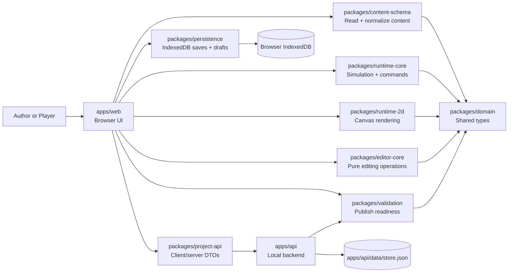

The architecture deliberately separates content, simulation, rendering, editing, persistence, and API concerns. That keeps the current 2D browser implementation flexible enough to support later phases such as richer graphics, additional renderers, real-time simulation, or more advanced AI without rewriting the content model from scratch.

## Package Responsibilities

| Area | Package or app | Responsibility |
| --- | --- | --- |
| Shared vocabulary | `packages/domain` | Defines IDs, adventure packages, maps, entities, triggers, dialogue, actions, and conditions. |
| Content ingestion | `packages/content-schema` | Reads raw authored content and normalizes it into an `AdventurePackage`. |
| Runtime simulation | `packages/runtime-core` | Owns player commands, state mutation, triggers, dialogue, enemy turns, snapshots, and engine events. |
| Runtime rendering | `packages/runtime-2d` | Draws runtime state to a canvas. It receives state; it does not decide game rules. |
| Editing rules | `packages/editor-core` | Provides pure functions such as `setTileAt`, `addEntityInstance`, `moveEntityInstance`, and metadata updates. |
| Validation | `packages/validation` | Checks whether a package is publishable and reports warnings/errors. |
| Local persistence | `packages/persistence` | Stores runtime saves and editor drafts in IndexedDB. |
| API contract | `packages/project-api` | Defines project/release DTOs and browser API client methods. |
| Browser app | `apps/web` | Wires DOM events to runtime/editor operations and updates UI panels. |
| Local backend | `apps/api` | Stores projects/releases, validates packages, and exposes local API endpoints. |

## Data Model Layers

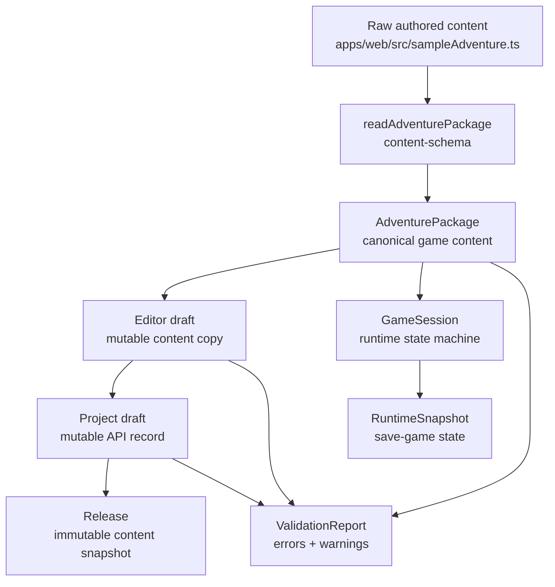

Important distinctions:

- Raw content is author-friendly data. In the sample, it lives in `apps/web/src/sampleAdventure.ts`.
- `readAdventurePackage(...)` turns raw content into a normalized `AdventurePackage`.
- A draft is mutable content used by the editor.
- A project draft is a mutable backend-side draft stored by `apps/api`.
- A release is an immutable content snapshot created from a valid project draft.
- A runtime save is not content. It is a `RuntimeSnapshot` that captures the state of a running session.

## Runtime Input-To-Rendering Overview

The runtime browser page is centered around one loop: input becomes a `PlayerCommand`, the command is dispatched into `runtime-core`, `runtime-core` returns new state plus events, and the browser redraws the canvas and side panels.

```mermaid
flowchart LR
    Input[Browser input\nkeyboard or button]
    Command[PlayerCommand\nmove / inspect / interact / etc]
    Dispatch[session.dispatch(command)]
    Engine[runtime-core\nmutates GameSessionState]
    Events[EngineResult\nstate + events]
    Panels[apps/web\nDOM panels + event log]
    Canvas[runtime-2d\ncanvas render]

    Input --> Command --> Dispatch --> Engine --> Events
    Events --> Panels
    Events --> Canvas
```

Primary runtime files:

- `apps/web/src/index.ts` owns the browser event listeners, save/load buttons, event log, side panels, and call to `renderer.render(...)`.
- `packages/runtime-core/src/index.ts` owns `PlayerCommand`, `GameSession`, `dispatch`, movement, inspection, triggers, dialogue, enemy turns, and snapshots.
- `packages/runtime-2d/src/index.ts` owns visual rendering of maps, entities, tile overrides, and the player marker.

## Use Case 1: Player Initiates A Move Command

This is the full path when the player presses an arrow key or `W`, `A`, `S`, or `D` in the browser.

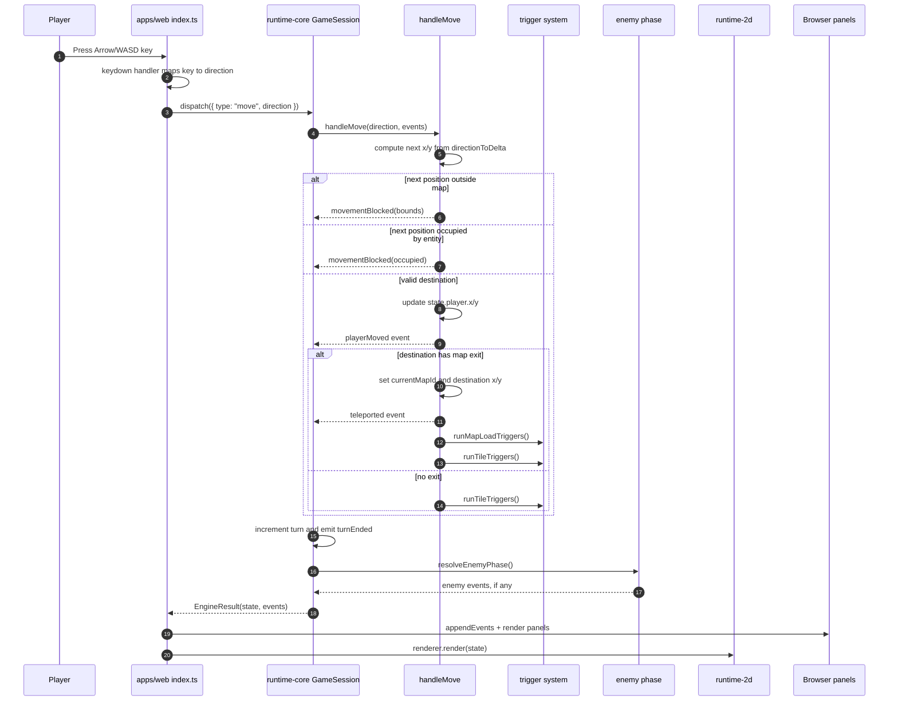

Detailed move flow:

1. `window.addEventListener("keydown", ...)` in `apps/web/src/index.ts` receives the key.
2. The browser ignores repeated keydown events with `if (event.repeat) return;`.
3. Arrow keys and `WASD` call `runCommand(() => session.dispatch({ type: "move", direction }))`.
4. `runCommand(...)` executes the dispatch callback, appends returned events to the event history, then calls `renderEverything(result.state)`.
5. `runtime-core.dispatch(...)` sees command type `move`, calls `handleMove(...)`, and uses the returned boolean to decide whether the command consumed a turn.
6. `handleMove(...)` calculates the destination with `directionToDelta(...)`.
7. If the destination is outside the current map, the engine emits `movementBlocked` with reason `bounds` and does not move the player.
8. If the destination contains an active entity, the engine emits `movementBlocked` with reason `occupied` and does not move the player.
9. If the destination is valid, the engine updates `state.player.x` and `state.player.y`, then emits `playerMoved`.
10. If the destination is an exit tile, the engine updates `state.currentMapId` and player coordinates, emits `teleported`, runs map-load triggers, and runs tile triggers at the arrival tile.
11. If the destination is not an exit, the engine only runs tile triggers for the new tile.
12. If movement succeeded, `dispatch(...)` increments `state.turn`, emits `turnEnded`, and runs the enemy phase.
13. The browser receives `EngineResult`, converts events to readable log lines with `describeEvent(...)`, and updates DOM panels in `renderEverything(...)`.
14. `CanvasGameRenderer.render(state)` redraws the map, tile overrides, entities, and player marker.

Current behavior note: blocked movement does not consume a turn and does not grant enemies a free action. Enemy behavior profiles may define `turnInterval`; the sample Shrine Wolf uses `turnInterval: 3`, so it only acts on every third successful player turn.

## Use Case 2: Player Initiates An Inspect Command

This is the full path when the player presses `Q` in the browser.

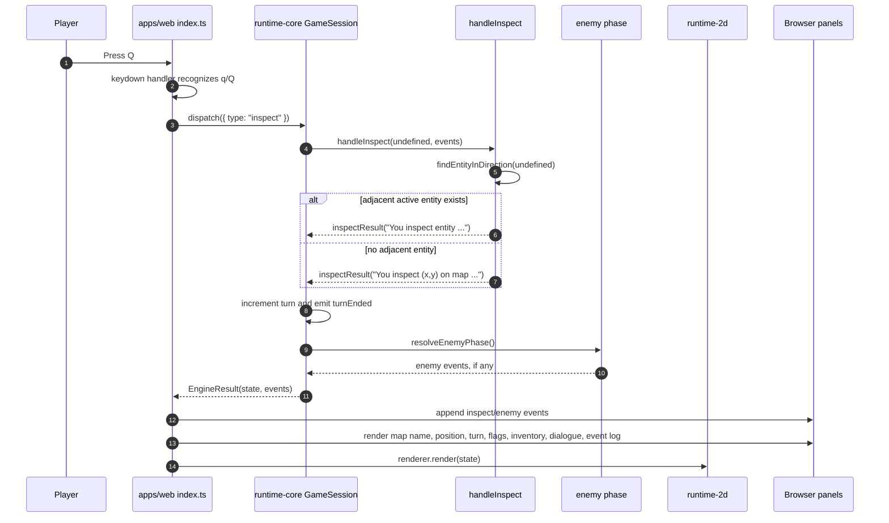

Detailed inspect flow:

1. `apps/web/src/index.ts` listens for `q` and `Q` in the same keydown handler as movement.
2. The browser calls `runCommand(() => session.dispatch({ type: "inspect" }))`.
3. `runtime-core.dispatch(...)` sees command type `inspect`, calls `handleInspect(...)`, and treats a completed inspection as a turn-consuming action.
4. `handleInspect(...)` calls `findEntityInDirection(direction)` with no direction because the browser currently sends no direction.
5. With no direction, `findEntityInDirection(...)` searches for the first active entity on the current map with Manhattan distance exactly `1` from the player.
6. If an adjacent entity exists, the engine emits `inspectResult` with a message like `You inspect entity 'entity_oracle'.`.
7. If no adjacent entity exists, the engine emits `inspectResult` describing the player's current coordinate and map id.
8. Inspect does not directly mutate player position, inventory, flags, tile overrides, dialogue, or map id.
9. After inspection, `dispatch(...)` increments `state.turn`, emits `turnEnded`, and runs the enemy phase.
10. The browser logs the inspect result and any enemy events, then calls `renderEverything(...)`.
11. The renderer redraws from state. Often the visible canvas will not change unless an enemy was eligible to act on its configured turn interval.

Current behavior note: inspect is intentionally treated as a turn-consuming action, but enemies still respect their `turnInterval`. If later design calls for a free-look inspect action, the behavior can be changed in `dispatch(...)` by returning `false` from `handleInspect(...)`.

## Runtime Rendering Details

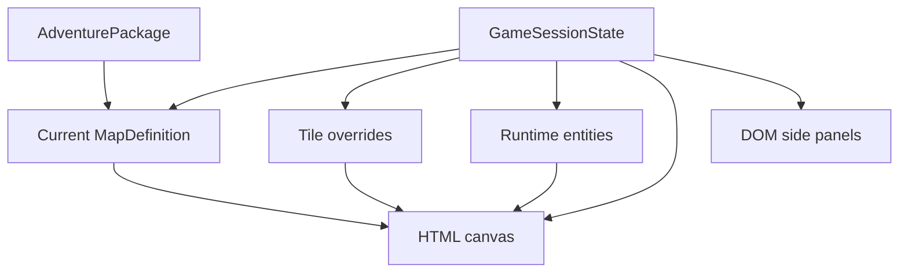

`renderEverything(state)` is the browser-side bridge between simulation and presentation. It calls `renderer.render(state)` for the canvas, then updates map name, player position, turn count, flags, inventory, dialogue overlay, and event log. This keeps the engine independent from HTML and canvas concerns.

## Editor Input-To-Draft Overview

The editor has a similar separation: browser UI collects intent, `editor-core` creates an updated package copy, validation reruns, and the browser updates the editor grid.

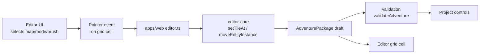

Primary editor files:

- `apps/web/src/editor.ts` owns browser controls, pointer events, selected brush state, validation display, project buttons, and grid rendering.
- `packages/editor-core/src/index.ts` owns pure editing operations such as cloning the package, changing a tile, listing entity definitions, and adding/moving entity instances.
- `packages/validation/src/index.ts` owns local and server-side validation rules.
- `packages/persistence/src/index.ts` stores local drafts for save and playtest.

## Use Case 3: Designer Changes A Tile With The Editor Brush

This is the full path when a designer selects a tile type and paints a grid cell.

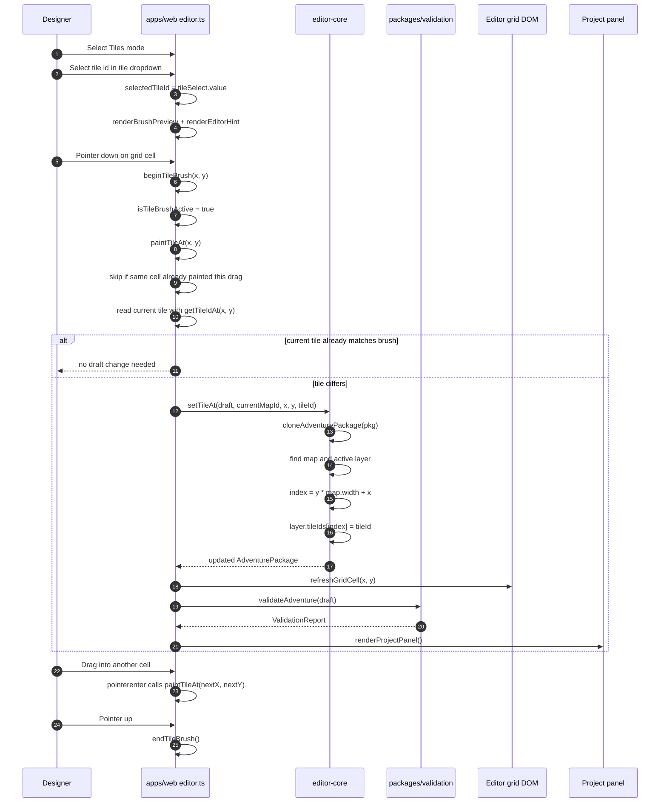

Detailed tile-edit flow:

1. The designer chooses `Tiles` mode in the editor mode dropdown.
2. `syncModeVisibility()` shows the tile picker and brush preview.
3. The designer chooses a tile in `tileSelect`.
4. `selectedTileId` is updated and the editor calls `renderBrushPreview()` and `renderEditorHint()`.
5. `renderGrid()` builds one button per map cell.
6. In tile mode, each cell receives a `pointerdown` handler and a `pointerenter` handler.
7. `pointerdown` calls `beginTileBrush(x, y)` for the clicked cell.
8. `beginTileBrush(...)` sets `isTileBrushActive = true`, resets `lastPaintedCellKey`, and calls `paintTileAt(x, y)`.
9. `paintTileAt(...)` exits early if the editor is not in tile mode.
10. `paintTileAt(...)` also exits early if this is the same cell already painted during the current drag.
11. The editor chooses the tile id from `selectedTileId`, falling back to the select value or `grass`.
12. The editor reads the current tile with `getTileIdAt(x, y)`.
13. If the current tile already matches the brush, no draft change is made.
14. If the tile differs, the editor calls `setTileAt(draft, currentMapId, x, y, tileId)` from `editor-core`.
15. `setTileAt(...)` clones the whole `AdventurePackage`, finds the map, selects the active layer, calculates `index = y * map.width + x`, writes `layer.tileIds[index] = tileId`, and returns the new package.
16. The browser replaces its `draft` variable with the updated package.
17. `refreshGridCell(x, y)` updates only the changed grid cell instead of rebuilding the whole grid.
18. `markValidationDirty()` clears the latest server validation report and calls `renderValidation()`.
19. `renderValidation()` runs `validateAdventure(draft)` locally and updates the validation list.
20. `renderProjectPanel()` enables or disables project/release buttons based on validation state.
21. While the pointer remains down, moving into another cell triggers `pointerenter`, which calls `paintTileAt(...)` again. This is what makes the tile picker behave like a brush instead of a one-shot selection.
22. `window.pointerup` calls `endTileBrush()`, which turns off painting and clears the last-painted-cell key.

Current behavior note: painting a tile changes the editor draft only. It does not automatically change the currently running game. To play the edited content, use `Playtest Draft`; the editor saves the draft to IndexedDB and opens the runtime page with a `?draft=...` query parameter.


## Use Case 4: Designer Places A New Entity Instance

This is the full path when a designer uses entity mode to add a new enemy or NPC to the current map.

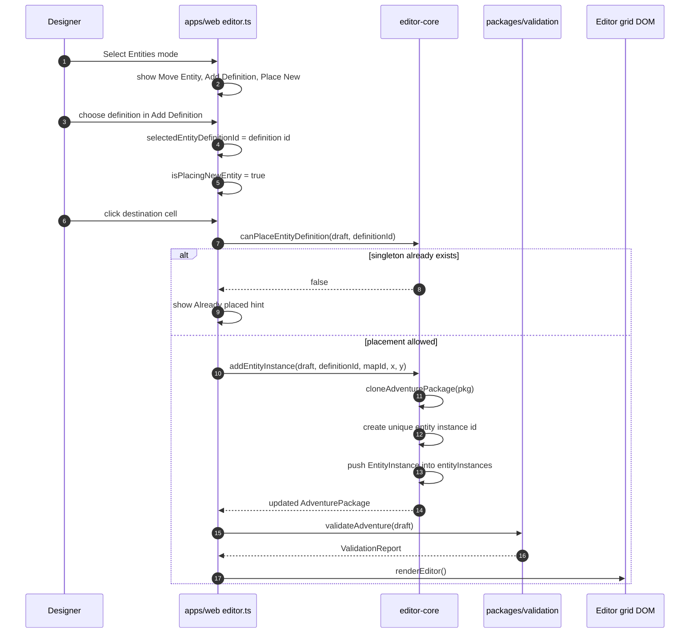

Detailed entity-placement flow:

1. The designer chooses `Entities` mode.
2. `syncModeVisibility()` hides tile-only controls and shows `Move Entity`, `Add Definition`, and `Place New`.
3. `renderPalette()` lists existing instances on the current map and reusable definitions from `entityDefinitions`.
4. Definitions whose placement rule is exhausted are disabled in the `Add Definition` dropdown.
5. Choosing a definition sets `selectedEntityDefinitionId`, clears `selectedEntityId`, and sets `entityEditIntent` to `place`.
6. Clicking a grid cell calls `applyEntityEdit(x, y)`.
7. If placing, the browser checks `canPlaceEntityDefinition(draft, definitionId)`.
8. `singleton` definitions return false once any instance of that definition exists anywhere in the adventure.
9. `multiple` definitions return true and can be placed repeatedly.
10. `addEntityInstance(...)` clones the package, creates a unique id such as `entity_wolf_1`, pushes a new `EntityInstance`, and returns the updated draft.
11. The editor reruns local validation and rerenders the grid and entity summary.
12. Playtesting uses the same draft package, so the runtime sees the newly placed entity without a separate conversion step.

Current behavior note: Milestone 9 adds entity instance creation and movement. It still does not add deletion of instances or creation of brand-new entity definitions from the browser UI.
## Editor-To-Playtest Flow

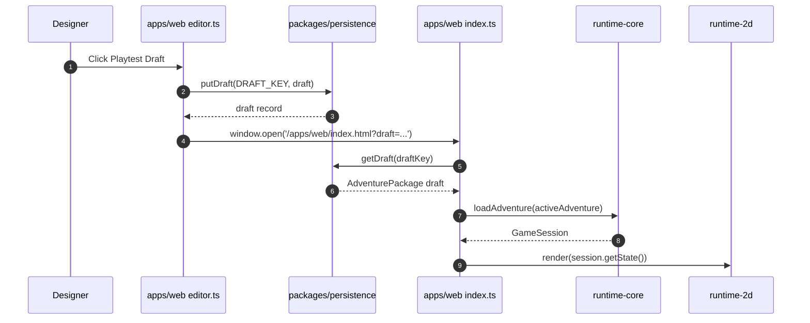

## Validation And Publishing Flow

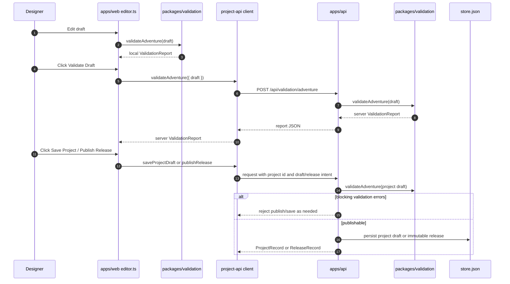

Validation currently checks categories such as:

- missing or unknown start map
- start position outside map bounds
- map region references that do not exist
- tile layer size mismatches
- wrong tile count for a layer
- exit source or destination out of bounds
- entity placements outside map bounds
- overlapping entities on one tile as a warning
- empty dialogue definitions
- duplicate dialogue node ids
- dialogue choices pointing to missing nodes
- trigger map locations that are missing or invalid
- conditions referencing missing items or quests
- actions referencing missing maps, items, tiles, or dialogues

## Save And Load Flow

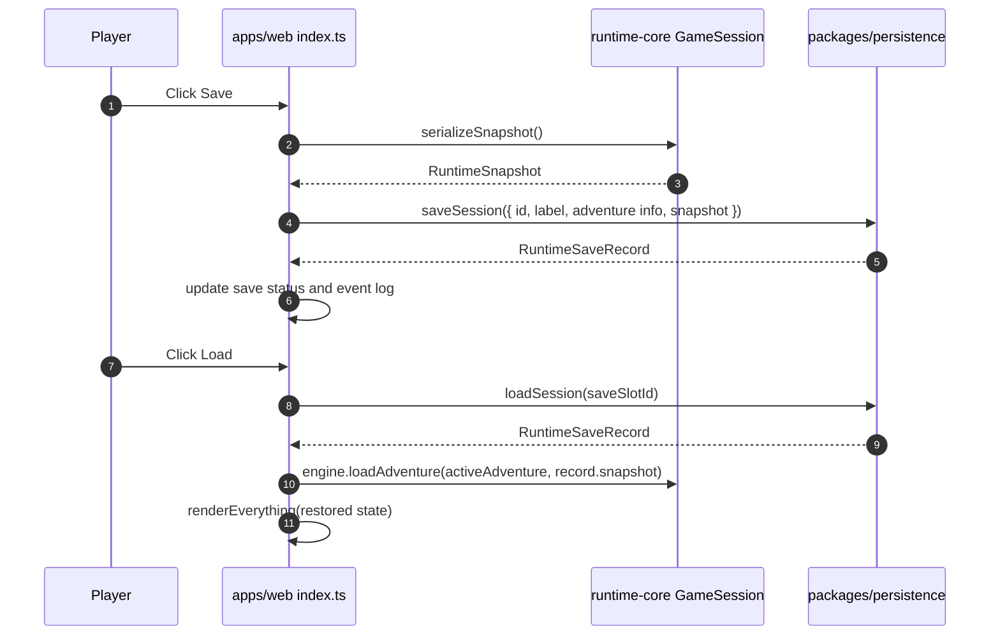

A save wraps the runtime's existing `RuntimeSnapshot`. That means persistence stores the same state model the engine already knows how to serialize and hydrate. The project does not maintain a second, competing save-game model.

## End-To-End Runtime Example: Move Onto A Trigger Tile

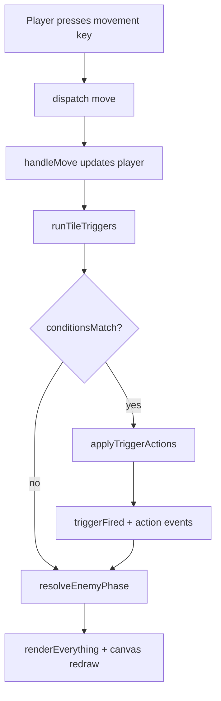

Example: when the player reaches the shrine altar in the sample adventure, the engine can run an `onEnterTile` trigger, grant an item, set flags, or change a tile. Those changes are represented as state changes and events, then the renderer redraws using the new state.

## End-To-End Editor Example: Change A Tile, Validate, Then Play

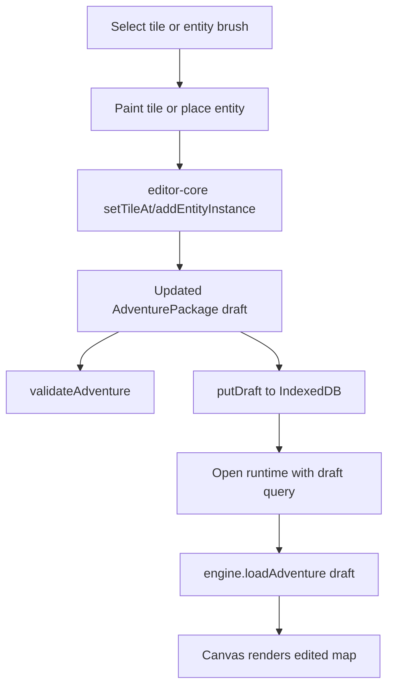

This flow is important because the editor and runtime share the same content representation. The editor does not produce a special editor-only format. It updates an `AdventurePackage`, validates that package, stores it as a draft, and the runtime can load that same package for playtesting.


## Milestone 10 Runtime Visual Modes

Milestone 10 implements the first classic ACS presentation mode without changing `runtime-core`. The runtime still loads an `AdventurePackage`, dispatches commands through `GameSession`, and emits `GameSessionState`. The browser can now ask `runtime-2d` to render that same state in either `classic-acs` mode or `debug-grid` mode.

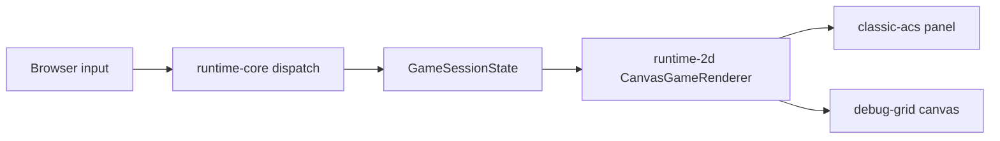

The classic renderer currently draws a procedural vintage panel:

- fixed 640 by 400 canvas surface
- map viewport centered inside a black playfield
- right-side `POWER` and `LIFE` rails
- bottom message band with actor, map, turn, and movement prompt text
- tile/icon drawing with pixelated blocks and a restrained palette

This is intentionally not a second engine. Switching visual mode does not reset the session, change saves, change triggers, or change enemy AI. It only changes how the current state is drawn.
## Current Design Constraints And Extension Points

The current design intentionally avoids locking the project into the current 2D implementation.

- A higher-resolution renderer can be introduced beside `runtime-2d` as long as it consumes `AdventurePackage` and `GameSessionState`.
- A 3D renderer could also consume the same state, though content would need richer spatial and asset metadata.
- Real-time play would likely require changing how `dispatch(...)`, turn advancement, enemy `turnInterval`, and enemy phases are scheduled, but the command/state/event boundary is a good place to evolve that behavior.
- Richer enemy AI should live in `runtime-core` or a future AI package, not in `apps/web` or `runtime-2d`.
- More advanced editor creation tools should extend `editor-core` with pure operations first, then wire those operations into `apps/web/src/editor.ts`.
- Asset manifests should continue to describe assets by id and metadata, so renderers can choose how to resolve those ids without hardcoded visual assumptions.


## Milestone 14 Map Structure Editing

Milestone 14 begins the world-structure track. The project can now describe a map's scale/purpose and create new blank maps from the editor while still keeping map data inside the shared `AdventurePackage`.

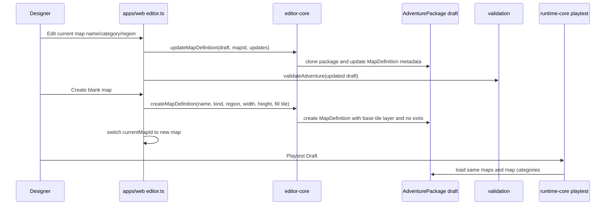

The new `MapKind` values are `world`, `region`, `local`, `interior`, and `dungeonFloor`. They are metadata for now: they describe intent and scale, but they do not yet change movement, rendering, encounters, or map transitions. That is intentional. The category field lets future milestones add world maps, region maps, interiors, and dungeon floors without retrofitting the content shape later.

A newly created map receives one base tile layer, dimensions chosen in the editor, a repeated fill tile, no exits, and no placed entities. The designer can immediately paint tiles and place entities on it. Exit/portal wiring and map deletion are deliberately left for later because they have more reference-safety consequences.
## Milestone 13 Dialogue And Trigger Editing

Milestone 13 extends the construction set from map/entity placement into authored text and structured rules. It still follows the same boundary as earlier editor work: browser controls gather intent, `editor-core` clones and updates the `AdventurePackage`, validation reruns, and playtest loads the same draft package.

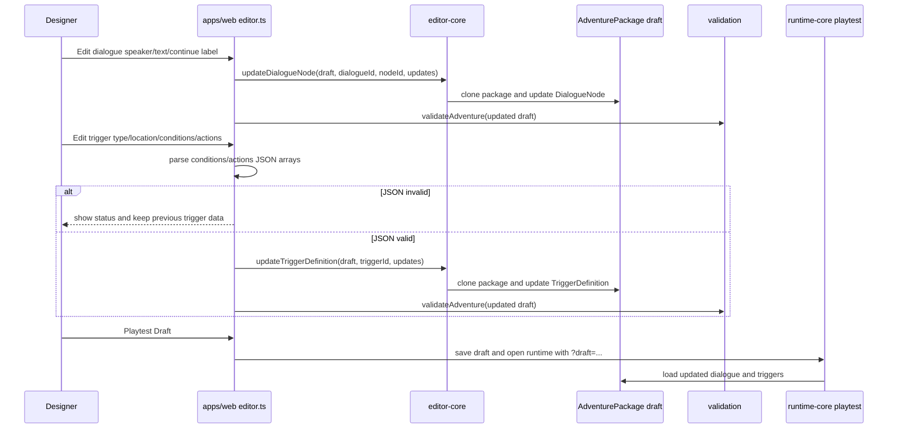

End-to-end trigger editing example:

1. The designer chooses `trigger_shrine_reward` in the `Rule Trigger` panel.
2. `renderTriggerEditor()` populates form fields from the selected `TriggerDefinition`.
3. The designer changes the `actions` JSON, for example changing a `showDialogue` action or adjusting a `changeTile` target tile id.
4. `applyTriggerEditorChanges()` parses both JSON textareas as arrays. This prevents malformed rule data from being saved silently.
5. If parsing succeeds, the editor calls `updateTriggerDefinition(...)` in `editor-core`.
6. `editor-core` clones the package and updates only the selected trigger record.
7. The editor reruns validation and updates the project controls.
8. When the designer clicks `Playtest Draft`, the runtime loads that same draft. No editor-only conversion step exists.
9. During gameplay, `runtime-core` evaluates the updated trigger through `runTriggers(...)`, `conditionsMatch(...)`, and `applyTriggerActions(...)`.

End-to-end dialogue editing example:

1. The designer chooses `dialogue_intro` in the `Dialogue Text` panel.
2. The editor shows the first dialogue node's speaker, text, and continue label.
3. Typing in the fields calls `applyDialogueEditorChanges()`.
4. The browser calls `updateDialogueNode(...)` in `editor-core`.
5. Any trigger action that references the same dialogue id, such as `{ "type": "showDialogue", "dialogueId": "dialogue_intro" }`, will show the revised text in the runtime.

Current limitation: Milestone 13 edits existing dialogue and trigger records. Brand-new trigger/dialogue creation, deletion, and a fully visual no-JSON rule builder remain future work.
## Milestone 12 Entity Definition Editing

Milestone 12 adds the first reusable definition editor to the browser construction set. The key model distinction is:

- `EntityDefinition`: reusable template data such as name, kind, placement policy, sprite asset id, faction, and behavior.
- `EntityInstance`: a placed copy on a map with an id, `definitionId`, `mapId`, x, and y.

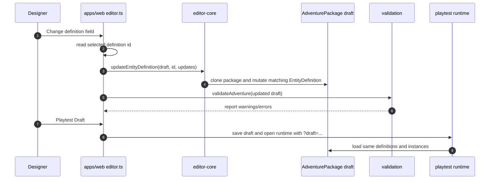

End-to-end behavior:

1. The editor sidebar renders an `Entity Definition` panel from `draft.entityDefinitions`.
2. Selecting a definition stores `selectedDefinitionEditorId` separately from the selected placed entity instance.
3. Field changes call `applyDefinitionEditorChanges()` in `apps/web/src/editor.ts`.
4. That function builds a partial `EntityDefinition` update from the form fields.
5. `editor-core.updateEntityDefinition(...)` clones the package, finds the matching definition, and applies the update.
6. The editor reruns local validation, refreshes entity placement controls, updates the entity summary, and keeps the draft/project panels in sync.
7. Existing `EntityInstance` records do not need to change because they reference the definition by `definitionId`.
8. Playtesting the draft loads the updated definition data through the same `AdventurePackage` path as normal gameplay.

This keeps future definition editors aligned with the architecture: pure package operations live in `editor-core`, while browser controls only gather input and render feedback.
## Milestone 11 Sprite Manifests And Classic Asset Sets

Milestone 11 moves the classic visual mode from hardcoded tile/entity assumptions toward manifest-driven presentation data. The game simulation still does not know about sprites. `runtime-core` continues to emit state only; `runtime-2d` decides how to draw that state by consulting the adventure's `visualManifests`.

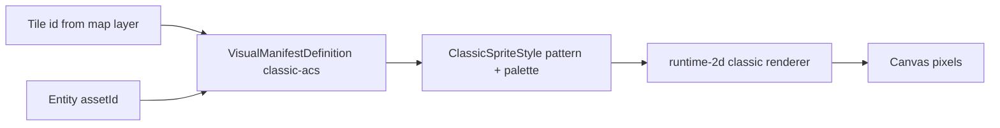

End-to-end classic tile rendering now works like this:

1. The browser loads `sampleAdventureData` and `content-schema` normalizes it into an `AdventurePackage`.
2. The package includes `visualManifests[0]`, a `classic-acs` manifest named `Classic Solar Seal Sprite Set`.
3. The renderer stores that manifest when `CanvasGameRenderer` is constructed.
4. During `renderClassic(...)`, each map coordinate still resolves to a logical tile id such as `grass`, `door`, or `altar-lit`.
5. Instead of switching directly on those tile ids as the source of truth, `drawClassicTile(...)` asks `resolveClassicTileSprite(tileId)` for a `ClassicSpriteStyle`.
6. The sprite style contains a pattern such as `dither`, `door`, `altar`, or `floor`, plus palette values such as fill, shadow, accent, and line colors.
7. `drawClassicSprite(...)` draws the selected style onto the canvas.
8. If a tile is missing from the manifest, `runtime-2d` falls back to built-in defaults so older content remains playable.

End-to-end classic entity rendering now works like this:

1. Entity definitions can carry an `assetId`, such as `sprite_hero`, `sprite_oracle`, or `sprite_wolf`.
2. The classic manifest maps those sprite IDs to `ClassicSpriteStyle` records.
3. `drawClassicEntity(...)` resolves the entity definition, checks `definition.assetId`, and looks up the corresponding manifest entry.
4. If no asset-specific sprite exists, the renderer falls back by entity definition id and then by entity kind.
5. The player uses the first party definition from `state.player.party`, so the hero sprite is still content-driven rather than hardcoded in the renderer.

Validation now checks the manifest layer too. `packages/validation` warns when an adventure has no `classic-acs` visual manifest, when a used tile id has no classic tile sprite, or when an entity `assetId` has no classic entity sprite. These are warnings instead of hard errors because the renderer still has safe fallbacks.
## Forward Milestone Path: Classic ACS Feel

The project should deliberately capture the feel of the original 1980s Adventure Construction Set while keeping the engine free of renderer assumptions. The legacy image set points to two major tracks: a classic gameplay panel and deeper construction-set authoring tools.

### Classic Runtime Presentation

The classic runtime mode should be a presentation layer, not a different game engine. It should consume `AdventurePackage`, `RuntimeSnapshot`, and `GameSessionState` just like the current renderer.

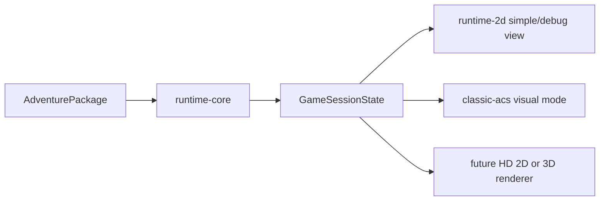

The target visual structure is:

- fixed-aspect vintage gameplay panel
- tile/icon map viewport on a dark field
- right-side status rail for life, power, and future actor resources
- bottom message band for location names, prompts, interaction text, and command hints
- pixelated sprite scaling and controlled palette
- asset IDs resolved through manifests so the same map can later render with HD or 3D assets

### Classic Editor Capability Track

The old editor suggests several authoring modes that should become future milestones:

- terrain/tile picture selection and eventually editing
- creature picture selection and eventually editing
- thing/item picture selection and eventually editing
- map creation, deletion, floor/category assignment, and exit/portal wiring
- reusable entity, item, terrain, and actor definitions
- actor profile fields such as life force, power, speed, skills, weapons, armor, and possessions
- structured thing/trigger authoring for portals, messages, conditions, tile changes, inventory rewards, map travel, entity removal, and quest progress
- text/dialogue/introduction editing

### Proposed Forward Milestones

1. Milestone 10: completed `classic-acs` visual mode with a gameplay viewport, right status rail, bottom message band, and renderer theme switching.
2. Milestone 11: completed sprite manifests, a first classic asset set, entity sprite IDs, manifest-driven classic renderer lookup, and validation warnings for missing sprite references.
3. Milestone 12: completed the first entity definition editor slice for reusable entity metadata, placement policy, sprite asset IDs, faction, and behavior tuning.
4. Milestone 13: completed dialogue and structured trigger editing for existing records.
5. Milestone 14: completed map categories, current-map structure metadata editing, and blank map creation.
6. Milestone 15: next, add richer character/profile and possession systems, with runtime status rendering and editor support.

This path is intentionally compatible with later higher-resolution graphics or 3D. The classic mode is a historically inspired renderer and asset pack, not a constraint on the engine.
## Recommended Editor Information Architecture

The current editor works, but its panels are still arranged in milestone order rather than authoring order. As the game data grows, the editor should be organized around the relationships in `AdventurePackage`, not around the order features were implemented.

The most important observation is that the adventure has two kinds of information:

- World-local content: regions, maps, tile layers, exits, placed entity instances, and map/location triggers.
- Reusable libraries: entity definitions, item definitions, dialogue, quests, assets, visual manifests, and rule/action templates.

A more intuitive editor should make those two categories obvious. Designers usually think, "I am editing this place," then, "What lives here?", then, "What happens here?" Reusable definitions should still be nearby, but they should not interrupt the flow of editing a selected map.

### Domain Relationship Map

```mermaid
flowchart TD
    Adventure[AdventurePackage]
    Metadata[Metadata]
    Rules[Rules]
    Assets[Assets + visual manifests]
    Regions[Regions]
    Maps[Maps]
    Layers[Tile layers]
    Exits[Exits / portals]
    Instances[Entity instances]
    Triggers[Triggers]
    Start[Start state]
    EntityDefs[Entity definitions]
    Items[Item definitions]
    Dialogue[Dialogue]
    Quests[Quests]
    Conditions[Conditions]
    Actions[Actions]

    Adventure --> Metadata
    Adventure --> Rules
    Adventure --> Assets
    Adventure --> Regions
    Adventure --> Maps
    Adventure --> EntityDefs
    Adventure --> Items
    Adventure --> Dialogue
    Adventure --> Quests
    Adventure --> Triggers
    Adventure --> Start

    Regions --> Maps
    Maps --> Layers
    Maps --> Exits
    Maps --> Instances
    Maps --> Triggers
    Instances --> EntityDefs
    Start --> Maps
    Start --> EntityDefs
    Triggers --> Maps
    Triggers --> Conditions
    Triggers --> Actions
    Conditions --> Items
    Conditions --> Quests
    Actions --> Items
    Actions --> Dialogue
    Actions --> Maps
```

This relationship map suggests the editor should not present `Maps`, `Regions`, `Tiles`, `Entities`, and `Triggers` as unrelated panels. They are connected. A map belongs to a region; placed entities belong to a map but point back to reusable definitions; triggers may belong to a map coordinate and may reference dialogue, items, quests, or destination maps.

### Proposed Top-Level Editor Areas

| Area | Purpose | Primary objects | Why it belongs here |
| --- | --- | --- | --- |
| Adventure Setup | Project-level identity and rules | metadata, rules, start state, validation | These settings affect the whole adventure and should not be mixed into map editing. |
| World Atlas | Spatial structure | regions, maps, map categories, exits, start position | This is the natural home for the Milestone 14 map structure tools. |
| Map Workspace | Editing the selected place | tile layers, entity instances, local triggers, exits | This is the main canvas-centric editing view. |
| Libraries | Reusable building blocks | entity definitions, item definitions, dialogue, quests, assets, visual manifests | These are referenced by maps/triggers/instances but are not themselves placed cells. |
| Logic & Quests | Cross-map behavior | triggers, conditions, actions, quest stages, dialogue links | This needs reference-aware tools because logic often connects many objects. |
| Test & Publish | Quality and release flow | validation, local draft, playtest, projects, releases | These are workflow actions, not content objects. |

### Recommended Navigation Layout

```mermaid
flowchart LR
    Sidebar[Left sidebar
Editor sections]
    Context[Middle column
Selected object tree]
    Canvas[Main workspace
Map grid or detail editor]
    Inspector[Right inspector
Properties + references]
    Footer[Bottom rail
Validation + save/publish]

    Sidebar --> Context --> Canvas --> Inspector
    Inspector --> Footer
    Canvas --> Footer
```

Recommended screen behavior:

1. The left sidebar chooses the authoring area: `Adventure`, `World Atlas`, `Map Workspace`, `Libraries`, `Logic`, or `Test & Publish`.
2. The middle column shows the selected area's object tree. For example, `World Atlas` should show Regions with nested Maps.
3. The main workspace shows the selected map grid, selected definition editor, or selected trigger flow.
4. The right inspector shows properties and references for the selected object.
5. The bottom rail always shows validation status, unsaved draft status, and playtest/publish actions.

### World Atlas Flow

The World Atlas should make the Region-to-Map dependency obvious.

```mermaid
flowchart TD
    Atlas[World Atlas]
    RegionList[Region list]
    RegionDetail[Selected region detail]
    MapList[Maps in region]
    MapDetail[Selected map metadata]
    ExitGraph[Exit / portal graph]
    StartPosition[Start position]

    Atlas --> RegionList
    RegionList --> RegionDetail
    RegionDetail --> MapList
    MapList --> MapDetail
    MapDetail --> ExitGraph
    MapDetail --> StartPosition
```

Recommended controls:

- Region list: create/select/rename regions and edit lore/source references.
- Map list grouped under each region: create maps, assign category, rename maps, and see map dimensions.
- Map detail: edit `MapDefinition.name`, `kind`, `regionId`, width/height where safe, and base properties.
- Exit graph: eventually show incoming and outgoing exits so designers can see whether a map is reachable.
- Start position: show the current start map and party start coordinate in relation to maps.

This is the best home for Milestone 14 features. The current `World Structure` panel is a good first slice, but it should eventually move into an atlas-style view where Regions and Maps are visible together.

### Map Workspace Flow

The Map Workspace should be centered on a selected map. It should answer four questions in order: what does this place look like, what is here, where can I go, and what happens here?

```mermaid
flowchart TD
    SelectedMap[Selected map]
    Tiles[Terrain / tile layers]
    Entities[Placed entities]
    Exits[Exits / portals]
    LocalTriggers[Map-local triggers]
    Inspector[Selection inspector]

    SelectedMap --> Tiles
    SelectedMap --> Entities
    SelectedMap --> Exits
    SelectedMap --> LocalTriggers
    Tiles --> Inspector
    Entities --> Inspector
    Exits --> Inspector
    LocalTriggers --> Inspector
```

Recommended layer tabs for the selected map:

- Terrain: paint tile layers with the persistent brush.
- Entities: move/place/delete entity instances and show which definition each instance uses.
- Exits: create or inspect map-to-map links directly on the grid.
- Triggers: show trigger markers for `onEnterTile`, `onInteractEntity`, and `onMapLoad` rules tied to this map.
- Preview: launch this map in playtest mode once start-position tooling exists.

This layout would make tile editing and entity placement feel related instead of competing. A designer should be able to select a cell and see every object attached to that cell: terrain tile, entity occupant, exit, and triggers.

### Libraries Flow

Libraries should hold reusable definitions. These are not map-specific, but maps and triggers reference them.

```mermaid
flowchart TD
    Libraries[Libraries]
    EntityDefs[Entity definitions]
    ItemDefs[Item definitions]
    Dialogue[Dialogue library]
    Quests[Quest library]
    Assets[Assets and visual manifests]
    References[Reference panel]

    Libraries --> EntityDefs --> References
    Libraries --> ItemDefs --> References
    Libraries --> Dialogue --> References
    Libraries --> Quests --> References
    Libraries --> Assets --> References
```

Recommended behavior:

- Entity definitions show where instances of that definition are placed.
- Dialogue records show which triggers/actions call them.
- Item definitions show which triggers give or require them.
- Assets and visual manifests show which tiles/entities reference each asset id.
- Quests show which conditions/actions read or advance their stages.

This preserves the distinction we have been building: an `EntityDefinition` is the reusable template, while an `EntityInstance` is a placed object on a map.

### Logic & Quest Flow

Triggers are currently edited as standalone records, but conceptually they are glue between maps, entities, dialogue, items, quests, and tiles. The editor should make those references visible.

```mermaid
flowchart LR
    Trigger[Trigger]
    When[When
type + map/x/y/entity/item event]
    If[If
conditions]
    Then[Then
actions]
    References[Reference resolver]

    Trigger --> When --> If --> Then
    When --> References
    If --> References
    Then --> References
```

Recommended trigger editor shape:

- `When`: trigger type and location/event source.
- `If`: conditions such as flags, inventory, or quest stage requirements.
- `Then`: actions such as show dialogue, set flag, give item, teleport, or change tile.
- Reference resolver: every referenced map, dialogue, item, quest, tile, or entity definition should be clickable or at least validated inline.

This would replace the current JSON-first trigger editing with a guided rule builder later, while still using the same `TriggerDefinition`, `Condition`, and `Action` data model underneath.

### Inspector And Dependency Panel

Every selected object should have a dependency panel. This is the most important UI principle for making relationships understandable.

For example:

- Selecting a Region should show maps inside that region.
- Selecting a Map should show its region, exits, entities, local triggers, and whether the start state points there.
- Selecting an Entity Definition should show all placed instances using it.
- Selecting an Entity Instance should show its definition and map location.
- Selecting a Dialogue record should show triggers/actions that call it.
- Selecting a Trigger should show all maps/items/dialogue/quests it references.
- Selecting a Tile cell should show tile id, occupant, exit, and triggers attached to that coordinate.

This dependency panel should eventually become the primary way to avoid broken references before validation runs.


### Implemented Edit Game Layout

The browser editor now implements the first version of this organization without changing the underlying data model. The same editor functions still update `AdventurePackage`, but the screen is arranged by information hierarchy:

- Left navigation: the authoring flow from Adventure Setup through Test & Publish.
- Context column: Adventure Setup and World Atlas, where map selection, region assignment, category metadata, and blank-map creation live.
- Center workspace: selected-map editing for terrain and entity instances.
- Inspector column: dependencies, reusable libraries, dialogue, trigger logic, validation, and publishing.

This is intentionally a layout refactor first. Later milestones can make each area deeper by adding a real region tree, selected-cell inspector, exit graph, reference backlinks, and a structured trigger builder.
### Recommended Editor Evolution Path

1. Reorganize the editor UI into top-level sections without changing the data model.
2. Add a World Atlas sidebar that groups maps under regions and exposes map category metadata.
3. Add a selected-cell inspector in the Map Workspace showing tile, entity, exit, and triggers for the clicked cell.
4. Move entity definitions, dialogue, triggers, and future item/quest editors into a Libraries/Logic split.
5. Replace raw trigger JSON editing with a structured `When / If / Then` builder that still emits the same domain `TriggerDefinition` objects.
6. Add reference backlinks everywhere: where-used lists for maps, definitions, dialogue, items, quests, and assets.
7. Add validation badges directly beside referenced objects instead of only showing a single global validation panel.

The key design rule is: the editor should show containment first, references second, and implementation details third. A designer should first understand where they are in the adventure, then what objects live there, then what reusable definitions and rules those objects point to.
## Current Feature Implementation Map

The table below is the compact implementation index for the current application. It should be updated after every milestone so the reference remains a practical map of the codebase.

| Feature | Browser entry point | Core package | Data changed | Rendering/output |
| --- | --- | --- | --- | --- |
| Runtime movement | `apps/web/src/index.ts` keydown handler | `runtime-core.dispatch` and `handleMove` | `GameSessionState.player`, current map, turn count, trigger effects | `runtime-2d` redraws canvas; DOM panels and event log update |
| Runtime inspect | `apps/web/src/index.ts` keydown handler for `Q` | `runtime-core.handleInspect` | Usually only turn/events; enemy phase may mutate entity positions | Event log updates; canvas redraws if enemies move |
| Runtime interact/dialogue | `apps/web/src/index.ts` keydown handler for `E` and dialogue advance keys | `runtime-core.handleInteract`, dialogue state helpers | Active dialogue state, flags/items if triggers fire | Dialogue overlay and event log update |
| Runtime save/load | `Save` and `Load` buttons | `runtime-core.serializeSnapshot` plus `persistence` | `RuntimeSnapshot` stored or restored from IndexedDB | Entire runtime rerenders from restored state |
| Visual mode switching | `Visual Mode` dropdown | `runtime-2d.CanvasGameRenderer` | No engine state change | Same state is rendered as Classic ACS or Debug Grid |
| Tile brush painting | Editor grid pointer events | `editor-core.setTileAt` | `AdventurePackage.maps[].tileLayers[].tileIds` | Editor grid cell refreshes; validation reruns |
| Entity movement | Editor entity mode cell click | `editor-core.moveEntityInstance` | `AdventurePackage.entityInstances[]` coordinates/map | Editor grid and entity summary refresh |
| Entity placement | `Add Definition` + `Place New` | `editor-core.addEntityInstance` and placement checks | New `EntityInstance` record | Editor grid summary updates; singleton rules enforced |
| Entity definition editing | `Entity Definition` panel inputs | `editor-core.updateEntityDefinition` | Reusable `EntityDefinition` metadata/behavior | Existing instances inherit changed definition data |
| Dialogue editing | `Dialogue Text` panel inputs | `editor-core.updateDialogueNode` | Existing `DialogueDefinition` node text | Runtime shows edited text when dialogue is triggered |
| Trigger editing | `Rule Trigger` panel inputs | `editor-core.updateTriggerDefinition` | Existing `TriggerDefinition` structured conditions/actions | Runtime evaluates edited trigger during playtest/release |
| Map structure editing | `World Structure` panel | `editor-core.updateMapDefinition` | `MapDefinition.name`, `kind`, `regionId` | Editor map selector/status update; future renderers can use metadata |
| Blank map creation | `Create Map` controls | `editor-core.createMapDefinition` | New `MapDefinition` with one base tile layer | Editor switches to new map; runtime can load it if reachable or selected by future tools |
| Local draft save/playtest | `Save Draft` / `Playtest Draft` | `persistence.putDraft` | Browser IndexedDB draft record | Runtime opens with `?draft=<key>` and loads the edited package |
| Project save/publish | Project panel buttons | `project-api`, `apps/api`, `validation` | `apps/api/data/store.json` project/release records | Published release can be opened by release id |

## Use Case: Designer Creates A Milestone 14 Blank Map

```mermaid
sequenceDiagram
    autonumber
    participant Designer as Designer
    participant Editor as apps/web editor.ts
    participant Core as editor-core
    participant Draft as AdventurePackage draft
    participant Validation as validation
    participant Grid as Editor grid

    Designer->>Editor: Enter name/category/region/width/height/fill tile
    Designer->>Editor: Click Create Map
    Editor->>Editor: clamp width/height and trim text fields
    Editor->>Core: createMapDefinition(draft, input)
    Core->>Core: cloneAdventurePackage(draft)
    Core->>Core: create stable map id from name
    Core->>Core: create base tile layer filled with fillTileId
    Core->>Draft: append MapDefinition
    Editor->>Editor: set currentMapId to created map
    Editor->>Validation: validateAdventure(updated draft)
    Editor->>Grid: renderEditor renders blank map grid
```

Implementation details:

1. The HTML controls live in `apps/web/editor.html` inside the `World Structure` panel.
2. `apps/web/src/editor.ts` owns the browser event listener for `createMapButton`.
3. `createBlankMapFromEditor()` reads the form, clamps dimensions, creates a map input object, and calls `editor-core.createMapDefinition(...)`.
4. `editor-core` clones the package, generates a unique map id, creates one base tile layer, fills the layer with the selected tile id, and appends the map.
5. The browser sets `currentMapId` to the new map and calls `renderEditor()`.
6. Validation reruns against the same `AdventurePackage` shape used by the runtime and API.
7. The new map has no exits. This is intentional because exit/portal wiring requires reference-safe tooling that belongs in a later milestone.

## Use Case: Designer Edits A Map's Structure Metadata

```mermaid
flowchart LR
    Fields[World Structure fields] --> Browser[apps/web editor.ts]
    Browser --> Core[editor-core updateMapDefinition]
    Core --> Clone[clone AdventurePackage]
    Clone --> Map[replace selected MapDefinition fields]
    Map --> Validate[validateAdventure]
    Validate --> UI[map selector, status, project buttons]
```

Map `kind` is descriptive metadata today. It can be used later by renderers, encounter systems, navigation tools, or editor filters without requiring every existing map to be reshaped. Current supported values are `world`, `region`, `local`, `interior`, and `dungeonFloor`.

## Use Case: Designer Completes The Full Authoring Loop

```mermaid
flowchart TD
    Edit[Edit draft in browser editor]
    LocalValidate[Local validateAdventure]
    SaveDraft[Save Draft to IndexedDB]
    Playtest[Open runtime with draft query]
    ApiValidate[Validate Draft through API]
    Project[Create/Save Project]
    Publish[Publish immutable Release]
    Open[Open Latest Release]
    Runtime[Runtime loads release id]

    Edit --> LocalValidate --> SaveDraft --> Playtest
    Edit --> ApiValidate --> Project --> Publish --> Open --> Runtime
```

This is the main construction-set loop. The editor never writes a separate editor-only file format. It updates an `AdventurePackage`; the runtime, validator, API, and release system all consume the same package shape.

## Documentation Generation Requirements

These requirements are part of the project process from this point forward:

- After every milestone, update the User Guide tutorial so it tries every feature currently available, not only the new feature.
- Explicitly highlight the latest milestone's features in the User Guide and System Reference.
- Keep Markdown Mermaid diagrams as the editable source of truth, and keep readable rendered equivalents in the HTML/PDF outputs.
- Include current runtime/editor screenshots or screenshot-style graphics where they help explain behavior.
- In the System Reference, document each major feature with an end-to-end flow from browser input to core operation to validation/persistence/rendering output.
- Avoid broken image links, HTML scroll artifacts, overlapping diagram text, and page splits through important diagrams or callout boxes.
- If UI text in a screenshot or guide graphic spills outside a button, reduce the screenshot text size and regenerate the PDF.
## Recommended Reading Order

If you are trying to learn the codebase quickly, read in this order:

1. `docs/user-guide.md`
2. `docs/architecture.md`
3. `docs/system-reference.md`
4. `packages/domain/src/index.ts`
5. `packages/content-schema/src/index.ts`
6. `packages/runtime-core/src/index.ts`
7. `packages/runtime-2d/src/index.ts`
8. `packages/editor-core/src/index.ts`
9. `packages/validation/src/index.ts`
10. `apps/web/src/index.ts`
11. `apps/web/src/editor.ts`
12. `apps/api/src/index.ts`
