# ACS System Reference

This document explains how the current ACS application is assembled, how each package participates in the application, and what happens during concrete end-to-end actions. It is meant to be the technical companion to the user guide: the user guide explains how to use the application, while this reference explains what the application does internally.

## Table Of Contents

1. Purpose
2. Feature Implementation Catalog
3. End-To-End Runtime Command Pattern
4. End-To-End Editor Mutation Pattern
5. Milestone 24 Starter Libraries And Graphics Authoring
6. Deployment, Publishing, And Artifact Handoffs
7. AI-Agnostic Provider Architecture
8. Testing, Quality Gates, And Documentation Validation
9. UX Skinning Inventory
10. Future Milestone Direction

## Purpose

Use this document when you want to answer questions like:

- Which package owns browser input, simulation, rendering, editing, validation, persistence, or publishing?
- What happens from the moment a player presses a movement key until the canvas redraws?
- What happens when the player presses `Q` to inspect?
- What happens when a designer paints a tile in the editor?
- What happens when a designer places a new entity instance from a reusable definition?
- How do raw content, normalized content, drafts, releases, and runtime saves differ?
- Where should future features be added without tangling engine logic, editor logic, and rendering logic together?
- How should future editor UX skins be added without tangling visual presentation with editor behavior?

## Feature Implementation Catalog

This section is the implementation map for the current Milestone 31 application. The key architectural rule is that game meaning lives in shared data and pure domain/runtime packages, while browser UI, canvas rendering, publishing handoff metadata, AI-provider contracts, AI review reports, AI session records, AI change summaries, AI application plans, AI review packages, AI review file bundles, AI review archives, AI handoff integrity reports, AI handoff import plans, AI handoff import reports, AI import dossiers, AI import dossier bundles, and documentation screenshots are presentation layers around that data.

The editor should follow the same rule as the runtime renderer. A WorldTree skin, classic skin, or later branded UX shell should still sit over the same draft `AdventurePackage`, validation/reporting flow, project-release services, and `editor-core` mutation helpers. Visual layout can change; authoring behavior should not fork into skin-specific business logic.

| Feature | User-facing behavior | Implementation path |
| --- | --- | --- |
| Sample adventure loading | The runtime and editor both start from the same Solar Seal sample adventure. | `apps/web/src/sampleAdventure.ts` exports raw content. `packages/content-schema` reads and normalizes it into an `AdventurePackage`. Runtime and editor clone that package instead of maintaining separate content models. |
| Classic ACS / Debug Grid visual modes | The player can switch presentation without changing game state. | `apps/web/src/index.ts` tracks visual mode. `packages/runtime-2d` renders the same `RuntimeSnapshot` differently. The engine never branches rules by visual style. |
| Keyboard movement | Arrow/WASD movement updates player position, turn count, events, triggers, and enemies. | Browser handlers convert keys into runtime commands. `GameSession.dispatch` handles movement, trigger execution, enemy turn cadence, and emits events. |
| Keyboard interaction and inspection | `E` interacts with adjacent entities; `Q` inspects nearby game state. | The browser dispatches `interact` or `inspect`. Runtime-core finds directional targets, emits events, and runs matching triggers. |
| Dialogue | Classic mode shows dialogue in the bottom message band; Debug Grid uses the larger dialogue panel. | Dialogue records live in the adventure package. Trigger actions set active dialogue in runtime state. Browser presentation decides where to show it. |
| Trigger actions | Tiles can give items, set flags, show dialogue, play media cues, play sound cues, teleport, change tiles, and advance quest-like state. | Triggers are structured arrays of `Condition` and `Action` objects. Runtime-core evaluates conditions and applies actions. The editor authors these through guided controls. |
| Classic size scaling | Players can resize the Classic ACS canvas to Compact, Large, or Extra Large without restarting or changing game state. | `apps/web/src/index.ts` stores a `classicScale` preference and calls `CanvasGameRenderer.setClassicScale`. `packages/runtime-2d` computes classic metrics from renderer options, keeping presentation scale separate from runtime-core state. |
| Media and sound cues | Trigger chains can emit named splash/transition/media and sound/ambient/music cue events. | `packages/domain` defines `MediaCueDefinition`, `SoundCueDefinition`, `playMedia`, and `playSound`. `packages/content-schema` normalizes cue collections. `packages/validation` checks cue asset references and trigger cue references. `packages/runtime-core` emits `mediaCuePlayed` and `soundCuePlayed`; the browser event log resolves cue names. |
| Quest definitions and objectives | Designers can create/edit quest stages, rewards, and source references; the runtime Objective panel reads current quest state. | `QuestDefinition` lives in domain data. `editor-core` creates/updates quests, `setQuestStage` trigger actions mutate `state.questStages`, and `apps/web` summarizes the current stage. |
| Turn-based enemy behavior | Enemies act after configured successful player turns rather than every blocked step. | Entity behavior profiles are definition data. Runtime-core advances turn counters on successful commands and evaluates intervals, detection radius, leash distance, and wander options. |
| Runtime save/load | The player can save, load, and reset session state locally. | `packages/persistence` stores `RuntimeSnapshot` records in IndexedDB. Saves wrap canonical runtime state and do not duplicate map definitions. |
| Focused editor navigation | The editor shows one coherent workspace at a time. | `apps/web/editor.html` marks sections with `data-editor-areas`. `apps/web/src/editor.ts` tracks `activeEditorArea`, applies hash/query startup state, and toggles visibility. |
| Map creation and metadata | Designers can create maps, assign regions, and classify map kind. | `editor-core` creates cloned map definitions with tile layers. Browser forms update `MapDefinition` fields and validation checks references. |
| Tile brush | A selected tile behaves like a paint brush and can be dragged across many cells. | Browser pointer state calls `setTileAt`. Cells refresh from the draft package. |
| Entity instances | Designers can move existing entities or place new instances from reusable definitions. | Definitions live in `entityDefinitions`. Instances store `definitionId`, optional `displayName`, optional `behaviorOverride`, `mapId`, and coordinates. Placement policy supports singleton or multiple. |
| Classified libraries | Items, dialogue, flags, quests, skills, traits, spells, assets, and custom object classes are browsed by library focus. | The domain model includes reusable objects and `LibraryCategoryDefinition`. The editor filters summaries and category creation by focus. |
| Stocked starter genre libraries | Milestone 24 now exposes real starter objects for fantasy, sci-fi, modern spy, superhero, science-fantasy, supernatural, and urban-fantasy adventure building. | `sampleAdventure.ts` defines genre-specific tile, entity, item, skill, trait, spell, and asset objects. `StarterLibraryPackDefinition` groups those ids without changing runtime rules. |
| Pixel-art and presentation authoring | Designers can choose splash/music/intro text and paint classic 8x8 pixel sprites from the Assets library focus. | `packages/domain` defines presentation, starter-pack, and pixel-sprite records. `packages/editor-core/src/asset-authoring.ts` clones and updates presentation/pixel data. `apps/web/src/editor.ts` renders the Assets focus and pixel grid. |
| Exits and portals | Designers can connect maps by selecting a target map/coordinate and clicking a source cell. | Milestone 20 adds editor-core exit helpers, browser Exits & Portals layer mode, dependency summaries, and runtime movement through `MapDefinition.exits`. |
| Tile definition library | Designers can create/edit reusable terrain definitions, including passability, hints, tags, categories, and classic sprite mappings. | Milestone 21 adds `TileDefinition` records to `AdventurePackage`, editor-core tile definition helpers, browser Libraries/Tiles controls, validation of tile references, runtime terrain blocking, and runtime-2d sprite-id resolution through tile definitions. |
| Project API and releases | Drafts can be validated, saved as projects, published, and opened as releases. | `apps/api` stores project/release data in `apps/api/data/store.json`. Browser project controls call `packages/project-api`; validation is shared with the local editor. |
| AI-agnostic provider contracts | Future LLM or agent integrations can target one shared request/proposal contract without directly mutating the editor or runtime. | `packages/ai-core` defines `AiProviderManifest`, `AdventureGenerationRequest`, `AiAdventureProposal`, provider registries, generation plans, proposal review reports, session records, proposal change summaries, application plans, portable review packages, export-ready review bundles, archive-ready review handoffs, shared AI handoff integrity reports, AI handoff import plans, AI handoff import reports, portable AI import dossiers, export-ready AI import dossier bundles, and shared request/proposal validation helpers. |
| Forkable export handoff manifest | Editable exports now describe how they should be reused, imported, and reviewed rather than acting as anonymous JSON blobs. | `packages/publishing` builds a `ForkableProjectManifest` with release metadata, content counts, import guidance, and known limitations. `apps/api` injects immutable release metadata, and `apps/web/src/editor.ts` renders those details in Forkable Preview and Release Readiness. |
| Artifact comparison | Designers can compare editable and play-only release handoffs side by side before exporting. | `apps/web/src/editor.ts` reads the latest forkable and standalone preview states, renders purpose/handoff/shared-source comparison lines, and `tools/editor-ui-smoke.ps1` verifies the comparison panel always has meaningful initial content. |
| Handoff naming and packaged release notes | Export names, packaged release notes, and handoff previews now come from the publishing manifests instead of separate editor-only naming rules. | `packages/publishing` defines the standalone archive/folder/release-notes handoff names, `apps/api/src/standalone-bundle.ts` emits `RELEASE-NOTES.txt`, and `apps/web/src/editor.ts` uses the manifest-backed names during preview, readiness, comparison, and final download. |
| Quality gate | New or changed code should remain easier to understand. | `tools/complexity-check.mjs` rejects new/worsened functions above cyclomatic complexity 8. The baseline records legacy violations to reduce over time. |
| Full testing gate | Milestones must prove behavior at package, editor UI, runtime UI, command-runtime, complexity, and documentation-validation levels before completion. | `tools/run-unit-tests.mjs` runs Node `node:test` tests against compiled packages. `tools/editor-ui-smoke.ps1` drives the real browser editor in headless Chromium. `tools/runtime-ui-e2e.ps1` drives the real playable browser runtime in headless Chromium. `tools/playtest-smoke.mjs` dispatches runtime commands through `createGameEngine`. |
| Authoring diagnostics and smoke tests | Designers can inspect authored triggers, exits, entities, flags, inventory objects, quests, and generated playtest scenarios from `Test & Publish`; maintainers can run a repeatable smoke script. | `packages/editor-core/src/diagnostics.ts` builds a pure `AuthoringDiagnosticsReport`. `apps/web/src/editor.ts` renders it into diagnostics/scenario lists. `tools/playtest-smoke.mjs` loads the built sample adventure, validates it, and dispatches runtime commands through `createGameEngine`. |

### End-To-End Runtime Command Pattern

All player commands follow the same core loop: browser input becomes a typed runtime command, runtime-core mutates canonical session state, runtime-core emits events, the browser app records user-facing messages, and runtime-2d renders from a snapshot.

```text
Keyboard or UI input
  -> apps/web command handler
  -> GameSession.dispatch(command)
  -> runtime-core state mutation and EngineEvent[]
  -> apps/web event log/message band/state panels
  -> runtime-2d canvas draw from RuntimeSnapshot
```

### End-To-End Editor Mutation Pattern

Editor operations follow a parallel loop: a focused panel collects user intent, browser code builds a small input object, editor-core clones and updates the adventure package, validation reruns, and the current workspace rerenders from the updated draft.

```text
Focused editor control
  -> apps/web/src/editor.ts reads form/grid input
  -> editor-core pure helper clones and updates AdventurePackage
  -> packages/validation checks references and content rules
  -> editor rerenders grid, summaries, validation, and project controls
```
## Milestone 24 Starter Libraries And Graphics Authoring

Milestone 24 is not only a roadmap promise. The sample adventure now contains stocked, object-backed starter content that the editor can list immediately.

Current starter packs:

- `Fantasy Shrine Trial`: Oracle, Shrine Wolf, Clockwork Knight, Solar Seal, Moon Key, Starforged Relic, shrine/ward tiles, and mystic skills.
- `Science Fiction Data Core`: Steel Deck, Force Field, Data Terminal, Starship AI, Security Drone, Data Core, Phase Decoder, Hacking, and Systems.
- `Modern Spy Operation`: City Street, Security Door, Neon Alley, Spy Contact, Cipher Badge, Stealth, Tradecraft, and Streetwise.
- `Superhero Rooftop Crisis`: Rooftop Edge, Power Conduit, Masked Vigilante, Gravity Cape, Gadgetry, Heroics, and secret-identity traits.
- `Science-Fantasy Gate`: Ward Circle, Force Field, Clockwork Knight, Starship AI, Starforged Relic, Data Core, Arcane Science, and Phase Step.
- `Supernatural Case File`: Haunted Floor, Ward Circle, Ghost Witness, Void Cultist, Street Witch, Ecto Lantern, Hex Charm, Occult Lore, and Spirit Speech.
- `Urban Fantasy Alley`: Neon Alley, City Street, Street Witch, Ghost Witness, Hex Charm, Ecto Lantern, Neon Hex, and Streetwise.

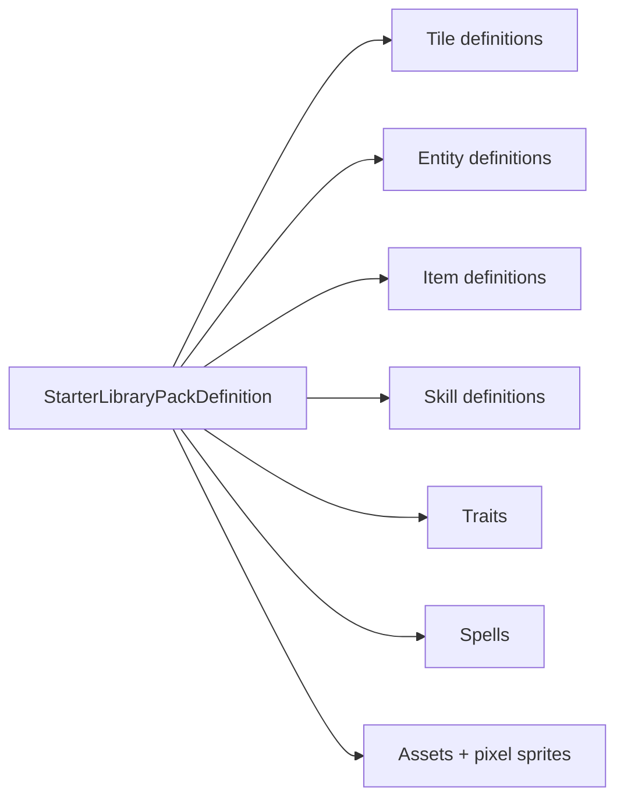
```mermaid
flowchart LR
    Pack[StarterLibraryPackDefinition]
    Tiles[Tile definitions]
    Entities[Entity definitions]
    Items[Item definitions]
    Skills[Skill definitions]
    Traits[Traits]
    Spells[Spells]
    Assets[Assets + pixel sprites]

    Pack --> Tiles
    Pack --> Entities
    Pack --> Items
    Pack --> Skills
    Pack --> Traits
    Pack --> Spells
    Pack --> Assets
```

The important architecture choice is that a starter pack is an index of existing objects. It does not create a second content model and it does not change runtime behavior. This lets later import/export, search, duplicate warnings, AI authoring, and genre filtering work with the same definitions the editor and runtime already use.

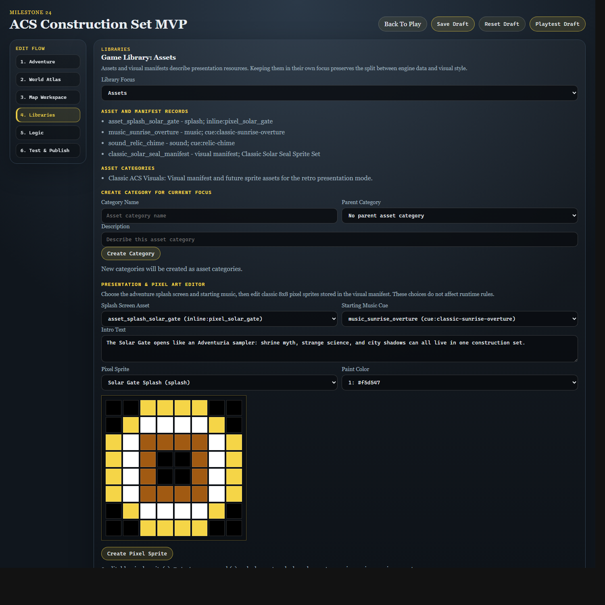

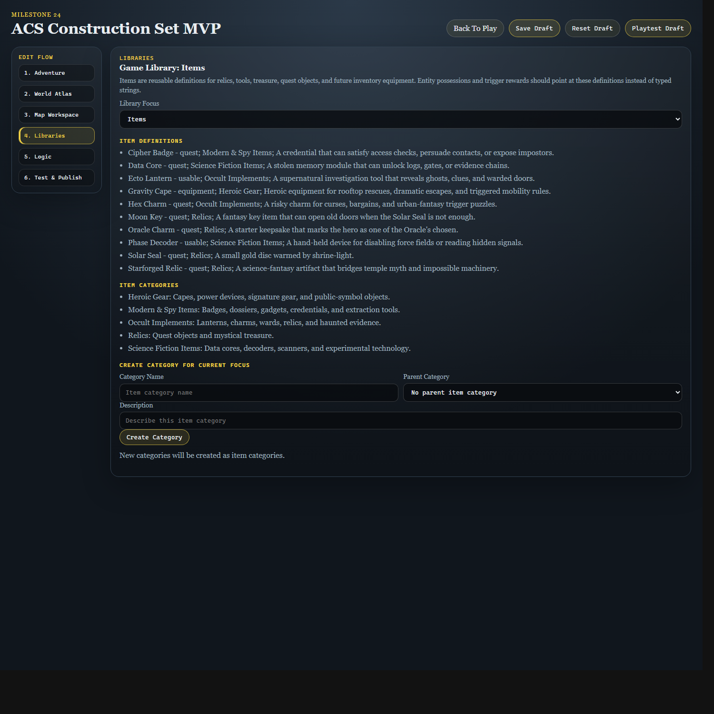

Graphics authoring lives under `Libraries -> Assets` because the project treats visuals as reusable presentation objects, not map rules. The first built-in graphics tool edits classic 8x8 pixel sprites stored in the visual manifest. The runtime can still render the same engine state in Classic ACS or Debug Grid mode because pixel sprites, splash selection, and starting music belong to presentation data.

The pixel editor now renders a visual paint-color swatch plus three synchronized previews from the same sprite record: an in-game preview at normal sprite proportions, a magnified preview for precise painting, and a grouping preview that repeats the sprite in a 4-by-4 tile block. The grouping preview is deliberately modeled after the original ACS graphic editor workflow because terrain, walls, shrubs, floors, starfields, and other repeated art often fail at the seam rather than inside a single isolated tile.

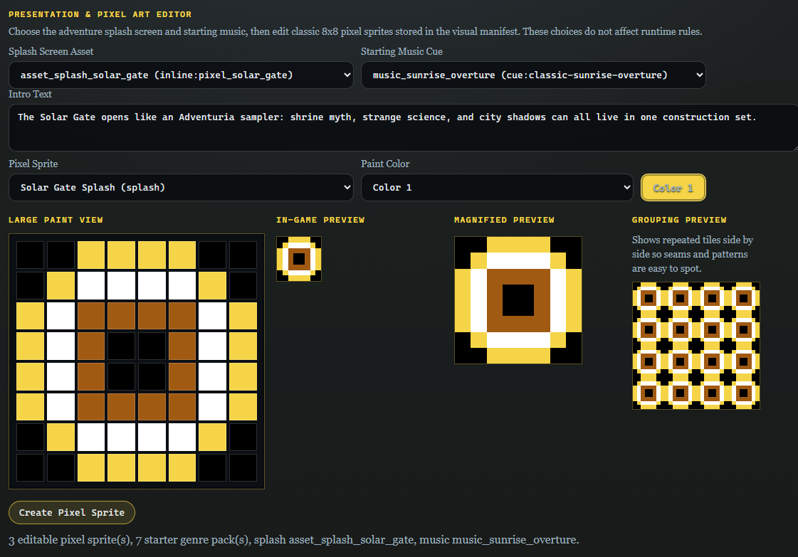

End-to-end pixel edit flow:

```text
Designer clicks a pixel cell
  -> apps/web/src/editor.ts reads selected sprite and palette index
  -> editor-core setClassicPixelSpritePixel clones the package
  -> visual manifest pixel array is updated
  -> editor rerenders the pixel grid, in-game preview, magnified preview, grouping preview, and validation summary
  -> runtime can later read the same manifest-backed sprite data
```

## Milestone 31A AI-Agnostic Provider Foundation

Milestone 31 begins by creating a clean seam for future AI work instead of wiring a model SDK directly into the editor. The new `@acs/ai-core` package is intentionally small and pure:

- `AiProviderManifest`: what a provider is, what it can do, and how it expects structured output.
- `AdventureGenerationRequest`: the normalized request envelope later UI/API adapters will send to a provider.
- `AiAdventureProposal`: the structured proposal envelope that comes back for review before any mutation is accepted.
- `createAiProviderRegistry(...)`, `findAiProvider(...)`, and `listProvidersForCapability(...)`: shared registry helpers so later adapter code can discover providers consistently.
- `validateAdventureGenerationRequest(...)` and `validateAdventureProposal(...)`: early guardrails that catch missing provider ids, empty prompts, invalid limits, mismatched proposal metadata, and missing structured payloads.

This milestone does not yet add AI UI, API calls, NPC dialogue generation, or automatic adventure mutation. That is deliberate. The architecture rule is still: AI can propose structured content, but human-reviewed application code remains responsible for validation and mutation.

Milestone 31B extends that same package with two additional review-oriented constructs:

- `AdventureGenerationPlan`: a provider-independent step list that makes the future UI/API flow explicit, from context gathering through human review and approved mutation.
- `AiProposalReviewReport`: a shared report that combines request validation, proposal validation, provider warnings, readiness state, and next-step guidance.

That means later AI UI can answer three practical questions without inventing browser-only logic:

1. What steps should this generation flow follow?
2. Is the returned proposal ready for human review, merely cautionary, or blocked?
3. Can an accepted proposal be applied yet?

Milestone 31C adds one more portability layer: `AiGenerationSessionRecord`. Instead of making later UI or persistence code keep separate references to a request, plan, proposal, and review report, the session record bundles them together and validates their internal links. That prepares the project for later features like:

- saved AI review sessions
- export/import of AI proposal packages
- audit trails for accepted or rejected proposals
- side-by-side comparison of multiple proposals for the same request

Milestone 31D adds `AiProposalChangeSummary`, which answers a different but equally important review question: what changes if the designer accepts this proposal? Instead of forcing later review UI to diff whole `AdventurePackage` payloads directly, the change-summary helper compares the existing adventure baseline with the proposed structured adventure and reports count deltas for maps, dialogue, triggers, reusable object collections, assets, starter packs, and cue collections.

Milestone 31E builds directly on top of that with `AiProposalApplicationPlan`. The application plan answers the next operational question: can this proposal be applied yet, and if so, which sections would the editor mutation flow touch? It carries forward human-review requirements, apply eligibility, blocker messages, and per-section apply targets so future UI does not have to reinvent that decision logic.

Milestone 31F adds `AiGenerationSessionPackage` and `AiGenerationSessionPackageManifest` on top of the existing session, change-summary, and application-plan helpers. This package is the first portable AI review handoff object that later editor or API surfaces can persist, export, preview, or import as one unit. It includes required file metadata, recommended package names, and a README string so later packaging work does not need to reconstruct those rules from browser-only state.

Milestone 31G builds directly on that package by adding `AiGenerationSessionPackageFileBundle`. The bundle layer turns the portable review package into concrete export-ready files, including the package manifest JSON itself, so later UI or API export work can hand off one declared bundle without re-serializing each AI review artifact independently.

Milestone 31H builds directly on that bundle layer by adding `AiGenerationSessionPackageArchive`. The archive layer is the first actual binary handoff artifact for AI review state: one pure package-level ZIP-like archive object with declared entry metadata and archive bytes. Later editor or API surfaces can now export the archive directly instead of reimplementing archive packaging over the file bundle in browser-only code.

Milestone 31I adds `AiGenerationSessionHandoffReport`, which evaluates the package, file-bundle, and archive layers together from one shared provider-agnostic summary. Later editor or API surfaces can use that one report to judge AI export/import readiness instead of rebuilding handoff-integrity logic in presentation code.

Milestone 31J adds `AiGenerationSessionImportPlan`, which answers the next pure handoff question: if a reviewed AI package is handed to another workflow later, is it safe to ingest, what artifacts should be preserved, and what still blocks import? That keeps future review/audit/import surfaces from embedding AI handoff-ingestion rules in UI code.

Milestone 31K adds `AiGenerationSessionImportReport`, which sits one level above the import plan and explains import readiness in reviewer-facing terms: current import status, blocker and issue counts, required file coverage, preserved artifacts, summary lines, and one next-step recommendation. Later editor or API import surfaces can render that one report directly instead of rebuilding import-readiness summaries in presentation code.

Milestone 31L adds `AiGenerationSessionImportDossier`, which bundles the handoff report, import plan, import report, required dossier file list, and a human-readable README into one portable import-review object. That keeps later editor/API review screens from having to stitch together import-readiness state from several separate AI-core records.

Milestone 31M adds `AiGenerationSessionImportDossierFileBundle`, which turns that portable dossier into one declared export-ready file bundle. Later editor/API import-review surfaces can now ship or persist dossier JSON files from one shared package-level seam instead of rebuilding AI import serialization rules in browser code.

### How The AI-Agnostic Layer Fits Together

The intended long-term AI flow is deliberately staged so no model provider ever gets a direct line into mutable game data.

1. A caller creates an `AdventureGenerationRequest`.
2. `createAdventureGenerationPlan(...)` produces the human-review-first workflow for that request.
3. A provider adapter sends the normalized request to one specific model API.
4. The adapter converts the provider response into one `AiAdventureProposal`.
5. `createProposalReviewReport(...)` evaluates request validity, proposal validity, provider warnings, and review readiness.
6. `createGenerationSessionRecord(...)` bundles the request, plan, proposal, and review report into one stable session object.
7. `createProposalChangeSummary(...)` explains what the proposal would change.
8. `createProposalApplicationPlan(...)` answers whether the proposal is safe to apply and which content sections it would touch.
9. `createGenerationSessionPackage(...)` and `createGenerationSessionPackageFileBundle(...)` turn that reviewed state into a portable handoff package for persistence, export, or later import.
10. Only after explicit human acceptance should normal editor mutation helpers apply the structured changes to the live adventure draft.

That separation matters. The model provider is only responsible for returning structured content or patch intent. The review, apply, export, and persistence rules stay inside ACS-owned code.

### What A Provider Adapter Must Do

The current codebase does not yet include concrete OpenAI, Anthropic, or local-model adapters. The provider-agnostic boundary was built first so those adapters all have to follow the same path.

When an adapter is added later, it should:

1. Declare one `AiProviderManifest`.
2. Register that manifest inside an `AiProviderRegistry`.
3. Accept a normalized `AdventureGenerationRequest`.
4. Convert the request into the provider's transport shape.
5. Ask the provider for structured output.
6. Convert the provider response back into one `AiAdventureProposal`.
7. Preserve provenance:
   - `providerId`
   - optional `providerLabel`
   - optional `model`
   - `generatedAt`
8. Return the proposal for normal ACS review helpers to validate and package.

The important design rule is that the adapter is a translation layer, not a business-rules layer.

### How To Switch Between AI Models

Once provider adapters exist, switching models should be operationally simple because the rest of the review flow stays the same.

The expected steps are:

1. Add or update an `AiProviderManifest`.
   Example fields:
   - `id`
   - `displayName`
   - `transport`
   - `capabilities`
   - `supportsStructuredOutput`
   - `modelHints`

2. Point the adapter at the desired provider endpoint or SDK.
   Examples later might be:
   - OpenAI Responses API
   - Anthropic API
   - local hosted model endpoint
   - custom agent service

3. Map the same `AdventureGenerationRequest` into that provider's expected prompt/tool/schema format.

4. Map the provider response back into the shared `AiAdventureProposal` shape.

5. Run the normal ACS review helpers:
   - `createProposalReviewReport(...)`
   - `createGenerationSessionRecord(...)`
   - `createProposalChangeSummary(...)`
   - `createProposalApplicationPlan(...)`
   - `createGenerationSessionPackage(...)`
   - `createGenerationSessionPackageFileBundle(...)`

6. Compare the reviewed outputs, not just the raw model text.

In other words, switching models should not require rewriting editor workflows, persistence, runtime logic, or publishing logic. It should mostly require:

- a different provider manifest
- a different adapter
- possibly different prompt/schema tuning

Everything after the adapter should remain the same.

### What Someone Should Actually Do To Add A New Provider Later

The practical implementation sequence should be:

1. Create a new adapter module, likely outside `packages/ai-core`.
   Reason:
   `packages/ai-core` should stay pure and network-free.

2. In that adapter module, define the provider manifest.

3. Implement request translation:
   `AdventureGenerationRequest -> provider request payload`

4. Implement response translation:
   `provider response payload -> AiAdventureProposal`

5. Add tests for:
   - manifest registration
   - request translation
   - response translation
   - invalid provider response handling

6. Plug the adapter into whichever future surface calls AI:
   - local API
   - future editor AI panel
   - batch content-generation tool

7. Keep the rest of the lifecycle unchanged:
   request -> plan -> proposal -> review report -> session -> change summary -> application plan -> package -> apply only after acceptance

That is the main benefit of the AI-agnostic model layer. The provider can change without changing the authoring and review contract.

### How Deployment Currently Works

ACS currently has two human-facing release handoff modes plus one reviewer package. They all start from the same rule:

1. Edit a draft.
2. Validate it.
3. Publish an immutable release.
4. Export handoff artifacts from that release.

The release is the source of truth for deployment. ACS does not deploy directly from a mutable draft.

### Deployment Mode 1: Forkable Project Package

Use this when another designer should be able to continue development.

Current flow:

1. Publish a release.
2. Export the forkable package from `Test & Publish`.
3. The package ZIP contains editable handoff files such as:
   - `forkable-project.json`
   - `project-manifest.json`
   - `README.html`
   - `README.txt`
   - `RELEASE-NOTES.txt`
   - `RELEASE-HANDOFF.json`
4. A future import flow will use that package as the seed for a new mutable project.

What to do with it:

- share it with another designer
- archive it as a remixable release
- later import it into ACS as a new project instead of treating it as a live shared workspace

### Deployment Mode 2: Standalone Playable Package

Use this when players should only play the game, not edit it.

Current flow:

1. Publish a release.
2. Export the standalone package from `Test & Publish`.
3. ACS builds a release-backed static web bundle.
4. The ZIP contains the runtime shell plus packaged content, including files such as:
   - `index.html`
   - `styles.css`
   - runtime JavaScript files
   - `bundle/adventure-package.json`
   - `bundle/distribution-manifest.json`
   - `RELEASE-NOTES.txt`
   - `README.html`
   - `README.txt`
   - optional local-launch helpers like `launch/run-local.ps1`

What to do with it:

- unzip and host it as a static web bundle
- or use the packaged launcher helpers for local desktop-friendly play
- later wrap the same bundle in desktop or mobile shells without rewriting the game rules

### Deployment Mode 3: Review Package

Use this when someone needs to review the release package itself rather than play or edit it.

Current flow:

1. Publish a release.
2. Preview release handoff and artifact integrity inside `Test & Publish`.
3. Export the review package.
4. The review ZIP contains:
   - `RELEASE-HANDOFF.json`
   - `ARTIFACT-INTEGRITY.json`
   - README files
   - release notes
   - review-package manifest files

What to do with it:

- hand it to QA or release reviewers
- archive a release-validation packet
- compare intended release metadata against actual packaged outputs

### How These Deployment Paths Fit Together

The important architectural split is:

- `forkableProject` is for future editing
- `standalonePlayable` is for playing
- `review package` is for auditing the release handoff itself

All three come from the same immutable release, which keeps:

- release identity
- release notes
- package naming
- packaged manifests
- validation expectations

consistent across the whole deployment story.

### What Someone Should Do In Practice

If the goal is to collaborate with another designer:

1. Validate draft
2. Publish release
3. Preview forkable artifact
4. Export forkable package

If the goal is to ship a game to players:

1. Validate draft
2. Publish release
3. Preview standalone package
4. Check release readiness
5. Export standalone ZIP
6. Host or launch the packaged bundle

If the goal is to review a release package:

1. Validate draft
2. Publish release
3. Preview release handoff
4. Preview artifact integrity
5. Preview review package
6. Export review package

## Milestone 26 Starter And Custom Library Portability

Milestone 26 creates the first explicit package boundary for starter/custom library storage. The project now has `packages/default-content`, published internally as `@acs/default-content`.

This package does not replace the domain model. Instead, it sits above `packages/domain`:

- `packages/domain` owns the type shapes: `StarterLibraryPackDefinition`, `TileDefinition`, `EntityDefinition`, `ItemDefinition`, `QuestDefinition`, and the rest of the reusable object model.
- `packages/default-content` owns default-library source metadata and helper functions for packaging starter snapshots and custom library exports.
- `apps/web/src/sampleAdventure.ts` still contains the current sample adventure's concrete starter object data while the content is migrated in phases.

### Storage Layers

| Layer | Owner | Storage Intent |
| --- | --- | --- |
| Built-in starter libraries | Application/default content | Shipped curated packs such as science-fiction, fantasy, modern spy, classic ACS reference, and future stocked genre collections. |
| Adventure-local objects | Project/adventure file | Objects created or copied for one specific game. These can safely diverge from built-in defaults. |
| Custom library exports | Designer-authored library file | Reusable packs a designer can import into another adventure. |

### Default Content API

`@acs/default-content` currently exposes:

- `builtInStarterLibrarySource`: stable metadata for the application-owned starter library source.
- `createLibraryCollections(pkg)`: copies reusable object collections out of an adventure package into a portable library collection object.
- `createStarterLibrarySnapshot(pkg)`: wraps starter packs and reusable object collections as a built-in starter-library snapshot.
- `createCustomLibraryExport(options)`: creates a designer-owned custom library export record with schema version, genre tags, provenance, starter-pack references, and copied object collections.
- `listStarterPacksByGenre(snapshot, genre)`: filters starter packs by genre without hardcoding genre behavior into the engine.
- `listCustomLibraryObjectCounts(exportFile)`: produces summary counts for import/export UI and diagnostics.

The current implementation is intentionally conservative. It establishes the boundary and type-safe file shape first. The next UI layer can add New Adventure genre selection, import/export file pickers, duplicate warnings, and object-level copy/fork controls without changing runtime-core.

## Milestone 28 Classic Presentation, Media Cues, And Sound Cues

Milestone 28 completes another slice of the "presentation is not rules" architecture. The engine still knows nothing about pixels, audio devices, DOM overlays, or video playback. It only knows that a trigger action requested a media cue or sound cue, and it emits a typed event. The browser presentation layer decides how visible or audible that cue should become.

### Data Model

`AdventurePackage` now includes two reusable cue collections:

- `mediaCues`: named splash, region-transition, image, cutscene, and future video cue definitions.
- `soundCues`: named effect, music, and ambient cue definitions.

Each cue points at an `AssetDefinition` by `assetId`. Validation checks that referenced assets exist and warns if a media cue points at an asset kind that does not look visual, or if a sound cue points at an asset kind that does not look audible.

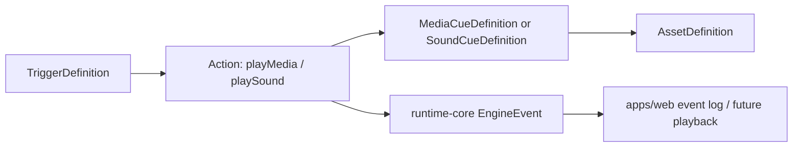
```mermaid
flowchart LR
    Trigger["TriggerDefinition"]
    Action["Action: playMedia / playSound"]
    Cue["MediaCueDefinition or SoundCueDefinition"]
    Asset["AssetDefinition"]
    Runtime["runtime-core EngineEvent"]
    Browser["apps/web event log / future playback"]

    Trigger --> Action
    Action --> Cue
    Cue --> Asset
    Action --> Runtime
    Runtime --> Browser
```

### Runtime Flow: Trigger Plays A Cue

When the player interacts with the Oracle in the sample adventure, the authored action chain now runs as a small scene:

1. Runtime finds the matching `onInteractEntity` trigger.
2. Runtime evaluates trigger conditions.
3. Runtime emits `triggerFired`.
4. Runtime applies `playMedia` and emits `mediaCuePlayed`.
5. Runtime applies `playSound` and emits `soundCuePlayed`.
6. Runtime starts dialogue, sets flags, updates quest stage, advances the turn, and runs enemy timing.
7. The browser event log resolves cue ids into designer-facing cue names such as `Solar Gate Flare` and `Gate Hum`.

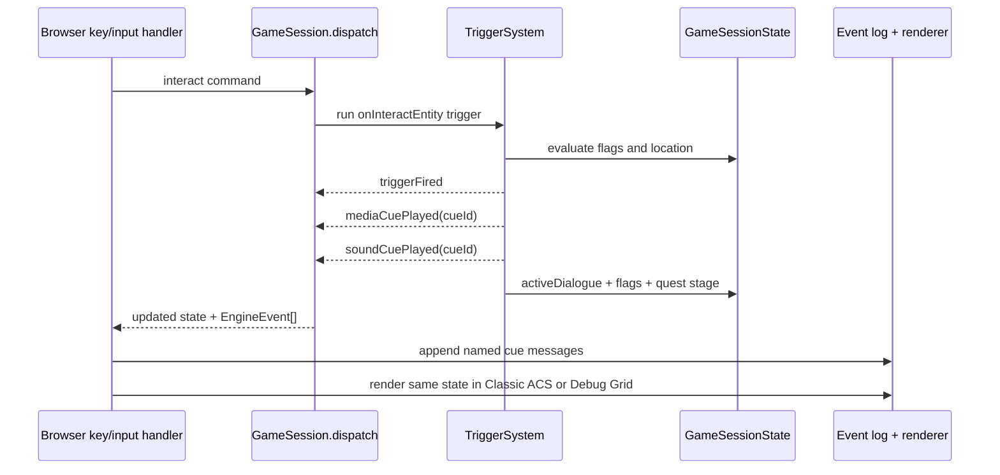
```mermaid
sequenceDiagram
    participant Browser as Browser key/input handler
    participant Session as GameSession.dispatch
    participant Trigger as TriggerSystem
    participant State as GameSessionState
    participant UI as Event log + renderer

    Browser->>Session: interact command
    Session->>Trigger: run onInteractEntity trigger
    Trigger->>State: evaluate flags and location
    Trigger-->>Session: triggerFired
    Trigger-->>Session: mediaCuePlayed(cueId)
    Trigger-->>Session: soundCuePlayed(cueId)
    Trigger->>State: activeDialogue + flags + quest stage
    Session-->>Browser: updated state + EngineEvent[]
    Browser->>UI: append named cue messages
    Browser->>UI: render same state in Classic ACS or Debug Grid
```

### Editor Flow: Authoring Cue Actions

The no-code trigger builder now exposes `Play Media Cue` and `Play Sound Cue` in the `Then Actions` selector. Choosing one of these action types reveals only the cue selector relevant to that action, keeping the progressive-disclosure rule intact.

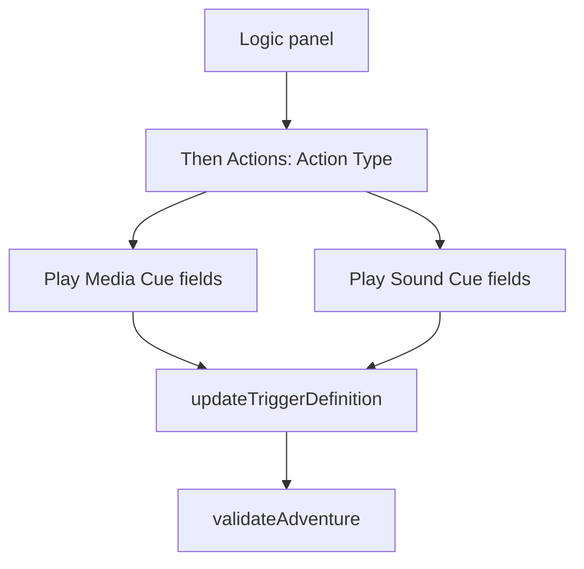
```mermaid
flowchart TD
    Logic["Logic panel"]
    ActionType["Then Actions: Action Type"]
    Media["Play Media Cue fields"]
    Sound["Play Sound Cue fields"]
    Draft["updateTriggerDefinition"]
    Validate["validateAdventure"]

    Logic --> ActionType
    ActionType --> Media
    ActionType --> Sound
    Media --> Draft
    Sound --> Draft
    Draft --> Validate
```

### Classic Size Flow

Classic size is intentionally renderer-local. It is not saved inside a project and it does not alter maps, coordinates, tiles, or entity positions. The browser stores the user preference in local storage, then passes it to `CanvasGameRenderer`.

```text
Classic Size dropdown
  -> readClassicScaleValue
  -> localStorage acs:runtime-classic-scale
  -> CanvasGameRenderer.setClassicScale
  -> renderClassic computes metrics from scale
  -> same GameSessionState is redrawn larger or smaller
```

## High-Level Architecture

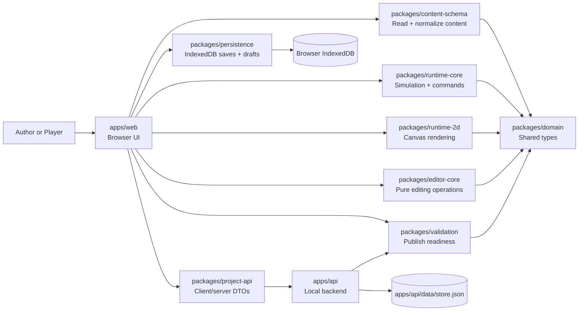
```mermaid
flowchart LR
    User[Author or Player]
    Web[apps/web
Browser UI]
    API[apps/api
Local backend]
    Schema[packages/content-schema
Read + normalize content]
    Domain[packages/domain
Shared types]
    Runtime[packages/runtime-core
Simulation + commands]
    Renderer[packages/runtime-2d
Canvas rendering]
    Editor[packages/editor-core
Pure editing operations]
    Validation[packages/validation
Publish readiness]
    Persistence[packages/persistence
IndexedDB saves + drafts]
    ProjectApi[packages/project-api
Client/server DTOs]
    Store[(apps/api/data/store.json)]
    IndexedDb[(Browser IndexedDB)]

    User --> Web
    Web --> Schema
    Web --> Runtime
    Web --> Renderer
    Web --> Editor
    Web --> Validation
    Web --> Persistence
    Web --> ProjectApi
    ProjectApi --> API
    API --> Validation
    API --> Store
    Persistence --> IndexedDb
    Schema --> Domain
    Runtime --> Domain
    Renderer --> Domain
    Editor --> Domain
    Validation --> Domain
```

The architecture deliberately separates content, simulation, rendering, editing, persistence, and API concerns. That keeps the current 2D browser implementation flexible enough to support later phases such as richer graphics, additional renderers, real-time simulation, or more advanced AI without rewriting the content model from scratch.

## Package Responsibilities

| Area | Package or app | Responsibility |
| --- | --- | --- |
| Shared vocabulary | `packages/domain` | Defines IDs, adventure packages, maps, tile definitions, entities, items, triggers, dialogue, actions, and conditions. |
| Content ingestion | `packages/content-schema` | Reads raw authored content, normalizes missing library arrays, and ensures `tileDefinitions` are present in an `AdventurePackage`. |
| Runtime simulation | `packages/runtime-core` | Owns player commands, state mutation, terrain passability, exits, triggers, dialogue, enemy turns, snapshots, and engine events. |
| Runtime rendering | `packages/runtime-2d` | Draws runtime state to a canvas. It receives state and tile sprite ids; it does not decide game rules. |
| Editing rules | `packages/editor-core` | Provides pure functions such as `setTileAt`, `addEntityInstance`, `moveEntityInstance`, and metadata updates. |
| Validation | `packages/validation` | Checks whether a package is publishable and reports warnings/errors. |
| Local persistence | `packages/persistence` | Stores runtime saves and editor drafts in IndexedDB. |
| API contract | `packages/project-api` | Defines project/release DTOs and browser API client methods. |
| Browser app | `apps/web` | Wires DOM events to runtime/editor operations and updates UI panels. |
| Local backend | `apps/api` | Stores projects/releases, validates packages, and exposes local API endpoints. |

## Data Model Layers

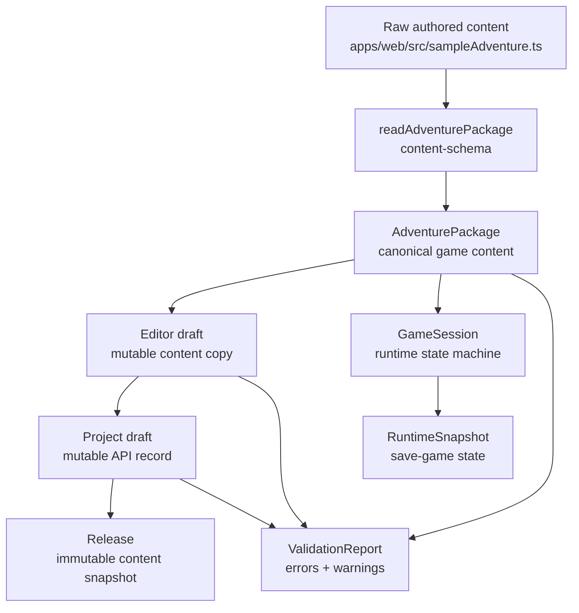
```mermaid
flowchart TD
    Raw[Raw authored content
apps/web/src/sampleAdventure.ts]
    Read[readAdventurePackage
content-schema]
    Package[AdventurePackage
canonical game content]
    Draft[Editor draft
mutable content copy]
    Project[Project draft
mutable API record]
    Release[Release
immutable content snapshot]
    Session[GameSession
runtime state machine]
    Snapshot[RuntimeSnapshot
save-game state]
    Validation[ValidationReport
errors + warnings]

    Raw --> Read --> Package
    Package --> Draft
    Draft --> Project
    Project --> Release
    Package --> Session
    Session --> Snapshot
    Package --> Validation
    Draft --> Validation
    Project --> Validation
```

Important distinctions:

- Raw content is author-friendly data. In the sample, it lives in `apps/web/src/sampleAdventure.ts`.
- `readAdventurePackage(...)` turns raw content into a normalized `AdventurePackage`.
- A draft is mutable content used by the editor.
- A project draft is a mutable backend-side draft stored by `apps/api`.
- A release is an immutable content snapshot created from a valid project draft.
- A runtime save is not content. It is a `RuntimeSnapshot` that captures the state of a running session.

## Runtime Input-To-Rendering Overview

The runtime browser page is centered around one loop: input becomes a `PlayerCommand`, the command is dispatched into `runtime-core`, `runtime-core` returns new state plus events, and the browser redraws the canvas and side panels.

```mermaid
flowchart LR
    Input[Browser input
keyboard or button]
    Command[PlayerCommand
move / inspect / interact / etc]
    Dispatch[session.dispatch(command)]
    Engine[runtime-core
mutates GameSessionState]
    Events[EngineResult
state + events]
    Panels[apps/web
DOM panels + event log]
    Canvas[runtime-2d
canvas render]

    Input --> Command --> Dispatch --> Engine --> Events
    Events --> Panels
    Events --> Canvas
```

Primary runtime files:

- `apps/web/src/index.ts` owns the browser event listeners, save/load buttons, event log, side panels, and call to `renderer.render(...)`.
- `packages/runtime-core/src/index.ts` is now the public export surface for the runtime package.
- `packages/runtime-core/src/engine.ts` owns `createGameEngine(...)` and package migration before session creation.
- `packages/runtime-core/src/game-session.ts` owns the `RuntimeGameSession` command lifecycle: dispatch, player movement, inspection, interaction, dialogue choice handling, turn advancement, and snapshots.
- `packages/runtime-core/src/trigger-system.ts` owns trigger matching, condition evaluation, and trigger actions such as dialogue, flags, item grants, teleport, and tile changes.
- `packages/runtime-core/src/enemy-turn-system.ts` owns enemy turn cadence, detection, leash, wander, guard, and pursue decisions.
- `packages/runtime-core/src/state-factory.ts` owns initial runtime state and save hydration.
- `packages/runtime-core/src/movement.ts` owns grid math helpers such as direction deltas, bounds checks, Manhattan distance, and deterministic wander direction ordering.
- `packages/runtime-2d/src/index.ts` owns visual rendering of maps, entities, tile overrides, and the player marker.

## Use Case 1: Player Initiates A Move Command

This is the full path when the player presses an arrow key or `W`, `A`, `S`, or `D` in the browser.

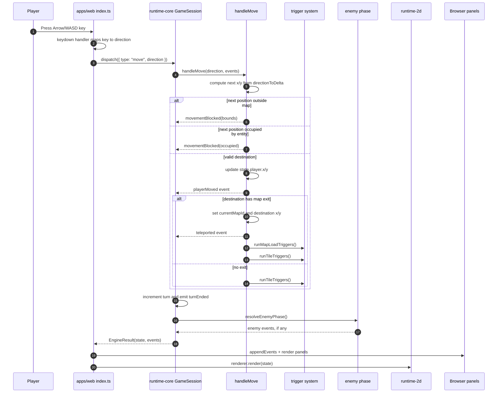
```mermaid
sequenceDiagram
    autonumber
    participant User as Player
    participant Browser as apps/web index.ts
    participant Session as runtime-core GameSession
    participant Move as handleMove
    participant Triggers as trigger system
    participant Enemy as enemy phase
    participant Renderer as runtime-2d
    participant DOM as Browser panels

    User->>Browser: Press Arrow/WASD key
    Browser->>Browser: keydown handler maps key to direction
    Browser->>Session: dispatch({ type: "move", direction })
    Session->>Move: handleMove(direction, events)
    Move->>Move: compute next x/y from directionToDelta
    alt next position outside map
        Move-->>Session: movementBlocked(bounds)
    else next position occupied by entity
        Move-->>Session: movementBlocked(occupied)
    else valid destination
        Move->>Move: update state.player.x/y
        Move-->>Session: playerMoved event
        alt destination has map exit
            Move->>Move: set currentMapId and destination x/y
            Move-->>Session: teleported event
            Move->>Triggers: runMapLoadTriggers()
            Move->>Triggers: runTileTriggers()
        else no exit
            Move->>Triggers: runTileTriggers()
        end
    end
    Session->>Session: increment turn and emit turnEnded
    Session->>Enemy: resolveEnemyPhase()
    Enemy-->>Session: enemy events, if any
    Session-->>Browser: EngineResult(state, events)
    Browser->>DOM: appendEvents + render panels
    Browser->>Renderer: renderer.render(state)
```

Detailed move flow:

1. `window.addEventListener("keydown", ...)` in `apps/web/src/index.ts` receives the key.
2. The browser ignores repeated keydown events with `if (event.repeat) return;`.
3. Arrow keys and `WASD` call `runCommand(() => session.dispatch({ type: "move", direction }))`.
4. `runCommand(...)` executes the dispatch callback, appends returned events to the event history, then calls `renderEverything(result.state)`.
5. `runtime-core.dispatch(...)` sees command type `move`, calls `handleMove(...)`, and uses the returned boolean to decide whether the command consumed a turn.
6. `handleMove(...)` calculates the destination with `directionToDelta(...)`.
7. If the destination is outside the current map, the engine emits `movementBlocked` with reason `bounds` and does not move the player.
8. If the destination contains an active entity, the engine emits `movementBlocked` with reason `occupied` and does not move the player.
9. If the destination tile definition is `blocked`, the engine emits `movementBlocked` with reason `terrain`, leaves the player in place, and does not consume a turn.
10. If the destination is valid, the engine updates `state.player.x` and `state.player.y`, then emits `playerMoved`.
11. If the destination is an exit tile, the engine updates `state.currentMapId` and player coordinates, emits `teleported`, runs map-load triggers, and runs tile triggers at the arrival tile.
12. If the destination is not an exit, the engine only runs tile triggers for the new tile.
13. If movement succeeded, `dispatch(...)` increments `state.turn`, emits `turnEnded`, and runs the enemy phase.
14. The browser receives `EngineResult`, converts events to readable log lines with `describeEvent(...)`, and updates DOM panels in `renderEverything(...)`.
15. `CanvasGameRenderer.render(state)` redraws the map, tile overrides, entities, and player marker.

Current behavior note: blocked movement does not consume a turn and does not grant enemies a free action. Enemy behavior profiles may define `turnInterval`; the sample Shrine Wolf uses `turnInterval: 3`, so it only acts on every third successful player turn.

## Use Case 2: Player Initiates An Inspect Command

This is the full path when the player presses `Q` in the browser.

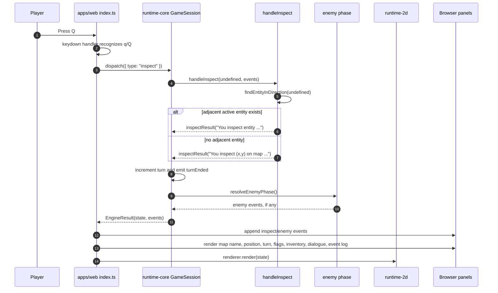
```mermaid
sequenceDiagram
    autonumber
    participant User as Player
    participant Browser as apps/web index.ts
    participant Session as runtime-core GameSession
    participant Inspect as handleInspect
    participant Enemy as enemy phase
    participant Renderer as runtime-2d
    participant DOM as Browser panels

    User->>Browser: Press Q
    Browser->>Browser: keydown handler recognizes q/Q
    Browser->>Session: dispatch({ type: "inspect" })
    Session->>Inspect: handleInspect(undefined, events)
    Inspect->>Inspect: findEntityInDirection(undefined)
    alt adjacent active entity exists
        Inspect-->>Session: inspectResult("You inspect entity ...")
    else no adjacent entity
        Inspect-->>Session: inspectResult("You inspect (x,y) on map ...")
    end
    Session->>Session: increment turn and emit turnEnded
    Session->>Enemy: resolveEnemyPhase()
    Enemy-->>Session: enemy events, if any
    Session-->>Browser: EngineResult(state, events)
    Browser->>DOM: append inspect/enemy events
    Browser->>DOM: render map name, position, turn, flags, inventory, dialogue, event log
    Browser->>Renderer: renderer.render(state)
```

Detailed inspect flow:

1. `apps/web/src/index.ts` listens for `q` and `Q` in the same keydown handler as movement.
2. The browser calls `runCommand(() => session.dispatch({ type: "inspect" }))`.
3. `runtime-core.dispatch(...)` sees command type `inspect`, calls `handleInspect(...)`, and treats a completed inspection as a turn-consuming action.
4. `handleInspect(...)` calls `findEntityInDirection(direction)` with no direction because the browser currently sends no direction.
5. With no direction, `findEntityInDirection(...)` searches for the first active entity on the current map with Manhattan distance exactly `1` from the player.
6. If an adjacent entity exists, the engine emits `inspectResult` with a message like `You inspect entity 'entity_oracle'.`.
7. If no adjacent entity exists, the engine emits `inspectResult` describing the player's current coordinate and map id.
8. Inspect does not directly mutate player position, inventory, flags, tile overrides, dialogue, or map id.
9. After inspection, `dispatch(...)` increments `state.turn`, emits `turnEnded`, and runs the enemy phase.
10. The browser logs the inspect result and any enemy events, then calls `renderEverything(...)`.
11. The renderer redraws from state. Often the visible canvas will not change unless an enemy was eligible to act on its configured turn interval.

Current behavior note: inspect is intentionally treated as a turn-consuming action, but enemies still respect their `turnInterval`. If later design calls for a free-look inspect action, the behavior can be changed in `dispatch(...)` by returning `false` from `handleInspect(...)`.

## Runtime Rendering Details

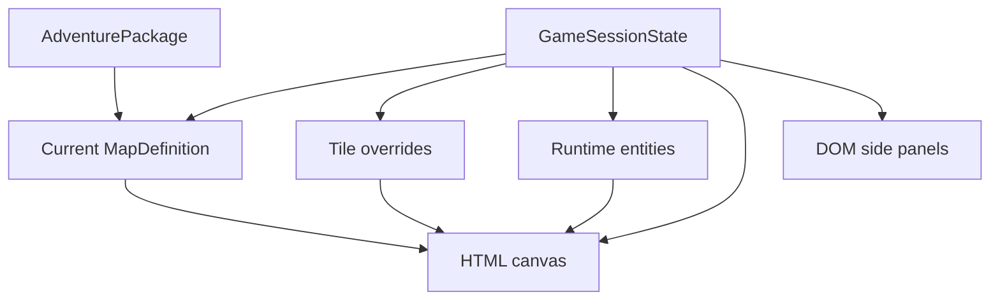
```mermaid
flowchart TD
    State[GameSessionState]
    Package[AdventurePackage]
    Map[Current MapDefinition]
    Overrides[Tile overrides]
    Entities[Runtime entities]
    Canvas[HTML canvas]
    Panels[DOM side panels]

    State --> Map
    Package --> Map
    State --> Overrides
    State --> Entities
    Map --> Canvas
    Overrides --> Canvas
    Entities --> Canvas
    State --> Canvas
    State --> Panels
```

`renderEverything(state)` is the browser-side bridge between simulation and presentation. It calls `renderer.render(state)` for the canvas, then updates map name, player position, turn count, flags, inventory, mode-specific dialogue presentation, and event log. Classic ACS draws dialogue in the canvas bottom message band and uses arrow keys to scroll wrapped lines; Debug Grid shows the DOM dialogue panel. This keeps the engine independent from HTML and canvas concerns.

## Editor Input-To-Draft Overview

The editor has a similar separation: browser UI collects intent, `editor-core` creates an updated package copy, validation reruns, and the browser updates the editor grid.

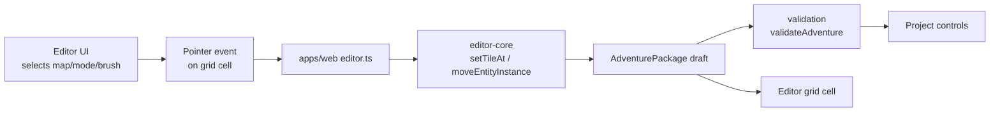
```mermaid
flowchart LR
    UI[Editor UI
selects map/mode/brush]
    Pointer[Pointer event
on grid cell]
    Web[apps/web editor.ts]
    Core[editor-core
setTileAt / moveEntityInstance]
    Draft[AdventurePackage draft]
    Validation[validation
validateAdventure]
    Grid[Editor grid cell]
    Project[Project controls]

    UI --> Pointer --> Web --> Core --> Draft
    Draft --> Validation
    Draft --> Grid
    Validation --> Project
```

Primary editor files:

- `apps/web/src/editor.ts` owns browser controls, pointer events, selected brush state, validation display, project buttons, and grid rendering.
- `packages/editor-core/src/index.ts` owns pure editing operations such as cloning the package, changing a tile, listing entity definitions, and adding/moving entity instances.
- `packages/validation/src/index.ts` owns local and server-side validation rules.
- `packages/persistence/src/index.ts` stores local drafts for save and playtest.

## Use Case 3: Designer Changes A Tile With The Editor Brush

This is the full path when a designer selects a tile type and paints a grid cell.

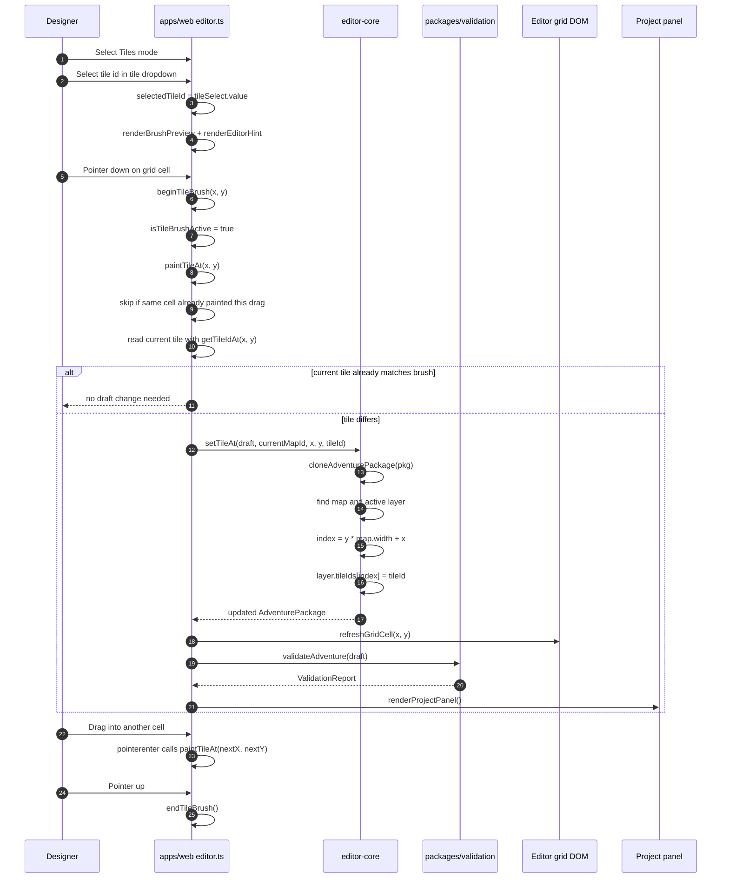
```mermaid
sequenceDiagram
    autonumber
    participant Designer as Designer
    participant Editor as apps/web editor.ts
    participant Core as editor-core
    participant Validation as packages/validation
    participant Grid as Editor grid DOM
    participant Project as Project panel

    Designer->>Editor: Select Tiles mode
    Designer->>Editor: Select tile id in tile dropdown
    Editor->>Editor: selectedTileId = tileSelect.value
    Editor->>Editor: renderBrushPreview + renderEditorHint
    Designer->>Editor: Pointer down on grid cell
    Editor->>Editor: beginTileBrush(x, y)
    Editor->>Editor: isTileBrushActive = true
    Editor->>Editor: paintTileAt(x, y)
    Editor->>Editor: skip if same cell already painted this drag
    Editor->>Editor: read current tile with getTileIdAt(x, y)
    alt current tile already matches brush
        Editor-->>Designer: no draft change needed
    else tile differs
        Editor->>Core: setTileAt(draft, currentMapId, x, y, tileId)
        Core->>Core: cloneAdventurePackage(pkg)
        Core->>Core: find map and active layer
        Core->>Core: index = y * map.width + x
        Core->>Core: layer.tileIds[index] = tileId
        Core-->>Editor: updated AdventurePackage
        Editor->>Grid: refreshGridCell(x, y)
        Editor->>Validation: validateAdventure(draft)
        Validation-->>Editor: ValidationReport
        Editor->>Project: renderProjectPanel()
    end
    Designer->>Editor: Drag into another cell
    Editor->>Editor: pointerenter calls paintTileAt(nextX, nextY)
    Designer->>Editor: Pointer up
    Editor->>Editor: endTileBrush()
```

Detailed tile-edit flow:

1. The designer chooses `Tiles` mode in the editor mode dropdown.
2. `syncModeVisibility()` shows the tile picker and brush preview.
3. The designer chooses a tile in `tileSelect`.
4. `selectedTileId` is updated and the editor calls `renderBrushPreview()` and `renderEditorHint()`.
5. `renderGrid()` builds one button per map cell.
6. In tile mode, each cell receives a `pointerdown` handler and a `pointerenter` handler.
7. `pointerdown` calls `beginTileBrush(x, y)` for the clicked cell.
8. `beginTileBrush(...)` sets `isTileBrushActive = true`, resets `lastPaintedCellKey`, and calls `paintTileAt(x, y)`.
9. `paintTileAt(...)` exits early if the editor is not in tile mode.
10. `paintTileAt(...)` also exits early if this is the same cell already painted during the current drag.
11. The editor chooses the tile id from `selectedTileId`, falling back to the select value or `grass`.
12. The editor reads the current tile with `getTileIdAt(x, y)`.
13. If the current tile already matches the brush, no draft change is made.
14. If the tile differs, the editor calls `setTileAt(draft, currentMapId, x, y, tileId)` from `editor-core`.
15. `setTileAt(...)` clones the whole `AdventurePackage`, finds the map, selects the active layer, calculates `index = y * map.width + x`, writes `layer.tileIds[index] = tileId`, and returns the new package.
16. The browser replaces its `draft` variable with the updated package.
17. `refreshGridCell(x, y)` updates only the changed grid cell instead of rebuilding the whole grid.
18. `markValidationDirty()` clears the latest server validation report and calls `renderValidation()`.
19. `renderValidation()` runs `validateAdventure(draft)` locally and updates the validation list.
20. `renderProjectPanel()` enables or disables project/release buttons based on validation state.
21. While the pointer remains down, moving into another cell triggers `pointerenter`, which calls `paintTileAt(...)` again. This is what makes the tile picker behave like a brush instead of a one-shot selection.
22. `window.pointerup` calls `endTileBrush()`, which turns off painting and clears the last-painted-cell key.

Current behavior note: painting a tile changes the editor draft only. It does not automatically change the currently running game. To play the edited content, use `Playtest Draft`; the editor saves the draft to IndexedDB and opens the runtime page with a `?draft=...` query parameter.


## Use Case 4: Designer Places A New Entity Instance

This is the full path when a designer uses entity mode to add a new enemy or NPC to the current map.

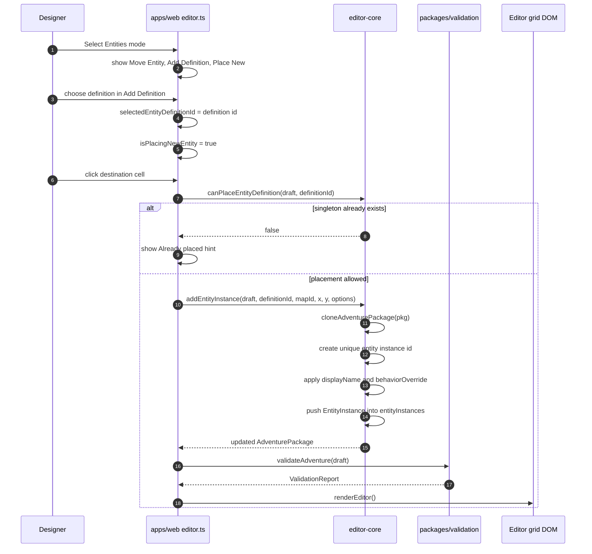
```mermaid
sequenceDiagram
    autonumber
    participant Designer as Designer
    participant Editor as apps/web editor.ts
    participant Core as editor-core
    participant Validation as packages/validation
    participant Grid as Editor grid DOM

    Designer->>Editor: Select Entities mode
    Editor->>Editor: show Move Entity, Add Definition, Place New
    Designer->>Editor: choose definition in Add Definition
    Editor->>Editor: selectedEntityDefinitionId = definition id
    Editor->>Editor: isPlacingNewEntity = true
    Designer->>Editor: click destination cell
    Editor->>Core: canPlaceEntityDefinition(draft, definitionId)
    alt singleton already exists
        Core-->>Editor: false
        Editor->>Editor: show Already placed hint
    else placement allowed
        Editor->>Core: addEntityInstance(draft, definitionId, mapId, x, y, options)
        Core->>Core: cloneAdventurePackage(pkg)
        Core->>Core: create unique entity instance id
        Core->>Core: apply displayName and behaviorOverride
        Core->>Core: push EntityInstance into entityInstances
        Core-->>Editor: updated AdventurePackage
        Editor->>Validation: validateAdventure(draft)
        Validation-->>Editor: ValidationReport
        Editor->>Grid: renderEditor()
    end
```

Detailed entity-placement flow:

1. The designer chooses `Entities` mode.
2. `syncModeVisibility()` hides tile-only controls and shows `Move Entity`, `Add Definition`, and `Place New`.
3. `renderPalette()` lists existing instances on the current map and reusable definitions from `entityDefinitions`.
4. Definitions whose placement rule is exhausted are disabled in the `Add Definition` dropdown.
5. Choosing a definition sets `selectedEntityDefinitionId`, clears `selectedEntityId`, and sets `entityEditIntent` to `place`.
6. Clicking a grid cell calls `applyEntityEdit(x, y)`.
7. If placing, the browser checks `canPlaceEntityDefinition(draft, definitionId)`.
8. `singleton` definitions return false once any instance of that definition exists anywhere in the adventure.
9. `multiple` definitions return true and can be placed repeatedly.
10. `addEntityInstance(...)` clones the package, creates a unique id such as `entity_wolf_1`, applies optional instance metadata such as `displayName` and `behaviorOverride`, pushes a new `EntityInstance`, and returns the updated draft.
11. The editor reruns local validation and rerenders the grid and entity summary.
12. Playtesting uses the same draft package, so the runtime sees the newly placed entity without a separate conversion step.

### Entity Definition vs Entity Instance

An `EntityDefinition` is the reusable template. It answers, "What kind of thing is this?" Examples include `Spy Handler`, `Police Officer`, `Defense Drone`, and `Oracle`. The definition owns reusable behavior defaults, profile data, placement policy, visuals, category, and starting possessions.

An `EntityInstance` is the placed copy. It answers, "Which one is this, and where is it?" Instances now carry optional `displayName` and `behaviorOverride` fields in addition to id, definition id, map id, and coordinates. That lets a designer place the same `Spy Handler` definition more than once while naming the copies `Red Team Spy Handler` and `Green Team Spy Handler`. It also lets one placed copy inherit the definition behavior while another uses a simple override such as `guard`, `wander`, `pursue`, or `idle`.

Runtime behavior resolution uses this order:

1. Look up the placed runtime entity.
2. Look up its authored `EntityInstance`.
3. Use `EntityInstance.behaviorOverride` when present.
4. Otherwise fall back to `EntityDefinition.behavior`.
5. Normalize the selected behavior into an `EntityBehaviorProfile`.

This keeps the reusable library clean. Designers do not need to create duplicate definitions just to give two placed copies different story names or simple behavior roles.

Current behavior note: entity instance creation and movement now support friendly instance names and simple per-instance behavior overrides. The editor still does not add deletion of instances or creation of brand-new entity definitions from the browser UI.

## Milestone 27 Editor Information Architecture

Milestone 27 adds two practical information-architecture tools that reduce editor hunting:

1. Selected Cell Inspector: Map Workspace now records the last clicked cell and the dependency panel summarizes the cell's tile definition, passability, occupant, exit records, and local triggers.
2. Display Rename / Reskin: Test & Publish now includes a UI-based preview/apply workflow for player-facing text changes. This is intentionally separate from internal id refactoring.

### Selected Cell Inspector Flow

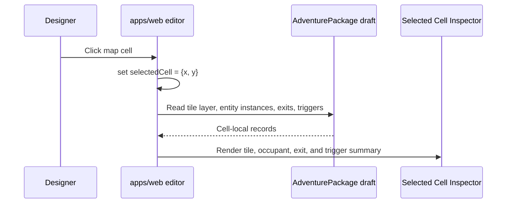
```mermaid
sequenceDiagram
    participant User as Designer
    participant Editor as apps/web editor
    participant Draft as AdventurePackage draft
    participant Panel as Selected Cell Inspector
    User->>Editor: Click map cell
    Editor->>Editor: set selectedCell = {x, y}
    Editor->>Draft: Read tile layer, entity instances, exits, triggers
    Draft-->>Editor: Cell-local records
    Editor->>Panel: Render tile, occupant, exit, and trigger summary
```

The inspector does not create a second model. It derives its answer from the current `AdventurePackage` draft every time it renders. That keeps it trustworthy: if a tile paint, entity placement, exit edit, or trigger attachment changes the draft, the inspector is reading the same data that playtest will later load.

### Display Rename / Reskin Flow

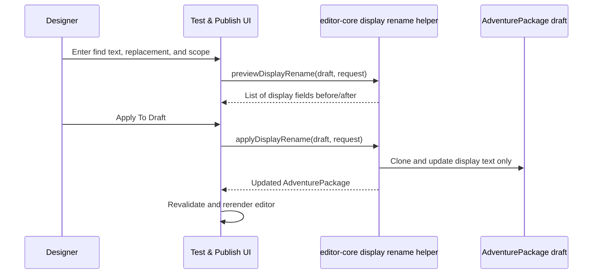
```mermaid
sequenceDiagram
    participant User as Designer
    participant UI as Test & Publish UI
    participant Core as editor-core display rename helper
    participant Draft as AdventurePackage draft
    User->>UI: Enter find text, replacement, and scope
    UI->>Core: previewDisplayRename(draft, request)
    Core-->>UI: List of display fields before/after
    User->>UI: Apply To Draft
    UI->>Core: applyDisplayRename(draft, request)
    Core->>Draft: Clone and update display text only
    Core-->>UI: Updated AdventurePackage
    UI->>UI: Revalidate and rerender editor
```

The helper scans player-facing display fields such as adventure title/description, region names/descriptions, map names, library category names/descriptions, entity definition names, entity instance display names, item names/descriptions, tile names/descriptions/hints, quest names/summaries/objectives/rewards, and dialogue speaker/text/choice labels. It preserves stable ids such as map ids, item ids, quest ids, entity definition ids, trigger ids, and structured references.

This supports the reskin workflow we want for future authors: a designer can rename visible concepts across an adventure from the UI without writing a script and without accidentally breaking trigger references or save data.
## Editor-To-Playtest Flow

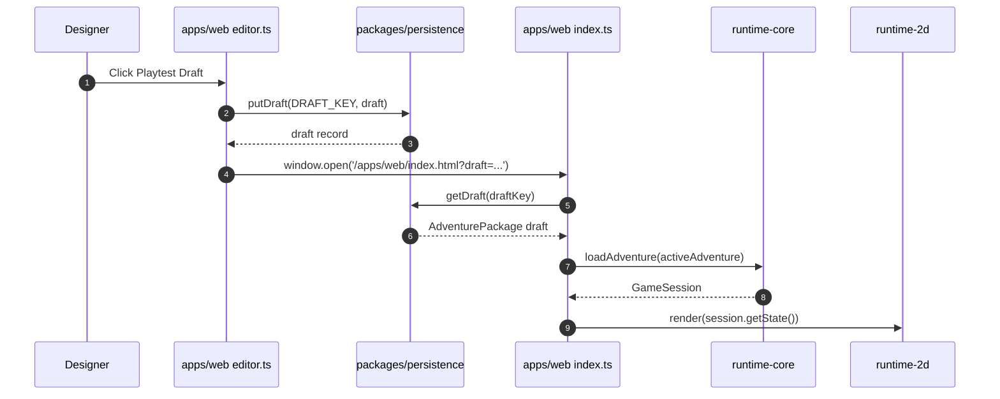
```mermaid
sequenceDiagram
    autonumber
    participant Designer as Designer
    participant Editor as apps/web editor.ts
    participant Persist as packages/persistence
    participant RuntimePage as apps/web index.ts
    participant Engine as runtime-core
    participant Renderer as runtime-2d

    Designer->>Editor: Click Playtest Draft
    Editor->>Persist: putDraft(DRAFT_KEY, draft)
    Persist-->>Editor: draft record
    Editor->>RuntimePage: window.open('/apps/web/index.html?draft=...')
    RuntimePage->>Persist: getDraft(draftKey)
    Persist-->>RuntimePage: AdventurePackage draft
    RuntimePage->>Engine: loadAdventure(activeAdventure)
    Engine-->>RuntimePage: GameSession
    RuntimePage->>Renderer: render(session.getState())
```

## Validation And Publishing Flow

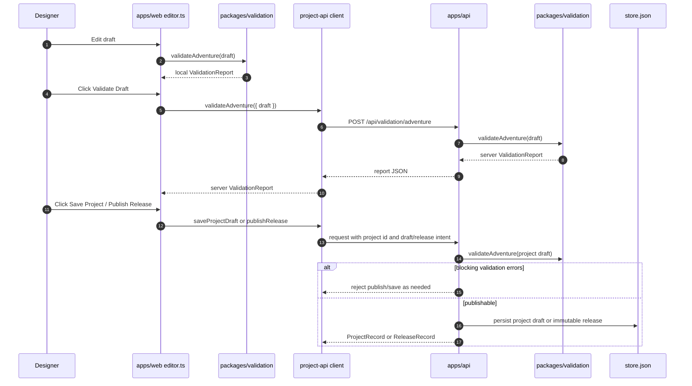
```mermaid
sequenceDiagram
    autonumber
    participant Designer as Designer
    participant Editor as apps/web editor.ts
    participant LocalVal as packages/validation
    participant Client as project-api client
    participant API as apps/api
    participant ServerVal as packages/validation
    participant Store as store.json

    Designer->>Editor: Edit draft
    Editor->>LocalVal: validateAdventure(draft)
    LocalVal-->>Editor: local ValidationReport
    Designer->>Editor: Click Validate Draft
    Editor->>Client: validateAdventure({ draft })
    Client->>API: POST /api/validation/adventure
    API->>ServerVal: validateAdventure(draft)
    ServerVal-->>API: server ValidationReport
    API-->>Client: report JSON
    Client-->>Editor: server ValidationReport
    Designer->>Editor: Click Save Project / Publish Release
    Editor->>Client: saveProjectDraft or publishRelease
    Client->>API: request with project id and draft/release intent
    API->>ServerVal: validateAdventure(project draft)
    alt blocking validation errors
        API-->>Client: reject publish/save as needed
    else publishable
        API->>Store: persist project draft or immutable release
        API-->>Client: ProjectRecord or ReleaseRecord
    end
```

Validation currently checks categories such as:

- missing or unknown start map
- start position outside map bounds
- map region references that do not exist
- tile layer size mismatches
- wrong tile count for a layer
- exit source or destination out of bounds
- entity placements outside map bounds
- overlapping entities on one tile as a warning
- empty dialogue definitions
- duplicate dialogue node ids
- dialogue choices pointing to missing nodes
- trigger map locations that are missing or invalid
- conditions referencing missing items or quests
- actions referencing missing maps, items, tiles, or dialogues

## Future Publishing Modes

Publishing should transform an immutable release into one or more artifacts. It should never mutate the original project draft or the frozen release snapshot.

The project should support two publishing modes:

| Artifact | Purpose | Includes | Excludes |
| --- | --- | --- | --- |
| `forkableProject` | Share an adventure so another designer can inspect, edit, remix, or fork it. | Editable adventure package, authoring metadata, custom libraries, source/provenance notes, visual manifests, assets, distribution/license metadata. | Nothing needed for editing should be stripped. |
| `standalonePlayable` | Ship a game to players as play-only content. | Runtime-normalized package, required maps, runtime triggers, dialogue, visual/audio assets, splash/music/sound cues, play shell, distribution/license metadata. | Editor UI, draft history, unused starter-library objects, source notes, and construction-set panels. |

Recommended future package boundary:

```text
packages/publishing
  createForkableProjectExport(release)
  createStandaloneRuntimeExport(release)
  collectRuntimeAssets(package)
  pruneUnusedAuthoringData(package)
  validatePublishArtifact(artifact)
```

The release path should be:

```text
Project Draft
  -> validation
  -> immutable Published Release
  -> forkable construction package and/or standalone playable bundle
```

Distribution metadata should record creator intent:

- `artifactType`: `forkableProject` or `standalonePlayable`
- `editable`: whether the artifact is intended to open in the editor
- `sourceIncluded`: whether authoring/source metadata is included
- `allowForking`: whether the creator permits remix/fork flows
- `license` and attribution text
- `runtimeOnly`: whether the artifact is designed only for play mode

Standalone export should begin with a static web bundle because it aligns with the current browser runtime. Later desktop wrappers, such as Tauri or a similar shell, can package the same runtime-only bundle without changing game rules.

## Save And Load Flow

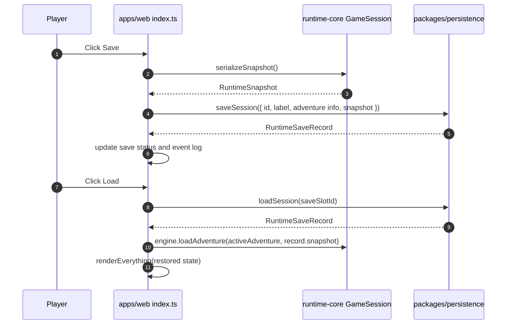
```mermaid
sequenceDiagram
    autonumber
    participant Player as Player
    participant RuntimePage as apps/web index.ts
    participant Session as runtime-core GameSession
    participant Persist as packages/persistence

    Player->>RuntimePage: Click Save
    RuntimePage->>Session: serializeSnapshot()
    Session-->>RuntimePage: RuntimeSnapshot
    RuntimePage->>Persist: saveSession({ id, label, adventure info, snapshot })
    Persist-->>RuntimePage: RuntimeSaveRecord
    RuntimePage->>RuntimePage: update save status and event log

    Player->>RuntimePage: Click Load
    RuntimePage->>Persist: loadSession(saveSlotId)
    Persist-->>RuntimePage: RuntimeSaveRecord
    RuntimePage->>Session: engine.loadAdventure(activeAdventure, record.snapshot)
    RuntimePage->>RuntimePage: renderEverything(restored state)
```

A save wraps the runtime's existing `RuntimeSnapshot`. That means persistence stores the same state model the engine already knows how to serialize and hydrate. The project does not maintain a second, competing save-game model.

## End-To-End Runtime Example: Move Onto A Trigger Tile

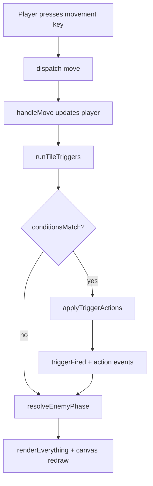
```mermaid
flowchart TD
    Key[Player presses movement key]
    Dispatch[dispatch move]
    Move[handleMove updates player]
    Tile[runTileTriggers]
    Condition{conditionsMatch?}
    Action[applyTriggerActions]
    Events[triggerFired + action events]
    Enemy[resolveEnemyPhase]
    Render[renderEverything + canvas redraw]

    Key --> Dispatch --> Move --> Tile --> Condition
    Condition -- no --> Enemy
    Condition -- yes --> Action --> Events --> Enemy
    Enemy --> Render
```

Example: when the player reaches the shrine altar in the sample adventure, the engine can run an `onEnterTile` trigger, grant an item, set flags, or change a tile. Those changes are represented as state changes and events, then the renderer redraws using the new state.

## End-To-End Editor Example: Change A Tile, Validate, Then Play

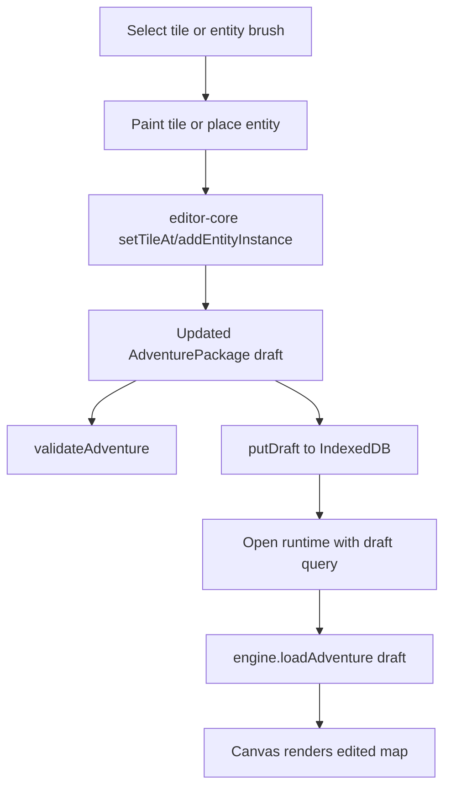
```mermaid
flowchart TD
    Brush[Select tile or entity brush]
    Paint[Paint tile or place entity]
    Core[editor-core setTileAt/addEntityInstance]
    Draft[Updated AdventurePackage draft]
    Validate[validateAdventure]
    Save[putDraft to IndexedDB]
    Play[Open runtime with draft query]
    Runtime[engine.loadAdventure draft]
    Render[Canvas renders edited map]

    Brush --> Paint --> Core --> Draft --> Validate
    Draft --> Save --> Play --> Runtime --> Render
```

This flow is important because the editor and runtime share the same content representation. The editor does not produce a special editor-only format. It updates an `AdventurePackage`, validates that package, stores it as a draft, and the runtime can load that same package for playtesting.


## Milestone 10 Runtime Visual Modes

Milestone 10 implements the first classic ACS presentation mode without changing `runtime-core`. The runtime still loads an `AdventurePackage`, dispatches commands through `GameSession`, and emits `GameSessionState`. The browser can now ask `runtime-2d` to render that same state in either `classic-acs` mode or `debug-grid` mode.

```mermaid
flowchart LR
    Input[Browser input]
    Engine[runtime-core dispatch]
    State[GameSessionState]
    Renderer[runtime-2d CanvasGameRenderer]
    Classic[classic-acs panel]
    Debug[debug-grid canvas]

    Input --> Engine --> State --> Renderer
    Renderer --> Classic
    Renderer --> Debug
```

The classic renderer currently draws a procedural vintage panel:

- fixed 640 by 400 canvas surface
- map viewport centered inside a black playfield
- right-side `POWER` and `LIFE` rails
- bottom message band with actor, map, turn, movement prompt text, and scrollable Classic ACS dialogue
- tile/icon drawing with pixelated blocks and a restrained palette

This is intentionally not a second engine. Switching visual mode does not reset the session, change saves, change triggers, or change enemy AI. It only changes how the current state is drawn.
## Current Design Constraints And Extension Points

The current design intentionally avoids locking the project into the current 2D implementation.

- A higher-resolution renderer can be introduced beside `runtime-2d` as long as it consumes `AdventurePackage` and `GameSessionState`.
- A 3D renderer could also consume the same state, though content would need richer spatial and asset metadata.
- Real-time play would likely require changing how `dispatch(...)`, turn advancement, enemy `turnInterval`, and enemy phases are scheduled, but the command/state/event boundary is a good place to evolve that behavior.
- Richer enemy AI should live in `runtime-core` or a future AI package, not in `apps/web` or `runtime-2d`.
- More advanced editor creation tools should extend `editor-core` with pure operations first, then wire those operations into `apps/web/src/editor.ts`.
- Asset manifests should continue to describe assets by id and metadata, so renderers can choose how to resolve classic pixel art, stocked genre libraries, splash screens, music cues, HD sprites, or future 3D assets without hardcoded visual assumptions.


### Genre Library Policy

The stocked starter libraries should be genre-complete enough to let a designer begin making a game immediately. The default library should include original, generic assets and definitions inspired by broad genres, not direct copies of protected intellectual property. For example, the library can support superhero adventures with capes, secret identities, gadgets, power icons, city rooftops, and masked villains, but it should not ship Marvel or DC characters, logos, names, or distinctive protected designs. The same principle applies to science-fantasy, supernatural investigation, urban fantasy, modern spy, and other popular genres.

The same caution now applies to product naming. A future legal-safe rebrand milestone should move human-facing ACS / Adventure Construction Set naming toward WorldTree branding. That rename should be handled as a compatibility migration, not a blind search-and-replace, so saved drafts, releases, exports, package names, and storage keys continue to work during the transition.

Current User Guide tutorial requirement: the tutorial should walk the reader through building a science-fiction adventure from scratch using the strongest currently supported trigger chain. The current tutorial concept is Relay Station Alecto: the designer creates station maps, paints terminal/transit/core tiles, places a station AI and drone, defines a multi-stage relay restoration quest, wires dialogue/flag/item/teleport/tile-change/quest-stage triggers, chooses presentation assets, runs diagnostics, and playtests the result. The examples should showcase current framework power without pretending future unsupported effects already exist.

### Current Corrective Planning Notes

- Stacked tile effects should become an ordered trigger action stack. One tile should be able to show a splash/media scene, play a sound cue, display text, grant or remove items, modify player stats, spawn or remove an NPC, change tiles, advance quests, and then optionally route the actor through an exit/portal.
- The runtime currently has a player-centered command path. Future AI NPCs should use actor-capable action services so player and NPC actors call the same validated movement, inspect, interact, item-use, trigger, and exit functions. Designer policies decide which actors may use which items, exits, triggers, or maps.
- The editor should keep all gameplay references as objects. Items, tiles, entities, dialogue, flags, skills, spells, objectives, rewards, media cues, assets, starter packs, categories, trigger templates, and condition/action templates should have CRUD controls, stable ids, categories, and validation.
- Play mode should add a player profile panel for inventory, abilities, skills, traits, active effects, quest connections, and owned/linked objects. Immediate values such as life, power, moves, and objective remain visible on the main play screen.
- Starter library definitions should migrate out of `sampleAdventure.ts` into reusable default library data. Adventures may include local additions/overrides, while import/export allows designers to reuse custom library packs across projects.
- Map Workspace and every other editor workspace should use progressive disclosure: the active task determines which panels are visible, and irrelevant task controls should be hidden rather than merely pushed lower on the page.

Each genre pack should include at least:

- terrain and architectural tiles
- interactable objects and treasure/items
- NPC/enemy/entity definitions
- portraits or symbolic character icons
- UI/item icons
- splash-screen templates
- starting music cues and sound-effect cue ids
- tags, categories, and example trigger-friendly object definitions

## Milestone 24 Presentation, Pixel Art, And Starter Libraries

Milestone 24 adds the first implementation slice for classic ACS-style asset authoring. It introduces adventure-level presentation settings, manifest-backed classic pixel sprites, and starter genre pack metadata. Runtime rules, movement, triggers, and quest state remain independent from presentation data.


| Layer | Object or function | Role |
| --- | --- | --- |
| Domain | `AdventurePresentationDefinition` | Stores selected splash asset, starting music asset, and intro text for the adventure. |
| Domain | `ClassicPixelSpriteDefinition` | Stores editable classic pixel art as width, height, palette, pixels, usage, tags, and genre tags. |
| Domain | `StarterLibraryPackDefinition` | Groups reusable tiles, entities, items, skills, assets, and quests into genre-oriented starter packs. |
| Content schema | `normalizeVisualManifests` and `normalizePixelSprite` | Ensures pixel sprites have valid dimensions, palettes, and pixel arrays when raw content is read. |
| Editor core | `asset-authoring.ts` | Holds presentation updates, pixel sprite creation, pixel painting, and starter pack listing outside the all-purpose barrel file. |
| Browser editor | `Libraries -> Assets` | Shows splash/music selectors, intro text, an 8x8 pixel editor, and starter pack summaries only when the Assets focus is active. |
| Browser runtime | `Adventure Intro` panel | Displays the selected splash asset id, music cue id, and intro text without changing game rules. |

### Presentation Data Flow

```mermaid
sequenceDiagram
  autonumber
  actor Designer
  participant Editor as apps/web editor
  participant Core as editor-core/asset-authoring
  participant Draft as AdventurePackage draft
  participant Runtime as apps/web runtime

  Designer->>Editor: Libraries -> Assets -> choose splash/music
  Editor->>Core: updateAdventurePresentation(draft, updates)
  Core->>Draft: clone package and sanitize presentation fields
  Draft-->>Editor: updated draft
  Designer->>Editor: Playtest Draft
  Editor->>Runtime: load draft from persistence
  Runtime->>Runtime: render Adventure Intro panel
```

### Pixel Sprite Editing Flow

```mermaid
sequenceDiagram
  autonumber
  actor Designer
  participant Editor as Assets panel
  participant Core as setClassicPixelSpritePixel
  participant Manifest as VisualManifestDefinition

  Designer->>Editor: select Solar Gate Splash
  Designer->>Editor: choose palette index
  Designer->>Editor: click pixel cell
  Editor->>Core: setClassicPixelSpritePixel(spriteId, x, y, paletteIndex)
  Core->>Manifest: update pixelSprites[].pixels[index]
  Manifest-->>Editor: rerender 8x8 grid
```

### Starter Pack Organization

Starter packs are not separate engines or rulesets. They are curated references to existing definitions, assets, and quests. This keeps genre organization discoverable without duplicating content or hardcoding genre behavior.

The sample now includes seven starter pack records:

- `Fantasy Shrine Trial`: shrine terrain, Oracle, wolf, relics, mystic skills, splash, and music cue.
- `Science Fiction Data Core`: starship/lab terrain, data core items, drones, ship AI, hacking, and system skills.
- `Modern Spy Operation`: contacts, security doors, cipher badges, stealth, tradecraft, and city extraction ingredients.
- `Superhero Rooftop Crisis`: rooftop terrain, vigilantes, drones, gravity gear, heroics, and gadgetry.
- `Science-Fantasy Gate`: relic machinery, ward circles, force fields, clockwork guardians, and arcane science.
- `Supernatural Case File`: haunted terrain, ghost witnesses, occult tools, spectral traits, and ward spells.
- `Urban Fantasy Alley`: neon alleys, street witches, cursed charms, city spirits, and spell-triggered shortcuts.

This is the foundation for the larger stocked library milestone path. Later passes should add fuller genre packs, richer asset CRUD, template import/apply flows, and duplicate/near-duplicate guardrails.
## Milestone 23 Object-Backed Quest Objectives And Rewards

Milestone 23 continues the object-model corrective pass by changing quest stage text and reward notes from loose string arrays into nested objects. A quest remains the parent library object, but each objective now has its own stable id, title, description, kind, optional target map, optional target item, and completion-stage number. Each reward now has its own stable id, label, kind, optional description, optional item reference, and optional quantity.

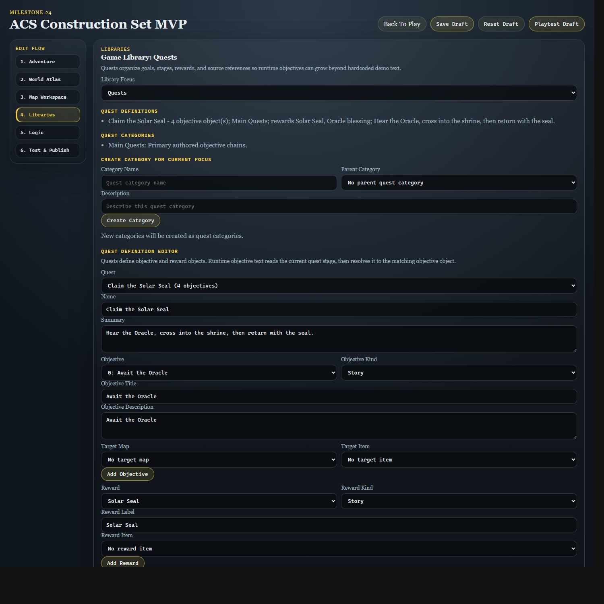

| Layer | Object or function | Role |
| --- | --- | --- |
| Domain | `QuestDefinition.objectives` | Stores objective records instead of loose stage strings. |
| Domain | `QuestRewardDefinition` | Stores reward records instead of freeform reward notes. |
| Content schema | `normalizeQuestDefinitions` | Migrates legacy `stages: string[]` and string rewards into objective/reward objects when raw content is read. |
| Editor core | `quest-definitions.ts` | Holds quest-specific list/create/update/sanitize helpers outside the all-purpose `index.ts`. |
| Browser editor | `Libraries -> Quests` | Lets designers select quest objects, objective objects, and reward objects without editing JSON. |
| Runtime core | `TriggerSystem.setQuestStage` | Still mutates `state.questStages[questId]`, so existing trigger-stage behavior remains stable. |
| Browser runtime | `summarizeCurrentObjective` | Reads the current objective object by quest stage and displays title, description, and reward labels. |
| Validation | `questObjectiveCount` | Validates stage numbers against objective count while retaining legacy stage fallback during migration. |

### Quest Objective Object Shape

```ts
interface QuestObjectiveDefinition {
  id: string;
  title: string;
  description: string;
  kind: "story" | "travel" | "collect" | "return" | "survive" | "custom";
  categoryId?: LibraryCategoryId;
  targetMapId?: MapId;
  targetItemId?: ItemDefId;
  completionStage?: number;
}
```

The current `completionStage` number preserves compatibility with the runtime's stage-based quest progress. Later milestones can add richer objective completion rules without breaking existing trigger actions.

### Quest Reward Object Shape

```ts
interface QuestRewardDefinition {
  id: string;
  label: string;
  kind: "item" | "story" | "flag" | "custom";
  description?: string;
  itemId?: ItemDefId;
  quantity?: number;
}
```

This is the first corrective step toward object-backed effects and rewards. Today a reward can document an item payoff and point at an item definition; later it can become a reusable effect object that grants items, sets flags, changes factions, opens exits, or starts dialogue.

### Quest Objective Runtime Flow

```mermaid
sequenceDiagram
  autonumber
  participant Player
  participant Browser as apps/web
  participant Session as GameSession
  participant Trigger as TriggerSystem
  participant State as GameSessionState
  participant UI as Objective panel

  Player->>Browser: Press E near Oracle
  Browser->>Session: dispatch({ type: "interact" })
  Session->>Trigger: evaluate interactEntity triggers
  Trigger->>State: set questStages[quest_solar_seal] = 1
  Trigger-->>Session: EngineEvent questStageSet
  Session-->>Browser: EngineResult(state, events)
  Browser->>UI: summarizeCurrentObjective(state)
  UI->>UI: read quest.objectives[stage]
  UI-->>Player: Show objective title, description, and reward labels
```

### Quest Authoring Flow

```mermaid
sequenceDiagram
  autonumber
  actor Designer
  participant Editor as apps/web editor
  participant Core as editor-core/quest-definitions
  participant Draft as AdventurePackage draft
  participant Validation

  Designer->>Editor: Libraries -> Quests -> select objective
  Editor->>Core: updateQuestDefinition(draft, questId, { objectives })
  Core->>Draft: clone package and sanitize objective object
  Draft-->>Editor: updated draft
  Editor->>Validation: validateAdventure(draft)
  Validation-->>Editor: quest reference and stage checks
  Editor-->>Designer: rerender objective/reward controls and status line
```
### End-To-End Use Case: Oracle Starts The Quest

1. The sample starts with `quest_solar_seal` at stage `0` in `startState.initialQuestStages`.
2. The player presses `E` near the Oracle.
3. Browser input becomes `dispatch({ type: "interact" })`.
4. Runtime-core finds the adjacent Oracle entity and matches `trigger_intro`.
5. The trigger starts dialogue, keeps the legacy `quest_started` and `quest_stage` flags for compatibility, and runs `setQuestStage` for `quest_solar_seal` stage `1`.
6. `TriggerSystem` writes `state.questStages.quest_solar_seal = 1` and emits `questStageSet`.
7. `apps/web` logs the event, calls `summarizeCurrentObjective`, and the Objective panel changes from `Await the Oracle` to `Seek the shrine`.
8. The same mechanism later moves the shrine reward to stage `2` and the Oracle return conversation to stage `3`.

This keeps quest progression out of page copy and out of renderer code. Future visual modes, AI authoring tools, and diagnostics can all inspect the same quest state without scraping UI text.
## Milestone 21 Tile Definition Library

Milestone 21 turns terrain from loose tile ids into reusable library data. A painted map cell still stores a tile id such as `grass`, `water`, `shrub`, or `altar`, but that id now resolves to a `TileDefinition` in the adventure package. This gives the engine, editor, validator, and renderer a shared object to reason about.

| Layer | Object or function | Role |
| --- | --- | --- |
| Domain | `TileDefinition` | Stable data record with `id`, `name`, `description`, `passability`, `interactionHint`, `tags`, `classicSpriteId`, and optional `categoryId`. |
| Content schema | `normalizeTileDefinitions` | Reads raw tile definitions, supplies safe defaults, and preserves older packages with no tile library. |
| Editor core | `listTileDefinitions`, `createTileDefinition`, `updateTileDefinition` | Pure draft operations that clone the package before adding or changing reusable terrain records. |
| Browser editor | `Libraries -> Tiles` | Lets designers browse tile definitions, edit behavior fields, create a new terrain definition, and use the same tile id in the map brush. |
| Runtime core | `RuntimeGameSession.isBlockedTerrain` | Looks up the destination cell's tile definition during movement and blocks movement when `passability` is `blocked`. |
| Runtime 2D | `indexTileClassicSpriteIds` and `resolveClassicTileSprite` | Maps logical tile ids to classic sprite ids without forcing future HD or 3D renderers to use the same artwork. |
| Validation | `validateTileReference` and map geometry checks | Warns when map layers or trigger tile-change actions reference tile ids that have no definition. |

### Tile Definition Data Flow

```mermaid
flowchart LR
  Sample[sampleAdventure tileDefinitions]
  Schema[content-schema normalizeTileDefinitions]
  Package[AdventurePackage.tileDefinitions]
  Editor[Libraries / Tiles editor]
  MapBrush[Map Workspace tile brush]
  Runtime[runtime-core terrain passability]
  Renderer[runtime-2d classic sprite lookup]
  Validation[validation tile references]

  Sample --> Schema --> Package
  Package --> Editor
  Editor --> Package
  Package --> MapBrush
  Package --> Runtime
  Package --> Renderer
  Package --> Validation
```

### Runtime Move Against Blocked Terrain

```mermaid
sequenceDiagram
  autonumber
  participant Player
  participant Browser as apps/web
  participant Session as RuntimeGameSession
  participant Tile as TileDefinition lookup
  participant Render as runtime-2d

  Player->>Browser: Press Arrow/WASD
  Browser->>Session: dispatch({ type: "move", direction })
  Session->>Session: compute destination coordinate
  Session->>Tile: get destination tile id from map layer/overrides
  Tile-->>Session: TileDefinition(passability)
  alt passability is blocked
    Session-->>Browser: movementBlocked(reason: terrain)
    Browser->>Render: render unchanged snapshot
  else passable or conditional
    Session->>Session: move player, check exits, run triggers, advance turn
    Session-->>Browser: EngineResult with events
    Browser->>Render: render updated snapshot
  end
```

### Editor Use Case: Create A Force Field Tile

1. The designer opens `Libraries`, chooses `Tiles`, and types `Force Field` into the create field.
2. Browser code calls `editor-core.createTileDefinition(draft, input)`.
3. Editor-core creates a stable id such as `force_field`, fills defaults, appends the sanitized `TileDefinition`, and returns a cloned draft.
4. The editor selects the new definition and rerenders the tile editor fields.
5. The designer sets `Passability` to `blocked`, writes an interaction hint, adds tags such as `barrier` and `sci-fi`, and assigns a temporary `classicSpriteId` such as `water`.
6. Browser code calls `editor-core.updateTileDefinition(...)` on each field change.
7. Validation reruns and the tile brush palette now includes the new `Force Field` tile by name.
8. When the designer paints that tile and playtests the draft, runtime-core blocks movement into that cell because it reads the same `TileDefinition` data the editor authored.

This feature is a small but important architecture hinge. It keeps terrain behavior out of `apps/web`, keeps visuals out of `runtime-core`, and prepares the project for future visual modes where the same `force_field` tile might be an 8-bit blue block, a 16-bit animated shimmer, a high-resolution sprite, or a 3D translucent wall.
## Milestone 20 Exits, Portals, And Map Graphs

Milestone 20 turns travel between maps into first-class authored data. A map owns zero or more `ExitDefinition` records. Each exit has a source coordinate on that map plus a target map and target coordinate. The same data powers editor summaries, validation checks, and runtime teleportation.

Terminology: an `exit` is the actual runtime data record. A `portal` is the designer-facing fiction or presentation for an exit: door, time window, transporter beam, subway hatch, magic gate, tunnel, boat crossing, or any other transition. The editor can call the tool `Exits & Portals` because designers think in both layers, but the runtime should continue to execute the stable `ExitDefinition` record rather than inventing a second travel model.

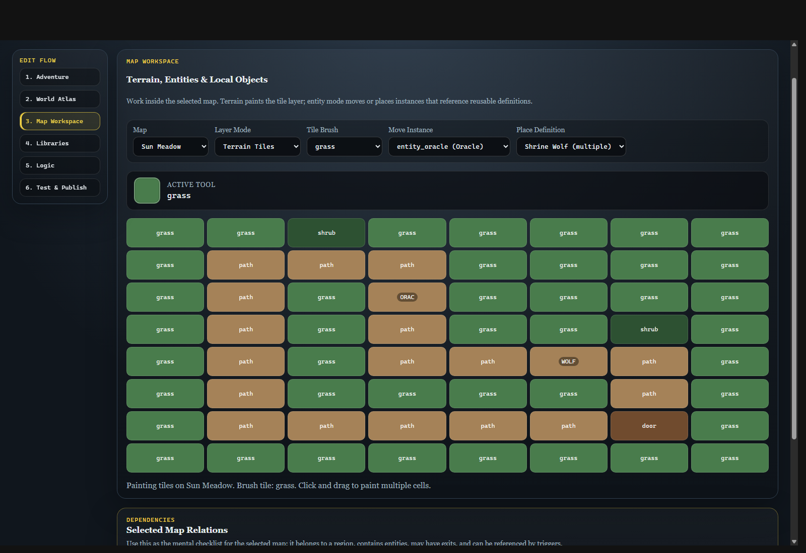

| Layer | Object or function | Role |
| --- | --- | --- |
| Domain | `ExitDefinition` | Stable data record with `id`, `x`, `y`, `toMapId`, `toX`, and `toY`. |
| Editor core | `listExitsForMap`, `upsertExitDefinition`, `deleteExitDefinition` | Pure draft operations that clone the package before modifying map exit arrays. |
| Browser editor | `Exits & Portals` layer mode | Lets the designer choose target map/coordinate, click a grid cell, and inspect or update exits. |
| Runtime core | `handleMove` | After a successful move, checks whether the destination cell has an exit and transfers the player. |
| Validation | `validateExits` | Reports broken target maps, out-of-bounds source/target coordinates, and suspicious overlaps. |

### Exit Authoring Sequence

```mermaid
sequenceDiagram
  actor Designer
  participant UI as Browser editor
  participant Core as editor-core
  participant Draft as AdventurePackage draft
  participant Validation
  Designer->>UI: choose Exits & Portals layer
  Designer->>UI: select target map and coordinate
  Designer->>UI: click source map cell
  UI->>UI: build UpsertExitInput
  UI->>Core: upsertExitDefinition(draft, mapId, input)
  Core->>Draft: clone package and update map.exits
  UI->>Validation: validateAdventure(draft)
  Validation-->>UI: exit warnings/errors and map graph summaries
```

### Runtime Move Through An Exit

```text
dispatch({ type: "move", direction: "south" })
  -> handleMove(direction, events)
  -> compute nextX/nextY
  -> reject bounds or occupied cells
  -> update player position and emit playerMoved
  -> find currentMap.exits at the new coordinate
  -> if found: set currentMapId, player.x, player.y
  -> emit teleported
  -> run map-load triggers for the target map
  -> run tile triggers at the arrival coordinate
  -> render the new snapshot
```

```mermaid
flowchart LR
  Keyboard[Keyboard move] --> Dispatch[dispatch command]
  Dispatch --> Move[handleMove]
  Move --> ExitLookup{Exit at new cell?}
  ExitLookup -- no --> TileTriggers[run tile triggers]
  ExitLookup -- yes --> Teleport[set currentMapId and player x/y]
  Teleport --> MapLoad[run map-load triggers]
  MapLoad --> TileTriggers
  TileTriggers --> Snapshot[RuntimeSnapshot]
  Snapshot --> Render[runtime-2d render]
```

Exits are not a renderer trick. The player first moves onto the source cell. Runtime-core then changes the canonical session state to the destination map and coordinate. After that, runtime-2d renders whatever the new snapshot says.

### Map Graph Derivation

The map graph is intentionally derived, not stored. The editor builds rows by walking `draft.maps.flatMap(map => map.exits)` and rendering each source map to target map edge. That design avoids a second graph model that could drift out of sync with the real exit records.

Validation has the same source of truth. It can verify that every exit points to an existing map, that source and target coordinates are inside their maps, and that authors can notice risky patterns such as multiple exits on the same source cell.

### Quality Cleanup Folded Into Milestone 20

The cleanup policy now travels with milestone work. Changed functions must stay at cyclomatic complexity 8 or lower, SOLID-style separation must not regress, and extracted helpers should make code easier to hold in your head. During this milestone, the browser grid/edit flow was split into smaller functions such as `wireGridCell`, `wireTileBrushCell`, `renderExitBrushPreview`, `editorHintForMode`, `selectExistingExit`, and `buildExitInput`. The complexity baseline now tracks 23 legacy violations to pay down over time after the runtime refactor and Milestone 21 editor cleanups, and the Milestone 21 changes add no new complexity violations.
## Milestone 19 Map Context And Classified Libraries

Milestone 19 extends the Milestone 18 focused workspace idea downward into the data model. The editor can now keep map context close to map work, and the content schema can classify reusable objects instead of leaving future concepts as typed strings.

```mermaid
flowchart TD
    Category[LibraryCategoryDefinition]
    Entity[EntityDefinition]
    Item[ItemDefinition]
    Skill[SkillDefinition]
    Flag[FlagDefinition]
    Quest[QuestDefinition]
    Trigger[TriggerDefinition]
    Profile[EntityProfile]

    Category --> Entity
    Category --> Item
    Category --> Skill
    Category --> Flag
    Category --> Quest
    Entity --> Profile
    Profile --> Skill
    Entity --> Item
    Trigger --> Flag
    Trigger --> Item
    Trigger --> Quest
```

Implementation details:

- `packages/domain` now defines `LibraryCategoryDefinition`, `SkillDefinition`, `TraitDefinition`, `SpellDefinition`, `FlagDefinition`, and `CustomLibraryObjectDefinition`.
- `AdventurePackage` now carries classified library arrays: `libraryCategories`, `skillDefinitions`, `traitDefinitions`, `spellDefinitions`, `flagDefinitions`, and `customLibraryObjects`. Dialogue records also carry `categoryId`, so dialogue is classified like other reusable library objects.
- `EntityProfile` now references `skillIds` and `traitIds`, so skills are reusable objects rather than comma-separated strings.
- `ItemDefinition` and `QuestDefinition` can point to `categoryId`, preparing weapons, spells, treasure, quest objects, and custom object classes to live in organized libraries.
- `packages/content-schema` normalizes missing arrays for older content and migrates legacy `profile.skills` into `profile.skillIds`.
- `packages/validation` checks category references, parent category references, and entity profile skill/trait references.
- `apps/web/editor.html` adds map selectors inside `Map Workspace` and `Logic`, and adds a `Library Focus` selector for entities, items, skills, traits, spells, dialogue, flags, quests, tiles, assets, and custom objects. The visible Libraries panel now changes title/help text, focused object list, categories, category creator, and object-specific editor visibility when the focus changes.

This is not the final library editor yet. It is the lower-level organizing structure that future milestones can build on: users should eventually create objects inside every class and have trigger builders select from definitions rather than accepting raw text for extensible concepts. The editor can now create categories for the currently selected kind of thing, including future-facing kinds such as traits, spells, tiles, assets, and custom objects. In the current sample content, `Solar Seal` and `Oracle Charm` are `ItemDefinition` records, and `dialogue_intro`, `dialogue_shrine`, and `dialogue_return` are categorized dialogue records.
## Milestone 18 Focused Editor Workspaces

Milestone 18 changes the editor from a long all-panels dashboard into a focused workspace switcher. The browser page still uses the same editor-core operations and AdventurePackage draft, but the visible UI is now filtered by the authoring area selected in the left Edit Flow navigation.

```mermaid
sequenceDiagram
    autonumber
    participant Designer as Designer
    participant Nav as Edit Flow nav
    participant Editor as apps/web editor.ts
    participant DOM as Editor panels
    participant Core as editor-core

    Designer->>Nav: Select Map Workspace
    Nav->>Editor: click data-editor-area="map"
    Editor->>Editor: setActiveEditorArea("map")
    Editor->>DOM: activate sections with data-editor-areas containing map
    Designer->>DOM: Paint terrain / place entity / attach trigger marker
    DOM->>Editor: grid pointer or click event
    Editor->>Core: setTileAt / addEntityInstance / moveEntityInstance
    Core-->>Editor: updated AdventurePackage draft
    Editor->>DOM: renderEditor keeps only relevant workspace panels visible
```

Implementation details:

- `apps/web/editor.html` now marks navigation links with `data-editor-area` and editable sections with `data-editor-areas`.
- `apps/web/src/editor.ts` tracks `activeEditorArea`, updates the URL hash for direct links, and calls `renderActiveEditorArea()` from the render loop.
- `apps/web/styles.css` hides inactive `.editor-section-card` panels and displays only the active workspace's relevant cards.
- The editor still keeps reusable data separate from map-specific work: Libraries owns reusable definitions and dialogue, Map Workspace owns selected-map cells, and Logic owns trigger details.

This is intentionally a presentation/UI refactor, not a game model fork. Future item, tile, quest, dialogue, and asset-library work can land inside the correct workspace without making the editor feel like an archaeological dig through every implemented feature.
## Milestone 17 Trigger Creation And Linking

Milestone 17 turns trigger editing into trigger authoring. Milestone 16 made existing triggers easier to edit; Milestone 17 adds the missing record-level operations and a spatial attachment workflow so rules feel like things placed in the world.

```mermaid
sequenceDiagram
    autonumber
    participant Designer
    participant Grid as Map Workspace
    participant Editor as apps/web editor.ts
    participant Core as editor-core
    participant Draft as AdventurePackage draft
    participant Runtime as runtime-core

    Designer->>Editor: Create Trigger
    Editor->>Core: createTriggerDefinition(draft, input)
    Core->>Draft: clone package and append TriggerDefinition
    Designer->>Grid: choose Trigger Markers mode
    Designer->>Grid: click map cell
    Grid->>Editor: attachSelectedTriggerToCell(x, y)
    Editor->>Core: updateTriggerDefinition({ mapId, x, y })
    Core->>Draft: clone package and update trigger location
    Editor->>Editor: render trigger chip and reference list
    Designer->>Runtime: Playtest Draft
    Runtime->>Runtime: run trigger from authored map coordinate
```

New editor-core operations:

- `createTriggerDefinition(...)` creates a safe unique trigger id and appends an empty `TriggerDefinition`.
- `duplicateTriggerDefinition(...)` copies an existing trigger under a new id so designers can create variations quickly.
- `deleteTriggerDefinition(...)` removes a trigger record from the package.
- `updateTriggerDefinition(...)` now accepts explicit cleared optional fields from the UI so map/x/y/run-once can be removed reliably.

New browser editor behavior:

- The `Logic & Quests` panel has `Create Trigger`, `Duplicate`, and `Delete` controls.
- `Map Workspace` has a `Trigger Markers` layer mode.
- In trigger marker mode, clicking a map cell assigns the selected trigger's `mapId`, `x`, and `y`.
- Cells with attached triggers show a small marker chip, making rule locations visible beside terrain and entity placement.
- The trigger editor shows a `Referenced Objects` list summarizing linked maps, flags, items, quests, dialogue, teleports, and tile changes.

This moves the editor closer to the Proposed Editor Areas model: the Map Workspace owns local map objects, while Logic & Quests owns the structured rule details. A designer can now move between them without mentally translating raw coordinates.
## Milestone 16 No-Code Trigger And Action Builder

Milestone 16 makes trigger authoring feel more like a construction set and less like data surgery. The underlying model did not change: triggers still store `conditions: Condition[]` and `actions: Action[]`, and `runtime-core` still evaluates those arrays through `conditionsMatch(...)` and `applyTriggerActions(...)`. The editor now gives designers guided controls for adding and removing those condition/action objects.

```mermaid
sequenceDiagram
    autonumber
    participant Designer
    participant Editor as apps/web editor.ts
    participant Core as editor-core
    participant Draft as AdventurePackage draft
    participant Validation as validation
    participant Runtime as runtime-core

    Designer->>Editor: Select trigger_shrine_reward
    Editor->>Editor: renderTriggerEditor()
    Editor->>Designer: Show When fields, If builder, Then builder, JSON mirror
    Designer->>Editor: Add condition: flagEquals quest_started true
    Editor->>Core: updateTriggerDefinition(triggerId, { conditions })
    Core->>Draft: clone package and replace trigger.conditions
    Editor->>Validation: validateAdventure(draft)
    Designer->>Editor: Add action: giveItem Solar Seal
    Editor->>Core: updateTriggerDefinition(triggerId, { actions })
    Core->>Draft: clone package and replace trigger.actions
    Editor->>Designer: Re-render list and JSON mirror
    Designer->>Runtime: Playtest Draft
    Runtime->>Runtime: runTriggers(), conditionsMatch(), applyTriggerActions()
```

The builder currently supports these condition forms:

- `flagEquals`: compare a named flag to a boolean, number, or string.
- `hasItem`: require an item and optional quantity.
- `questStageAtLeast`: require a quest stage threshold.

The builder currently supports these action forms:

- `showDialogue`: start a dialogue record.
- `setFlag`: set a named flag to a boolean, number, or string.
- `giveItem`: add an item quantity to inventory.
- `teleport`: move the player to a map coordinate.
- `changeTile`: override a map coordinate's tile id.

End-to-end shrine reward example:

1. The designer selects `trigger_shrine_reward`.
2. The `When` controls keep it attached to `onEnterTile` at the shrine altar coordinate.
3. The `If Conditions` builder adds `flagEquals quest_started true`.
4. The `Then Actions` builder adds `showDialogue dialogue_shrine`, `giveItem item_solar_seal`, `setFlag quest_stage 2`, and `changeTile altar-lit`.
5. `renderTriggerEditor()` refreshes the visible condition/action summaries and writes the same data into the advanced JSON textareas.
6. On playtest, the runtime sees no editor-specific builder metadata. It only sees the trigger arrays and executes them normally.

This is deliberately inspired by the original ACS demo philosophy behind `Land of Adventuria`: a tutorial should show a compact range of possibilities. The same builder can express a fantasy shrine reward, a sci-fi transporter, an urban keypad/locked-door behavior, or a spy dossier pickup without changing the engine.

Historical note: Milestone 16 edited existing trigger records only. Milestone 17 adds trigger record creation, duplication, deletion, and map-cell marker placement; brand-new dialogue/item/quest creation still remains future work.
## Milestone 15 Entity Profiles And Starting Gear

Milestone 15 enriches reusable `EntityDefinition` records. Definitions can now carry a `profile` with stat fields and skills, plus `startingPossessions` that seed the party inventory when a new runtime session starts.

```mermaid
flowchart LR
  Editor[Editor fields
stats, skills, gear] --> Definition[EntityDefinition
profile + possessions]
  Definition --> Validation[Validation
stats + item refs]
  Definition --> Inventory[createInitialInventory
party starter items]
  Inventory --> RuntimeUI[Runtime UI
party/profile/inventory]
```

End-to-end flow:

1. The browser editor reads definition form values from `apps/web/src/editor.ts`, including life, power, speed, skills, and starting possession text such as `item_oracle_charm:1`.
2. Those values are stored on the reusable `EntityDefinition`, not on each placed `EntityInstance`. Placement remains map-specific.
3. `packages/validation` rejects negative/non-integer stats, unknown starting item ids, and invalid starting possession quantities.
4. When `runtime-core` creates a new session, `createInitialInventory` walks the party definition ids in `startState.party`, finds each definition, and folds its `startingPossessions` into inventory state.
5. The runtime browser UI displays the party, profile summary, and named inventory, while `runtime-2d` continues to render from state without owning these rules.

This keeps the future path open: combat can read stats, AI can read skills or faction, equipment can read starting possessions, and alternate renderers can present the same data differently.
## Milestone 14 Map Structure Editing

Milestone 14 begins the world-structure track. The project can now describe a map's scale/purpose and create new blank maps from the editor while still keeping map data inside the shared `AdventurePackage`.

```mermaid
sequenceDiagram
    participant User as Designer
    participant Editor as apps/web editor.ts
    participant Core as editor-core
    participant Draft as AdventurePackage draft
    participant Validation as validation
    participant Runtime as runtime-core playtest

    User->>Editor: Edit current map name/category/region
    Editor->>Core: updateMapDefinition(draft, mapId, updates)
    Core->>Draft: clone package and update MapDefinition metadata
    Editor->>Validation: validateAdventure(updated draft)
    User->>Editor: Create blank map
    Editor->>Core: createMapDefinition(name, kind, region, width, height, fill tile)
    Core->>Draft: create MapDefinition with base tile layer and no exits
    Editor->>Editor: switch currentMapId to new map
    User->>Runtime: Playtest Draft
    Runtime->>Draft: load same maps and map categories
```

The new `MapKind` values are `world`, `region`, `local`, `interior`, and `dungeonFloor`. They are metadata for now: they describe intent and scale, but they do not yet change movement, rendering, encounters, or map transitions. That is intentional. The category field lets future milestones add world maps, region maps, interiors, and dungeon floors without retrofitting the content shape later.

A newly created map receives one base tile layer, dimensions chosen in the editor, a repeated fill tile, no exits, and no placed entities. The designer can immediately paint tiles and place entities on it. Exit/portal wiring and map deletion are deliberately left for later because they have more reference-safety consequences.
## Milestone 13 Dialogue And Trigger Editing

Milestone 13 extends the construction set from map/entity placement into authored text and structured rules. It still follows the same boundary as earlier editor work: browser controls gather intent, `editor-core` clones and updates the `AdventurePackage`, validation reruns, and playtest loads the same draft package.

```mermaid
sequenceDiagram
    participant User as Designer
    participant Editor as apps/web editor.ts
    participant Core as editor-core
    participant Draft as AdventurePackage draft
    participant Validation as validation
    participant Runtime as runtime-core playtest

    User->>Editor: Edit dialogue speaker/text/continue label
    Editor->>Core: updateDialogueNode(draft, dialogueId, nodeId, updates)
    Core->>Draft: clone package and update DialogueNode
    Editor->>Validation: validateAdventure(updated draft)
    User->>Editor: Edit trigger type/location/conditions/actions
    Editor->>Editor: parse conditions/actions JSON arrays
    alt JSON invalid
        Editor-->>User: show status and keep previous trigger data
    else JSON valid
        Editor->>Core: updateTriggerDefinition(draft, triggerId, updates)
        Core->>Draft: clone package and update TriggerDefinition
        Editor->>Validation: validateAdventure(updated draft)
    end
    User->>Editor: Playtest Draft
    Editor->>Runtime: save draft and open runtime with ?draft=...
    Runtime->>Draft: load updated dialogue and triggers
```

End-to-end trigger editing example:

1. The designer chooses `trigger_shrine_reward` in the `Rule Trigger` panel.
2. `renderTriggerEditor()` populates form fields from the selected `TriggerDefinition`.
3. The designer changes the `actions` JSON, for example changing a `showDialogue` action or adjusting a `changeTile` target tile id.
4. `applyTriggerEditorChanges()` parses both JSON textareas as arrays. This prevents malformed rule data from being saved silently.
5. If parsing succeeds, the editor calls `updateTriggerDefinition(...)` in `editor-core`.
6. `editor-core` clones the package and updates only the selected trigger record.
7. The editor reruns validation and updates the project controls.
8. When the designer clicks `Playtest Draft`, the runtime loads that same draft. No editor-only conversion step exists.
9. During gameplay, `runtime-core` evaluates the updated trigger through `runTriggers(...)`, `conditionsMatch(...)`, and `applyTriggerActions(...)`.

End-to-end dialogue editing example:

1. The designer chooses `Dialogue` in `Library Focus`, then chooses `dialogue_intro` in the Dialogue Definition Editor.
2. The editor shows the first dialogue node's speaker, text, and continue label.
3. Typing in the fields calls `applyDialogueEditorChanges()`.
4. The browser calls `updateDialogueNode(...)` in `editor-core`.
5. Any trigger action that references the same dialogue id, such as `{ "type": "showDialogue", "dialogueId": "dialogue_intro" }`, will show the revised text in the runtime.

Current limitation: Milestone 13 edits existing dialogue and trigger records. Brand-new trigger/dialogue creation, deletion, and a fully visual no-JSON rule builder remain future work.
## Milestone 12 Entity Definition Editing

Milestone 12 adds the first reusable definition editor to the browser construction set. The key model distinction is:

- `EntityDefinition`: reusable template data such as name, kind, placement policy, sprite asset id, faction, and behavior.
- `EntityInstance`: a placed copy on a map with an id, `definitionId`, `mapId`, x, and y.

```mermaid
sequenceDiagram
    autonumber
    participant User as Designer
    participant Editor as apps/web editor.ts
    participant Core as editor-core
    participant Draft as AdventurePackage draft
    participant Validation as validation
    participant Runtime as playtest runtime

    User->>Editor: Change definition field
    Editor->>Editor: read selected definition id
    Editor->>Core: updateEntityDefinition(draft, id, updates)
    Core->>Draft: clone package and mutate matching EntityDefinition
    Editor->>Validation: validateAdventure(updated draft)
    Validation-->>Editor: report warnings/errors
    User->>Editor: Playtest Draft
    Editor->>Runtime: save draft and open runtime with ?draft=...
    Runtime->>Draft: load same definitions and instances
```

End-to-end behavior:

1. The editor sidebar renders an `Entity Definition` panel from `draft.entityDefinitions`.
2. Selecting a definition stores `selectedDefinitionEditorId` separately from the selected placed entity instance.
3. Field changes call `applyDefinitionEditorChanges()` in `apps/web/src/editor.ts`.
4. That function builds a partial `EntityDefinition` update from the form fields.
5. `editor-core.updateEntityDefinition(...)` clones the package, finds the matching definition, and applies the update.
6. The editor reruns local validation, refreshes entity placement controls, updates the entity summary, and keeps the draft/project panels in sync.
7. Existing `EntityInstance` records do not need to change because they reference the definition by `definitionId`.
8. Playtesting the draft loads the updated definition data through the same `AdventurePackage` path as normal gameplay.

This keeps future definition editors aligned with the architecture: pure package operations live in `editor-core`, while browser controls only gather input and render feedback.
## Milestone 11 Sprite Manifests And Classic Asset Sets

Milestone 11 moves the classic visual mode from hardcoded tile/entity assumptions toward manifest-driven presentation data. The game simulation still does not know about sprites. `runtime-core` continues to emit state only; `runtime-2d` decides how to draw that state by consulting the adventure's `visualManifests`.

```mermaid
flowchart LR
    TileId[Tile id from map layer]
    EntityAsset[Entity assetId]
    Manifest[VisualManifestDefinition classic-acs]
    SpriteStyle[ClassicSpriteStyle pattern + palette]
    Renderer[runtime-2d classic renderer]
    Canvas[Canvas pixels]

    TileId --> Manifest
    EntityAsset --> Manifest
    Manifest --> SpriteStyle
    SpriteStyle --> Renderer
    Renderer --> Canvas
```

End-to-end classic tile rendering now works like this:

1. The browser loads `sampleAdventureData` and `content-schema` normalizes it into an `AdventurePackage`.
2. The package includes `visualManifests[0]`, a `classic-acs` manifest named `Classic Solar Seal Sprite Set`.
3. The renderer stores that manifest when `CanvasGameRenderer` is constructed.
4. During `renderClassic(...)`, each map coordinate still resolves to a logical tile id such as `grass`, `door`, or `altar-lit`.
5. Instead of switching directly on those tile ids as the source of truth, `drawClassicTile(...)` asks `resolveClassicTileSprite(tileId)` for a `ClassicSpriteStyle`.
6. The sprite style contains a pattern such as `dither`, `door`, `altar`, or `floor`, plus palette values such as fill, shadow, accent, and line colors.
7. `drawClassicSprite(...)` draws the selected style onto the canvas.
8. If a tile is missing from the manifest, `runtime-2d` falls back to built-in defaults so older content remains playable.

End-to-end classic entity rendering now works like this:

1. Entity definitions can carry an `assetId`, such as `sprite_hero`, `sprite_oracle`, or `sprite_wolf`.
2. The classic manifest maps those sprite IDs to `ClassicSpriteStyle` records.
3. `drawClassicEntity(...)` resolves the entity definition, checks `definition.assetId`, and looks up the corresponding manifest entry.
4. If no asset-specific sprite exists, the renderer falls back by entity definition id and then by entity kind.
5. The player uses the first party definition from `state.player.party`, so the hero sprite is still content-driven rather than hardcoded in the renderer.

Validation now checks the manifest layer too. `packages/validation` warns when an adventure has no `classic-acs` visual manifest, when a used tile id has no classic tile sprite, or when an entity `assetId` has no classic entity sprite. These are warnings instead of hard errors because the renderer still has safe fallbacks.
## Forward Milestone Path: Classic ACS Feel

The project should deliberately capture the feel of the original 1980s Adventure Construction Set while keeping the engine free of renderer assumptions. The legacy image set points to two major tracks: a classic gameplay panel and deeper construction-set authoring tools.

### Classic Runtime Presentation

The classic runtime mode should be a presentation layer, not a different game engine. It should consume `AdventurePackage`, `RuntimeSnapshot`, and `GameSessionState` just like the current renderer.

```mermaid
flowchart LR
    Content[AdventurePackage]
    Engine[runtime-core]
    State[GameSessionState]
    Debug[runtime-2d simple/debug view]
    Classic[classic-acs visual mode]
    Future[future HD 2D or 3D renderer]

    Content --> Engine --> State
    State --> Debug
    State --> Classic
    State --> Future
```

The target visual structure is:

- fixed-aspect vintage gameplay panel
- tile/icon map viewport on a dark field
- right-side status rail with clearly labeled life, power, and future actor-resource meters
- bottom message band for location names, prompts, scrollable dialogue, interaction text, and command hints
- pixelated sprite scaling and controlled palette
- asset IDs resolved through manifests so the same map can later render with HD or 3D assets

### Classic Editor Capability Track

The old editor suggests several authoring modes that should become future milestones:

- terrain/tile picture selection and eventually editing
- creature picture selection and eventually editing
- thing/item picture selection and eventually editing
- map creation, deletion, floor/category assignment, and exit/portal wiring
- reusable entity, item, terrain, and actor definitions
- actor profile fields such as life force, power, speed, skills, weapons, armor, and possessions
- structured thing/trigger authoring for portals, messages, conditions, tile changes, inventory rewards, map travel, entity removal, and quest progress
- text/dialogue/introduction editing

### Proposed Forward Milestones

1. Milestone 10: completed `classic-acs` visual mode with a gameplay viewport, right status rail, bottom message band, and renderer theme switching.
2. Milestone 11: completed sprite manifests, a first classic asset set, entity sprite IDs, manifest-driven classic renderer lookup, and validation warnings for missing sprite references.
3. Milestone 12: completed the first entity definition editor slice for reusable entity metadata, placement policy, sprite asset IDs, faction, and behavior tuning.
4. Milestone 13: completed dialogue and structured trigger editing for existing records.
5. Milestone 14: completed map categories, current-map structure metadata editing, and blank map creation.
6. Milestone 15: completed richer entity profiles, skills, starting possessions, runtime party/profile/inventory rendering, editor fields, and validation checks.
7. Milestone 16: completed no-code trigger/action construction for existing trigger records, including guided condition/action add/remove controls and an advanced JSON mirror.
8. Milestone 17: completed trigger creation, duplication, deletion, map-cell trigger markers, and trigger reference summaries.
9. Milestone 18: focused editor workspaces, including navigation-driven Adventure, World Atlas, Map Workspace, Libraries, Logic, and Test & Publish views.
10. Milestone 19: map-context selectors and classified libraries, including definition-backed skills, flags, item categories, quest categories, and reusable object classification.
11. Milestone 20: exits, portals, and map graph tools for safe map-to-map connection authoring.
12. Milestone 21: tile definition library with passability, tags, interaction hints, and renderer-neutral visual bindings.
13. Milestone 22: quest and objective builder that replaces hardcoded sample objective text with authored quest state.
14. Milestone 23: object-model corrective pass followed by creature interaction foundations, including quest-local objective objects, reusable objective templates/archetypes, reward/effect objects, managed tags/taxonomy, first-class factions, dialogue speaker references, sprite/style references, anti-data-pollution library tooling, CRUD parity for library objects, TypeScript section/module organization cleanup, then defeat triggers, drops, entity removal, and tactical turn balance.
15. Milestone 24: classic pixel-art, splash, music, and stocked genre library authoring, including a true built-in pixel editor for tiles/entities/items/portraits/UI sprites, reusable fantasy/science-fiction/modern-spy/superhero/science-fantasy/supernatural-investigation/urban-fantasy starter libraries, adventure splash-screen selection, starting music selection, visual manifest editing, future HD 2D pack preparation, and a new User Guide tutorial that builds a brand new Adventuria-inspired adventure from scratch using the starter libraries and every implemented feature.
16. Milestone 25: authoring diagnostics and playtest harness for trigger firings, entity turns, pathing, flags, inventory, and quest state.
17. Milestone 26: import/export and package portability with schema migration hooks.
18. Milestone 27: editor information architecture completion, centered on the Proposed Editor Areas and selected-cell inspector.
19. Milestone 28: complete Classic ACS presentation pass with polish, accessibility scaling, and keyboard-consistent runtime flow.
20. Milestone 29: validation, testing, content QA, and documentation acceptance checks.
21. Milestone 30: MVP completion and packaging, including an Adventuria-inspired sample adventure that demonstrates fantasy, sci-fi, modern/spy, superhero, science-fantasy, supernatural investigation, urban fantasy, and castle-style construction using the stocked starter libraries.

This path is intentionally compatible with later higher-resolution graphics or 3D. The classic mode is a historically inspired renderer and asset pack, not a constraint on the engine.
## Recommended Editor Information Architecture

The current editor works, but its panels are still arranged in milestone order rather than authoring order. As the game data grows, the editor should be organized around the relationships in `AdventurePackage`, not around the order features were implemented.

The most important observation is that the adventure has two kinds of information:

- World-local content: regions, maps, tile layers, exits, placed entity instances, and map/location triggers.
- Reusable libraries: entity definitions, item definitions, dialogue, quests, assets, visual manifests, and rule/action templates.

A more intuitive editor should make those two categories obvious. Designers usually think, "I am editing this place," then, "What lives here?", then, "What happens here?" Reusable definitions should still be nearby, but they should not interrupt the flow of editing a selected map.

### Domain Relationship Map

```mermaid
flowchart TD
    Adventure[AdventurePackage]
    Metadata[Metadata]
    Rules[Rules]
    Assets[Assets + visual manifests]
    Regions[Regions]
    Maps[Maps]
    Layers[Tile layers]
    Exits[Exits / portals]
    Instances[Entity instances]
    Triggers[Triggers]
    Start[Start state]
    EntityDefs[Entity definitions]
    Items[Item definitions]
    Dialogue[Dialogue]
    Quests[Quests]
    Conditions[Conditions]
    Actions[Actions]

    Adventure --> Metadata
    Adventure --> Rules
    Adventure --> Assets
    Adventure --> Regions
    Adventure --> Maps
    Adventure --> EntityDefs
    Adventure --> Items
    Adventure --> Dialogue
    Adventure --> Quests
    Adventure --> Triggers
    Adventure --> Start

    Regions --> Maps
    Maps --> Layers
    Maps --> Exits
    Maps --> Instances
    Maps --> Triggers
    Instances --> EntityDefs
    Start --> Maps
    Start --> EntityDefs
    Triggers --> Maps
    Triggers --> Conditions
    Triggers --> Actions
    Conditions --> Items
    Conditions --> Quests
    Actions --> Items
    Actions --> Dialogue
    Actions --> Maps
```

This relationship map suggests the editor should not present `Maps`, `Regions`, `Tiles`, `Entities`, and `Triggers` as unrelated panels. They are connected. A map belongs to a region; placed entities belong to a map but point back to reusable definitions; triggers may belong to a map coordinate and may reference dialogue, items, quests, or destination maps.

### Proposed Top-Level Editor Areas

| Area | Purpose | Primary objects | Why it belongs here |
| --- | --- | --- | --- |
| Adventure Setup | Project-level identity and rules | metadata, rules, start state, validation | These settings affect the whole adventure and should not be mixed into map editing. |
| World Atlas | Spatial structure | regions, maps, map categories, exits, start position | This is the natural home for the Milestone 14 map structure tools. |
| Map Workspace | Editing the selected place | tile layers, entity instances, local triggers, exits | This is the main canvas-centric editing view. |
| Libraries | Reusable building blocks | entity definitions, item definitions, dialogue, quests, assets, visual manifests | These are referenced by maps/triggers/instances but are not themselves placed cells. |
| Logic & Quests | Cross-map behavior | triggers, conditions, actions, quest stages, dialogue links | This needs reference-aware tools because logic often connects many objects. |
| Test & Publish | Quality and release flow | validation, local draft, playtest, projects, releases | These are workflow actions, not content objects. |

### Map Scale And Region Ownership

The editor should use a simple ACS-like map hierarchy for designers:

- `World`: a broad overview map for overland, planetary, sector, or campaign-scale travel.
- `Region`: a major area such as a kingdom, station deck, city district, planet zone, or dungeon-level grouping.
- `Local Area`: the actual playable scene map. This replaces confusing visible splits such as `local`, `interior`, and `dungeon floor`. A local area can still be a room, cave, street, forest clearing, spaceship bay, rooftop, office, shrine, or outdoor site.

The domain model still accepts older or more granular `MapKind` values for compatibility, but the editor-facing flow should prefer the three-part hierarchy unless a future feature proves that more visible categories are necessary.

`Parent Region` is organizational metadata. It tells the World Atlas where a map belongs, but it does not restrict movement. Exits can connect local areas inside the same region, local areas in different regions, a region map to a local area, or any other valid source/target pair. A designer can still choose to make all regional travel pass through a world map, but the engine does not require that pattern.

### Recommended Navigation Layout

```mermaid
flowchart LR
    Sidebar[Left sidebar
Editor sections]
    Context[Middle column
Selected object tree]
    Canvas[Main workspace
Map grid or detail editor]
    Inspector[Right inspector
Properties + references]
    Footer[Bottom rail
Validation + save/publish]

    Sidebar --> Context --> Canvas --> Inspector
    Inspector --> Footer
    Canvas --> Footer
```

Recommended screen behavior:

1. The left sidebar chooses the authoring area: `Adventure`, `World Atlas`, `Map Workspace`, `Libraries`, `Logic`, or `Test & Publish`.
2. The middle column shows the selected area's object tree. For example, `World Atlas` should show Regions with nested Maps.
3. The main workspace shows the selected map grid, selected definition editor, or selected trigger flow.
4. The right inspector shows properties and references for the selected object.
5. The bottom rail always shows validation status, unsaved draft status, and playtest/publish actions.

### World Atlas Flow

The World Atlas should make the Region-to-Map dependency obvious.

```mermaid
flowchart TD
    Atlas[World Atlas]
    RegionList[Region list]
    RegionDetail[Selected region detail]
    MapList[Maps in region]
    MapDetail[Selected map metadata]
    ExitGraph[Exit / portal graph]
    StartPosition[Start position]

    Atlas --> RegionList
    RegionList --> RegionDetail
    RegionDetail --> MapList
    MapList --> MapDetail
    MapDetail --> ExitGraph
    MapDetail --> StartPosition
```

Recommended controls:

- Region list: create/select/rename regions and edit lore/source references.
- Map list grouped under each region: create maps, assign category, rename maps, and see map dimensions.
- Map detail: edit `MapDefinition.name`, `kind`, `regionId`, width/height where safe, and base properties.
- Exit graph: eventually show incoming and outgoing exits so designers can see whether a map is reachable.
- Start position: show the current start map and party start coordinate in relation to maps.

This is the best home for Milestone 14 features. The current `World Structure` panel is a good first slice, but it should eventually move into an atlas-style view where Regions and Maps are visible together.

### Map Workspace Flow

The Map Workspace should be centered on a selected map. It should answer four questions in order: what does this place look like, what is here, where can I go, and what happens here?

```mermaid
flowchart TD
    SelectedMap[Selected map]
    Tiles[Terrain / tile layers]
    Entities[Placed entities]
    Exits[Exits / portals]
    LocalTriggers[Map-local triggers]
    Inspector[Selection inspector]

    SelectedMap --> Tiles
    SelectedMap --> Entities
    SelectedMap --> Exits
    SelectedMap --> LocalTriggers
    Tiles --> Inspector
    Entities --> Inspector
    Exits --> Inspector
    LocalTriggers --> Inspector
```

Recommended layer tabs for the selected map:

- Terrain: paint tile layers with the persistent brush.
- Entities: move/place/delete entity instances and show which definition each instance uses.
- Exits: create or inspect map-to-map links directly on the grid.
- Triggers: show trigger markers for `onEnterTile`, `onInteractEntity`, and `onMapLoad` rules tied to this map.
- Preview: launch this map in playtest mode once start-position tooling exists.

This layout would make tile editing and entity placement feel related instead of competing. A designer should be able to select a cell and see every object attached to that cell: terrain tile, entity occupant, exit, and triggers.


### UI-Based Display Rename Policy

Display-name reskinning should be an editor workflow, not a script or code task. The tool should let designers search across player-facing names and labels, preview affected objects, choose scope, apply changes to the draft, and rerun validation. It should update display fields such as names, titles, speaker labels, descriptions, and selected player-facing text while preserving stable internal ids by default.

The safe default is display-name rename. Advanced internal id refactoring should be a separate, clearly marked workflow because it must update every structured reference and may affect saves, releases, manifests, triggers, quests, and validation.
### Libraries Flow

Libraries should hold reusable definitions. These are not map-specific, but maps and triggers reference them.

```mermaid
flowchart TD
    Libraries[Libraries]
    EntityDefs[Entity definitions]
    ItemDefs[Item definitions]
    Dialogue[Dialogue library]
    Quests[Quest library]
    Assets[Assets and visual manifests]
    References[Reference panel]

    Libraries --> EntityDefs --> References
    Libraries --> ItemDefs --> References
    Libraries --> Dialogue --> References
    Libraries --> Quests --> References
    Libraries --> Assets --> References
```

Recommended behavior:

- Entity definitions show where instances of that definition are placed.
- Dialogue records show which triggers/actions call them.
- Item definitions show which triggers give or require them.
- Assets and visual manifests show which tiles/entities reference each asset id.
- Quests show which conditions/actions read or advance their stages.

This preserves the distinction we have been building: an `EntityDefinition` is the reusable template, while an `EntityInstance` is a placed object on a map.

### Logic & Quest Flow

Triggers are currently edited as standalone records, but conceptually they are glue between maps, entities, dialogue, items, quests, and tiles. The editor should make those references visible.

```mermaid
flowchart LR
    Trigger[Trigger]
    When[When
type + map/x/y/entity/item event]
    If[If
conditions]
    Then[Then
actions]
    References[Reference resolver]

    Trigger --> When --> If --> Then
    When --> References
    If --> References
    Then --> References
```

Recommended trigger editor shape:

- `When`: trigger type and location/event source.
- `If`: conditions such as flags, inventory, or quest stage requirements.
- `Then`: actions such as show dialogue, set flag, give item, teleport, or change tile.
- Reference resolver: every referenced map, dialogue, item, quest, tile, or entity definition should be clickable or at least validated inline.

This would replace the current JSON-first trigger editing with a guided rule builder later, while still using the same `TriggerDefinition`, `Condition`, and `Action` data model underneath.

### Inspector And Dependency Panel

Every selected object should have a dependency panel. This is the most important UI principle for making relationships understandable.

For example:

- Selecting a Region should show maps inside that region.
- Selecting a Map should show its region, exits, entities, local triggers, and whether the start state points there.
- Selecting an Entity Definition should show all placed instances using it.
- Selecting an Entity Instance should show its definition and map location.
- Selecting a Dialogue record should show triggers/actions that call it.
- Selecting a Trigger should show all maps/items/dialogue/quests it references.
- Selecting a Tile cell should show tile id, occupant, exit, and triggers attached to that coordinate.

This dependency panel should eventually become the primary way to avoid broken references before validation runs.


### Implemented Edit Game Layout

The browser editor now implements the first version of this organization without changing the underlying data model. The same editor functions still update `AdventurePackage`, but the screen is arranged by information hierarchy:

- Left navigation: the authoring flow from Adventure Setup through Test & Publish.
- Context column: Adventure Setup and World Atlas, where map selection, region assignment, category metadata, and blank-map creation live.
- Center workspace: selected-map editing for terrain and entity instances.
- Inspector column: dependencies, reusable libraries, dialogue, trigger logic, validation, and publishing.

This is intentionally a layout refactor first. Later milestones can make each area deeper by adding a real region tree, selected-cell inspector, exit graph, reference backlinks, and a structured trigger builder.
### Recommended Editor Evolution Path

1. Reorganize the editor UI into top-level sections without changing the data model.
2. Add a World Atlas sidebar that groups maps under regions and exposes map category metadata.
3. Add a selected-cell inspector in the Map Workspace showing tile, entity, exit, and triggers for the clicked cell.
4. Move entity definitions, dialogue, triggers, and future item/quest editors into a Libraries/Logic split.
5. Replace raw trigger JSON editing with a structured `When / If / Then` builder that still emits the same domain `TriggerDefinition` objects.
6. Add reference backlinks everywhere: where-used lists for maps, definitions, dialogue, items, quests, and assets.
7. Add validation badges directly beside referenced objects instead of only showing a single global validation panel.

The key design rule is: the editor should show containment first, references second, and implementation details third. A designer should first understand where they are in the adventure, then what objects live there, then what reusable definitions and rules those objects point to.
## Current Feature Implementation Map

The table below is the compact implementation index for the current application. It should be updated after every milestone so the reference remains a practical map of the codebase.

| Feature | Browser entry point | Core package | Data changed | Rendering/output |
| --- | --- | --- | --- | --- |
| Runtime movement | `apps/web/src/index.ts` keydown handler | `runtime-core.dispatch` and `handleMove` | `GameSessionState.player`, current map, turn count, trigger effects | `runtime-2d` redraws canvas; DOM panels and event log update |
| Runtime inspect | `apps/web/src/index.ts` keydown handler for `Q` | `runtime-core.handleInspect` | Usually only turn/events; enemy phase may mutate entity positions | Event log updates; canvas redraws if enemies move |
| Runtime interact/dialogue | `apps/web/src/index.ts` keydown handler for `E`, dialogue advance keys, and Classic dialogue scroll arrows | `runtime-core.handleInteract`, dialogue state helpers | Active dialogue state, flags/items if triggers fire | Classic canvas message band or Debug DOM dialogue panel plus event log update |
| Runtime save/load | `Save` and `Load` buttons | `runtime-core.serializeSnapshot` plus `persistence` | `RuntimeSnapshot` stored or restored from IndexedDB | Entire runtime rerenders from restored state |
| Visual mode switching | `Visual Mode` dropdown | `runtime-2d.CanvasGameRenderer` | No engine state change | Same state is rendered as Classic ACS or Debug Grid |
| Tile brush painting | Editor grid pointer events | `editor-core.setTileAt` | `AdventurePackage.maps[].tileLayers[].tileIds` | Editor grid cell refreshes; validation reruns |
| Entity movement | Editor entity mode cell click | `editor-core.moveEntityInstance` | `AdventurePackage.entityInstances[]` coordinates/map | Editor grid and entity summary refresh |
| Entity placement | `Add Definition` + `Place New` | `editor-core.addEntityInstance` and placement checks | New `EntityInstance` record | Editor grid summary updates; singleton rules enforced |
| Entity definition editing | `Entity Definition` panel inputs | `editor-core.updateEntityDefinition` | Reusable `EntityDefinition` metadata/behavior | Existing instances inherit changed definition data |
| Dialogue editing | `Dialogue` Library Focus inputs | `editor-core.updateDialogueNode` | Existing categorized `DialogueDefinition` node text | Runtime shows edited text when dialogue is triggered |
| Trigger editing | `Rule Trigger` panel inputs | `editor-core.updateTriggerDefinition` | Existing `TriggerDefinition` structured conditions/actions | Runtime evaluates edited trigger during playtest/release |
| Map structure editing | `World Structure` panel | `editor-core.updateMapDefinition` | `MapDefinition.name`, `kind`, `regionId` | Editor map selector/status update; future renderers can use metadata |
| Blank map creation | `Create Map` controls | `editor-core.createMapDefinition` | New `MapDefinition` with one base tile layer | Editor switches to new map; runtime can load it if reachable or selected by future tools |
| Local draft save/playtest | `Save Draft` / `Playtest Draft` | `persistence.putDraft` | Browser IndexedDB draft record | Runtime opens with `?draft=<key>` and loads the edited package |
| Project save/publish | Project panel buttons | `project-api`, `apps/api`, `validation` | `apps/api/data/store.json` project/release records | Published release can be opened by release id |

## Use Case: Designer Creates A Milestone 14 Blank Map

```mermaid
sequenceDiagram
    autonumber
    participant Designer as Designer
    participant Editor as apps/web editor.ts
    participant Core as editor-core
    participant Draft as AdventurePackage draft
    participant Validation as validation
    participant Grid as Editor grid

    Designer->>Editor: Enter name/category/region/width/height/fill tile
    Designer->>Editor: Click Create Map
    Editor->>Editor: clamp width/height and trim text fields
    Editor->>Core: createMapDefinition(draft, input)
    Core->>Core: cloneAdventurePackage(draft)
    Core->>Core: create stable map id from name
    Core->>Core: create base tile layer filled with fillTileId
    Core->>Draft: append MapDefinition
    Editor->>Editor: set currentMapId to created map
    Editor->>Validation: validateAdventure(updated draft)
    Editor->>Grid: renderEditor renders blank map grid
```

Implementation details:

1. The HTML controls live in `apps/web/editor.html` inside the `World Structure` panel.
2. `apps/web/src/editor.ts` owns the browser event listener for `createMapButton`.
3. `createBlankMapFromEditor()` reads the form, clamps dimensions, creates a map input object, and calls `editor-core.createMapDefinition(...)`.
4. `editor-core` clones the package, generates a unique map id, creates one base tile layer, fills the layer with the selected tile id, and appends the map.
5. The browser sets `currentMapId` to the new map and calls `renderEditor()`.
6. Validation reruns against the same `AdventurePackage` shape used by the runtime and API.
7. The new map has no exits. This is intentional because exit/portal wiring requires reference-safe tooling that belongs in a later milestone.

## Use Case: Designer Edits A Map's Structure Metadata

```mermaid
flowchart LR
    Fields[World Structure fields] --> Browser[apps/web editor.ts]
    Browser --> Core[editor-core updateMapDefinition]
    Core --> Clone[clone AdventurePackage]
    Clone --> Map[replace selected MapDefinition fields]
    Map --> Validate[validateAdventure]
    Validate --> UI[map selector, status, project buttons]
```

Map `kind` is descriptive metadata today. It can be used later by renderers, encounter systems, navigation tools, or editor filters without requiring every existing map to be reshaped. Current supported values are `world`, `region`, `local`, `interior`, and `dungeonFloor`.

## Use Case: Designer Completes The Full Authoring Loop

```mermaid
flowchart TD
    Edit[Edit draft in browser editor]
    LocalValidate[Local validateAdventure]
    SaveDraft[Save Draft to IndexedDB]
    Playtest[Open runtime with draft query]
    ApiValidate[Validate Draft through API]
    Project[Create/Save Project]
    Publish[Publish immutable Release]
    Open[Open Latest Release]
    Runtime[Runtime loads release id]

    Edit --> LocalValidate --> SaveDraft --> Playtest
    Edit --> ApiValidate --> Project --> Publish --> Open --> Runtime
```

This is the main construction-set loop. The editor never writes a separate editor-only file format. It updates an `AdventurePackage`; the runtime, validator, API, and release system all consume the same package shape.

## Runtime-Core Internal Module Map

The runtime-core package was refactored so its `index.ts` file no longer acts as a catch-all implementation file. This keeps the public import path stable while creating smaller internal modules with clearer reasons to change.

```mermaid
flowchart TD
    Index[index.ts
public exports]
    Engine[engine.ts
createGameEngine]
    Session[game-session.ts
command lifecycle]
    State[state-factory.ts
initial state + hydration]
    Triggers[trigger-system.ts
conditions + actions]
    Enemies[enemy-turn-system.ts
enemy phase]
    Movement[movement.ts
grid math]
    Types[types.ts
public runtime contracts]

    Index --> Engine
    Index --> Types
    Engine --> Session
    Session --> State
    Session --> Triggers
    Session --> Enemies
    Session --> Movement
    Triggers --> Types
    Enemies --> Movement
    Enemies --> Types
```

This split supports the SOLID cleanup path. `RuntimeGameSession` coordinates the command flow, but trigger behavior and enemy behavior now sit behind focused classes. Future work can continue reducing older large files by following the same pattern: keep public `index.ts` files as stable exports, then move cohesive behavior into named modules or classes.

## Engineering Quality Gates

The project now has an explicit complexity and SOLID quality gate.

- `npm run quality:complexity` runs `tools/complexity-check.mjs`.
- New or worsened functions must stay at cyclomatic complexity `8` or below.
- Existing violations are tracked in `tools/complexity-baseline.json` and should be refactored down over time.
- A touched function over complexity `8` should be refactored before or alongside the feature change.
- No new SOLID violations should be introduced: keep responsibilities narrow, use registries/handlers for extensible concepts, keep browser/API/persistence details out of domain/runtime/editor-core packages, and pass smaller interfaces when practical.
- `npm test` is now the milestone completion gate. It runs unit tests, headless editor UI smoke tests, headless runtime UI E2E tests, and the command-level runtime playtest smoke script.
- New features should add or update a focused test at the lowest relevant layer. Bug fixes should include regression tests when feasible.

The cleanup strategy is incremental: baseline the current debt, prevent regression, then reduce the baseline during focused refactor passes.

## Milestone 29A Test Harness Foundation

The project paused before further feature expansion to add a testing harness. The first harness is intentionally dependency-light:

- `tools/build-workspace.mjs` regenerates local workspace package stubs, resolves a working TypeScript compiler from `ACS_TSC`, repo-local TypeScript, or the known-good Codex runner, then builds the workspace.
- `npm run build` and `npm run typecheck` now use `tools/build-workspace.mjs` so standard project commands no longer depend on one fragile `node_modules/typescript/lib/tsc.js` path.
- `tools/run-unit-tests.mjs` delegates its build step to `tools/build-workspace.mjs`, then runs Node's built-in `node:test` runner over `tests/unit`.
- `tests/unit/default-content.test.mjs` compares imported classic ACS starter content against `legacy ACS/legacy_ACS_startpacks.txt` so documented non-Land starter elements stay covered by a regression test.
- `tests/unit/runtime-core.test.mjs` verifies start state, Oracle interaction, cue events, shrine reward action stacks, item grants, quest stages, tile changes, and exits.
- `tests/unit/editor-core.test.mjs` verifies pure editor operations for map creation, tile painting, tile definitions, entity placement/movement, exits, and classic pixel sprite pixel updates.
- `tests/unit/validation.test.mjs` verifies the sample adventure and catches broken exit targets and tile layer geometry errors.
- `tests/unit/persistence.test.mjs` verifies runtime save records preserve the existing `RuntimeSnapshot` shape instead of inventing a second state model.
- `tools/editor-ui-smoke.ps1` launches the actual browser editor in headless Chromium and asserts that Terrain, Entity, Exit, and Assets modes show the correct controls while hiding irrelevant panels.
- `tools/runtime-ui-e2e.ps1` launches the actual playable browser runtime in headless Chromium and asserts startup rendering, visual-mode and classic-size preference persistence, keyboard movement, interaction, dialogue display, trigger and flag logging, save, reset, and load.
- `tools/playtest-smoke.mjs` remains the high-level runtime acceptance check.

Coverage output is wired through the test harness but disabled by default on the current Node 18 Windows runtime because `NODE_V8_COVERAGE` crashes the process. On a verified runtime, set `ACS_ENABLE_V8_COVERAGE=1` before `npm run test:coverage` to emit V8 coverage JSON. A later tooling cleanup should either repair the Node/TypeScript/npm environment or add a stable coverage reporter.

### Runtime Browser E2E Flow

`tools/runtime-ui-e2e.ps1` exists because package tests and command-level smoke tests are not enough on their own. A regression can leave `runtime-core` correct while the actual browser page no longer wires keyboard events, preference controls, dialogue UI, or save/load buttons correctly. The runtime E2E harness therefore drives the same `apps/web/index.html` page a player uses.

```mermaid
sequenceDiagram
  participant Test as runtime-ui-e2e.ps1
  participant Server as apps/web/server.mjs
  participant Browser as Headless Chromium
  participant UI as apps/web/index.html
  participant Runtime as runtime-core GameSession
  participant Save as IndexedDB persistence

  Test->>Server: Start local web server on an isolated port
  Test->>Browser: Open runtime page through Chrome DevTools Protocol
  Test->>UI: Assert app version, map name, objective, canvas
  Test->>UI: Change Visual Mode and Classic Size selectors
  UI->>Browser: Persist preferences to localStorage
  Test->>UI: Dispatch ArrowRight and ArrowDown key events
  UI->>Runtime: dispatch({ type: "move" })
  Runtime-->>UI: Updated player position and turn state
  Test->>UI: Dispatch E interaction key
  UI->>Runtime: dispatch({ type: "interact" })
  Runtime-->>UI: Dialogue, trigger, flag, cue, and quest events
  Test->>UI: Click Save, move, Reset, then Load
  UI->>Save: Store and retrieve RuntimeSnapshot
  Save-->>UI: Restored player position
```

The assertions intentionally cover UI wiring and state symptoms rather than private implementation details. The test does not call runtime internals directly. It verifies what a player can observe: the canvas is live, the controls persist, keyboard input moves the player, interaction produces dialogue and trigger logs, and loading restores the saved snapshot.

## Object Model Corrective Backlog

The project goal is not that every visible word becomes an object. Names, descriptions, dialogue prose, labels, and lore notes can remain strings because they are display content. The corrective rule is narrower and more useful: any value that runtime rules, validation, editor workflows, starter libraries, AI authoring, or reusable content packs need to reference should be a first-class object with a stable id, category support where appropriate, validation, and editor CRUD.

### Current Gaps Found In The Audit

| Area | Current shape | Why it is a problem | Corrective objective |
| --- | --- | --- | --- |
| Quest objectives | `QuestDefinition.stages: string[]` plus numeric stage indexes | Objectives cannot be individually named, categorized, reordered safely, referenced, rewarded, or linked to triggers without fragile stage numbers. | Add quest-local `QuestObjectiveDefinition` objects with ids. Triggers should reference objective ids or objective state, not raw stage indexes. |
| Quest rewards | `QuestDefinition.rewards?: string[]` | Rewards are notes, not linked objects. They cannot reliably grant items, unlock skills, set flags, or display rich reward previews. | Add reward/effect objects or reuse trigger action objects as reward definitions. Let objectives and quests reference rewards by id. |
| Tags | `tags: string[]` on metadata and tiles | Tags are useful, but currently freeform strings. Typos create invisible categories, and the editor cannot manage tag meaning. | Add `TagDefinition` or taxonomy/category objects with CRUD, descriptions, color/icon hints, and where-used lists. |
| Flags and runtime state variables | Trigger actions use `flag: string`; runtime uses `Record<string, ...>` | Flag definitions exist, but trigger/runtime state still use unbranded strings and arbitrary values. This weakens validation and editor affordances. | Use `FlagDefId` in conditions/actions/state, add value-type metadata, and route all flag selection through definitions. |
| Quest progress state | `Record<string, number>` | Quest state is keyed by loose string and points to numeric stages. | Key by `QuestId` and objective id/status records after objectives become objects. |
| Tile references | Map layers and tile-change actions use `string` tile ids | Tile definitions exist, but the type still permits arbitrary strings and UI still has some manual tile-id input. | Use `TileDefId` consistently, replace manual tile id fields with definition selectors, keep migration for legacy strings. |
| Classic sprite references | `classicSpriteId?: string`, visual manifests use `Record<string, ClassicSpriteStyle>` | Sprite/style ids are important presentation assets but not yet managed as reusable asset/style records. | Add visual style/sprite definition objects or asset records for classic sprites, with editor CRUD and manifest assignment tools. |
| Factions | `EntityDefinition.faction?: string` | Combat, hostility, alliances, dialogue, and AI will need faction relationships. Free strings are too weak. | Add `FactionDefinition` with stance/relationship rules, colors/icons, and editor CRUD before richer combat. |
| Dialogue speakers | `DialogueNode.speaker?: string` | Dialogue text displays speaker names, but speakers cannot reliably reference entities, portraits, factions, or localization. | Add speaker/actor references, preferably `speakerEntityDefId` or `DialogueSpeakerDefinition`, while preserving display override text. |
| Dialogue choices and nodes | Nodes/choices are objects, but choices are edited as one label and node creation is incomplete | Branching dialogue needs CRUD for nodes/choices and references to conditions/actions. | Add full dialogue graph CRUD and eventually condition/action-backed choices. |
| Source references | `sourceReferences?: string[]` | Notes are acceptable as prose, but if source material becomes searchable, licensed, or AI-assisted, raw strings are too limited. | Keep simple notes for now; later add optional `SourceReferenceDefinition` for structured source packs. |
| Custom library fields | `fields?: Record<string, boolean | number | string>` | Custom objects can become bags of arbitrary values without schema, labels, validation, or editor controls. | Add reusable field/schema definitions for custom object classes. |
| Inventory and save-state maps | runtime inventory and flags use `Record<string, ...>` | Runtime records use strings for serialized compatibility, but should align with definition ids at the type boundary. | Introduce branded-id record helpers and validation/migration around save-state keys. |


### Objective Template And Library Organization Plan

Quest objectives should not become one enormous global dropdown. That would technically make objectives objects, but it would create the same authoring problem in a new form: designers would face dozens or hundreds of similar choices, miss existing matches, create near-duplicates, and slowly pollute the project library.

Recommended model:

- Quest objectives are quest-local by default. A concrete objective such as `Return to the Oracle` belongs inside its quest and does not automatically clutter a global library.
- Reusable objective templates/archetypes are global library objects. Examples include `Collect Item`, `Deliver Item`, `Reach Location`, `Speak To NPC`, `Use Item On Tile`, `Defeat Enemy`, `Survive Turns`, `Escort Entity`, `Unlock Passage`, and `Discover Clue`.
- Starter genre packs provide grouped templates. Fantasy can include shrine trials and relic recoveries; sci-fi can include airlock repair and data-core recovery; modern/spy can include contact meetings and file theft; urban fantasy can include charm collection and hex breaking.
- Creating an objective should default to `Create From Template`. A blank objective can exist, but it should be secondary.

Recommended objective organization dimensions:

| Dimension | Purpose | Example values |
| --- | --- | --- |
| Objective kind | Primary mechanical behavior | progression, interaction, collection, conflict, puzzle, narrative, system |
| Genre tags | Starter-pack and theme filtering | fantasy, sci-fi, modern-spy, superhero, urban-fantasy, supernatural-investigation |
| Target type | What the objective points at | item, entity, map, tile, exit, dialogue, flag, quest objective |
| Scope | Whether it is quest-local or reusable | local objective, project template, starter-pack template, imported template |
| Usage state | Helps cleanup and reuse | recently used, used by current quest, unused, archived |

Anti-pollution requirements:

1. Avoid infinite dropdowns. Use a searchable browser with filters for kind, genre, category, target type, scope, and usage state.
2. Show where-used counts for templates and objectives.
3. Warn on near-duplicates when name, kind, target, and category resemble an existing objective/template.
4. Offer `Reuse`, `Duplicate And Customize`, or `Create Anyway` when a duplicate is detected.
5. Keep starter templates namespaced separately from project-created objectives and imported packs.
6. Prefer archive/hide over hard delete for reusable templates that may have references.
7. Allow quest-local objectives to be promoted into reusable templates only when the designer intentionally chooses to do so.

This lets the project keep the "everything important is an object" principle without turning the editor into a swamp of tiny duplicate objects.
### CRUD Coverage Gaps

Current editor-core CRUD is uneven. Triggers and exits have create/update/delete style operations. Maps can be created and updated but not deleted. Tiles and quests can be created and updated but not deleted. Entity definitions can be updated but not created or deleted. Items, skills, flags, traits, spells, custom objects, and dialogue records are mostly listed or edited in limited ways rather than fully created, updated, deleted, categorized, and reference-checked.

Corrective objective: every library object kind should eventually have the same baseline lifecycle:

1. Create from a named template or blank definition.
2. Edit all meaningful fields through structured controls, not comma-separated lists unless the list items are harmless prose notes.
3. Delete only when references are safe, or provide a dependency report and replacement flow.
4. Duplicate/reskin for fast authoring.
5. Show where-used references across maps, triggers, entities, quests, dialogue, assets, and save/start state.
6. Validate missing references, invalid values, duplicate singleton-like constraints, and unsafe deletes.

### Milestone Path Adjustment


### TypeScript Section And Module Organization Cleanup

As files grow, related interfaces, exported operations, private helpers, and sanitizers should be grouped so the code is easy to scan and collapse in the editor. TypeScript can use region-style comments recognized by common editors:

```ts
//#region Exits
export interface UpsertExitInput { ... }
export function listExitsForMap(...) { ... }
export function upsertExitDefinition(...) { ... }
export function deleteExitDefinition(...) { ... }
function createExitId(...) { ... }
//#endregion
```

Cleanup rules:

- Keep interfaces immediately before the operations that use them.
- Group exported functions, private helpers, sanitizers, and id builders by feature area: package/common helpers, exits, tile definitions, library categories, quest definitions/objectives, maps/regions, entity definitions/instances, dialogue, triggers, validation helpers, and metadata utilities.
- Avoid scattering helper functions far below the public operations they support unless they are truly shared utilities.
- Prefer extracting large regions into focused files over keeping a huge `index.ts` forever. For example, `exits.ts`, `tiles.ts`, `quests.ts`, `maps.ts`, `entities.ts`, `dialogue.ts`, and `triggers.ts` can export through `index.ts` once the grouping is clear.
- Use `//#region Name` and `//#endregion` for temporary organization inside large files, but do not let regions hide excessive complexity. If a region becomes large enough to be hard to understand, extract a module.
- Keep the complexity rule intact: organizing into regions is not a substitute for refactoring functions above cyclomatic complexity 8.
- When touching any TypeScript file for milestone work, clean the touched area opportunistically without creating unrelated churn across the whole repo. Do not limit this standard to editor-core.

This rule applies to all TypeScript code, not just editor-core. `packages/editor-core/src/index.ts` is the first obvious candidate because it already contains exits, tiles, quest definitions, map definitions, entity operations, dialogue updates, trigger operations, and sanitizers in one barrel file. The same cleanup standard should apply to runtime-core, runtime-2d, content-schema, validation, persistence, project-api, apps/web, apps/api, and any future package. The corrective pass should first group large files into collapsible regions, then extract stable regions into focused modules as APIs settle.
### Progressive Disclosure UI Requirement

The editor must not show every possible object, relationship, and corrective tool at once. The object model will grow substantially, so the UI must stay focused and reveal controls only when they are relevant to the current task.

Required UI principles:

- Keep the top-level Edit Flow focused on one authoring area at a time.
- Within each area, show only the selected object's active editor and hide unrelated subpanels.
- Use searchable browsers and filter drawers instead of long dropdowns.
- Keep duplicate warnings modal or inline and temporary; do not permanently add large warning panels to the default screen.
- Let advanced details such as where-used graphs, raw ids, dependency reports, and migration diagnostics live behind expandable sections.
- Prefer task-specific creation flows such as `Create Objective From Template` over all-purpose forms with dozens of always-visible fields.
- As panels become richer, favor tabs, accordions, inspectors, and contextual side drawers over one large page of controls.
- Screenshots in the User Guide should demonstrate the clean focused workflow, not every available subpanel expanded at once.

This is a core UX constraint for the corrective object-model work. More objects should make authoring clearer, not busier.
Milestone 23 should begin with an object-model corrective pass before expanding creature interaction and combat. This is important because combat needs object-backed factions, drops/rewards, defeat triggers, entity removal rules, and encounter roles. Building combat on top of freeform strings would deepen the very debt we are trying to remove.

Milestone 24 began the starter-library and classic pixel-art milestone by adding presentation settings, manifest-backed pixel sprites, and starter pack metadata. Further passes should deepen stocked libraries now that the corrected object model is in place. Starter libraries will be far more useful if quests contain objective objects, rewards are reusable definitions, factions are first-class, tags are managed taxonomy objects, and visual sprite references are asset/style objects rather than typed strings.
## Milestone 25 Authoring Diagnostics And Playtest Harness

Milestone 25 adds the first reusable authoring-diagnostics layer. Validation remains the hard correctness gate: it catches bad references, invalid map geometry, out-of-bounds entities, singleton placement violations, missing tile definitions, and other package integrity issues. Diagnostics is a softer design-quality layer: it summarizes what the designer has authored and points to scenario checks that should be playtested.

### Implementation Pieces

| Piece | Location | Responsibility |
| --- | --- | --- |
| Diagnostics model | `packages/editor-core/src/diagnostics.ts` | Defines `AuthoringDiagnostic`, `PlaytestScenario`, `AuthoringDiagnosticsSummary`, and `AuthoringDiagnosticsReport`. |
| Diagnostics builder | `createAuthoringDiagnostics(pkg)` | Produces summaries for triggers, entity behavior, initial flags, inventory object count, exits, quests, and scenario prompts. |
| Editor rendering | `apps/web/src/editor.ts` | Calls `createAuthoringDiagnostics(draft)` during `renderEditor()` and writes compact rows into `diagnostics-list` and `scenario-list`. |
| UI surface | `apps/web/editor.html` | Adds `Authoring Diagnostics` and `Playtest Scenarios` cards under `Test & Publish`. |
| Styling | `apps/web/styles.css` | Adds compact diagnostic cards that fit the focused editor flow without expanding every panel. |
| Repeatable smoke script | `tools/playtest-smoke.mjs` | Builds against the compiled packages, validates the sample adventure, and simulates core runtime behaviors. |
| NPM command | `package.json` | Adds `npm run playtest:smoke` as the one-command acceptance check for the current sample. |

### Diagnostics Data Flow

```mermaid
sequenceDiagram
  participant Designer
  participant EditorUI as apps/web editor
  participant EditorCore as editor-core diagnostics
  participant Draft as AdventurePackage draft
  Designer->>EditorUI: Open Test & Publish
  EditorUI->>Draft: Read current draft object graph
  EditorUI->>EditorCore: createAuthoringDiagnostics(draft)
  EditorCore->>Draft: Inspect triggers, exits, entities, flags, items, quests
  EditorCore-->>EditorUI: AuthoringDiagnosticsReport
  EditorUI-->>Designer: Render compact diagnostics and playtest scenarios
```

### Smoke-Test Runtime Flow

```mermaid
sequenceDiagram
  participant CLI as npm run playtest:smoke
  participant Build as TypeScript build
  participant Schema as content-schema
  participant Validation as validation
  participant Runtime as runtime-core
  CLI->>Build: Compile workspace
  CLI->>Schema: readAdventurePackage(sampleAdventureData)
  CLI->>Validation: validateAdventure(adventure)
  CLI->>Runtime: createGameEngine().loadAdventure(adventure)
  CLI->>Runtime: dispatch move/interact commands at Oracle
  Runtime-->>CLI: triggerFired, dialogueStarted, flagSet, questStageSet
  CLI->>Runtime: load shrine snapshot and dispatch move south
  Runtime-->>CLI: itemGranted, tileChanged, questStageSet
  CLI->>Runtime: load exit snapshot and dispatch move south
  Runtime-->>CLI: teleported
  CLI-->>Designer: PASS lines for each expected behavior
```

### What The Smoke Script Proves

`tools/playtest-smoke.mjs` deliberately runs through behaviors that are easy to break during editor or runtime refactors:

- The sample adventure still validates with zero blocking errors.
- The runtime start state matches `AdventurePackage.startState`.
- The Oracle can be targeted by keyboard interaction.
- The Oracle interaction fires a trigger, starts dialogue, sets flags, and advances the Solar Seal quest stage.
- The shrine reward trigger grants the Solar Seal item, advances quest state, and changes the altar tile.
- The meadow exit teleports the player to the shrine destination coordinates.

This is not a complete game test suite. It is the first repeatable acceptance harness, intended to grow as combat, media events, import/export, genre-pack creation, and actor-capable NPC actions become richer.

### Milestone 29C Actor Action Readiness

Milestone 29C adds the first runtime-side readiness layer for the future shared player/NPC action model. This is intentionally not full NPC command execution yet. It is a pure policy evaluator that answers whether an actor would be allowed to attempt a proposed action under the currently authored capability and object-use rules.

| Piece | Location | Responsibility |
| --- | --- | --- |
| Actor readiness evaluator | `packages/runtime-core/src/actor-permissions.ts` | Resolves player or entity actor kind, reads capability profile permissions, reads target item/trigger/exit `usePolicy`, and returns allowed/blocked reasons. |
| Public export | `packages/runtime-core/src/index.ts` | Exposes `evaluateRuntimeActionReadiness(...)` and `ActorActionReadiness` for tests, diagnostics, and future runtime orchestration. |
| Regression tests | `tests/unit/runtime-core.test.mjs` | Verifies player item use, enemy/NPC item blocks, support NPC exit permissions, and informational NPC capability restrictions. |

The evaluator consumes normal domain objects:

- `RuntimeActionProposal`: actor id, action kind, and optional target ids.
- `ActorCapabilityProfile`: role-level allowed actions plus broad item/trigger/exit policies.
- `ActorUsePolicy`: per-object rules such as `all`, `playersOnly`, `npcsOnly`, `blocked`, or `explicit`.
- Entity definitions and instances: an entity instance points to a definition, which can point to a capability profile.

The result is an `ActorActionReadiness` object:

```ts
{
  allowed: boolean;
  actorKind: ActorKind;
  reasons: string[];
}
```

This gives future diagnostics and AI/NPC systems a safe preflight check. For example, a support ally can be allowed to traverse exits if its capability profile and the exit policy permit it; an informational NPC can be blocked from item use before the runtime ever tries to mutate inventory or trigger effects. Later milestones still need actor-owned inventories, actor-aware trigger execution, and shared actor command services before NPCs can truly perform the same actions as players.

### Milestone 29D Documentation Validation

Milestone 29D adds a documentation integrity gate so the User Guide and System Reference cannot silently lose screenshots or PDF outputs.

| Piece | Location | Responsibility |
| --- | --- | --- |
| Documentation validator | `tools/validate-docs.mjs` | Parses Markdown and HTML image references, verifies referenced local files exist and are non-empty, verifies required PDFs exist, and checks the Relay Station tutorial step screenshot sequence. |
| NPM script | `package.json` | Adds `npm run docs:validate`. |
| Quality gate | `package.json` | Adds docs validation to `npm run quality` between complexity and typecheck. |

The validator currently checks:

- `docs/user-guide.md`
- `docs/user-guide.html`
- `docs/system-reference.md`
- `docs/system-reference.html`
- `docs/user-guide.pdf`
- `docs/system-reference.pdf`
- Relay Station tutorial Steps 1 through 19 and their expected screenshots
- duplicate screenshot reuse across tutorial step sections

This does not replace visual review. It is a guardrail for the exact failure modes we have seen repeatedly: broken links, stale missing assets, empty PDFs, and repeated generic tutorial screenshots where a step-specific image should exist.

### Milestone 29E Tutorial Acceptance Manifest

Milestone 29E turns the Relay Station Alecto tutorial into a structured acceptance artifact instead of a purely prose walkthrough. The goal is not to make documentation mechanical. The goal is to preserve the tutorial as a reliable, feature-rich, first-user path through the application.

| Piece | Location | Responsibility |
| --- | --- | --- |
| Tutorial acceptance manifest | `docs/tutorial-acceptance.json` | Names the tutorial, declares required concepts, and lists the required title cue, text cues, and screenshots for each Step 1 through 19. |
| Documentation validator | `tools/validate-docs.mjs` | Reads the manifest and verifies the User Guide still contains the accepted tutorial structure. |
| Quality command | `npm run docs:validate` and `npm run quality` | Fails when a required tutorial step, screenshot, text cue, PDF, or image reference is missing. |

The manifest currently protects these tutorial behaviors:

- opening the editor and naming the adventure
- creating maps through World Atlas
- painting terrain through Map Workspace
- placing named entity instances
- creating object-backed quest objectives and rewards
- using the pixel editor grouping preview
- creating a multi-action trigger chain with media cues, sound cues, flags, quest stages, item grants, tile changes, and teleport
- creating a normal exit between maps
- inspecting selected cell relations
- running diagnostics
- previewing display rename/reskin changes
- saving, publishing, and playtesting

Future milestone rule: when a milestone adds a feature that should be showcased in the User Guide, update both the tutorial section and `docs/tutorial-acceptance.json` so the guide remains a living acceptance test.

### Milestone 30A Publishing Artifact Foundation

Milestone 30 begins by turning the earlier publishing recommendation into a real package boundary. The project now has `packages/publishing`, which is intentionally pure data transformation code rather than a browser export wizard or backend bundle job.

| Piece | Location | Responsibility |
| --- | --- | --- |
| Publishing package | `packages/publishing/src/index.ts` | Defines artifact shapes and pure builders for editable and standalone exports. |
| Forkable artifact builder | `createForkableProjectExport(...)` | Clones an adventure package into a `forkableProject` artifact that keeps authoring-oriented data intact. |
| Standalone artifact builder | `createStandaloneRuntimeExport(...)` | Clones an adventure package into a `standalonePlayable` artifact, strips starter-library authoring packs, and records runtime asset dependencies. |
| Asset dependency collector | `collectRuntimeAssets(...)` | Resolves file-backed asset references used by presentation settings, cue definitions, and visual bindings that point to actual `AssetRecord` ids. |
| Publish validator | `validatePublishArtifact(...)` | Verifies artifact schema and standalone runtime-asset expectations before later UI/API export flows accept an artifact. |

Current limitation: this is the packaging foundation, not the final shipping workflow. There is not yet a browser UI for "Export Forkable Project" or "Export Standalone Playable," and there is not yet a generated static runtime bundle. Those remain the next Milestone 30 follow-through steps.

The important architectural gain is separation of intent:

- editable sharing now has a named artifact shape instead of being a vague future idea
- standalone play-only packaging now has a named artifact shape instead of being hand-waved as "publish somehow"
- runtime asset pruning can now be reasoned about separately from project saving or release creation
- publishing can transform immutable releases into derivative artifacts without mutating the draft or release source of truth

### Milestone 30B Release Export Workflow

Milestone 30B wires the publishing boundary into the application workflow instead of leaving it as a package-only abstraction.

| Piece | Location | Responsibility |
| --- | --- | --- |
| API export route | `apps/api/src/index.ts` | Accepts `POST /api/releases/:id/artifacts` and returns either a `forkableProject` or `standalonePlayable` artifact for an immutable release. |
| Client export method | `packages/project-api/src/index.ts` | Exposes `exportReleaseArtifact(releaseId, { artifactKind })` so browser callers use the same typed API contract as the server. |
| Editor export controls | `apps/web/editor.html` and `apps/web/src/editor.ts` | Adds release-backed forkable and standalone export actions in `Test & Publish`, enabled only when a release exists. |
| Browser download step | `apps/web/src/editor.ts` | Starts from the returned release artifact and downloads the appropriate handoff package for that artifact kind. |

The governing rule remains unchanged: export starts from a release, not from the mutable in-browser draft. The editor may save drafts and publish releases, but artifact export is intentionally release-backed so a shared or shipped artifact always comes from a validated frozen snapshot.

Current limitation after 30B: the exported artifact is JSON, not yet a packaged static play bundle. `standalonePlayable` still means "play-only runtime artifact shape" rather than "already deployable website."

### Milestone 30C Standalone Play Bundle Foundation

Milestone 30C is the next release-packaging slice. It does not yet write a `.zip` or copy files to a distribution folder, but it does turn the standalone export into a bundle-aware artifact that describes a real play-only web package.

| Piece | Location | Responsibility |
| --- | --- | --- |
| Bundle manifest types | `packages/publishing/src/index.ts` | Adds `StandaloneBundleFile` and `StandaloneBundleManifest` so a standalone artifact can carry generated bundle files in a typed way. |
| Bundle attachment helper | `attachStandaloneBundle(...)` | Returns a new `standalonePlayable` artifact with a generated bundle manifest attached, preserving the no-mutation publishing rule. |
| Bundle validator | `validatePublishArtifact(...)` | Verifies that a standalone bundle includes its entry file and `bundle/adventure-package.json`. |
| Bundle assembly | `apps/api/src/standalone-bundle.ts` | Reads the built runtime shell files, creates a standalone `index.html`, emits `bundle/adventure-package.json`, and records all generated/copied files in one manifest. |
| API export integration | `apps/api/src/index.ts` | Attaches the generated bundle manifest automatically when `POST /api/releases/:id/artifacts` requests `standalonePlayable`. |
| Standalone runtime boot | `apps/web/src/index.ts` | Supports `?package=...` so the browser runtime can fetch and load a packaged adventure JSON file without going through draft/release API loading. |

The important architectural step is that a standalone export now has two layers:

- the normalized runtime-only `AdventurePackage`
- the play-bundle file manifest that explains how that package would boot in a static browser shell

That separation matters because it keeps publishing composable:

- `packages/publishing` still owns artifact identity and validation
- `apps/api` owns filesystem-aware bundle assembly
- `apps/web` owns runtime boot behavior for packaged adventures

Current limitation after 30C: standalone exports now contain the generated play-bundle manifest, but the editor still downloads that artifact as JSON rather than emitting a ready-to-serve folder or zip.

### Milestone 30D Standalone ZIP Export

Milestone 30D converts the standalone bundle manifest into an actual downloaded archive without changing the release-backed publishing contract. The API still returns a typed standalone artifact. The browser now packages that artifact's bundle manifest into a ZIP for the designer.

| Piece | Location | Responsibility |
| --- | --- | --- |
| ZIP archive builder | `packages/publishing/src/standalone-archive.ts` | Converts a standalone bundle manifest into a valid store-only ZIP archive using pure TypeScript. |
| Publishing export surface | `packages/publishing/src/index.ts` | Re-exports `createStandaloneBundleArchive(...)` so browser/UI code can package standalone bundle manifests without duplicating ZIP logic. |
| Editor export action | `apps/web/src/editor.ts` | Detects `standalonePlayable` artifacts with attached bundle manifests, creates a ZIP archive, and downloads it as a `.zip` file. |
| Editor button label | `apps/web/editor.html` | Renames the standalone export action from JSON wording to `Export Standalone ZIP`. |
| Browser import map | `apps/web/editor.html` and `apps/web/index.html` | Adds `@acs/publishing` so browser modules can use the shared archive helper cleanly. |

This keeps the architecture layered:

- `apps/api` still owns release lookup and standalone bundle assembly
- `packages/publishing` now owns artifact validation plus archive packaging logic
- `apps/web` owns the download UX for designers

After 30D, standalone export is now a real artifact a designer can hand to someone else as a packaged bundle. The remaining follow-through for Milestone 30 is mostly around richer distribution ergonomics, such as optional archive naming, emitted folder layouts, or later desktop/mobile wrappers.

### Milestone 30E Standalone Package Preview

Milestone 30E adds a packaging-inspection step to `Test & Publish`. Instead of asking designers to trust that a standalone ZIP contains the right files, the editor can now preview the current release-backed standalone package before download.

| Piece | Location | Responsibility |
| --- | --- | --- |
| Preview action | `apps/web/editor.html` | Adds `Preview Standalone Package` beside the existing release actions. |
| Preview state | `apps/web/src/editor.ts` | Stores the latest fetched `standalonePlayable` artifact in `latestStandalonePreview` and clears it whenever the draft changes. |
| Preview fetch | `previewLatestStandaloneArtifact()` | Requests the latest release's `standalonePlayable` artifact from the same API export route used for ZIP download. |
| Preview rendering | `renderStandalonePreviewPanel()` | Displays bundle entry file, adventure title, runtime asset counts, cue counts, and up to the first ten packaged file paths. |
| UI safety coverage | `tools/editor-ui-smoke.ps1` | Verifies the preview button and preview panel exist, render status text, and remain disabled before a release exists. |

This is intentionally a transparency layer, not a second publishing system. The preview uses the same release-backed artifact source as standalone ZIP export, which keeps the flow honest:

- publish immutable release
- preview packaged standalone contents
- export the ZIP from the same artifact source

The preview is also invalidated when the draft changes. That prevents an easy-to-miss mismatch where the editor would otherwise display package contents from an older release while the designer is looking at a newer modified draft.

### Milestone 30F Release Readiness And Known Limitations

Milestone 30F adds a higher-level distribution checkpoint to `Test & Publish`. Validation, diagnostics, standalone preview, and export actions already existed, but the user still had to mentally combine them. The new readiness panel turns those signals into one explicit release summary.

| Piece | Location | Responsibility |
| --- | --- | --- |
| Readiness card | `apps/web/editor.html` | Adds the `Release Readiness` panel beside the standalone package preview. |
| Readiness builder | `apps/web/src/editor.ts` | Computes release status text and checklist lines from validation state, release presence, package preview presence, diagnostics presence, and current MVP known limits. |
| Known-limitations surface | `apps/web/src/editor.ts` | Shows current bounded MVP constraints directly in the UI, including browser-play packaging focus and the fact that the final flagship sample campaign is not yet the finished shipped centerpiece. |
| Button-state cleanup | `apps/web/src/editor.ts` | Refactors release-action enablement into `projectButtonState()` and `setButtonDisabled()` so the packaging workflow stays under the complexity-over-8 rule. |

This panel is intentionally descriptive rather than authoritative deployment policy. It does not replace validation or diagnostics. Instead, it answers the practical designer question: "Given the current draft, release, and package preview state, am I actually ready to hand this to someone?"

### Milestone 30G Release Notes And Metadata

Milestone 30G makes immutable releases self-describing. Before this slice, a release could be validated, published, previewed, and exported, but it still had no first-class place for a designer to say what changed or what a reviewer should focus on.

| Piece | Location | Responsibility |
| --- | --- | --- |
| Release metadata shape | `packages/project-api/src/index.ts` | Extends `ReleaseRecord` and `PublishReleaseRequest` with `releaseNotes` so publish metadata is shared across client and API. |
| Release persistence | `apps/api/src/index.ts` | Stores normalized release notes on immutable release records when a project is published. |
| Publish UI metadata editor | `apps/web/editor.html` | Adds a Release Notes card with a release-label input and release-notes textarea. |
| Publish metadata flow | `apps/web/src/editor.ts` | Reads label/notes input values, sends them through `projectApi.publishRelease(...)`, renders note excerpts in the release summary, and reflects note presence in the readiness checklist. |
| Publish metadata tests | `tests/unit/project-api.test.mjs` and `tools/editor-ui-smoke.ps1` | Verifies the API client posts release notes and the editor exposes the new publish fields. |

This keeps the architecture aligned with the Milestone 30 publishing boundary:

- adventure draft data remains game content
- immutable releases remain publish snapshots
- publish-only notes live with the release, not inside the `AdventurePackage`

That separation keeps the future publishing modes clean. A `forkableProject` may later expose richer provenance and remix metadata, while a `standalonePlayable` package may surface player-facing release notes or shareable distribution summaries. Release metadata is the first durable step toward that richer publishing layer.

### Milestone 30H Standalone Distribution Manifest

Milestone 30H moves the standalone package one step closer to a durable shipping artifact by giving it a first-class distribution manifest. Before this slice, release identity was split across the release record, preview UI, and bundle metadata file. Now the standalone artifact itself carries a typed summary of what is being distributed.

| Piece | Location | Responsibility |
| --- | --- | --- |
| Distribution manifest type | `packages/publishing/src/index.ts` | Defines `StandaloneDistributionManifest` for release identity, package entry file, content counts, and known limitations. |
| Artifact population | `packages/publishing/src/index.ts` | Builds `distributionManifest` during `createStandaloneRuntimeExport(...)`. |
| Release-backed metadata feed | `apps/api/src/index.ts` | Passes immutable release id, label, version, and release notes into the standalone export builder. |
| Packaged manifest file | `apps/api/src/standalone-bundle.ts` | Emits `bundle/distribution-manifest.json` alongside the packaged adventure and standalone metadata files. |
| Editor consumption | `apps/web/src/editor.ts` | Uses the distribution manifest in standalone preview and release readiness summaries so the browser surfaces the same packaged metadata that the ZIP now carries. |
| Validation coverage | `tests/unit/publishing.test.mjs` and `tests/unit/standalone-bundle.test.mjs` | Verifies the manifest is populated, validated, and emitted into the standalone bundle/archive. |

This slice improves the publication model in two important ways:

- the standalone artifact now has one canonical place to describe release identity and package intent
- the preview UI is now reading packaged distribution metadata instead of re-deriving everything from unrelated fields

That is the right architectural direction for later distribution work like richer release manifests, publish checklists, desktop/mobile wrappers, or hosted download surfaces.

### Milestone 30I Local Launcher Groundwork

Milestone 30I adds the first packaged local-launch path for standalone exports. The important architectural choice is that the exported game is still the same static web bundle. The launcher is only a convenience layer that serves that bundle locally and opens it in the browser.

| Piece | Location | Responsibility |
| --- | --- | --- |
| Launcher metadata | `packages/publishing/src/index.ts` | Extends `StandaloneDistributionManifest` with bundled local-launch information such as script paths, default port, browser-open behavior, and launcher notes. |
| Windows launcher script | `apps/api/src/standalone-bundle.ts` | Emits `launch/run-local.ps1`, which starts a tiny local static server rooted at the exported bundle and opens the default browser. |
| Windows command shim | `apps/api/src/standalone-bundle.ts` | Emits `launch/run-local.cmd`, which invokes the PowerShell launcher for a simpler double-click path on Windows. |
| Editor preview/readiness integration | `apps/web/src/editor.ts` | Surfaces launcher file names and launcher readiness in `Standalone Package Preview` and `Release Readiness`. |
| Bundle and ZIP coverage | `tests/unit/standalone-bundle.test.mjs` | Verifies the launcher files are present in the generated bundle and in the packaged ZIP archive. |

This slice does not change the core package format:

- the exported game is still a static browser bundle
- `runtime-core` remains unaware of launcher behavior
- the launcher does not become a second runtime model

That is exactly what we wanted for long-term flexibility. The same standalone export can still be manually hosted, published to the web, wrapped later for desktop, or launched locally by a bundled helper script.

### Milestone 30J Standalone Handoff Guide

Milestone 30J finishes another important publishing detail: the exported package now explains itself. Before this slice, the standalone ZIP had the right files and launcher helpers, but a recipient still had to infer how to run it. Now the package carries player-facing handoff instructions inside the bundle itself.

| Piece | Location | Responsibility |
| --- | --- | --- |
| Handoff metadata | `packages/publishing/src/index.ts` | Extends `StandaloneDistributionManifest` with `handoff` metadata for README file paths, recommended launch path, and supported delivery modes. |
| Packaged instructions | `apps/api/src/standalone-bundle.ts` | Emits `README.html` and `README.txt` into the standalone bundle with launch and hosting guidance. |
| Editor package visibility | `apps/web/src/editor.ts` | Adds handoff-guide and recommended-launch details to `Standalone Package Preview` and `Release Readiness`. |
| Validation and unit coverage | `tests/unit/publishing.test.mjs` and `tests/unit/standalone-bundle.test.mjs` | Verifies handoff metadata exists and README files are packaged into the bundle and ZIP archive. |

This keeps the architecture aligned with the rest of Milestone 30:

- `runtime-core` still owns rules and state.
- `runtime-2d` still owns rendering.
- `@acs/publishing` owns artifact identity and packaging metadata.
- `apps/api` owns bundle assembly from the immutable release.
- `apps/web` owns the designer-facing preview and export workflow.

The new handoff files are intentionally lightweight. They do not replace a future installer, desktop shell, or hosted publishing page. They simply make the standalone ZIP understandable the moment it is unzipped.

### Milestone 30K Forkable Artifact Preview

Milestone 30K makes the editable export path as inspectable as the standalone one. Before this slice, the editor made it easy to preview the standalone package, but the forkable handoff remained a blind export button. Now the designer can inspect what the editable artifact preserves before downloading it.

| Piece | Location | Responsibility |
| --- | --- | --- |
| Forkable preview action | `apps/web/editor.html` | Adds `Preview Forkable Artifact` beside the export controls in `Test & Publish`. |
| Forkable preview state | `apps/web/src/editor.ts` | Tracks the latest release-backed `ForkableProjectArtifact` preview and invalidates it whenever the draft changes. |
| Forkable preview renderer | `apps/web/src/editor.ts` | Shows editable-handoff facts such as title, source title, starter-pack preservation, custom-library counts, and preserved editor metadata. |
| Readiness integration | `apps/web/src/editor.ts` | Adds forkable-preview coverage to the `Release Readiness` checklist so both export modes are represented. |
| UI smoke coverage | `tools/editor-ui-smoke.ps1` | Verifies the forkable preview button exists, stays disabled before release, and that the preview panel renders useful initial content. |

This keeps the publishing model easier to reason about:

- `forkableProject` means editable handoff, preserving authoring-oriented data.
- `standalonePlayable` means play-only handoff, trimming authoring data and packaging a static runtime bundle.
- The editor now surfaces both paths explicitly instead of making one of them invisible until after download.

### Milestone 30N Handoff Naming And Release Notes Packaging

Milestone 30N closes one more packaging mismatch: the final exported file names and packaged release-note files now come from the publishing manifests themselves instead of editor-only naming rules. That keeps preview, readiness, comparison, bundle contents, and final download behavior aligned.

| Piece | Location | Responsibility |
| --- | --- | --- |
| Standalone handoff naming | `packages/publishing/src/index.ts` | Adds `recommendedArchiveFileName`, `recommendedExtractedFolderName`, and `releaseNotesText` to the standalone handoff manifest. |
| Standalone bundle release notes | `apps/api/src/standalone-bundle.ts` | Emits `RELEASE-NOTES.txt` into the exported bundle and mentions that file in both packaged README variants. |
| Editor download naming | `apps/web/src/editor.ts` | Uses `projectManifest.handoff.recommendedFileName` for forkable exports and `distributionManifest.handoff.recommendedArchiveFileName` for standalone ZIP downloads. |
| Preview/readiness surfacing | `apps/web/src/editor.ts` | Shows the final download name, extracted-folder name, and release-notes file path inside the standalone preview, readiness, and comparison panels. |
| Validation coverage | `tests/unit/publishing.test.mjs` and `tests/unit/standalone-bundle.test.mjs` | Verifies the new handoff-name fields and the packaged `RELEASE-NOTES.txt` file. |

The practical outcome is small but important:

- designers now see the exact handoff filenames before export
- exported ZIP names match the packaged handoff metadata
- the standalone bundle includes a plain-text release-notes file for recipients
- the forkable handoff naming now follows the forkable manifest instead of a generic fallback

### Milestone 30O Forkable Project Package Export

Milestone 30O brings the editable handoff up to parity with the standalone one. Before this slice, the forkable path had a strong manifest and preview story, but the actual download was still just the raw artifact JSON. Now the forkable handoff is packaged as a ZIP with companion guidance files while preserving the structured artifact JSON inside for future import flows.

| Piece | Location | Responsibility |
| --- | --- | --- |
| Forkable package archive builder | `packages/publishing/src/forkable-package.ts` | Builds a ZIP archive containing the full `forkable-project.json` artifact plus companion manifest and instruction files. |
| Forkable handoff manifest fields | `packages/publishing/src/index.ts` | Extends `ForkableProjectManifest.handoff` with recommended archive/folder names plus packaged README and release-notes file paths. |
| Shared ZIP infrastructure | `packages/publishing/src/standalone-archive.ts` | Adds generic text-file ZIP packaging support reused by the forkable package builder without duplicating archive logic. |
| Editor export flow | `apps/web/src/editor.ts` | Downloads forkable exports as a package ZIP, not as raw JSON, and surfaces package names and packaged file paths in preview/readiness/comparison text. |
| Editor action label | `apps/web/editor.html` | Renames the editable export action to `Export Forkable Package` so the UI matches the actual handoff format. |
| Validation coverage | `tests/unit/publishing.test.mjs` | Verifies the forkable manifest fields and the generated package archive contents. |

The package currently contains:

- `forkable-project.json`
- `project-manifest.json`
- `README.html`
- `README.txt`
- `RELEASE-NOTES.txt`

That gives the editable handoff the same practical strengths the standalone handoff already had:

- the artifact can be shared as one package instead of one opaque JSON file
- recipients get import and remix guidance without opening the editor first
- release notes travel with the editable package in plain text
- the future forkable import wizard can still target the structured `forkable-project.json` inside the package

### Milestone 30P Forkable Package Manifest Symmetry

Milestone 30P closes the last asymmetry between the editable package and the standalone package at the artifact-description layer. Before this slice, the forkable ZIP was real, but its file list still had to be re-derived during archive creation. Now the forkable artifact itself carries a typed package manifest with entry-file and file-list data.

| Piece | Location | Responsibility |
| --- | --- | --- |
| Forkable package manifest model | `packages/publishing/src/index.ts` | Defines the typed package-file list and entry-file metadata attached to `forkableProject` artifacts. |
| Forkable archive builder | `packages/publishing/src/forkable-package.ts` | Builds the ZIP directly from the shared package manifest instead of re-deriving the file set. |
| Editor package visibility | `apps/web/src/editor.ts` | Surfaces package entry file, packaged file count, and packaged file paths in Forkable Artifact Preview and uses those values in readiness/comparison text. |
| Publishing unit coverage | `tests/unit/publishing.test.mjs` | Verifies the new forkable package manifest contents during normal artifact validation. |

The architecture payoff is small but important: the editor, the validator, and the ZIP builder now all agree on what the forkable package contains because they read the same package description.

### Milestone 30Q Shared Release Handoff Manifest

Milestone 30Q adds one more packaging layer above the artifact-specific manifests: a release-level handoff summary that explains both export modes together. Before this slice, the editor could preview forkable and standalone exports separately, but the combined release story still lived across multiple panels and packaged files.

| Piece | Location | Responsibility |
| --- | --- | --- |
| Shared release handoff manifest | `packages/publishing/src/index.ts` | Defines `ReleaseHandoffManifest` and attaches it to both forkable and standalone artifacts so both export modes carry the same release-level handoff summary. |
| Standalone packaged release handoff file | `apps/api/src/standalone-bundle.ts` | Adds `RELEASE-HANDOFF.json` to standalone bundles and mentions it in packaged README files. |
| Forkable packaged release handoff file | `packages/publishing/src/index.ts` | Adds `RELEASE-HANDOFF.json` to the forkable package manifest so the editable ZIP carries the same shared release summary. |
| Editor release handoff preview | `apps/web/editor.html` and `apps/web/src/editor.ts` | Adds `Preview Release Handoff` and a dedicated Release Handoff Manifest card in `Test & Publish`. |
| Test coverage | `tests/unit/publishing.test.mjs`, `tests/unit/standalone-bundle.test.mjs`, `tools/editor-ui-smoke.ps1` | Verifies the packaged handoff file and the new release handoff preview UI. |

This keeps the Milestone 30 packaging architecture coherent:

- artifact-specific manifests still describe each handoff in detail
- one shared release manifest now summarizes both export modes together
- the editor can preview that shared manifest before export
- packaged outputs now carry the same release story the editor showed to the designer

### Milestone 30R Direct Release Handoff Export

Milestone 30R turns that shared release handoff summary into a first-class downloadable release document. Before this slice, the editor could preview the shared handoff manifest and package it indirectly inside the forkable and standalone outputs, but it still could not export the release-level summary on its own.

| Piece | Location | Responsibility |
| --- | --- | --- |
| Direct release handoff export control | `apps/web/editor.html` | Adds `Export Release Handoff` beside the preview and package export controls in `Test & Publish`. |
| Release handoff export flow | `apps/web/src/editor.ts` | Ensures the shared handoff manifest is current, then downloads it directly as JSON using the manifest-backed recommended filename. |
| Release handoff filename metadata | `packages/publishing/src/index.ts` | Adds a recommended direct-export filename to `ReleaseHandoffManifest.handoff`. |
| Test coverage | `tests/unit/publishing.test.mjs` and `tools/editor-ui-smoke.ps1` | Verifies the new direct-export filename and the new export button. |

This completes another useful part of the Milestone 30 release story:

- the shared handoff manifest can be previewed
- the same manifest is packaged inside both shipped export modes
- the release-level summary can now also be exported directly as its own JSON document

### Milestone 30S Artifact Integrity Report

Milestone 30S adds one more pure publishing check before distribution review: a shared artifact-integrity report. Instead of asking designers to compare the forkable package, standalone bundle, and shared release handoff summary manually, the publishing layer can now produce one report that verifies whether those three views still agree.

| Piece | Location | Responsibility |
| --- | --- | --- |
| Integrity report builder | `packages/publishing/src/index.ts` | Adds `createArtifactIntegrityReport(...)`, which compares the forkable package, standalone bundle, and shared release handoff manifest. |
| Integrity preview/export controls | `apps/web/editor.html` | Adds `Preview Artifact Integrity`, `Export Integrity Report`, and a dedicated Artifact Integrity Report card in `Test & Publish`. |
| Integrity editor flow | `apps/web/src/editor.ts` | Loads both artifact previews, builds the report client-side through `@acs/publishing`, renders pass/fail checks, and exports the report as JSON using the manifest-backed filename. |
| Test coverage | `tests/unit/publishing.test.mjs` and `tools/editor-ui-smoke.ps1` | Verifies the report builder plus the new preview/export controls and empty-state panel text. |

The current report checks:

- release metadata parity across forkable and standalone artifacts
- shared handoff manifest parity across both export modes
- required forkable packaged files
- required standalone bundle files
- archive-name alignment with the shared release handoff manifest
- release-notes-path alignment across both export modes

### Milestone 30T Release Review Package

Milestone 30T adds a reviewer-facing ZIP package on top of the new handoff and integrity documents. Instead of asking reviewers to download the shared release handoff JSON and the artifact-integrity JSON separately, the publishing layer can now bundle them together with README files and release notes.

| Piece | Location | Responsibility |
| --- | --- | --- |
| Review package manifest builder | `packages/publishing/src/index.ts` | Adds `createReleaseReviewPackageManifest(...)`, which assembles README files, release notes, the shared handoff JSON, and the artifact-integrity JSON into one reviewer-facing package description. |
| Review package ZIP builder | `packages/publishing/src/review-package.ts` | Creates a ZIP archive from the typed review-package manifest. |
| Review package preview/export controls | `apps/web/editor.html` and `apps/web/src/editor.ts` | Adds `Preview Review Package`, `Export Review Package`, a dedicated Release Review Package card, and release-readiness messaging in `Test & Publish`. |
| Test coverage | `tests/unit/publishing.test.mjs` and `tools/editor-ui-smoke.ps1` | Verifies the review-package manifest, ZIP contents, and new preview/export controls. |

The current review package contains:

- `README.html`
- `README.txt`
- `RELEASE-NOTES.txt`
- `RELEASE-HANDOFF.json`
- `ARTIFACT-INTEGRITY.json`

### Milestone 30U Review Package Manifest Symmetry

Milestone 30U makes the reviewer-facing ZIP self-describing too. Before this slice, the review package existed as a typed manifest in code and a ZIP archive on disk, but the ZIP itself did not contain its own manifest record. Now the reviewer package follows the same pattern as the other export packages and ships a packaged manifest file.

| Piece | Location | Responsibility |
| --- | --- | --- |
| Review package manifest extension | `packages/publishing/src/index.ts` | Adds a recommended direct manifest filename and packaged manifest file path to `ReleaseReviewPackageManifest.handoff`. |
| Packaged review manifest file | `packages/publishing/src/index.ts` | Adds `review-package-manifest.json` to the review ZIP file list. |
| Review package preview details | `apps/web/src/editor.ts` | Surfaces the direct review-manifest filename and packaged manifest file in Release Review Package preview and readiness text. |
| Test coverage | `tests/unit/publishing.test.mjs` | Verifies the new manifest fields and packaged review-manifest file inside the ZIP. |

This brings the review package into line with the other Milestone 30 handoff artifacts:

- forkable package has a package manifest
- standalone package has a distribution manifest
- shared release summary has a release handoff manifest
- reviewer ZIP now has a review-package manifest too

### Why Diagnostics Lives In Editor-Core

The diagnostics builder is intentionally outside the browser UI. That gives us one source of authoring intelligence that can later be reused by:

- the browser editor
- command-line validation and release tooling
- AI-assisted authoring review before accepting generated content
- future duplicate/near-duplicate warnings
- actor/NPC permission simulation
- documentation examples and tutorial acceptance checks

The editor only decides how much of the report to show. This preserves the progressive-disclosure UI rule: useful design intelligence exists, but the default screen remains compact.

## AI NPC Environment Interaction Readiness

Current state: NPCs cannot yet interact with the environment exactly as the player can. The runtime has a strong start because player input already becomes structured `PlayerCommand` records, movement and triggers are centralized in `runtime-core`, and enemies are advanced by `EnemyTurnSystem`. However, the implementation is still player-centered in several important places:

- `RuntimeGameSession.dispatch` accepts `PlayerCommand`, not a general actor command.
- Movement, exits, portals, inspect, interact, and item use mutate `state.player` and the shared player inventory.
- `TriggerSystem` evaluates conditions against global player/session state and does not receive an acting entity.
- Enemy behavior currently chooses movement/threaten/wait actions, but not item use, portal traversal, support actions, informational behaviors, or trigger activation.
- The editor does not yet let designers declare which NPCs may use which items, triggers, portals, maps, or action categories.

The future AI NPC design should therefore not let an AI directly mutate game state. Instead, the AI or deterministic NPC policy should propose an actor action. Runtime-core should validate that proposal through the same rules used by the player, plus NPC-specific capability checks. Only validated actions should change state.

Required future model pieces:

- Actor command model: a shared command/action shape such as `ActorCommand` or `RuntimeActionProposal` that can represent player and NPC movement, inspection, interaction, item use, trigger activation, and portal traversal.
- Actor identity: each command should identify the acting player or entity instance so runtime can apply position, inventory, faction, map, and permission rules to the correct actor.
- Capability profiles: designer-authored records that say whether an NPC can move, inspect, speak, use items, activate triggers, traverse exits/portals, pick up objects, give support, attack, flee, follow, or manipulate map objects.
- Permission scopes: explicit allow/deny lists for usable item definitions, trigger ids or trigger categories, portal/exit ids, map ids, object classes, and action kinds.
- Actor inventories or equipment: support characters and antagonists need a place to hold/use their own items instead of borrowing the player inventory model.
- Trigger actor context: trigger conditions/actions need optional actor-aware context so a trigger can distinguish `player used key`, `ally opened door`, and `enemy crossed portal`.
- Deterministic fallback: every AI-controlled action should have deterministic failure behavior, cooldowns, and logging so games remain testable.

Recommended roadmap placement:

- Milestone 29 should add tests and diagnostics for the actor-capable action model so future NPC permissions can be simulated before AI is attached.
- Milestone 33 should add optional AI-driven NPC behavior on top of those actor services, including support, informational, random, rival, and antagonist capability profiles.

## Shared Actor Actions And Visual Editing Requirements

The player and future AI/NPC actors should not have separate gameplay functions. The target architecture is a shared actor-action surface: the browser, deterministic NPC systems, and future AI providers all propose the same kind of action, then runtime-core validates it against the actor, map, item, trigger, exit, and permission context before mutating state.

The current domain now includes planning types for this path:

- `RuntimeActionProposal`: a future shared action request shape for player, deterministic NPC, and AI NPC actions.
- `ActorCapabilityProfile`: designer-authored role permissions for players, support characters, informational NPCs, random actors, and antagonists.
- `ActorUsePolicy`: item, trigger, exit, and map permission rules such as all-actor, player-only, NPC-only, explicit allow-list, or blocked.
- Optional `usePolicy` fields on items, exits, triggers, tiles, and spells so an object can say who may use it.

Milestone 29C adds `evaluateRuntimeActionReadiness(...)` in `runtime-core` as the first executable piece of this plan. It can evaluate whether a player, support NPC, informational NPC, enemy, random actor, or antagonist is allowed to attempt an item, trigger, or exit action under capability profile and object-use policies. This is still not full runtime execution yet: runtime-core still needs the later refactor that changes player-centered movement/item/trigger code into actor-capable services with actor inventories, actor positions, actor-aware triggers, and deterministic failure events.

The accepted targeted-item-usage plan fits directly on top of this actor-action path. Rather than adding permanently player-only weapon, heal, or tile-use shortcuts, the safer architecture is:

- designer-authored structured item effects in `ItemDefinition`
- serializable target data such as self, entity id, or tile coordinate
- shared actor-action validation for players, deterministic NPCs, AI NPCs, and later multiplayer actors
- normal runtime events and actor-aware trigger context when an item effect succeeds or is rejected

That splits implementation across the milestones that already own the right seams: Milestone 33 for shared runtime execution, Milestone 36 for item target/effect authoring UI and validation, Milestone 37 for player targeting UX, and Milestone 34 for multiplayer reuse.

The accepted variable-sprite-scale plan follows the same separation rule. Higher-resolution modes may later need variable-sized sprites, render layers, optional pixel-accurate collision, and Euclidean missile-distance calculations, but those should stay renderer-family capabilities rather than rewriting classic 8-bit gameplay rules. The safest placement is Milestone 38 for renderer-family architecture and Milestone 39 for higher-resolution asset authoring follow-through such as HD sprite records, scale-aware previews, and optional collision-mask editing.

Visual presentation follows the same principle: graphics must not be an entity-only editor concern. The domain now has `VisualPresentationBinding` so visual-capable objects can point to an asset id, classic sprite id, pixel sprite id, or portrait asset id. Milestone 27 should turn this into one shared visual editor component embedded in each selected object's detail panel. If a selected entity, item, tile, spell/power, portrait, splash scene, or future media object has a visual binding, its detail panel should show both assignment controls and the relevant graphical editor.

## Original ACS Starter-Library Target

Original ACS references describe a construction set with maps, rooms/regions, things, creatures, pictures, music/sound, spells, text screens, shops, random encounters, and starter toolkits for fantasy, futurist/sci-fi, and spy/modern adventure styles. The current sample starter library now moves closer to that shape by adding generic construction-set stock rather than only demo-specific objects:

- Classic things and set pieces: bridge, trap, signpost, shop counter, stairs, treasure chest, teleport pad, and locked gate.
- Classic creature roles: thief, slinker, dungeon fighter, guard captain, support healer, merchant, alien scout, and spy handler.
- Equipment and supplies: sword, shield, healing potion, torch, rope, coins, gem, ration, lockpick, access card, blaster, medkit, spy camera, dossier, spell scroll, and magic ring.
- Actor permissions: examples now show all-actor, player-only, explicit support/NPC use, and antagonist-capable items.

Sources used for this planning pass include the archived ACS manual listing, general ACS feature descriptions, and summaries noting fantasy/futurist/spy starter toolkits plus Land of Aventuria/Rivers of Light demos.
## AI-Friendly Project Context

Starting with the Milestone 24 documentation pass, the repo includes `docs/llm-project-context.json` as a structured companion to the human User Guide and System Reference. The purpose is to give an LLM or future AI agent a compact, machine-readable map of the application: architecture boundaries, package roles, data objects, runtime flows, editor flows, current milestone status, quality rules, known gaps, and future AI extension points.

This document should be regenerated or reviewed after every milestone. It is not a replacement for source code or validation. It is a navigation aid that helps an AI reason from the same durable project facts a human reader sees in the PDFs, while keeping generated proposals constrained to the existing `AdventurePackage` model and editor-core operations.

The planned AI NPC domain should include designer-authored brain records. A brain record is not executable game logic by itself; it is authored context for an optional AI provider. It should hold history, backstory, motives, relationships, known facts, forbidden facts, voice guidelines, memory policy, story role, and fallback behavior. Any AI-proposed NPC action still needs to pass normal runtime validation before changing game state.

## Future Multiplayer Architecture

Multiplayer is a later-phase feature, but several architectural choices should be protected now so it remains practical. The recommended foundation is backend-authoritative multiplayer: browsers send serializable actor commands, a server-side session validates those commands through portable `runtime-core`, the server advances canonical state, and clients receive state snapshots or event deltas.

This recommendation matters because multiplayer changes the source of truth. The current browser can safely own a solo session, but a shared session needs one authority for turn order, trigger execution, inventory changes, NPC actions, saves, and publishing/replay state. Keeping `runtime-core` DOM-free and deterministic gives us the option to run the same simulation in the browser for solo play and on the backend for multiplayer.

Peer-to-peer can still be explored later for private/friendly play, but it should not be the first foundation. Peer-to-peer would add harder problems around cheating, conflict resolution, host migration, reconnection, save ownership, and divergent trigger execution. If we ever support it, it should still exchange validated actor commands and use deterministic runtime rules.

Required future preparation:

- Runtime commands should remain serializable data, not UI callbacks.
- Player and NPC actions should converge on the same actor-capable action services.
- Trigger execution should receive actor context so multiplayer can distinguish which player or NPC activated a tile, item, portal, or rule.
- Persistence should be able to store authoritative session snapshots and replay/audit events.
- Publishing should distinguish editable projects, standalone playables, and hosted shared sessions.
- Diagnostics should be able to simulate multi-actor scenarios and catch permission problems before publishing.

Roadmap placement: Milestone 34 tracks the future multiplayer session architecture after MVP, with earlier readiness work in Milestones 29, 30, and 33.

## Future Mobile Play Mode

Mobile support should mean play mode first, not construction mode. Phone-sized devices should not expose editor/create workflows. The future mobile shell should hide or block authoring tools through screen-size and capability gates, while larger tablets can be evaluated later with deliberate UX criteria.

The mobile play shell should be a presentation and input adapter over the existing runtime state:

- Touch controls should dispatch the same movement, inspect, interact, continue dialogue, and profile/open commands used by keyboard play.
- Classic and modern play layouts should scale to readable sizes without requiring hover or precise mouse interaction.
- The message band, dialogue continuation, inventory/profile drawer, objective panel, life/power/move state, and error/status messages should remain available on small screens.
- Standalone playable publishing should be able to emit a direct play URL or installable shell that contains no editor UI.
- The editor should remain desktop/tablet-oriented unless a later design pass explicitly decides otherwise.

Roadmap placement: Milestone 35 tracks the future mobile play-only runtime shell. The phone play-only rule is intentionally documented now so future responsive work does not accidentally turn into a cramped mobile editor.

## Pre-Milestone Build Documents

Accepted recommendations should never live only in chat. Before starting each milestone, consult these durable documents:

- `docs/roadmap.html`: milestone order, accepted future capabilities, and editor-area planning.
- `docs/system-reference.md`: detailed architecture, implementation explanations, known gaps, and future constraints.
- `docs/llm-project-context.json`: compact AI-readable project structure, data model, flows, future planning, and pre-milestone checklist.
- `docs/codex-chat-log.json`: collaboration history, user preferences, milestone decisions, and corrections.
- `docs/user-guide.md`: current user-facing workflow and tutorial expectations.
- `docs/quality/engineering-quality.md`: complexity, SOLID, organization, and cleanup expectations.

If a recommendation is accepted during chat, the next documentation pass should mirror it into the relevant durable planning document before or alongside implementation. This is the project memory safety net.

The working practice is broader than milestone closeouts: when planning or implementation changes are accepted, update `docs/roadmap.html` and the other affected durable documents in the same pass rather than letting roadmap, reference, guide, and AI-readable context drift apart.
## Documentation Generation Requirements

These requirements are part of the project process from this point forward:

- After every milestone, update the User Guide tutorial so it tries every feature currently available, not only the new feature.
- After the Milestone 24 starter-library foundation, the main User Guide tutorial should continue becoming a from-scratch adventure creation walkthrough rather than an inherited-sample editing checklist. It should be Land of Adventuria-inspired, genre-flexible, screenshot-heavy, and creatively demonstrate chained quests, triggers, exits, entities, items, pixel art, splash screen, and music selection.
- Explicitly highlight the latest milestone's features in the User Guide and System Reference.
- Keep Markdown Mermaid diagrams as the editable source of truth, and keep readable rendered equivalents in the HTML/PDF outputs.
- Include current runtime/editor screenshots or screenshot-style graphics where they help explain behavior.
- In the System Reference, document each major feature with an end-to-end flow from browser input to core operation to validation/persistence/rendering output.
- Avoid broken image links, HTML scroll artifacts, overlapping diagram text, and page splits through important diagrams or callout boxes.
- If UI text in a screenshot or guide graphic spills outside a button, reduce the screenshot text size and regenerate the PDF.
- Update `docs/llm-project-context.json` after each milestone so AI assistants have current structured context for architecture, data, flows, completed features, and known gaps.

## UX Skinning Inventory

The live UI surface inventory for future skinning is tracked in:

- `docs/ux-skinning-inventory.md`
- `docs/ux-skinning-inventory.json`

Those files catalog the current Edit Mode and Play Mode elements that exist in the real application, including:

- panels
- buttons
- text inputs
- textareas
- dropdowns and multi-selects
- checkboxes
- lists and summary blocks
- grid cells
- overlays
- canvases
- diagnostics cards
- publishing and release handoff cards
- dynamic DOM fragments created by the editor and runtime presenters

This inventory exists because the project intends to support future skins for both the editor and the game player. A later skin should be able to replace borders, backgrounds, icons, workflows, typography, and panel treatments without changing authoring behavior or gameplay rules.

Any milestone that changes visible UI is expected to update the inventory so the eventual skinning phase has a current map of the UI surface area.

## Recommended Reading Order

If you are trying to learn the codebase quickly, read in this order:

1. `docs/user-guide.md`
2. `docs/architecture.md`
3. `docs/system-reference.md`
4. `packages/domain/src/index.ts`
5. `packages/content-schema/src/index.ts`
6. `packages/runtime-core/src/index.ts` and then `packages/runtime-core/src/game-session.ts`, `trigger-system.ts`, `enemy-turn-system.ts`, `state-factory.ts`, and `movement.ts`
7. `packages/runtime-2d/src/index.ts`
8. `packages/editor-core/src/index.ts`
9. `packages/validation/src/index.ts`
10. `apps/web/src/index.ts`
11. `apps/web/src/editor.ts`
12. `apps/api/src/index.ts`
