# ACS System Reference

This document explains how the current ACS application is put together, how the major packages relate to one another, and what happens during common end-to-end behaviors.

## Purpose

Use this document when you want to answer questions like:

- Where is content authored?
- How is content normalized and validated?
- How does the runtime load a draft or release?
- What is the difference between a draft, a project, a release, and a save?
- What sequence of modules runs when the player presses a key or the editor publishes a release?

## High-Level Architecture

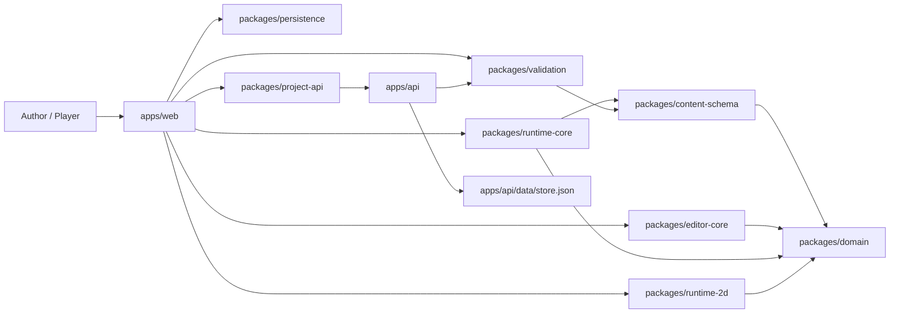

## Package Responsibilities

### `packages/domain`

Defines the shared vocabulary of the application:

- IDs such as `MapId`, `EntityId`, `DialogueId`
- core content types such as `AdventurePackage`, `MapDefinition`, `EntityDefinition`, `TriggerDefinition`
- rule/action/condition unions shared across the editor, validation, and runtime

This package is the lowest-level shared contract.

### `packages/content-schema`

Owns adventure-package ingestion:

- reads raw authored content
- normalizes shorthand raw content into full `AdventurePackage` structures
- provides base schema validation
- provides migration/parse entry points

This is where raw content becomes structured game content.

### `packages/validation`

Owns deeper publish-readiness checks:

- map geometry checks
- start-state checks
- exit target checks
- entity placement bounds checks
- dialogue node checks
- trigger condition/action reference checks
- validation summaries and blocking state

This package is now the shared truth for whether a draft is publishable.

### `packages/editor-core`

Owns pure editing operations:

- clone the adventure package
- change metadata
- paint tiles
- move entity instances
- list map entities and palette values

This keeps editing logic separate from browser DOM code.

### `packages/runtime-core`

Owns game simulation:

- create sessions from an `AdventurePackage`
- dispatch player commands
- execute triggers and dialogue
- move the player between maps
- update runtime state and emit events
- serialize runtime snapshots
- process phase-1 enemy AI

This package is renderer-agnostic.

### `packages/runtime-2d`

Owns presentation of runtime state on a canvas:

- draw maps
- draw entities
- draw the player marker
- reflect tile overrides and current session state visually

### `packages/persistence`

Owns local browser persistence:

- local runtime saves
- local draft saves
- IndexedDB access
- save/draft record wrappers around canonical content or runtime snapshots

### `packages/project-api`

Owns shared client/server contract for backend operations:

- project DTOs
- release DTOs
- validation request contract
- browser API client methods

### `apps/web`

Owns browser behavior and UI:

- runtime host page
- editor page
- keyboard handling
- DOM updates
- status panels
- project/release controls
- calling the API client
- calling local persistence

### `apps/api`

Owns local backend behavior:

- session endpoint
- project CRUD-like draft endpoints
- release publish endpoints
- validation endpoint
- asset metadata endpoint
- file-backed local storage

## Data Model Layers

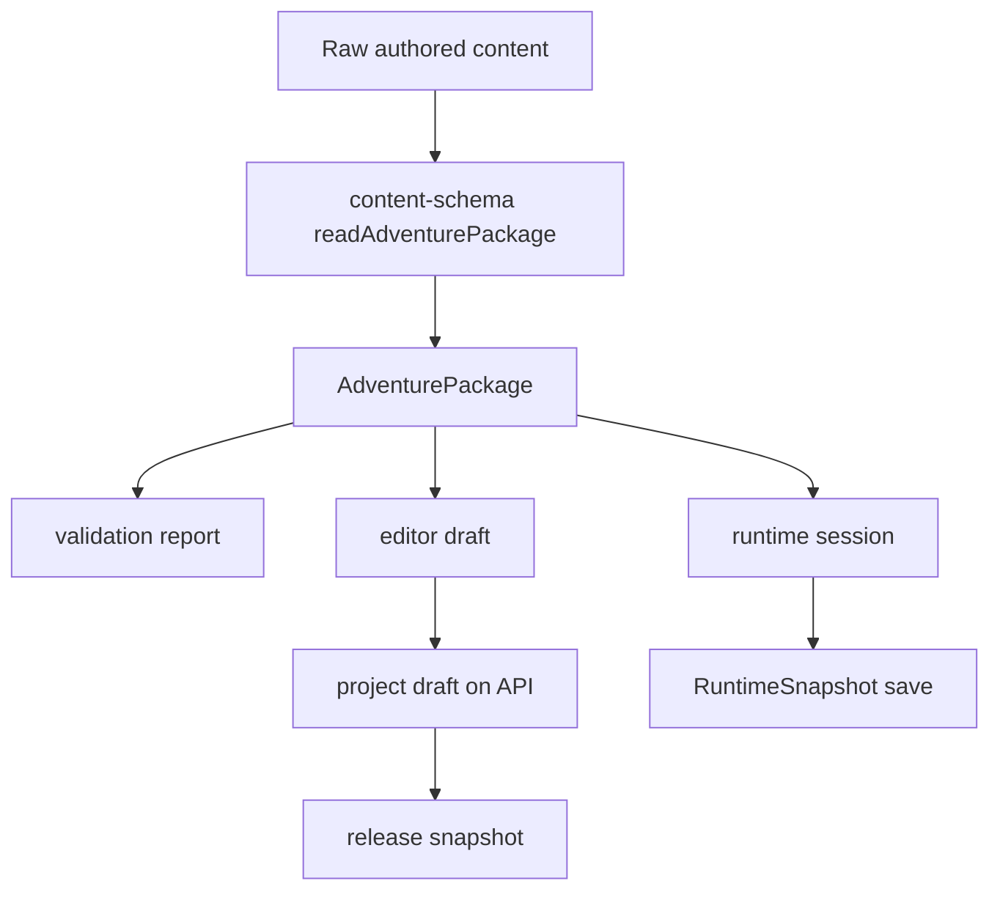

### Raw authored content

For the sample adventure, authored content lives in:

- [sampleAdventure.ts](H:\My%20Drive\Repos\ACS\apps\web\src\sampleAdventure.ts)

This is now raw content data rather than content mixed with helper constructors.

### Normalized content

`readAdventurePackage(...)` in `packages/content-schema` converts raw content into a full `AdventurePackage`.

### Drafts

A draft is mutable. It can exist in two places:

- local IndexedDB draft in the browser
- mutable project draft in the API store

### Releases

A release is immutable. It is a frozen snapshot of the project draft at publish time.

### Saves

A runtime save is not a content package. It is a serialized `RuntimeSnapshot` taken from a running session.

## Runtime Flow

### Runtime boot

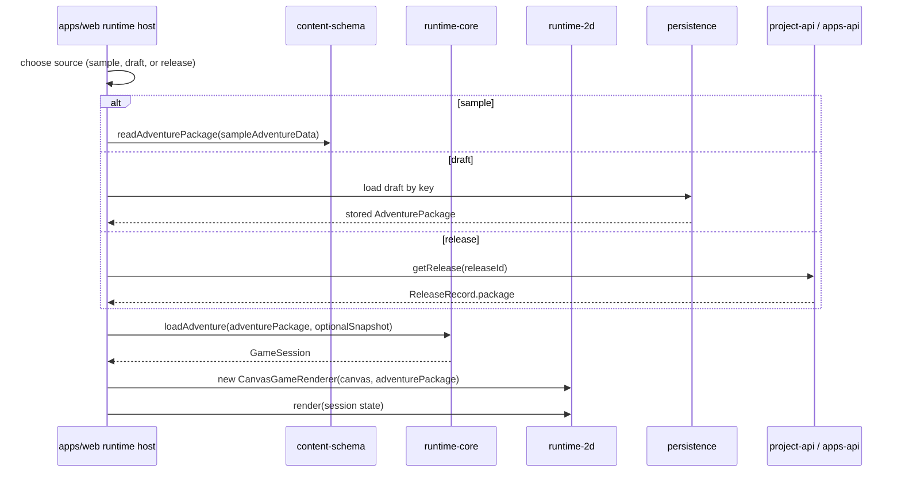

### Command dispatch flow

A player action goes through a strict path:

1. browser input handler creates a `PlayerCommand`
2. command is dispatched to `runtime-core`
3. runtime updates session state and emits events
4. browser host updates UI panels
5. renderer redraws the canvas

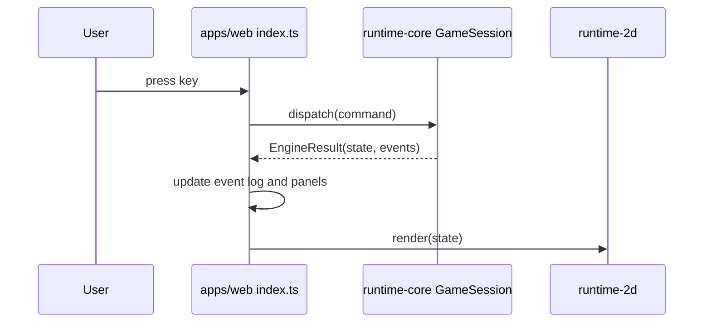

### End-to-end example: stepping through the door to the shrine

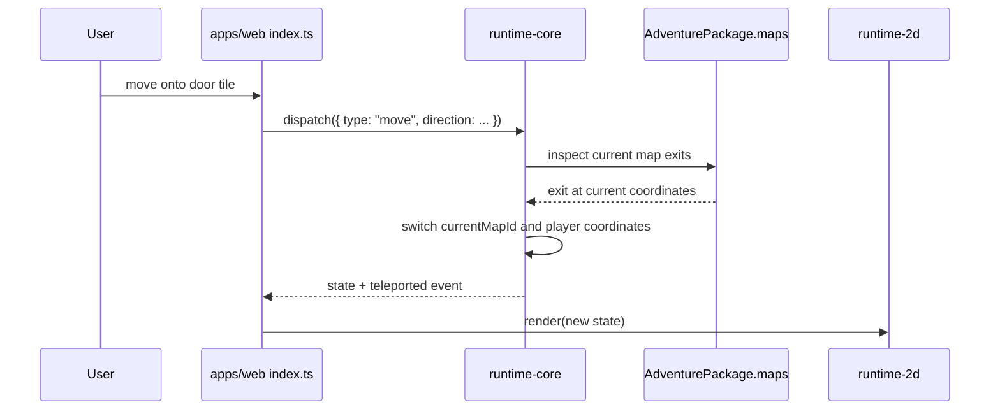

## Editor Flow

### Editor boot

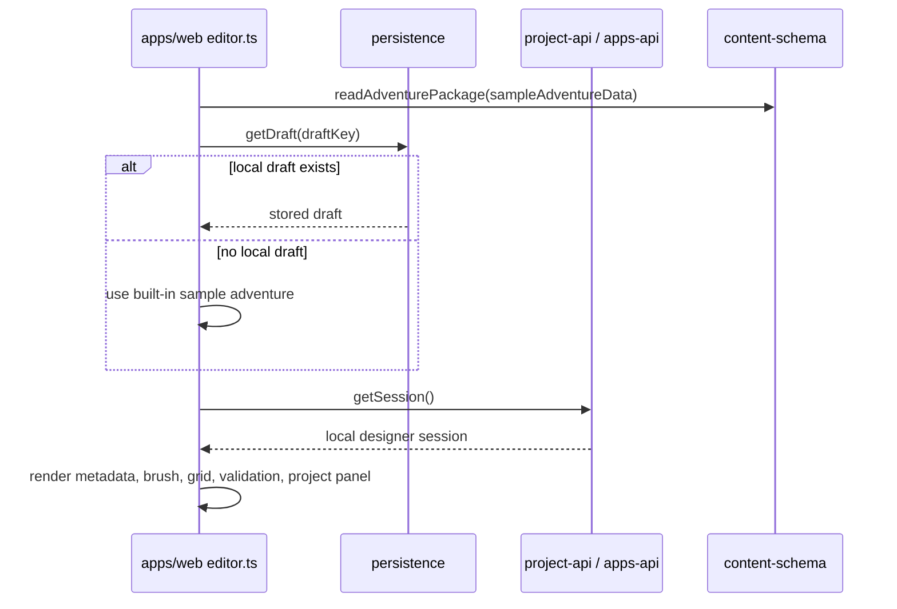

### Tile brush behavior

The tile brush is a persistent editor state, not a one-shot action.

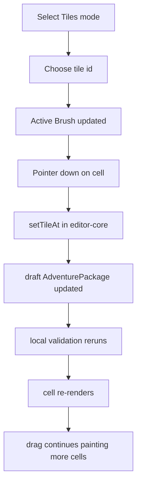

### End-to-end example: Validate Draft

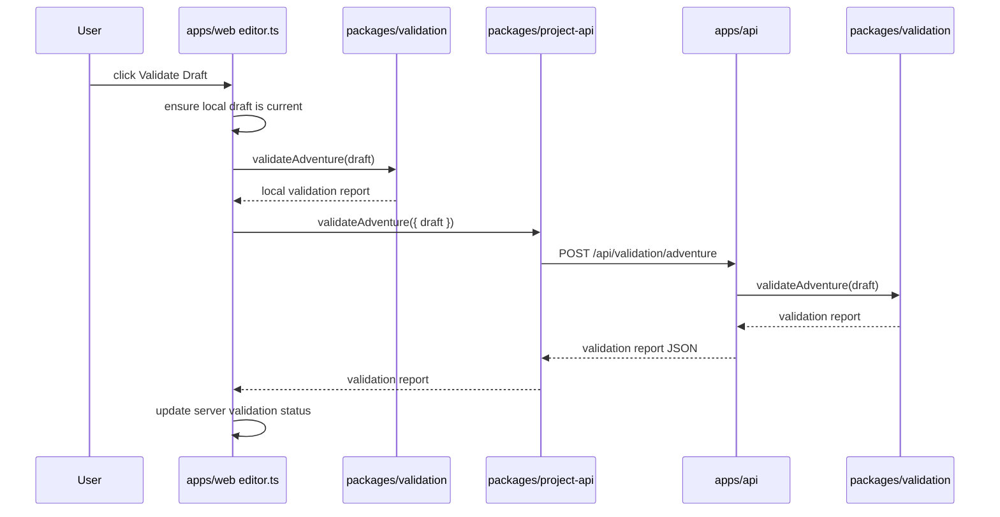

## Project And Release Flow

### Draft -> project -> release

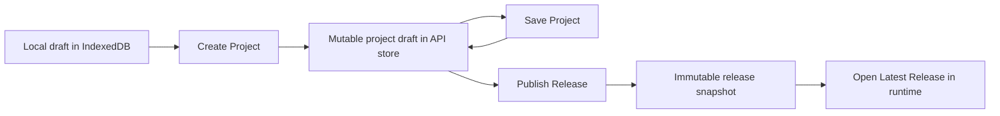

### End-to-end example: Publish Release

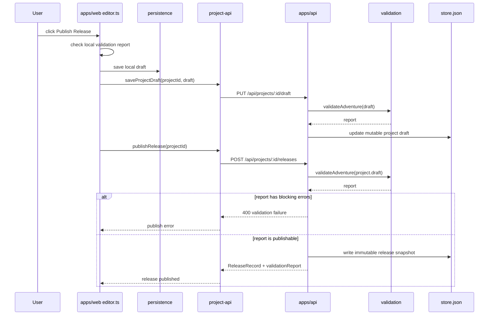

## Save And Load Flow

### Runtime save flow

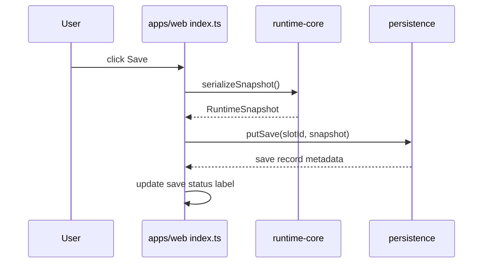

### Runtime load flow

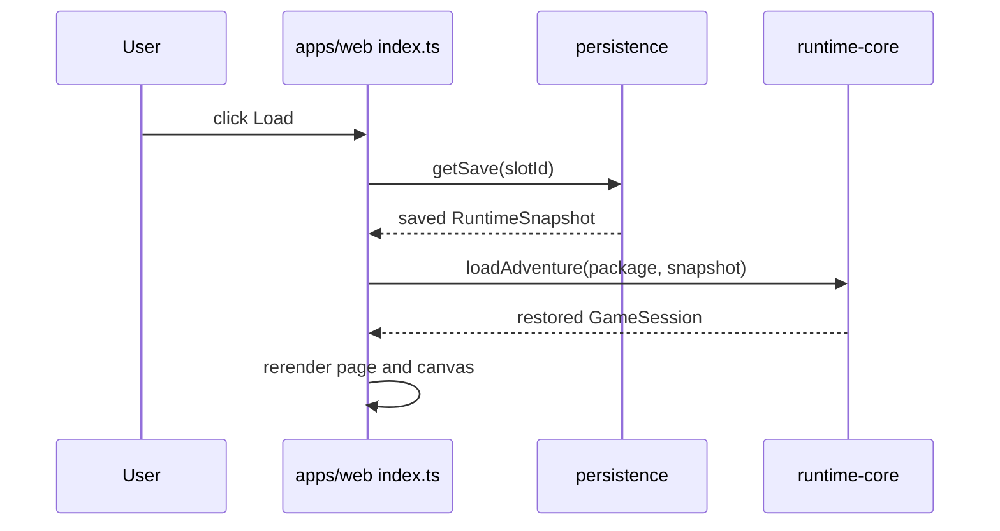

## Validation Rules In Practice

The shared validation package currently checks categories like:

- missing or unknown start map
- start position outside the chosen map
- map region references that do not exist
- tile layer size mismatches
- wrong tile count for a layer
- exits whose source or destination are out of bounds
- entity placements outside map bounds
- overlapping entities on one map tile (warning)
- empty dialogue definitions
- duplicate dialogue node ids
- dialogue choices pointing to missing nodes
- trigger map locations that are missing or invalid
- conditions referencing missing items or quests
- actions referencing missing maps, items, or dialogues

## Major End-to-End Behaviors

### Behavior 1: Talk to the Oracle

1. Browser key handler maps `E` to `{ type: "interact" }`.
2. Runtime finds the adjacent Oracle entity.
3. Runtime executes matching `onInteractEntity` triggers.
4. Trigger actions start dialogue and set quest flags.
5. Browser updates dialogue overlay and event log.

### Behavior 2: Reach the shrine altar

1. Player walks onto the altar tile.
2. Runtime evaluates `onEnterTile` triggers.
3. Matching shrine trigger grants the Solar Seal.
4. Runtime changes the altar tile state.
5. Renderer shows the updated tile and UI reflects the new inventory/flags.

### Behavior 3: Publish a valid release

1. Editor validates the draft locally.
2. User optionally runs `Validate Draft` against the API.
3. User saves the project draft.
4. API validates again before publish.
5. API creates an immutable release and stores the validation report alongside it.
6. Editor can open the latest release in the runtime.

### Behavior 4: Load a published release and save progress

1. Runtime fetches the release package by release id.
2. Runtime boots a session from that package.
3. Save slot id is namespaced to the release.
4. Player saves progress.
5. Later loads return to that exact release-based session snapshot.

## Current Limits Of The Architecture

The structure is intentionally modular, but a few things are still early-stage:

- `runtime-2d` still hardcodes simple visual conventions
- the editor can paint and reposition but not yet create full new content types
- the local API is file-backed rather than database-backed
- release discovery and user accounts are still minimal
- documentation now explains the pieces clearly, but some guide graphics are illustrative rather than fully live captures

## Recommended Reading Order

If you are trying to learn the codebase quickly, this order works well:

1. `docs/user-guide.md`
2. `docs/architecture.md`
3. `docs/system-reference.md`
4. `packages/domain/src/index.ts`
5. `packages/content-schema/src/index.ts`
6. `packages/validation/src/index.ts`
7. `packages/runtime-core/src/index.ts`
8. `apps/web/src/editor.ts`
9. `apps/web/src/index.ts`
10. `apps/api/src/index.ts`
