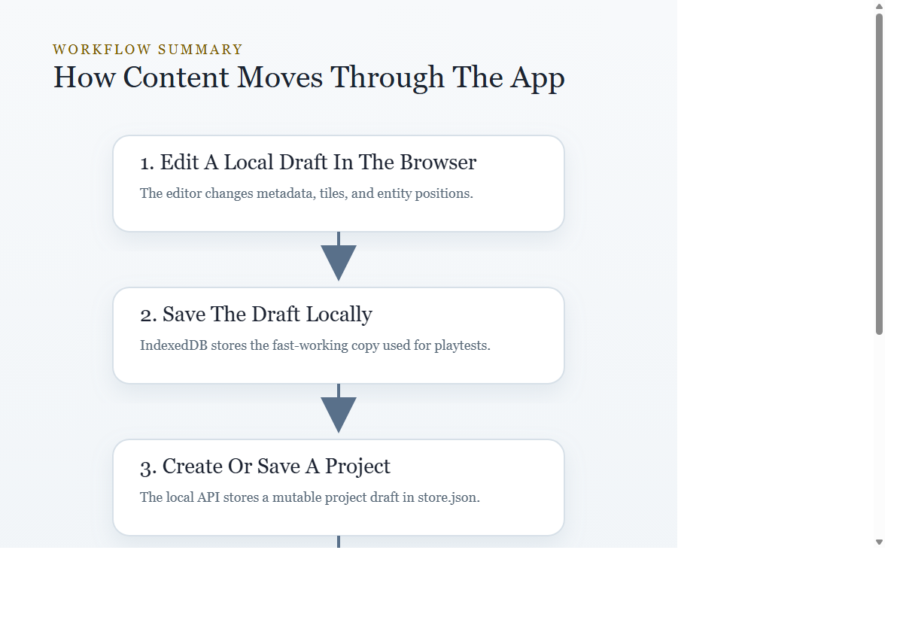
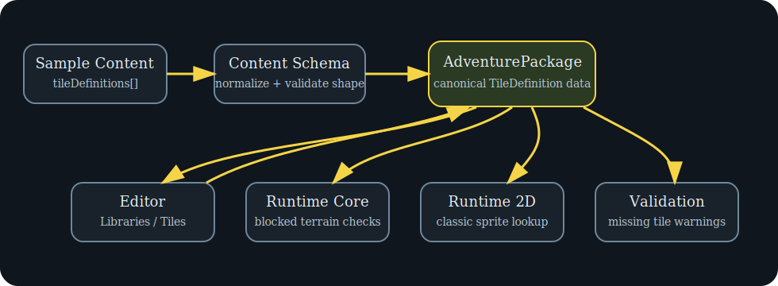
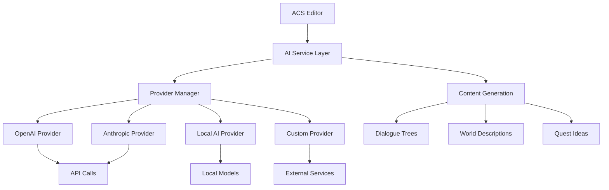
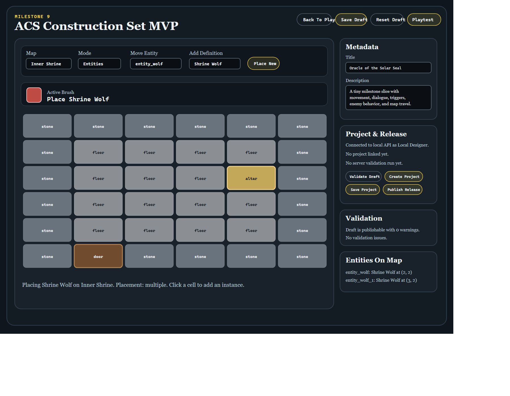
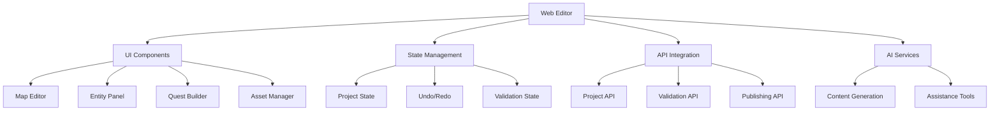
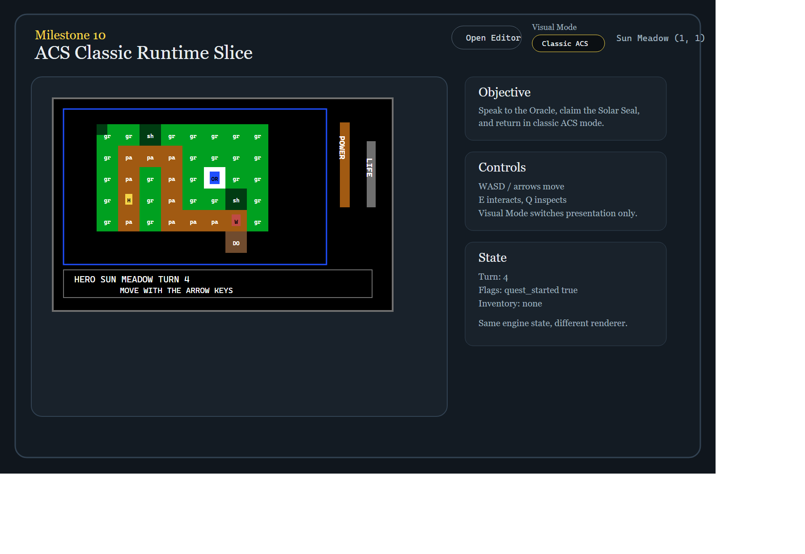
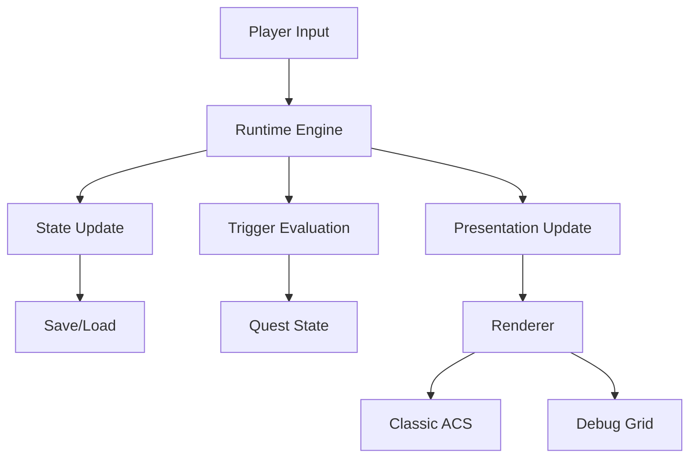
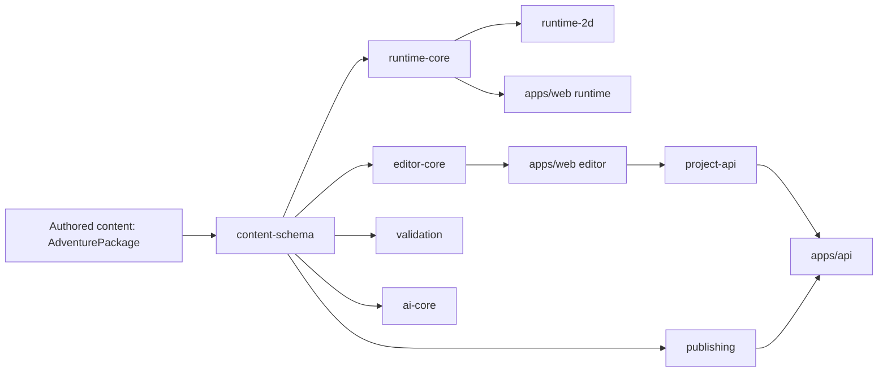

# ACS System Reference

This document provides comprehensive technical documentation for the ACS adventure construction system. It explains the architecture, data models, and implementation details for developers, maintainers, and advanced users.

## Table of Contents

1. [System Overview](#system-overview)
2. [Architecture Principles](#architecture-principles)
3. [Core Components](#core-components)
4. [Data Model](#data-model)
5. [AI-Agnostic Integration](#ai-agnostic-integration)
6. [Editor Architecture](#editor-architecture)
7. [Runtime Engine](#runtime-engine)
8. [Publishing System](#publishing-system)
9. [Skinning and Presentation](#skinning-and-presentation)
10. [Persistence Layer](#persistence-layer)
11. [Validation Framework](#validation-framework)
12. [API Reference](#api-reference)
13. [Troubleshooting](#troubleshooting)
14. [Development Guide](#development-guide)

## 1. System Overview

ACS (Adventure Construction Set) is a browser-based environment for creating and playing text-based adventure games with retro-styled graphics. The system consists of three main components: a web-based editor, a runtime player, and a backend API for persistence and validation.

### Core Principles

- **Browser-native**: Runs entirely in web browsers using modern JavaScript
- **Offline-capable**: Works without internet connectivity for local development
- **Modular architecture**: Clean separation between editing, playing, and persistence
- **Extensible**: Plugin architecture for AI providers, renderers, and export formats

### Target Users

- **Content creators**: Authors who build adventures using the visual editor
- **Players**: End users who experience published adventures
- **Developers**: Contributors who extend or maintain the system
- **Integrators**: Third parties who connect external services

## 2. Architecture Principles

### Separation of Concerns

The system is built around clear boundaries between different functional areas:

- **Authoring**: Content creation and editing
- **Execution**: Runtime gameplay and state management
- **Persistence**: Data storage and retrieval
- **Presentation**: Visual and audio rendering
- **Integration**: External service connections

### Data Flow Architecture

Content flows through the system in a structured pipeline:

```
Authoring → Validation → Publishing → Distribution → Execution → Presentation
```

Each stage has well-defined interfaces and data contracts.

### System Diagrams

The ACS architecture is best understood with visual diagrams. The current system reference includes several key diagrams that describe the authoring and runtime flow.

- **Workflow Overview**: `docs/assets/workflow-vertical.svg` shows the end-to-end authoring pipeline from editor actions through validation and runtime playback.
- **Editor Feature Flow**: `docs/assets/editor-guide.svg` shows the main editor sections, the user journey through World Atlas, Map Workspace, Libraries, and Logic & Quests.
- **Runtime Lifecycle**: `docs/assets/runtime-guide.svg` illustrates the runtime player state transitions, save/load flows, and player interaction loop.
- **Tile Definition Flow**: `docs/assets/tile-definition-flow.svg` shows how tile metadata is authored, validated, and consumed by the renderer and runtime.
- **Map Graph and Trigger Chains**: `docs/assets/tutorial-relay-detail-03-map-links.svg` and `docs/assets/tutorial-relay-detail-04-trigger-cells.svg` show map linkage and trigger cell behavior.





### Extensibility Points

The system provides multiple extension mechanisms:

- **AI Providers**: Pluggable content generation services
- **Renderers**: Alternative presentation engines
- **Exporters**: Custom publishing formats
- **Validators**: Domain-specific quality checks

## 3. Core Components

### Web Editor (`apps/web/editor.html`)

The primary authoring interface providing:

- Visual map editor with tile painting
- Entity placement and configuration
- Dialogue tree construction
- Quest definition and management
- Trigger logic builder
- Asset management
- Project publishing workflow

### Runtime Player (`apps/web/index.html`)

The gameplay experience featuring:

- Turn-based movement and interaction
- Dialogue presentation
- Inventory management
- Quest tracking
- Save/load functionality
- Multiple visual modes (Classic ACS, Debug Grid)

### Backend API (`apps/api/dist/index.js`)

The persistence and validation service providing:

- Project storage and retrieval
- Draft management
- Publishing workflow
- Content validation
- Release management

## 4. Data Model

### Core Data Types

#### Adventure Package

The root container for all adventure content:

```typescript
interface Adventure {
  id: string;
  title: string;
  description: string;
  version: string;
  maps: Map[];
  entities: Entity[];
  items: Item[];
  quests: Quest[];
  triggers: Trigger[];
  assets: Asset[];
  config: AdventureConfig;
}
```

#### Map Structure

Spatial layout and terrain definition:

```typescript
interface Map {
  id: string;
  name: string;
  width: number;
  height: number;
  tiles: Tile[][];
  entities: EntityInstance[];
  properties: MapProperties;
}
```

#### Entity System

Interactive characters and objects:

```typescript
interface Entity {
  id: string;
  name: string;
  type: 'character' | 'item' | 'object';
  sprite: string;
  behavior: BehaviorConfig;
  properties: Record<string, any>;
}
```

### State Management

#### Runtime State

Live gameplay session data:

```typescript
interface RuntimeState {
  player: PlayerState;
  currentMap: string;
  position: Position;
  inventory: Item[];
  questProgress: QuestState[];
  flags: Record<string, boolean>;
  turnCount: number;
}
```

#### Editor State

Authoring session data:

```typescript
interface EditorState {
  currentAdventure: Adventure;
  selectedTool: ToolType;
  currentMap: string;
  unsavedChanges: boolean;
  validationResults: ValidationIssue[];
}
```

## 5. AI-Agnostic Integration

### Architecture Overview

The AI integration uses a provider-agnostic architecture that allows multiple AI services to be used interchangeably. This design enables flexibility in choosing AI providers based on cost, quality, or availability requirements.

#### Key Components

- **Provider Manager**: Orchestrates AI service interactions
- **Content Generators**: Specialized modules for different content types
- **Caching Layer**: Optimizes API usage and response times
- **Fallback System**: Ensures reliability when primary providers fail

### Provider Interface

All AI providers implement a common interface:

```typescript
interface AIProvider {
  generateDialogue(options: DialogueOptions): Promise<DialogueTree>;
  generateDescription(context: DescriptionContext): Promise<string>;
  generateQuestIdeas(theme: string): Promise<QuestConcept[]>;
  validateContent(content: any): Promise<ValidationResult>;
}
```

### Supported Providers

#### OpenAI Integration
- GPT-4 for complex narrative generation
- GPT-3.5-turbo for efficient dialogue creation
- DALL-E for image asset generation

#### Anthropic Claude
- Advanced reasoning for plot development
- Safety-focused content generation
- Long-context understanding for complex worlds

#### Local AI Models
- Ollama integration for offline operation
- Custom fine-tuned models
- Privacy-preserving local processing

### Content Generation Pipeline

1. **Request Analysis**: Parse user intent and context
2. **Provider Selection**: Choose optimal AI service
3. **Prompt Engineering**: Craft effective prompts
4. **Response Processing**: Parse and validate AI output
5. **Content Integration**: Merge AI content with existing assets

### AI-Assisted Authoring Features

#### Dialogue Tree Generation
- Character-consistent conversations
- Branching narrative options
- Emotional tone analysis

#### World Building Enhancement
- Atmospheric descriptions
- Lore generation
- Environmental storytelling

#### Quest Design Assistance
- Plot structure suggestions
- Character motivation development
- Pacing recommendations

### Quality Assurance

- **Content Validation**: AI-generated content passes through validation rules
- **Consistency Checks**: Maintains world and character consistency
- **Safety Filters**: Prevents inappropriate content generation

### Performance Optimization

- **Response Caching**: Reduces API calls for similar requests
- **Batch Processing**: Efficient handling of multiple generation tasks
- **Rate Limiting**: Manages API usage to stay within limits

### AI Integration Architecture Diagram



All AI providers implement a common interface:

```typescript
interface AIProvider {
  id: string;
  name: string;
  capabilities: AICapability[];

  generateContent(request: AIRequest): Promise<AIResponse>;
  validateConnection(): Promise<boolean>;
  getUsageStats(): Promise<UsageStats>;
}
```

### Request Planning System

Before calling an AI provider, the system analyzes the request context:

1. **Context Analysis**: Examines current adventure state, selected elements, and user intent
2. **Capability Matching**: Determines which AI capabilities are needed
3. **Prompt Construction**: Builds structured prompts with context and constraints
4. **Provider Selection**: Chooses the most appropriate AI provider
5. **Request Formatting**: Converts internal request to provider-specific format

### Content Generation Types

#### Dialogue Generation

Creates natural conversation flows:

- **Character Consistency**: Maintains personality and speaking patterns
- **Context Awareness**: References current game state and history
- **Branching Logic**: Creates meaningful choice consequences

#### Quest Design

Generates narrative objectives:

- **Pacing**: Creates appropriate difficulty progression
- **Integration**: Fits quests into existing story world
- **Rewards**: Designs meaningful incentives and payoffs

#### World Building

Enhances environmental descriptions:

- **Atmosphere**: Creates immersive environmental details
- **Consistency**: Maintains world-building rules and lore
- **Interactivity**: Suggests interactive elements and secrets

### Safety and Quality Controls

#### Content Filtering

- **Input Validation**: Checks prompts for inappropriate content
- **Output Filtering**: Reviews generated content before presentation
- **Usage Monitoring**: Tracks API usage and costs

#### Quality Assurance

- **Consistency Checks**: Validates generated content against adventure rules
- **Grammar and Style**: Ensures professional presentation
- **Cultural Sensitivity**: Avoids problematic stereotypes or references

### Provider Implementations

#### OpenAI Integration

Uses GPT models through their API:

- **Model Selection**: Supports multiple GPT versions
- **Token Management**: Efficient prompt construction and response parsing
- **Rate Limiting**: Respects API quotas and costs

#### Future Provider Support

The architecture supports additional providers:

- **Anthropic Claude**: Alternative language model
- **Google Gemini**: Multi-modal capabilities
- **Local Models**: Self-hosted AI instances
- **Custom Providers**: Proprietary or specialized services

### Configuration and Management

#### Provider Configuration

```typescript
interface AIConfig {
  defaultProvider: string;
  providers: Record<string, ProviderConfig>;
  safety: SafetySettings;
  caching: CacheSettings;
}
```

#### Runtime Provider Switching

The system can switch providers dynamically:

- **Fallback**: Automatic failover to backup providers
- **Load Balancing**: Distribute requests across multiple providers
- **Cost Optimization**: Choose providers based on pricing
- **Quality Preferences**: Select providers for specific content types

## 6. Editor Architecture

### Component Structure

The editor is built as a single-page application with modular components:

- **Canvas View**: Main editing area with map display
- **Tool Palette**: Available editing tools and brushes
- **Property Panel**: Configuration for selected elements
- **Library Browser**: Asset and template management
- **Validation Panel**: Error checking and warnings

### Editing Modes

#### Map Editing

Primary content creation mode:

- **Tile Painting**: Brush-based terrain editing
- **Entity Placement**: Drag-and-drop character positioning
- **Trigger Creation**: Visual logic builder
- **Property Editing**: In-place configuration

#### Dialogue Editing

Conversation tree construction:

- **Node-Based Editor**: Visual dialogue flow
- **Branching Logic**: Conditional conversation paths
- **Variable Integration**: Dynamic text based on game state
- **Preview System**: Test conversations in context

#### Quest Design

Objective and narrative creation:

- **Stage Builder**: Step-by-step quest progression
- **Dependency Management**: Prerequisite and unlock systems
- **Reward Configuration**: Item and experience rewards
- **Tracking Integration**: Journal and UI updates

### State Management

#### Undo/Redo System

Comprehensive change tracking:

- **Operation Batching**: Groups related changes
- **Memory Management**: Efficient storage of edit history
- **Selective Undo**: Target specific operations
- **State Persistence**: Survives editor sessions

#### Auto-Save Functionality

### Editor Architecture Diagram

`docs/assets/editor-guide.svg` shows the current editor component layout and the interaction flow between map editing, library browsing, quests, and validation.





Prevents data loss:

- **Draft Saving**: Automatic local storage
- **Version Control**: Timestamped snapshots
- **Conflict Resolution**: Merge concurrent changes
- **Recovery Options**: Restore from backups

### Validation Integration

Real-time quality checking:

- **Syntax Validation**: Structural correctness
- **Logic Verification**: Trigger and quest consistency
- **Performance Checks**: Optimization warnings
- **Completeness Testing**: Missing content detection

## 7. Runtime Engine

### Execution Model

The runtime uses a turn-based execution model:

1. **Input Processing**: Handle player actions
2. **State Update**: Modify game world state
3. **Trigger Evaluation**: Check and execute conditional logic
4. **Presentation Update**: Refresh visual display
5. **Save Opportunity**: Allow state preservation

### State Management

#### Runtime Snapshot

Complete game state capture:

```typescript
interface RuntimeSnapshot {
  adventure: Adventure;
  player: PlayerState;
  world: WorldState;
  timestamp: Date;
  version: string;
}
```

#### Session Persistence

Browser-based save system:

- **IndexedDB Storage**: Client-side persistence
- **Multiple Slots**: Separate saves per adventure
- **Metadata Tracking**: Save timestamps and descriptions
- **Corruption Recovery**: Automatic backup restoration

### Trigger System

Event-driven logic execution:

#### Trigger Types

- **Location Triggers**: Area entry/exit events
- **Interaction Triggers**: Player action responses
- **Time Triggers**: Scheduled or delayed events
- **State Triggers**: Condition-based activation

#### Execution Engine

- **Condition Evaluation**: Boolean logic processing
- **Action Sequencing**: Ordered effect execution
- **Rollback Support**: Undo failed operations
- **Performance Optimization**: Efficient trigger indexing

### Rendering Pipeline

Multiple presentation modes:

#### Classic ACS Renderer

Retro-styled graphics:

- **Tile Rendering**: Pixel-perfect sprite display
- **Panel Layout**: Traditional interface arrangement
- **Scaling Options**: Multiple size configurations
- **Color Management**: Palette-based theming

#### Debug Grid Renderer

Development visualization:

- **Coordinate Overlay**: Position and grid display
- **Debug Information**: Technical state details
- **Wireframe Mode**: Structural visualization
- **Performance Metrics**: Frame rate and memory usage

### Runtime Architecture Diagram

The runtime engine is visualized in `docs/assets/runtime-guide.svg`, showing the execution loop, trigger evaluation, and presentation update phases.





## 8. Publishing System

### Publishing Workflow

Multi-stage content release process:

1. **Draft Creation**: Initial content authoring
2. **Validation**: Quality and consistency checks
3. **Project Formation**: Backend project creation
4. **Release Building**: Versioned publication
5. **Distribution**: Content deployment

### Project Management

Backend project structure:

```typescript
interface Project {
  id: string;
  title: string;
  description: string;
  owner: string;
  drafts: Draft[];
  releases: Release[];
  collaborators: string[];
  settings: ProjectSettings;
}
```

### Release System

Versioned content distribution:

#### Release Types

- **Development**: Internal testing releases
- **Beta**: Limited user testing
- **Stable**: Public production releases
- **Patch**: Bug fix updates

#### Release Metadata

```typescript
interface Release {
  id: string;
  version: string;
  changelog: string;
  compatibility: CompatibilityInfo;
  assets: ReleaseAsset[];
  published: Date;
  downloads: number;
}
```

### Export Formats

Multiple distribution options:

#### Web Package

Browser-native format:

- **Single File**: Self-contained HTML/JS bundle
- **Offline Play**: No server requirements
- **Cross-Platform**: Works on any modern browser
- **Size Optimized**: Compressed assets and code

#### Development Package

Source format for modification:

- **Editable Assets**: Original source files
- **Project Structure**: Complete development environment
- **Tool Integration**: Compatible with editor
- **Version Control**: Git-friendly organization

### Distribution Channels

Content delivery options:

- **Direct Download**: ZIP package distribution
- **Web Hosting**: Server-based deployment
- **CDN Delivery**: Global content distribution
- **Platform Integration**: Third-party marketplace support

## 9. Skinning and Presentation

### Visual Architecture

Multi-layered presentation system:

#### Asset Management

Resource organization and loading:

- **Asset Registry**: Centralized resource catalog
- **Loading Pipeline**: Asynchronous asset fetching
- **Caching Strategy**: Performance optimization
- **Format Support**: Multiple image and audio formats

#### Theme System

Visual customization framework:

```typescript
interface Theme {
  id: string;
  name: string;
  colors: ColorPalette;
  fonts: FontConfig;
  sprites: SpriteMapping;
  audio: AudioConfig;
}
```

### Rendering Modes

Alternative presentation engines:

#### Classic ACS Mode

Retro adventure styling:

- **Pixel Graphics**: 16/32px tile-based rendering
- **Panel Interface**: Traditional layout (map, status, messages)
- **Color Palettes**: Limited color schemes for authenticity
- **Scalable UI**: Multiple size options

#### Modern Mode

Contemporary presentation:

- **Vector Graphics**: Smooth scaling and effects
- **Flexible Layout**: Responsive design
- **Rich Colors**: Full color spectrum
- **Advanced Effects**: Lighting, particles, animations

#### Debug Mode

Development visualization:

- **Grid Overlay**: Coordinate and boundary display
- **Debug Panels**: Technical information
- **Wireframe Rendering**: Structural outlines
- **Performance Metrics**: Real-time statistics

### Customization Framework

Extensible theming system:

#### CSS Variables

Dynamic styling control:

```css
:root {
  --primary-color: #4a90e2;
  --text-color: #333333;
  --tile-size: 32px;
  --font-family: 'PixelFont', monospace;
}
```

#### Asset Swapping

Runtime visual changes:

- **Sprite Replacement**: Alternative character graphics
- **Tile Set Changes**: Different terrain appearances
- **UI Skinning**: Interface customization
- **Audio Themes**: Alternative sound sets

### Accessibility Features

Inclusive design support:

- **High Contrast**: Improved visibility options
- **Large Text**: Readable font scaling
- **Keyboard Navigation**: Full keyboard control
- **Screen Reader**: Semantic markup and labels
- **Color Blind Support**: Alternative color schemes

## 10. Persistence Layer

### Storage Architecture

Multi-tier data persistence:

#### Browser Storage

Client-side persistence:

- **IndexedDB**: Structured data storage
- **LocalStorage**: Simple key-value storage
- **SessionStorage**: Temporary session data
- **Cache API**: Asset caching

#### Backend Storage

Server-side persistence:

- **Project Database**: Adventure project storage
- **User Management**: Account and permission system
- **Release Archive**: Published content repository
- **Analytics Storage**: Usage and performance data

### Data Synchronization

Conflict resolution and merging:

#### Change Tracking

Version control for content:

- **Operation Log**: Sequence of modifications
- **Conflict Detection**: Simultaneous edit resolution
- **Merge Strategies**: Automatic and manual merging
- **Rollback Support**: Undo complex operations

#### Synchronization Protocol

Real-time collaboration:

- **WebSocket Communication**: Live updates
- **Operational Transformation**: Concurrent edit handling
- **Presence Indicators**: User activity display
- **Offline Support**: Queue changes for later sync

### Backup and Recovery

Data protection strategies:

#### Automatic Backups

Regular data preservation:

- **Scheduled Snapshots**: Time-based backups
- **Change-Based**: Backup after significant modifications
- **Compressed Storage**: Efficient backup files
- **Retention Policies**: Automatic cleanup

#### Recovery Options

Data restoration:

- **Point-in-Time Recovery**: Restore to specific moments
- **Incremental Restore**: Partial data recovery
- **Cross-Platform**: Backup portability
- **Verification**: Integrity checking

## 11. Validation Framework

### Validation Architecture

Comprehensive quality assurance:

#### Validation Types

- **Syntax Validation**: Structural correctness
- **Semantic Validation**: Logical consistency
- **Performance Validation**: Efficiency checks
- **Compatibility Validation**: Platform support

#### Validation Rules

Configurable quality gates:

```typescript
interface ValidationRule {
  id: string;
  category: ValidationCategory;
  severity: 'error' | 'warning' | 'info';
  condition: ValidationCondition;
  message: string;
  fix?: AutoFix;
}
```

### Quality Gates

Automated quality checks:

#### Content Validation

Adventure-specific checks:

- **Completeness**: Required elements present
- **Consistency**: Internal logic verification
- **Balance**: Difficulty and pacing assessment
- **Accessibility**: Inclusive design verification

#### Technical Validation

System-level checks:

- **Performance**: Resource usage analysis
- **Compatibility**: Browser and platform support
- **Security**: Safe content verification
- **Standards**: Format compliance

### Automated Testing

Continuous quality assurance:

#### Unit Tests

Component-level testing:

- **Function Testing**: Individual feature verification
- **Integration Testing**: Component interaction
- **Regression Testing**: Prevent functionality loss
- **Performance Testing**: Speed and efficiency checks

#### Playtesting Automation

Automated gameplay simulation:

- **Scenario Testing**: Common gameplay paths
- **Edge Case Testing**: Unusual situations
- **Load Testing**: Performance under stress
- **Compatibility Testing**: Multiple environment verification

## 12. API Reference

### REST API Endpoints

Backend service interfaces:

#### Project Management

```
GET    /api/projects           # List projects
POST   /api/projects           # Create project
GET    /api/projects/:id       # Get project
PUT    /api/projects/:id       # Update project
DELETE /api/projects/:id       # Delete project
```

#### Content Management

```
GET    /api/projects/:id/drafts     # List drafts
POST   /api/projects/:id/drafts     # Save draft
GET    /api/projects/:id/releases   # List releases
POST   /api/projects/:id/releases   # Create release
```

#### Validation Service

```
POST   /api/validate              # Validate content
GET    /api/validation/rules      # Get validation rules
POST   /api/validation/rules      # Update rules
```

### WebSocket API

Real-time communication:

#### Editor Synchronization

```typescript
interface EditorMessage {
  type: 'draft_update' | 'validation_result' | 'collaborator_join';
  payload: any;
  timestamp: Date;
}
```

#### Runtime Events

```typescript
interface RuntimeMessage {
  type: 'state_change' | 'trigger_fire' | 'save_complete';
  payload: any;
  sessionId: string;
}
```

### SDK and Libraries

Development support:

#### JavaScript SDK

```javascript
import { ACSApi } from '@acs/sdk';

const api = new ACSApi({ endpoint: 'http://localhost:4318' });

// Create project
const project = await api.projects.create({
  title: 'My Adventure',
  description: 'An epic quest'
});

// Save draft
await api.drafts.save(project.id, adventureData);
```

#### Type Definitions

Complete TypeScript declarations for all APIs and data structures.

## 13. Troubleshooting

### Common Issues

#### Editor Problems

- **Loading failures**: Check network connectivity and API availability
- **Save errors**: Verify disk space and permissions
- **Performance issues**: Close unnecessary browser tabs
- **Display problems**: Clear browser cache and reload

#### Runtime Issues

- **Game won't start**: Verify browser compatibility and JavaScript enabled
- **Controls not responding**: Check for conflicting browser extensions
- **Audio not playing**: Ensure browser audio permissions granted
- **Save corruption**: Use backup recovery options

#### Publishing Issues

- **Validation failures**: Review and fix reported errors
- **Upload timeouts**: Check file sizes and network stability
- **Distribution problems**: Verify target platform requirements

### Diagnostic Tools

#### Built-in Diagnostics

- **Health Check**: System component verification
- **Performance Monitor**: Resource usage tracking
- **Log Viewer**: Detailed error and event logs
- **Network Inspector**: API communication monitoring

#### Debug Modes

- **Verbose Logging**: Detailed operation tracing
- **Debug Rendering**: Visual debugging overlays
- **Performance Profiling**: Execution time analysis
- **Memory Inspection**: Resource usage breakdown

### Support Resources

#### Documentation

- **User Guide**: Feature usage instructions
- **API Reference**: Technical integration details
- **Troubleshooting FAQ**: Common problem solutions
- **Video Tutorials**: Visual walkthroughs

#### Community Support

- **Issue Tracker**: Bug reports and feature requests
- **Discussion Forums**: Community Q&A
- **Developer Chat**: Real-time assistance
- **Knowledge Base**: Detailed guides and best practices

## 14. Development Guide

### Getting Started

#### Development Environment

Prerequisites and setup:

- **Node.js**: Version 16 or higher
- **Git**: Version control system
- **Modern Browser**: Chrome, Firefox, or Edge
- **Code Editor**: VS Code recommended

#### Project Structure

```
apps/
  web/           # Frontend applications
    editor.html  # Main editor interface
    index.html   # Runtime player
    server.mjs   # Development server
  api/           # Backend API
    src/         # Source code
    dist/        # Built application
packages/        # Shared libraries
  ai-core/       # AI provider abstractions
  content-schema/# Data model definitions
  editor-core/   # Editor logic
  runtime-core/  # Runtime engine
  validation/    # Quality assurance
```

### Development Workflow

#### Local Development

1. **Clone Repository**: Get the source code
2. **Install Dependencies**: `npm install` in root
3. **Start Services**: Run both web and API servers
4. **Open Editor**: Navigate to localhost editor URL
5. **Make Changes**: Edit code and see live updates

#### Building for Production

```bash
# Build all packages
npm run build

# Start production servers
npm run start:prod
```

### Contributing Guidelines

#### Code Standards

- **TypeScript**: Strict type checking enabled
- **ESLint**: Code quality and style enforcement
- **Prettier**: Automatic code formatting
- **Testing**: Unit and integration test coverage

#### Pull Request Process

1. **Create Feature Branch**: `git checkout -b feature/name`
2. **Write Tests**: Add test coverage for new features
3. **Update Documentation**: Modify relevant docs
4. **Run Tests**: Ensure all tests pass
5. **Submit PR**: Create pull request with description

### Extension Points

#### Adding AI Providers

Implement the AIProvider interface:

```typescript
class CustomProvider implements AIProvider {
  async generateContent(request: AIRequest): Promise<AIResponse> {
    // Custom AI integration logic
  }
}
```

#### Custom Renderers

Extend the rendering system:

```typescript
class CustomRenderer implements Renderer {
  render(scene: Scene): void {
    // Custom rendering logic
  }
}
```

#### Validation Rules

Add custom quality checks:

```typescript
const customRule: ValidationRule = {
  id: 'custom-check',
  condition: (content) => /* validation logic */,
  message: 'Custom validation message'
};
```

### Testing Strategy

#### Test Categories

- **Unit Tests**: Individual function testing
- **Integration Tests**: Component interaction
- **End-to-End Tests**: Full workflow testing
- **Performance Tests**: Speed and resource usage

#### Test Automation

```bash
# Run all tests
npm test

# Run specific test suite
npm run test:unit
npm run test:integration
npm run test:e2e
```

### Deployment

#### Environment Configuration

- **Development**: Local development setup
- **Staging**: Pre-production testing
- **Production**: Live user environment

#### CI/CD Pipeline

Automated deployment process:

1. **Code Quality**: Linting and testing
2. **Build**: Compile and bundle
3. **Test**: Automated testing
4. **Deploy**: Environment-specific deployment
5. **Monitor**: Health checking and alerting
- where responsibilities live
- how the important workflows behave
- what future work is expected to build on top of

The intended reading order is top-down. Early sections give the mental model. Later sections give the implementation map.

## Executive Summary

ACS is a browser-based adventure construction environment inspired by classic 1980s construction-set software, but designed with modern package boundaries and future extensibility in mind.

At a high level, the application has five major parts:

1. A shared authored-content model centered on `AdventurePackage`
2. A runtime engine that plays that content
3. A browser editor that creates and changes that content
4. A publishing layer that creates release-backed handoff artifacts
5. A future AI integration layer that is intentionally provider-agnostic and review-first

The most important architectural principle is separation:

- gameplay rules are separate from gameplay presentation
- editor behavior is separate from editor presentation
- authored content is separate from runtime state
- mutable draft state is separate from immutable release state
- AI provider details are separate from AI review and apply logic

That separation is what makes the longer roadmap possible without rewriting the core system every time a new feature arrives. It is what allows:

- multiple renderer families such as classic 8-bit, richer 2D, and later 3D
- editor skins such as WorldTree or other branded shells
- richer publishing modes and delivery paths
- AI-assisted authoring without locking the app to one model vendor
- future multiplayer and mobile shells

Current project position:

- Milestones `0` through `30` are complete
- Milestone `31` is complete through `31O`
- Milestone `32` is active and complete through `32A`
- Milestones `33` through `40` are planned in the roadmap

## Product Model

### What The Application Is

The simplest way to understand ACS is this:

- it is a playable adventure runtime
- it is also a game-construction environment
- it is also a release and export system

Those three things share one content model instead of each inventing their own private data shape.

### Who The Application Is For

There are four main reader or user roles:

#### 1. Player

A player opens Play Mode and:

- moves through maps
- interacts with entities
- reads dialogue
- triggers quest progression
- saves and loads session state

#### 2. Designer

A designer opens Edit Mode and:

- creates or changes authored content
- paints maps
- places entities
- edits libraries and logic
- validates the adventure
- playtests the draft
- publishes releases
- exports handoff packages

#### 3. Reviewer

A reviewer may not want to edit or play deeply. They may instead want to:

- inspect release metadata
- compare export modes
- review artifact integrity
- understand what a release contains

#### 4. Future Integrator

A future integrator may want to:

- connect an AI provider
- add a renderer family
- add a distribution shell
- build tooling around projects or releases

This reference is especially important for that role because they need to know what must remain stable and what is intentionally replaceable.

### Main User-Visible Modes

The application currently presents three important visible modes:

#### Play Mode

The runtime page. It loads a playable session and renders it.

#### Edit Mode

The browser editor. It changes authored content and draft state.

#### Test & Publish

This is inside the editor, but it is important enough to call out separately. It is where validation, release creation, export preview, and artifact handoff happen.

### Main Artifacts

The application uses a set of related artifacts that are easy to confuse at first, so it is worth being explicit:

#### Draft

Mutable adventure state being edited right now.

#### Project

A mutable backend-backed draft record. This is still editable.

#### Release

An immutable published snapshot of a project. This is the stable source for shareable outputs.

#### Forkable Package

An editable handoff built from a release. This is for another designer.

#### Standalone Package

A play-only handoff built from a release. This is for a player or distributor.

#### Review Package

A reviewer-facing release summary bundle.

#### AI Review Artifacts

Portable reviewed AI handoff records used in the future AI flow before anything is imported or applied.

## Core Domains

The system becomes much easier to understand once its major domains are separated mentally.

### Adventure Domain

The adventure domain is the authored content of the game world. This is what designers create.

It includes:

- adventure metadata
- world structure and map organization
- maps
- regions or zones
- tiles and tile definitions
- entity definitions
- entity instances placed on maps
- items
- skills, traits, spells, and flags
- dialogue
- quests and objectives
- media and sound cues
- visual and presentation records
- starter-library and custom-library content

This domain answers the question:

> What exists in the authored world?

### Runtime Domain

The runtime domain is the active playable state and the rules that operate on it.

It includes:

- session state
- player position
- inventory state
- flags and quest state
- active dialogue state
- command handling
- trigger execution
- enemy cadence and behavior
- runtime events

This domain answers the question:

> What is happening right now while the game is being played?

### Editor Domain

The editor domain is the authoring workflow layer.

It includes:

- draft mutation helpers
- workspace behavior
- focused editing flows
- diagnostics
- validation presentation
- project and release orchestration

This domain answers the question:

> How does the designer safely change the authored world?

### Publishing Domain

The publishing domain turns immutable releases into handoff artifacts.

It includes:

- forkable exports
- standalone exports
- handoff summaries
- artifact integrity reports
- reviewer packages

This domain answers the question:

> How do we turn a release into something that another person can edit, play, or review?

### AI Domain

The AI domain is the future model-integration boundary.

It includes:

- provider manifests
- request envelopes
- structured proposals
- review reports
- change summaries
- application plans
- session records
- review/export/import handoff layers

This domain answers the question:

> How can AI assist the product without being allowed to bypass structure, validation, or human review?

## Domain Boundaries

The repo is already split into packages so responsibilities can stay separate as the product grows.

| Package / App | Responsibility |
| --- | --- |
| `packages/domain` | Shared TypeScript model for authored content objects and related records |
| `packages/content-schema` | Package reading, defaults, normalization, and compatibility cleanup |
| `packages/runtime-core` | Renderer-agnostic gameplay rules, state, commands, triggers, and events |
| `packages/runtime-2d` | Canvas-based gameplay presentation over runtime snapshots |
| `packages/editor-core` | Pure authoring mutations and editor-side report builders |
| `packages/validation` | Shared structural and reference validation |
| `packages/persistence` | Runtime snapshot persistence wrappers |
| `packages/project-api` | Shared browser-facing project/release DTOs and client contracts |
| `packages/publishing` | Release-backed export and handoff artifact generation |
| `packages/default-content` | Built-in starter-library source metadata and helpers |
| `packages/ai-core` | AI provider-agnostic request/review/apply/import/export contracts |
| `apps/web` | Browser runtime UI and browser editor UI |
| `apps/api` | Local project/release API and standalone bundle assembly |

### Boundary Rules

These are the rules that keep the system maintainable:

- `runtime-core` must not depend on DOM or browser presentation
- `editor-core` must not depend on browser layout
- `publishing` must not depend on browser-only editor state
- `ai-core` must not contain vendor-specific SDK logic
- `apps/web` may orchestrate behavior, but should not become the source of truth for game rules or structured handoff logic

## System Architecture

At a high level, the system works like this:



### What This Means In Practice

1. Authored content is read and normalized through `content-schema`
2. The runtime engine consumes normalized content and produces runtime state and events
3. The renderer and browser runtime UI present that state
4. The editor changes authored content through browser orchestration plus `editor-core`
5. Validation is shared rather than duplicated per UI
6. Publishing starts from releases, not from arbitrary browser draft state
7. Future AI work should hand structured proposals into review/apply flows instead of calling editor internals directly

## Data Model Hierarchy

There are three distinctions that matter most when reading the code or the docs.

### 1. Authored Data Vs Runtime State

These are not the same thing.

#### Authored Data

This is long-lived content the designer creates:

- maps
- definitions
- dialogue
- quests
- assets
- triggers

This lives primarily inside `AdventurePackage`.

#### Runtime State

This is live state created when the game is being played:

- current map
- player position
- inventory quantities
- active flags
- quest progress
- active dialogue node
- event history

This lives in runtime session state and snapshots.

The same authored adventure can produce many different runtime sessions.

### 2. Definitions Vs Instances

A second critical distinction is reusable definitions versus placed or live instances.

Example:

- an entity definition describes the reusable idea of a thing
- an entity instance is the copy placed on a specific map coordinate

That split is important because it allows:

- one definition to be reused multiple times
- instance-specific placement data
- optional instance display names
- future instance-local behavior overrides

### 3. Mutable Vs Immutable Artifacts

This distinction matters most in publishing.

#### Mutable

- local drafts
- backend projects

#### Immutable

- releases
- release-backed export artifacts

This is what keeps release handoffs reproducible and reviewable.

## Application Modes

### Play Mode

Play Mode loads:

- the built-in sample adventure
- a local draft playtest
- or a published release

Then it:

- creates a runtime session
- accepts player commands
- advances runtime state
- renders the result
- allows save/load/reset

### Edit Mode

Edit Mode loads a draft and lets the designer:

- edit adventure metadata
- manage world structure and maps
- paint tiles
- place entities
- edit library objects
- edit logic and quests
- validate the draft
- playtest the draft
- manage projects and releases

### Test & Publish

This is the release-preparation area within the editor. It is where the designer:

- runs validation
- reads diagnostics
- previews release handoffs
- creates projects
- saves projects
- publishes releases
- exports reviewable packages

## End-To-End Workflows

### Runtime Command Flow

```text
Player input
  -> apps/web runtime handler
  -> runtime-core command dispatch
  -> runtime state mutation and engine events
  -> browser UI updates and event log
  -> runtime-2d render from the latest snapshot
```

### Editor Mutation Flow

```text
Designer action in editor
  -> apps/web editor handler
  -> editor-core pure mutation helper
  -> updated AdventurePackage draft
  -> shared validation and diagnostics
  -> rerender current editor workspace
```

### Project And Release Flow

```text
Mutable draft
  -> validate draft
  -> create/save mutable project
  -> publish immutable release
  -> preview and export release-backed artifacts
```

## Publishing In Detail

Publishing is an architecture boundary: it turns immutable release snapshots into shareable artifacts without letting unstable draft state leak into distribution.

Publishing deserves its own section because it is one of the most important product workflows and one of the easiest to misunderstand.

### Why Publishing Starts From Releases

The publishing system is intentionally release-backed.

That means:

- the designer edits a draft
- the draft can be saved into a mutable project
- an immutable release is published from that project
- all shareable exports are derived from that immutable release

This matters because it prevents confusion between:

- unstable authoring state
- stable release state
- editable handoff artifacts
- play-only handoff artifacts

### Draft Vs Project Vs Release

#### Draft

The current working copy. It may live only in browser storage.

#### Project

A backend-backed mutable editable record. This is still under active development.

#### Release

A frozen published snapshot. This is the stable source for exports, previews, and external review.

### Export Types

#### Forkable Package

The editable handoff.

Use it when the recipient should:

- import the work into the editor
- continue building it
- remix it

It preserves authored content and handoff metadata.

#### Standalone Package

The play-only handoff.

Use it when the recipient should:

- play the game
- host the game
- review the runtime package as a player-facing build

It is intentionally a static web bundle instead of a second runtime model.

#### Review Package

The reviewer-facing handoff.

Use it when someone needs to:

- inspect release metadata
- compare package integrity
- review the release structure without importing or playing deeply

### Delivery Model For Standalone Packages

The current and planned delivery modes are:

- manual static hosting
- bundled local launcher
- hosted web delivery
- future desktop wrappers

The important architecture decision is that these are delivery shells over the same exported static runtime bundle.

## AI-Agnostic Integration In Detail

This section is intentionally much more detailed than the rest of the document because the AI foundation is one of the least obvious parts of the system.

### The Problem The AI Layer Is Solving

If AI support is added carelessly, the application gets locked to:

- one vendor
- one SDK
- one response format
- one UI flow

Worse, AI code can end up bypassing:

- structured content rules
- human review
- release discipline
- editor mutation boundaries

The AI-agnostic layer exists to prevent that.

### The Core Principle

AI should be allowed to propose structured changes.

AI should not be allowed to directly mutate the authored world.

That means the stable system should not be:

- “call provider SDK and write directly into editor state”

Instead, it should be:

- build a normalized request
- receive a structured proposal
- validate the proposal
- review the proposal
- summarize its impact
- decide whether it is acceptable
- only then apply it through controlled authoring flows

### What `@acs/ai-core` Actually Is

`packages/ai-core` is not a live model client.

It is also not an agent loop.

It is a stable contract and review package that defines:

- what an AI provider looks like to the app
- what a generation request looks like
- what a proposal looks like
- what a review report looks like
- what an apply plan looks like
- what portable handoff artifacts look like

Think of it as the application’s AI language and review protocol.

### What `@acs/ai-core` Is Not

It is not:

- OpenAI-specific
- Anthropic-specific
- local-model-specific
- UI-specific
- browser-specific
- backend-route-specific

That is deliberate. The point is that the same review lifecycle should survive a provider change.

### How the AI-Agnostic Connecting Model Works

The AI-agnostic model is a connector pattern that keeps the app stable while vendors change.

- `ai-core` defines the stable internal request and proposal language.
- provider adapters translate to vendor-specific API calls.
- shared review flows validate, summarize, and humanize proposals.
- the editor can now record explicit accept/reject review decisions and preview apply-plan readiness.
- only reviewed apply plans are allowed to mutate authored content, and the current editor still stops before draft mutation.

That means AI integration should look like:

1. Generate an `AdventureGenerationRequest` in app terms.
2. Hand it to a provider adapter outside `ai-core`.
3. Translate the vendor response into an `AiAdventureProposal`.
4. Validate and review the proposal using shared contracts.
5. If accepted, build an apply plan.
6. Apply changes through controlled editor mutation.

This is the core of the AI-agnostic connecting model: stable app contracts on one side, vendor-specific translation on the other.

### The AI Lifecycle

The intended future lifecycle is:

1. Choose a provider
2. Build a normalized request
3. Send that request through a provider-specific adapter
4. Receive a provider response
5. Convert that response into a stable proposal envelope
6. Validate the request and the proposal
7. Build review artifacts
8. Have a human accept or reject the proposal
9. If accepted, build an apply plan
10. Only then pass the reviewed result into controlled editor-side mutation flow

This lifecycle applies specifically to **content AI** - AI-assisted authoring and content generation workflows that produce new adventure content. It is designed to be review-first, ensuring human oversight before any AI-generated content is applied to authored adventures.

### Content AI vs Runtime AI

The AI integration architecture distinguishes between two fundamentally different AI use cases:

#### Content AI (Authoring-Time AI)

This is the AI lifecycle described above, focused on assisting human designers during content creation. Key characteristics:

- **Scope**: Generates new adventure content (maps, entities, dialogue, quests, etc.)
- **Timing**: Occurs during editing/authoring sessions
- **Review**: Requires explicit human acceptance/rejection before application
- **Purpose**: Augments the designer's creativity and productivity
- **Integration**: Feeds into the editor's mutation flow after review

#### Runtime AI (Gameplay-Time AI)

This is a separate concern for AI-driven NPC behavior during actual gameplay. Key characteristics:

- **Scope**: Controls NPC actions, responses, and decision-making in real-time
- **Timing**: Occurs during play sessions, responding to player actions
- **Review**: No human intervention - AI operates autonomously like another player in multiplayer
- **Purpose**: Creates dynamic, responsive NPC behavior without pre-authored scripts
- **Integration**: Interfaces directly with the runtime engine, not the editor

Runtime AI is intentionally separate from content AI to allow NPCs to behave naturally and unpredictably, responding to player actions in real-time without requiring human authorization for each decision. This enables more immersive and dynamic gameplay experiences.

### Main AI-Core Types And What They Mean

#### `AiProviderManifest`

This is the stable identity card for a provider.

It should answer questions like:

- what is this provider called?
- what capabilities does it offer?
- what kind of output does it claim it can produce?
- what constraints or warnings does the app need to know?

This lets the rest of the app refer to a provider generically.

#### `AdventureGenerationRequest`

This is the normalized request envelope the application wants to send.

It is not a raw vendor prompt blob.

It should carry things like:

- provider identity
- the authoring goal
- the requested task
- any limits
- any context the provider needs

Its job is to express the app’s intent in application terms before any vendor-specific translation happens.

#### `AiAdventureProposal`

This is the structured proposal envelope returned for review.

It is not supposed to be “whatever the provider happened to return.”

Instead, it is the provider response translated back into a stable application-level proposal shape. That means the rest of the app can review proposals consistently without caring which vendor produced them.

#### `AdventureGenerationPlan`

This is the normalized step plan for the future UI or API flow.

Its purpose is to make the review-first lifecycle explicit. Instead of the browser inventing its own step logic, the application can point at one shared plan shape that says:

- gather context
- build request
- obtain proposal
- validate
- review
- accept/reject
- prepare apply

#### `AiProposalReviewReport`

This is the shared readiness report for a proposal.

It combines:

- request validation
- proposal validation
- provider warnings
- readiness status
- next-step guidance

Its job is to answer:

- is this proposal structurally okay?
- is it blocked?
- is it reviewable?
- what should the human do next?

#### `AiGenerationSessionRecord`

This bundles the request, plan, proposal, and review state into one portable session record.

Its job is to prevent later UI or persistence layers from keeping those pieces in unrelated browser-only state.

#### `AiProposalChangeSummary`

This explains what the proposal would change.

Its purpose is practical: before a human accepts a proposal, they should be able to see the impact without diffing a whole adventure package manually.

#### `AiProposalApplicationPlan`

This answers a different question:

> If the proposal is accepted, can it be applied yet, and what would that affect?

This is the bridge between review and controlled mutation.

### Review Packages, Bundles, Archives, And Import Dossiers

Later Milestone 31 slices add portable handoff layers on top of the core review objects.

The point of these is simple:

- the app should be able to store, export, review, re-import, or audit reviewed AI work without reconstructing everything from ephemeral UI state

That is why there are now typed layers for:

- review packages
- file bundles
- archives
- handoff integrity reports
- import plans
- import reports
- import dossiers
- import dossier integrity reports

These are not just extra wrappers for fun. They are the transport and audit layers that keep reviewed AI work portable and inspectable.

### How A Provider Adapter Should Work

This is the part a future implementer needs most clearly.

A provider adapter should live outside `ai-core`.

Its job should be:

1. Accept a stable `AdventureGenerationRequest`
2. Translate that request into the vendor’s API shape
3. Call the vendor SDK or HTTP API
4. Receive the vendor response
5. Translate that response into a stable `AiAdventureProposal`
6. Hand that proposal back to the shared review flow

In other words:

- `ai-core` defines the language the app speaks internally
- the provider adapter is a translator between the app’s language and the vendor’s language

### What A Provider Adapter Must Not Do

A provider adapter should not:

- mutate editor state directly
- bypass validation
- bypass review reports
- decide by itself that a proposal is acceptable
- call low-level authoring mutations without going through the reviewed apply path

### How To Implement A New Provider Later

If someone wanted to wire in a new provider, the expected steps would be:

1. Define a new `AiProviderManifest`
2. Add that provider to the provider registry
3. Write an adapter that converts:
   - `AdventureGenerationRequest` -> vendor request
   - vendor response -> `AiAdventureProposal`
4. Pass the proposal through:
   - request validation
   - proposal validation
   - review report creation
   - change summary creation
   - application planning
5. Expose that reviewed lifecycle in UI or API

The key point is that the provider-specific code is mostly just translation and transport. The review semantics stay shared.

The first live-provider rollout should do this with one complete adapter end to end rather than several partial adapters at once. The goal is to prove that a real model can be configured, called, reviewed, and applied through the same lifecycle the package-level contracts already define.

### How To Switch From One AI Model Or Vendor To Another

This is one of the main reasons the architecture exists.

Switching providers should not require rewriting:

- the editor
- the runtime
- the content model
- the review lifecycle

What should change:

- provider manifest choice
- provider adapter implementation
- model-specific limits and warnings

What should stay stable:

- generation request shape
- proposal shape
- review report shape
- session record shape
- change summary shape
- application plan shape
- review/export/import handoff layers
- human review requirement

That is what it means for the AI layer to be provider-agnostic.

### What Is Still Missing Today

Right now the AI layer is foundational, not end-user complete.

What exists:

- the shared contracts and portable review layers
- Milestone `32A` product-level request planning for creating a new game, finishing an existing game, or expanding an existing game from an AI prompt

What does not exist yet:

- end-user AI buttons in the editor
- live provider adapters
- vendor credential management
- actual request execution UI
- actual reviewed-apply mutation UI

So the right way to read the current AI system is:

> the seam is built; the concrete provider connections and user-facing workflows come later

## Runtime Behavior Model

The runtime is responsible for gameplay meaning, not presentation chrome.

Core responsibilities include:

- movement
- interaction
- inspection
- dialogue state
- quest progression
- trigger execution
- enemy cadence
- runtime event emission

Current behavior is still mostly player-centered. Future actor-capable action work is planned so NPCs, AI-driven actors, and multiplayer participants can use the same validated action pathways instead of bypassing runtime rules.

Large-map presentation is also still simpler than the final target. Oversized maps are allowed in authored content, but true player-facing map-window scrolling is future presentation work. World coordinates should remain in shared runtime state while viewport behavior remains a presentation concern.

## Editor Behavior Model

The editor is responsible for authoring workflows and workspace orchestration, not gameplay rules.

Important editor rules:

- `editor-core` provides pure mutation helpers that are independent of browser UI
- `apps/web` editor UI orchestrates workspace state, controls, and editor-core calls
- validation should use shared package rules rather than duplicated logic
- diagnostics should summarize authoring quality without replacing validation
- the same draft model should survive future editor skins

This keeps the authoring layer stable even if the visual editor shell changes.

The long-term goal is an editor that can be reskinned or reorganized visually without forking authoring behavior.

## Presentation And Skinning

Skinning is a future architectural feature, not just a styling exercise.

### Gameplay Presentation

- `runtime-core` owns gameplay meaning
- `runtime-2d` and later renderer families own visual presentation

This is what makes classic, richer 2D, and later 3D presentations possible over the same rules.

The same separation should be used for large-map scrolling:

- the engine should continue to think in map coordinates
- renderers should decide how to frame large maps

That means classic mode, HD 2D, and later 3D should be free to choose different viewport behavior without changing movement or traversal rules.

### Editor Presentation

- shared draft state should remain stable
- validation and mutation helpers should remain stable
- future WorldTree or branded shells should sit over those same contracts

The live UI surface registry is tracked in:

- `docs/ux-skinning-inventory.md`
- `docs/ux-skinning-inventory.json`

## Persistence And Storage

The application currently uses three important storage layers.

### Browser Storage

Used for:

- runtime saves
- local drafts
- remembered active project id

### Local API Storage

Used for:

- mutable projects
- immutable releases

The current local backing store lives in `apps/api/data/store.json`.

### Export Artifacts

Used for:

- forkable designer handoffs
- standalone player handoffs
- reviewer handoffs
- future AI review/import handoffs

## Validation And Quality Gates

Quality is treated as a layered gate, not one simple command.

Important commands:

- `npm run quality`
- `npm test`
- `npm run docs:validate`

Together these cover:

- complexity
- docs validation
- typecheck
- unit tests
- editor UI smoke
- runtime UI E2E
- playtest smoke

Documentation quality is also part of milestone quality:

- PDFs must be regenerated when guide/reference sources change
- tables of contents must be visible in source guide/reference pages
- screenshots must be current and task-specific
- tutorial screenshots must be step-accurate

## Current Limitations

Important current gaps include:

- full CRUD coverage is still incomplete across all object classes
- editor information architecture cleanup is still future work
- richer player profile and front-end state presentation are still future work
- no true runtime map-window scrolling yet for oversized maps
- starter-library and graphics completion is still future work
- no cloud or account system yet
- no multiplayer yet
- no user-facing AI authoring workflow yet

## Future Roadmap Alignment

The roadmap currently places major future work like this:

- `32`: AI game creation from prompt. `32A` maps create, finish, and expand game prompts onto the shared AI generation/review contract; `32B` adds OpenAI Responses request planning; `32C` adds the local API bridge; `32D` adds editor prompt submission and proposal preview; `32E` adds explicit accept/reject review state and apply-plan preview before any draft mutation
- `33`: optional AI-driven NPC behavior and shared actor-capable runtime growth
- `34`: multiplayer
- `35`: mobile play-only shell
- `36`: editor completion and editor-skinning separation
- `37`: player front end and runtime-skinning separation, including runtime map-window scrolling
- `38`: renderer family choice, including renderer-family viewport rules for large maps
- `39`: starter libraries and graphics completion
- `40`: WorldTree naming and compatibility migration

## Subject Glossary

### Product Terms

- `Play Mode`: the playable runtime
- `Edit Mode`: the authoring environment
- `Test & Publish`: the release and export area inside the editor

### Authoring Terms

- `AdventurePackage`: the top-level authored content object
- `Draft`: mutable editor state
- `Project`: mutable backend-backed editable record
- `Release`: immutable published snapshot

### Runtime Terms

- `RuntimeSnapshot`: serializable runtime state
- `GameSession`: runtime orchestration object
- `EngineEvent`: runtime event emitted during play

### Publishing Terms

- `Forkable package`: editable release-backed handoff
- `Standalone package`: play-only release-backed handoff
- `Artifact integrity report`: parity check across release handoffs

### AI Terms

- `Provider manifest`: provider identity and capability description
- `Proposal`: structured AI-generated content candidate
- `Review report`: normalized readiness and issue summary
- `Application plan`: safe-apply readiness summary
- `Import dossier`: reviewed AI handoff import package

## Technical Catalog

This is the short lower-level map of important files and modules.

### Important Apps

- `apps/web/src/index.ts`: browser runtime orchestration
- `apps/web/src/editor.ts`: browser editor orchestration
- `apps/api/src/index.ts`: local project/release API
- `apps/api/src/standalone-bundle.ts`: standalone bundle assembly

### Important Packages

- `packages/runtime-core/src/index.ts`
- `packages/runtime-core/src/game-session.ts`
- `packages/editor-core/src/index.ts`
- `packages/validation/src/index.ts`
- `packages/publishing/src/index.ts`
- `packages/ai-core/src/index.ts`

### Important Companion Documents

- `docs/roadmap.html`
- `docs/user-guide.md`
- `docs/architecture.md`
- `docs/testing-strategy.md`
- `docs/llm-project-context.json`
- `docs/ux-skinning-inventory.md`

## Diagrams Appendix

Recommended long-term diagram set for this reference:

- package boundary diagram
- runtime command flow diagram
- editor mutation flow diagram
- publishing flow diagram
- AI review lifecycle diagram
- skinning separation diagram

## Change Log And Reference Maintenance

This reference should be updated whenever accepted planning or implementation changes alter:

- major system flows
- package responsibilities
- publishing behavior
- AI integration behavior
- skinning boundaries
- documentation standards

Maintenance rule from this point forward:

- the System Reference should stay readable top-down
- it should introduce concepts before diving into file-level detail
- milestone closeout should update roadmap, reference, guide, and AI-readable context together where appropriate
