# ACS System Reference

This document explains how the current ACS application is assembled, how each package participates in the application, and what happens during concrete end-to-end actions. It is meant to be the technical companion to the user guide: the user guide explains how to use the application, while this reference explains what the application does internally.

## Purpose

Use this document when you want to answer questions like:

- Which package owns browser input, simulation, rendering, editing, validation, persistence, or publishing?
- What happens from the moment a player presses a movement key until the canvas redraws?
- What happens when the player presses `Q` to inspect?
- What happens when a designer paints a tile in the editor?
- How do raw content, normalized content, drafts, releases, and runtime saves differ?
- Where should future features be added without tangling engine logic, editor logic, and rendering logic together?

## High-Level Architecture

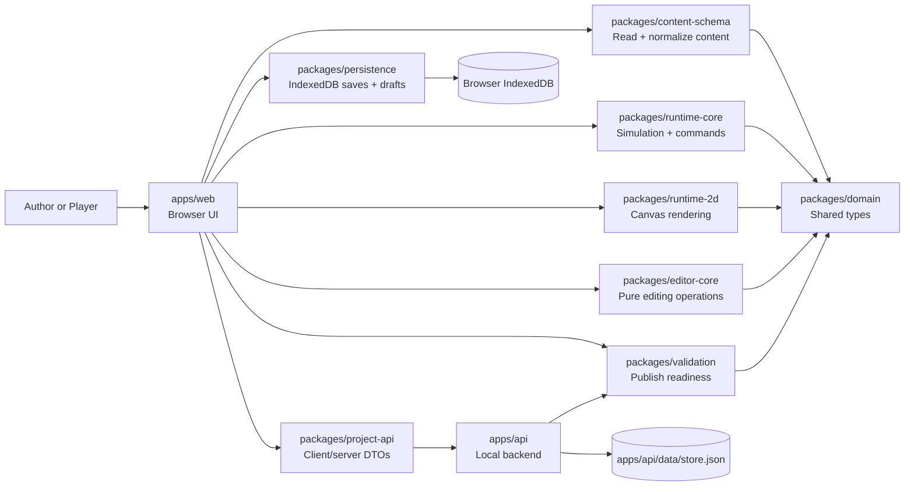

The architecture deliberately separates content, simulation, rendering, editing, persistence, and API concerns. That keeps the current 2D browser implementation flexible enough to support later phases such as richer graphics, additional renderers, real-time simulation, or more advanced AI without rewriting the content model from scratch.

## Package Responsibilities

| Area | Package or app | Responsibility |
| --- | --- | --- |
| Shared vocabulary | `packages/domain` | Defines IDs, adventure packages, maps, entities, triggers, dialogue, actions, and conditions. |
| Content ingestion | `packages/content-schema` | Reads raw authored content and normalizes it into an `AdventurePackage`. |
| Runtime simulation | `packages/runtime-core` | Owns player commands, state mutation, triggers, dialogue, enemy turns, snapshots, and engine events. |
| Runtime rendering | `packages/runtime-2d` | Draws runtime state to a canvas. It receives state; it does not decide game rules. |
| Editing rules | `packages/editor-core` | Provides pure functions such as `setTileAt`, `moveEntityInstance`, and metadata updates. |
| Validation | `packages/validation` | Checks whether a package is publishable and reports warnings/errors. |
| Local persistence | `packages/persistence` | Stores runtime saves and editor drafts in IndexedDB. |
| API contract | `packages/project-api` | Defines project/release DTOs and browser API client methods. |
| Browser app | `apps/web` | Wires DOM events to runtime/editor operations and updates UI panels. |
| Local backend | `apps/api` | Stores projects/releases, validates packages, and exposes local API endpoints. |

## Data Model Layers

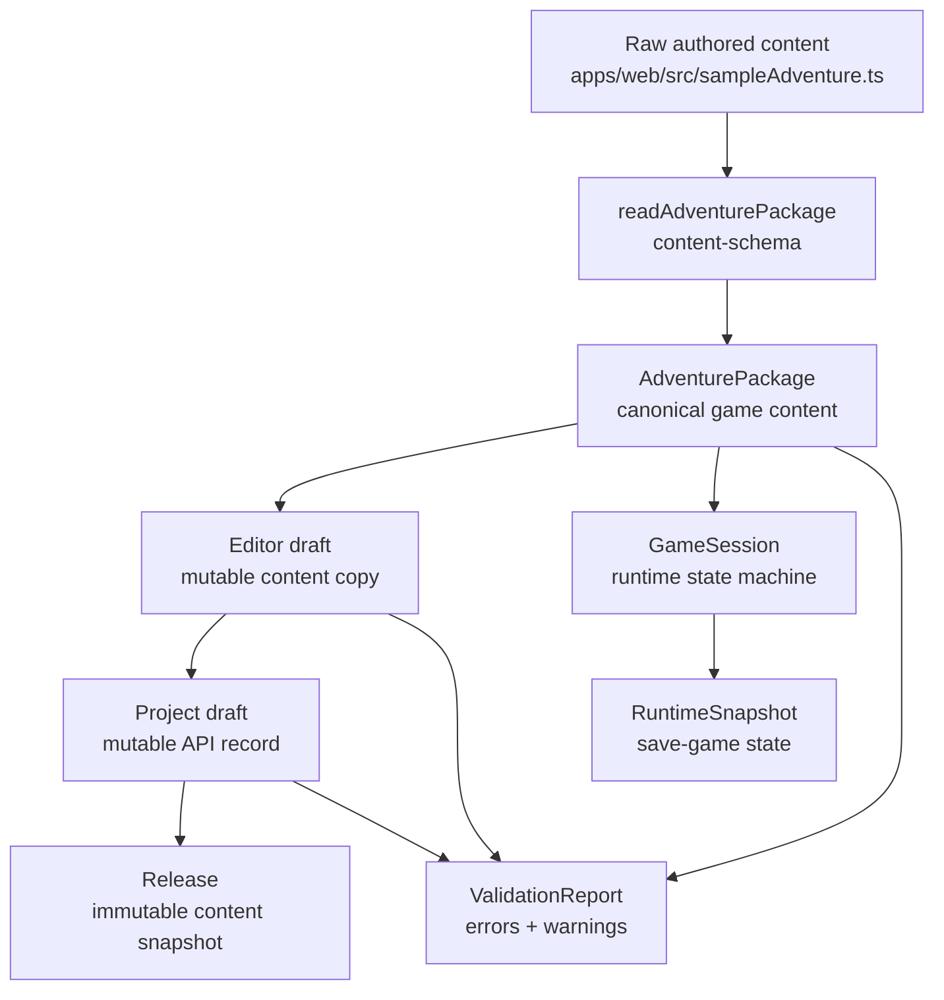

Important distinctions:

- Raw content is author-friendly data. In the sample, it lives in `apps/web/src/sampleAdventure.ts`.
- `readAdventurePackage(...)` turns raw content into a normalized `AdventurePackage`.
- A draft is mutable content used by the editor.
- A project draft is a mutable backend-side draft stored by `apps/api`.
- A release is an immutable content snapshot created from a valid project draft.
- A runtime save is not content. It is a `RuntimeSnapshot` that captures the state of a running session.

## Runtime Input-To-Rendering Overview

The runtime browser page is centered around one loop: input becomes a `PlayerCommand`, the command is dispatched into `runtime-core`, `runtime-core` returns new state plus events, and the browser redraws the canvas and side panels.

```mermaid
flowchart LR
    Input[Browser input\nkeyboard or button]
    Command[PlayerCommand\nmove / inspect / interact / etc]
    Dispatch[session.dispatch(command)]
    Engine[runtime-core\nmutates GameSessionState]
    Events[EngineResult\nstate + events]
    Panels[apps/web\nDOM panels + event log]
    Canvas[runtime-2d\ncanvas render]

    Input --> Command --> Dispatch --> Engine --> Events
    Events --> Panels
    Events --> Canvas
```

Primary runtime files:

- `apps/web/src/index.ts` owns the browser event listeners, save/load buttons, event log, side panels, and call to `renderer.render(...)`.
- `packages/runtime-core/src/index.ts` owns `PlayerCommand`, `GameSession`, `dispatch`, movement, inspection, triggers, dialogue, enemy turns, and snapshots.
- `packages/runtime-2d/src/index.ts` owns visual rendering of maps, entities, tile overrides, and the player marker.

## Use Case 1: Player Initiates A Move Command

This is the full path when the player presses an arrow key or `W`, `A`, `S`, or `D` in the browser.

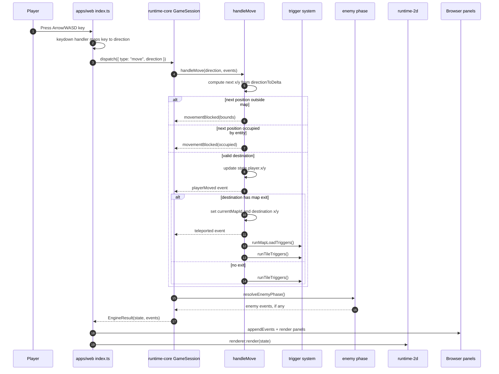

Detailed move flow:

1. `window.addEventListener("keydown", ...)` in `apps/web/src/index.ts` receives the key.
2. The browser ignores repeated keydown events with `if (event.repeat) return;`.
3. Arrow keys and `WASD` call `runCommand(() => session.dispatch({ type: "move", direction }))`.
4. `runCommand(...)` executes the dispatch callback, appends returned events to the event history, then calls `renderEverything(result.state)`.
5. `runtime-core.dispatch(...)` sees command type `move`, calls `handleMove(...)`, and marks `shouldResolveEnemyPhase = true`.
6. `handleMove(...)` calculates the destination with `directionToDelta(...)`.
7. If the destination is outside the current map, the engine emits `movementBlocked` with reason `bounds` and does not move the player.
8. If the destination contains an active entity, the engine emits `movementBlocked` with reason `occupied` and does not move the player.
9. If the destination is valid, the engine updates `state.player.x` and `state.player.y`, then emits `playerMoved`.
10. If the destination is an exit tile, the engine updates `state.currentMapId` and player coordinates, emits `teleported`, runs map-load triggers, and runs tile triggers at the arrival tile.
11. If the destination is not an exit, the engine only runs tile triggers for the new tile.
12. After movement handling, `dispatch(...)` runs the enemy phase because movement consumes a turn-like action.
13. The browser receives `EngineResult`, converts events to readable log lines with `describeEvent(...)`, and updates DOM panels in `renderEverything(...)`.
14. `CanvasGameRenderer.render(state)` redraws the map, tile overrides, entities, and player marker.

Current behavior note: blocked movement still marks `shouldResolveEnemyPhase = true` because `dispatch(...)` sets that flag for every `move` command before knowing whether the move succeeds. That means a blocked move can still let enemies act.

## Use Case 2: Player Initiates An Inspect Command

This is the full path when the player presses `Q` in the browser.

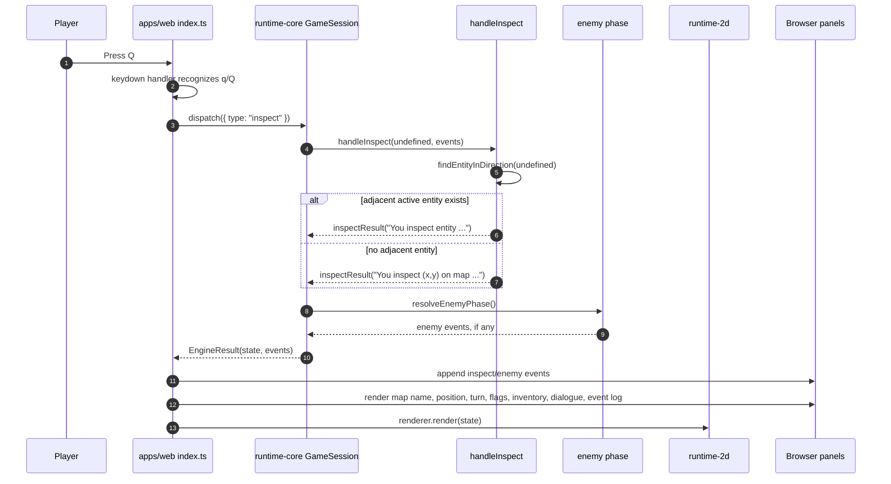

Detailed inspect flow:

1. `apps/web/src/index.ts` listens for `q` and `Q` in the same keydown handler as movement.
2. The browser calls `runCommand(() => session.dispatch({ type: "inspect" }))`.
3. `runtime-core.dispatch(...)` sees command type `inspect`, calls `handleInspect(...)`, and marks `shouldResolveEnemyPhase = true`.
4. `handleInspect(...)` calls `findEntityInDirection(direction)` with no direction because the browser currently sends no direction.
5. With no direction, `findEntityInDirection(...)` searches for the first active entity on the current map with Manhattan distance exactly `1` from the player.
6. If an adjacent entity exists, the engine emits `inspectResult` with a message like `You inspect entity 'entity_oracle'.`.
7. If no adjacent entity exists, the engine emits `inspectResult` describing the player's current coordinate and map id.
8. Inspect does not directly mutate player position, inventory, flags, tile overrides, dialogue, or map id.
9. After inspection, the enemy phase currently runs because inspect is treated as a turn-resolving action.
10. The browser logs the inspect result and any enemy events, then calls `renderEverything(...)`.
11. The renderer redraws from state. Often the visible canvas will not change unless an enemy moved during the enemy phase.

Current behavior note: because inspect currently advances the enemy phase, inspecting near a hostile creature may cause that creature to move or threaten. If later design calls for a free-look inspect action, the behavior can be changed in `dispatch(...)` by not setting `shouldResolveEnemyPhase = true` for inspect.

## Runtime Rendering Details

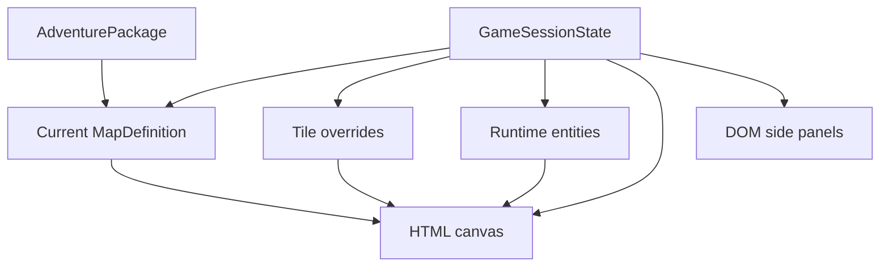

`renderEverything(state)` is the browser-side bridge between simulation and presentation. It calls `renderer.render(state)` for the canvas, then updates map name, player position, turn count, flags, inventory, dialogue overlay, and event log. This keeps the engine independent from HTML and canvas concerns.

## Editor Input-To-Draft Overview

The editor has a similar separation: browser UI collects intent, `editor-core` creates an updated package copy, validation reruns, and the browser updates the editor grid.

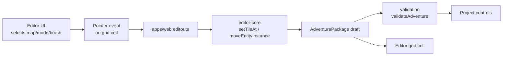

Primary editor files:

- `apps/web/src/editor.ts` owns browser controls, pointer events, selected brush state, validation display, project buttons, and grid rendering.
- `packages/editor-core/src/index.ts` owns pure editing operations such as cloning the package and changing a tile.
- `packages/validation/src/index.ts` owns local and server-side validation rules.
- `packages/persistence/src/index.ts` stores local drafts for save and playtest.

## Use Case 3: Designer Changes A Tile With The Editor Brush

This is the full path when a designer selects a tile type and paints a grid cell.

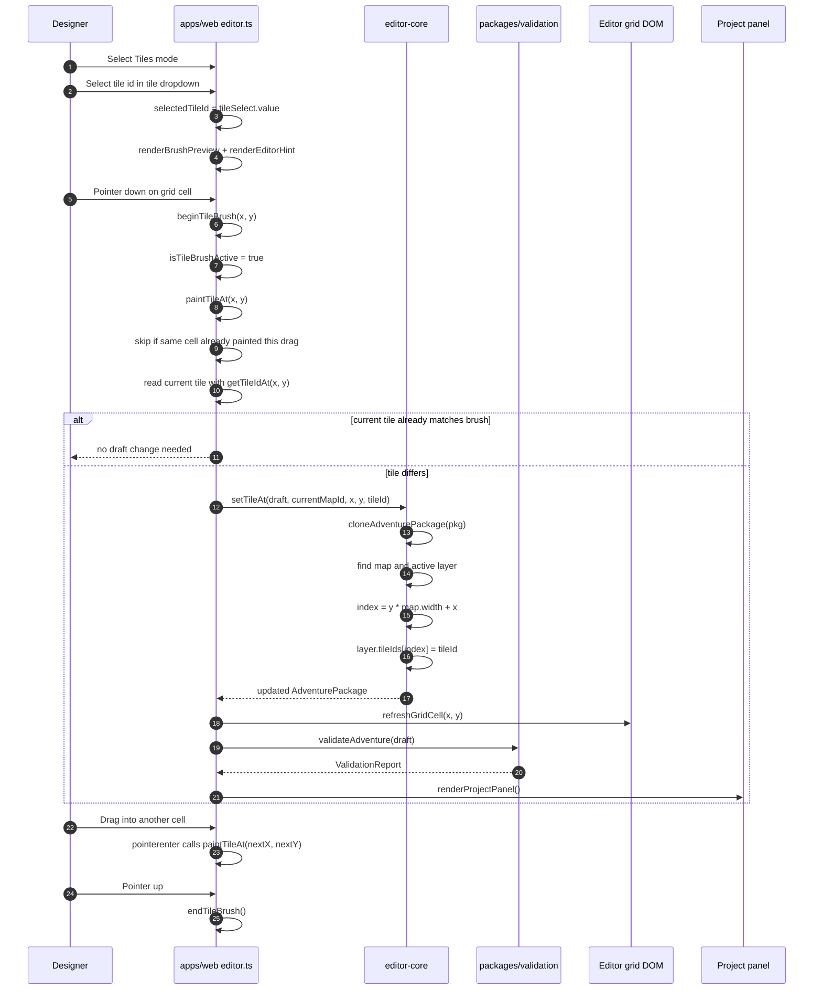

Detailed tile-edit flow:

1. The designer chooses `Tiles` mode in the editor mode dropdown.
2. `syncModeVisibility()` shows the tile picker and brush preview.
3. The designer chooses a tile in `tileSelect`.
4. `selectedTileId` is updated and the editor calls `renderBrushPreview()` and `renderEditorHint()`.
5. `renderGrid()` builds one button per map cell.
6. In tile mode, each cell receives a `pointerdown` handler and a `pointerenter` handler.
7. `pointerdown` calls `beginTileBrush(x, y)` for the clicked cell.
8. `beginTileBrush(...)` sets `isTileBrushActive = true`, resets `lastPaintedCellKey`, and calls `paintTileAt(x, y)`.
9. `paintTileAt(...)` exits early if the editor is not in tile mode.
10. `paintTileAt(...)` also exits early if this is the same cell already painted during the current drag.
11. The editor chooses the tile id from `selectedTileId`, falling back to the select value or `grass`.
12. The editor reads the current tile with `getTileIdAt(x, y)`.
13. If the current tile already matches the brush, no draft change is made.
14. If the tile differs, the editor calls `setTileAt(draft, currentMapId, x, y, tileId)` from `editor-core`.
15. `setTileAt(...)` clones the whole `AdventurePackage`, finds the map, selects the active layer, calculates `index = y * map.width + x`, writes `layer.tileIds[index] = tileId`, and returns the new package.
16. The browser replaces its `draft` variable with the updated package.
17. `refreshGridCell(x, y)` updates only the changed grid cell instead of rebuilding the whole grid.
18. `markValidationDirty()` clears the latest server validation report and calls `renderValidation()`.
19. `renderValidation()` runs `validateAdventure(draft)` locally and updates the validation list.
20. `renderProjectPanel()` enables or disables project/release buttons based on validation state.
21. While the pointer remains down, moving into another cell triggers `pointerenter`, which calls `paintTileAt(...)` again. This is what makes the tile picker behave like a brush instead of a one-shot selection.
22. `window.pointerup` calls `endTileBrush()`, which turns off painting and clears the last-painted-cell key.

Current behavior note: painting a tile changes the editor draft only. It does not automatically change the currently running game. To play the edited content, use `Playtest Draft`; the editor saves the draft to IndexedDB and opens the runtime page with a `?draft=...` query parameter.

## Editor-To-Playtest Flow

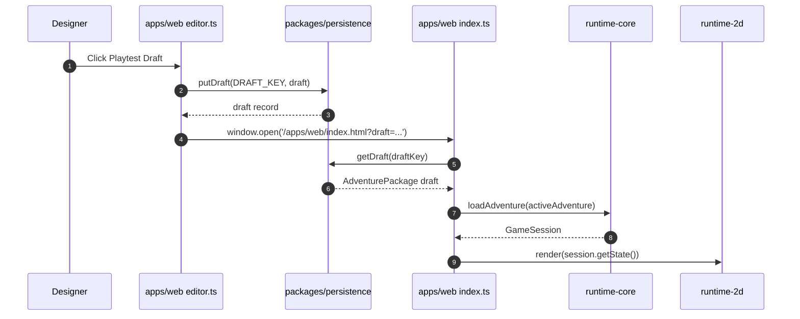

## Validation And Publishing Flow

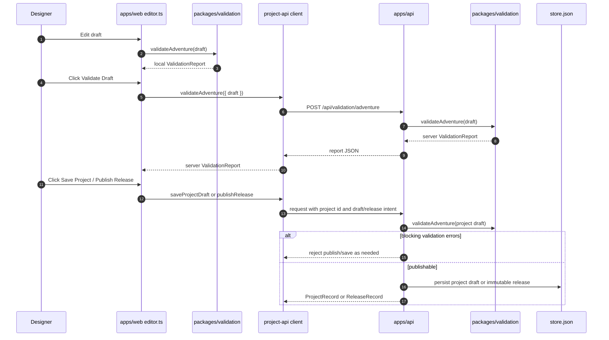

Validation currently checks categories such as:

- missing or unknown start map
- start position outside map bounds
- map region references that do not exist
- tile layer size mismatches
- wrong tile count for a layer
- exit source or destination out of bounds
- entity placements outside map bounds
- overlapping entities on one tile as a warning
- empty dialogue definitions
- duplicate dialogue node ids
- dialogue choices pointing to missing nodes
- trigger map locations that are missing or invalid
- conditions referencing missing items or quests
- actions referencing missing maps, items, tiles, or dialogues

## Save And Load Flow

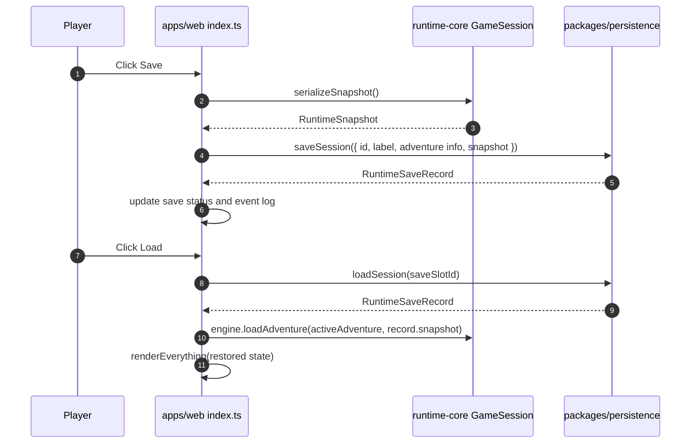

A save wraps the runtime's existing `RuntimeSnapshot`. That means persistence stores the same state model the engine already knows how to serialize and hydrate. The project does not maintain a second, competing save-game model.

## End-To-End Runtime Example: Move Onto A Trigger Tile

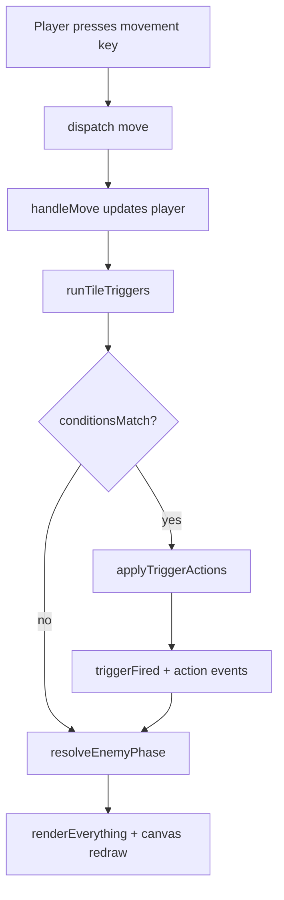

Example: when the player reaches the shrine altar in the sample adventure, the engine can run an `onEnterTile` trigger, grant an item, set flags, or change a tile. Those changes are represented as state changes and events, then the renderer redraws using the new state.

## End-To-End Editor Example: Change A Tile, Validate, Then Play

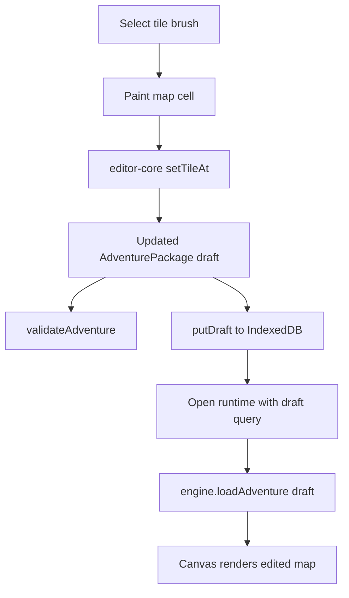

This flow is important because the editor and runtime share the same content representation. The editor does not produce a special editor-only format. It updates an `AdventurePackage`, validates that package, stores it as a draft, and the runtime can load that same package for playtesting.

## Current Design Constraints And Extension Points

The current design intentionally avoids locking the project into the current 2D implementation.

- A higher-resolution renderer can be introduced beside `runtime-2d` as long as it consumes `AdventurePackage` and `GameSessionState`.
- A 3D renderer could also consume the same state, though content would need richer spatial and asset metadata.
- Real-time play would likely require changing how `dispatch(...)`, turn advancement, and enemy phases are scheduled, but the command/state/event boundary is a good place to evolve that behavior.
- Richer enemy AI should live in `runtime-core` or a future AI package, not in `apps/web` or `runtime-2d`.
- More advanced editor creation tools should extend `editor-core` with pure operations first, then wire those operations into `apps/web/src/editor.ts`.
- Asset manifests should continue to describe assets by id and metadata, so renderers can choose how to resolve those ids without hardcoded visual assumptions.

## Recommended Reading Order

If you are trying to learn the codebase quickly, read in this order:

1. `docs/user-guide.md`
2. `docs/architecture.md`
3. `docs/system-reference.md`
4. `packages/domain/src/index.ts`
5. `packages/content-schema/src/index.ts`
6. `packages/runtime-core/src/index.ts`
7. `packages/runtime-2d/src/index.ts`
8. `packages/editor-core/src/index.ts`
9. `packages/validation/src/index.ts`
10. `apps/web/src/index.ts`
11. `apps/web/src/editor.ts`
12. `apps/api/src/index.ts`
