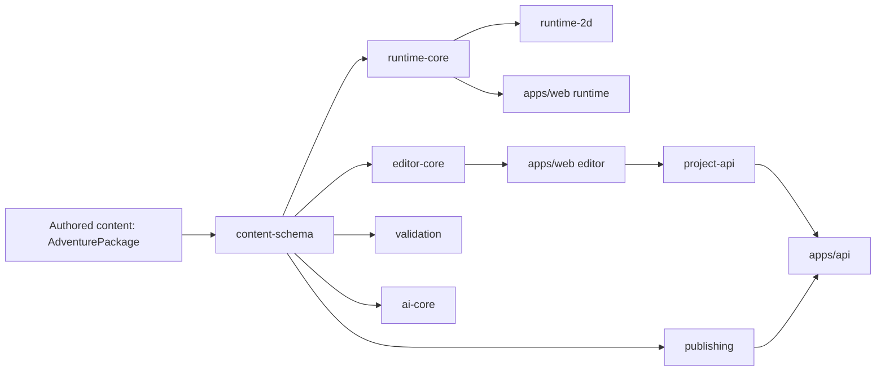

# ACS System Reference

This document explains the system from the outside in. It starts with what the application is, who it is for, and how the main domains fit together. It then moves gradually into data shape, package boundaries, runtime/editor behavior, publishing, and future AI integration. The goal is comprehension before implementation detail.

If a reader is brand new to the project, they should be able to read this document top to bottom and come away with clear answers to these questions:

- What is this application?
- What are its major parts?
- How do Play Mode and Edit Mode relate to one another?
- How do drafts, projects, releases, and exports differ?
- How does the AI-agnostic provider model work?
- What would I actually have to build to connect a new AI provider later?

## Table Of Contents

1. Purpose
2. Executive Summary
3. Product Model
4. Core Domains
5. Domain Boundaries
6. System Architecture
7. Data Model Hierarchy
8. Application Modes
9. End-To-End Workflows
10. Publishing In Detail
11. AI-Agnostic Integration In Detail
12. Runtime Behavior Model
13. Editor Behavior Model
14. Presentation And Skinning
15. Persistence And Storage
16. Validation And Quality Gates
17. Current Limitations
18. Future Roadmap Alignment
19. Subject Glossary
20. Technical Catalog
21. Diagrams Appendix
22. Change Log And Reference Maintenance

## Purpose

This System Reference is for:

- developers working in the codebase
- maintainers trying to keep architecture clean as milestones land
- advanced designers who want to understand what the editor and runtime are actually doing
- future integrators who may need to connect model providers, new renderers, or new distribution modes

This document is not trying to teach day-one usage. That is the User Guide’s job. Instead, this reference explains:

- how the system is assembled
- where responsibilities live
- how the important workflows behave
- what future work is expected to build on top of

The intended reading order is top-down. Early sections give the mental model. Later sections give the implementation map.

## Executive Summary

ACS is a browser-based adventure construction environment inspired by classic 1980s construction-set software, but designed with modern package boundaries and future extensibility in mind.

At a high level, the application has five major parts:

1. A shared authored-content model centered on `AdventurePackage`
2. A runtime engine that plays that content
3. A browser editor that creates and changes that content
4. A publishing layer that creates release-backed handoff artifacts
5. A future AI integration layer that is intentionally provider-agnostic and review-first

The most important architectural principle is separation:

- gameplay rules are separate from gameplay presentation
- editor behavior is separate from editor presentation
- authored content is separate from runtime state
- mutable draft state is separate from immutable release state
- AI provider details are separate from AI review and apply logic

That separation is what makes the longer roadmap possible without rewriting the core system every time a new feature arrives. It is what allows:

- multiple renderer families such as classic 8-bit, richer 2D, and later 3D
- editor skins such as WorldTree or other branded shells
- richer publishing modes and delivery paths
- AI-assisted authoring without locking the app to one model vendor
- future multiplayer and mobile shells

Current project position:

- Milestones `0` through `30` are complete
- Milestone `31` is active and complete through `31O`
- Milestones `32` through `40` are planned in the roadmap

## Product Model

### What The Application Is

The simplest way to understand ACS is this:

- it is a playable adventure runtime
- it is also a game-construction environment
- it is also a release and export system

Those three things share one content model instead of each inventing their own private data shape.

### Who The Application Is For

There are four main reader or user roles:

#### 1. Player

A player opens Play Mode and:

- moves through maps
- interacts with entities
- reads dialogue
- triggers quest progression
- saves and loads session state

#### 2. Designer

A designer opens Edit Mode and:

- creates or changes authored content
- paints maps
- places entities
- edits libraries and logic
- validates the adventure
- playtests the draft
- publishes releases
- exports handoff packages

#### 3. Reviewer

A reviewer may not want to edit or play deeply. They may instead want to:

- inspect release metadata
- compare export modes
- review artifact integrity
- understand what a release contains

#### 4. Future Integrator

A future integrator may want to:

- connect an AI provider
- add a renderer family
- add a distribution shell
- build tooling around projects or releases

This reference is especially important for that role because they need to know what must remain stable and what is intentionally replaceable.

### Main User-Visible Modes

The application currently presents three important visible modes:

#### Play Mode

The runtime page. It loads a playable session and renders it.

#### Edit Mode

The browser editor. It changes authored content and draft state.

#### Test & Publish

This is inside the editor, but it is important enough to call out separately. It is where validation, release creation, export preview, and artifact handoff happen.

### Main Artifacts

The application uses a set of related artifacts that are easy to confuse at first, so it is worth being explicit:

#### Draft

Mutable adventure state being edited right now.

#### Project

A mutable backend-backed draft record. This is still editable.

#### Release

An immutable published snapshot of a project. This is the stable source for shareable outputs.

#### Forkable Package

An editable handoff built from a release. This is for another designer.

#### Standalone Package

A play-only handoff built from a release. This is for a player or distributor.

#### Review Package

A reviewer-facing release summary bundle.

#### AI Review Artifacts

Portable reviewed AI handoff records used in the future AI flow before anything is imported or applied.

## Core Domains

The system becomes much easier to understand once its major domains are separated mentally.

### Adventure Domain

The adventure domain is the authored content of the game world. This is what designers create.

It includes:

- adventure metadata
- world structure and map organization
- maps
- regions or zones
- tiles and tile definitions
- entity definitions
- entity instances placed on maps
- items
- skills, traits, spells, and flags
- dialogue
- quests and objectives
- media and sound cues
- visual and presentation records
- starter-library and custom-library content

This domain answers the question:

> What exists in the authored world?

### Runtime Domain

The runtime domain is the active playable state and the rules that operate on it.

It includes:

- session state
- player position
- inventory state
- flags and quest state
- active dialogue state
- command handling
- trigger execution
- enemy cadence and behavior
- runtime events

This domain answers the question:

> What is happening right now while the game is being played?

### Editor Domain

The editor domain is the authoring workflow layer.

It includes:

- draft mutation helpers
- workspace behavior
- focused editing flows
- diagnostics
- validation presentation
- project and release orchestration

This domain answers the question:

> How does the designer safely change the authored world?

### Publishing Domain

The publishing domain turns immutable releases into handoff artifacts.

It includes:

- forkable exports
- standalone exports
- handoff summaries
- artifact integrity reports
- reviewer packages

This domain answers the question:

> How do we turn a release into something that another person can edit, play, or review?

### AI Domain

The AI domain is the future model-integration boundary.

It includes:

- provider manifests
- request envelopes
- structured proposals
- review reports
- change summaries
- application plans
- session records
- review/export/import handoff layers

This domain answers the question:

> How can AI assist the product without being allowed to bypass structure, validation, or human review?

## Domain Boundaries

The repo is already split into packages so responsibilities can stay separate as the product grows.

| Package / App | Responsibility |
| --- | --- |
| `packages/domain` | Shared TypeScript model for authored content objects and related records |
| `packages/content-schema` | Package reading, defaults, normalization, and compatibility cleanup |
| `packages/runtime-core` | Renderer-agnostic gameplay rules, state, commands, triggers, and events |
| `packages/runtime-2d` | Canvas-based gameplay presentation over runtime snapshots |
| `packages/editor-core` | Pure authoring mutations and editor-side report builders |
| `packages/validation` | Shared structural and reference validation |
| `packages/persistence` | Runtime snapshot persistence wrappers |
| `packages/project-api` | Shared browser-facing project/release DTOs and client contracts |
| `packages/publishing` | Release-backed export and handoff artifact generation |
| `packages/default-content` | Built-in starter-library source metadata and helpers |
| `packages/ai-core` | AI provider-agnostic request/review/apply/import/export contracts |
| `apps/web` | Browser runtime UI and browser editor UI |
| `apps/api` | Local project/release API and standalone bundle assembly |

### Boundary Rules

These are the rules that keep the system maintainable:

- `runtime-core` must not depend on DOM or browser presentation
- `editor-core` must not depend on browser layout
- `publishing` must not depend on browser-only editor state
- `ai-core` must not contain vendor-specific SDK logic
- `apps/web` may orchestrate behavior, but should not become the source of truth for game rules or structured handoff logic

## System Architecture

At a high level, the system works like this:



### What This Means In Practice

1. Authored content is read and normalized through `content-schema`
2. The runtime engine consumes normalized content and produces runtime state and events
3. The renderer and browser runtime UI present that state
4. The editor changes authored content through browser orchestration plus `editor-core`
5. Validation is shared rather than duplicated per UI
6. Publishing starts from releases, not from arbitrary browser draft state
7. Future AI work should hand structured proposals into review/apply flows instead of calling editor internals directly

## Data Model Hierarchy

There are three distinctions that matter most when reading the code or the docs.

### 1. Authored Data Vs Runtime State

These are not the same thing.

#### Authored Data

This is long-lived content the designer creates:

- maps
- definitions
- dialogue
- quests
- assets
- triggers

This lives primarily inside `AdventurePackage`.

#### Runtime State

This is live state created when the game is being played:

- current map
- player position
- inventory quantities
- active flags
- quest progress
- active dialogue node
- event history

This lives in runtime session state and snapshots.

The same authored adventure can produce many different runtime sessions.

### 2. Definitions Vs Instances

A second critical distinction is reusable definitions versus placed or live instances.

Example:

- an entity definition describes the reusable idea of a thing
- an entity instance is the copy placed on a specific map coordinate

That split is important because it allows:

- one definition to be reused multiple times
- instance-specific placement data
- optional instance display names
- future instance-local behavior overrides

### 3. Mutable Vs Immutable Artifacts

This distinction matters most in publishing.

#### Mutable

- local drafts
- backend projects

#### Immutable

- releases
- release-backed export artifacts

This is what keeps release handoffs reproducible and reviewable.

## Application Modes

### Play Mode

Play Mode loads:

- the built-in sample adventure
- a local draft playtest
- or a published release

Then it:

- creates a runtime session
- accepts player commands
- advances runtime state
- renders the result
- allows save/load/reset

### Edit Mode

Edit Mode loads a draft and lets the designer:

- edit adventure metadata
- manage world structure and maps
- paint tiles
- place entities
- edit library objects
- edit logic and quests
- validate the draft
- playtest the draft
- manage projects and releases

### Test & Publish

This is the release-preparation area within the editor. It is where the designer:

- runs validation
- reads diagnostics
- previews release handoffs
- creates projects
- saves projects
- publishes releases
- exports reviewable packages

## End-To-End Workflows

### Runtime Command Flow

```text
Player input
  -> apps/web runtime handler
  -> runtime-core command dispatch
  -> runtime state mutation and engine events
  -> browser UI updates and event log
  -> runtime-2d render from the latest snapshot
```

### Editor Mutation Flow

```text
Designer action in editor
  -> apps/web editor handler
  -> editor-core pure mutation helper
  -> updated AdventurePackage draft
  -> shared validation and diagnostics
  -> rerender current editor workspace
```

### Project And Release Flow

```text
Mutable draft
  -> validate draft
  -> create/save mutable project
  -> publish immutable release
  -> preview and export release-backed artifacts
```

## Publishing In Detail

Publishing deserves its own section because it is one of the most important product workflows and one of the easiest to misunderstand.

### Why Publishing Starts From Releases

The publishing system is intentionally release-backed.

That means:

- the designer edits a draft
- the draft can be saved into a mutable project
- an immutable release is published from that project
- all shareable exports are derived from that immutable release

This matters because it prevents confusion between:

- unstable authoring state
- stable release state
- editable handoff artifacts
- play-only handoff artifacts

### Draft Vs Project Vs Release

#### Draft

The current working copy. It may live only in browser storage.

#### Project

A backend-backed mutable editable record. This is still under active development.

#### Release

A frozen published snapshot. This is the stable source for exports, previews, and external review.

### Export Types

#### Forkable Package

The editable handoff.

Use it when the recipient should:

- import the work into the editor
- continue building it
- remix it

It preserves authored content and handoff metadata.

#### Standalone Package

The play-only handoff.

Use it when the recipient should:

- play the game
- host the game
- review the runtime package as a player-facing build

It is intentionally a static web bundle instead of a second runtime model.

#### Review Package

The reviewer-facing handoff.

Use it when someone needs to:

- inspect release metadata
- compare package integrity
- review the release structure without importing or playing deeply

### Delivery Model For Standalone Packages

The current and planned delivery modes are:

- manual static hosting
- bundled local launcher
- hosted web delivery
- future desktop wrappers

The important architecture decision is that these are delivery shells over the same exported static runtime bundle.

## AI-Agnostic Integration In Detail

This section is intentionally much more detailed than the rest of the document because the AI foundation is one of the least obvious parts of the system.

### The Problem The AI Layer Is Solving

If AI support is added carelessly, the application gets locked to:

- one vendor
- one SDK
- one response format
- one UI flow

Worse, AI code can end up bypassing:

- structured content rules
- human review
- release discipline
- editor mutation boundaries

The AI-agnostic layer exists to prevent that.

### The Core Principle

AI should be allowed to propose structured changes.

AI should not be allowed to directly mutate the authored world.

That means the stable system should not be:

- “call provider SDK and write directly into editor state”

Instead, it should be:

- build a normalized request
- receive a structured proposal
- validate the proposal
- review the proposal
- summarize its impact
- decide whether it is acceptable
- only then apply it through controlled authoring flows

### What `@acs/ai-core` Actually Is

`packages/ai-core` is not a live model client.

It is also not an agent loop.

It is a stable contract and review package that defines:

- what an AI provider looks like to the app
- what a generation request looks like
- what a proposal looks like
- what a review report looks like
- what an apply plan looks like
- what portable handoff artifacts look like

Think of it as the application’s AI language and review protocol.

### What `@acs/ai-core` Is Not

It is not:

- OpenAI-specific
- Anthropic-specific
- local-model-specific
- UI-specific
- browser-specific
- backend-route-specific

That is deliberate. The point is that the same review lifecycle should survive a provider change.

### The AI Lifecycle

The intended future lifecycle is:

1. Choose a provider
2. Build a normalized request
3. Send that request through a provider-specific adapter
4. Receive a provider response
5. Convert that response into a stable proposal envelope
6. Validate the request and the proposal
7. Build review artifacts
8. Have a human accept or reject the proposal
9. If accepted, build an apply plan
10. Only then pass the reviewed result into controlled editor-side mutation flow

### Main AI-Core Types And What They Mean

#### `AiProviderManifest`

This is the stable identity card for a provider.

It should answer questions like:

- what is this provider called?
- what capabilities does it offer?
- what kind of output does it claim it can produce?
- what constraints or warnings does the app need to know?

This lets the rest of the app refer to a provider generically.

#### `AdventureGenerationRequest`

This is the normalized request envelope the application wants to send.

It is not a raw vendor prompt blob.

It should carry things like:

- provider identity
- the authoring goal
- the requested task
- any limits
- any context the provider needs

Its job is to express the app’s intent in application terms before any vendor-specific translation happens.

#### `AiAdventureProposal`

This is the structured proposal envelope returned for review.

It is not supposed to be “whatever the provider happened to return.”

Instead, it is the provider response translated back into a stable application-level proposal shape. That means the rest of the app can review proposals consistently without caring which vendor produced them.

#### `AdventureGenerationPlan`

This is the normalized step plan for the future UI or API flow.

Its purpose is to make the review-first lifecycle explicit. Instead of the browser inventing its own step logic, the application can point at one shared plan shape that says:

- gather context
- build request
- obtain proposal
- validate
- review
- accept/reject
- prepare apply

#### `AiProposalReviewReport`

This is the shared readiness report for a proposal.

It combines:

- request validation
- proposal validation
- provider warnings
- readiness status
- next-step guidance

Its job is to answer:

- is this proposal structurally okay?
- is it blocked?
- is it reviewable?
- what should the human do next?

#### `AiGenerationSessionRecord`

This bundles the request, plan, proposal, and review state into one portable session record.

Its job is to prevent later UI or persistence layers from keeping those pieces in unrelated browser-only state.

#### `AiProposalChangeSummary`

This explains what the proposal would change.

Its purpose is practical: before a human accepts a proposal, they should be able to see the impact without diffing a whole adventure package manually.

#### `AiProposalApplicationPlan`

This answers a different question:

> If the proposal is accepted, can it be applied yet, and what would that affect?

This is the bridge between review and controlled mutation.

### Review Packages, Bundles, Archives, And Import Dossiers

Later Milestone 31 slices add portable handoff layers on top of the core review objects.

The point of these is simple:

- the app should be able to store, export, review, re-import, or audit reviewed AI work without reconstructing everything from ephemeral UI state

That is why there are now typed layers for:

- review packages
- file bundles
- archives
- handoff integrity reports
- import plans
- import reports
- import dossiers
- import dossier integrity reports

These are not just extra wrappers for fun. They are the transport and audit layers that keep reviewed AI work portable and inspectable.

### How A Provider Adapter Should Work

This is the part a future implementer needs most clearly.

A provider adapter should live outside `ai-core`.

Its job should be:

1. Accept a stable `AdventureGenerationRequest`
2. Translate that request into the vendor’s API shape
3. Call the vendor SDK or HTTP API
4. Receive the vendor response
5. Translate that response into a stable `AiAdventureProposal`
6. Hand that proposal back to the shared review flow

In other words:

- `ai-core` defines the language the app speaks internally
- the provider adapter is a translator between the app’s language and the vendor’s language

### What A Provider Adapter Must Not Do

A provider adapter should not:

- mutate editor state directly
- bypass validation
- bypass review reports
- decide by itself that a proposal is acceptable
- call low-level authoring mutations without going through the reviewed apply path

### How To Implement A New Provider Later

If someone wanted to wire in a new provider, the expected steps would be:

1. Define a new `AiProviderManifest`
2. Add that provider to the provider registry
3. Write an adapter that converts:
   - `AdventureGenerationRequest` -> vendor request
   - vendor response -> `AiAdventureProposal`
4. Pass the proposal through:
   - request validation
   - proposal validation
   - review report creation
   - change summary creation
   - application planning
5. Expose that reviewed lifecycle in UI or API

The key point is that the provider-specific code is mostly just translation and transport. The review semantics stay shared.

The first live-provider rollout should do this with one complete adapter end to end rather than several partial adapters at once. The goal is to prove that a real model can be configured, called, reviewed, and applied through the same lifecycle the package-level contracts already define.

### How To Switch From One AI Model Or Vendor To Another

This is one of the main reasons the architecture exists.

Switching providers should not require rewriting:

- the editor
- the runtime
- the content model
- the review lifecycle

What should change:

- provider manifest choice
- provider adapter implementation
- model-specific limits and warnings

What should stay stable:

- generation request shape
- proposal shape
- review report shape
- session record shape
- change summary shape
- application plan shape
- review/export/import handoff layers
- human review requirement

That is what it means for the AI layer to be provider-agnostic.

### What Is Still Missing Today

Right now the AI layer is foundational, not end-user complete.

What exists:

- the shared contracts and portable review layers

What does not exist yet:

- end-user AI buttons in the editor
- live provider adapters
- vendor credential management
- actual request execution UI
- actual reviewed-apply UI

So the right way to read the current AI system is:

> the seam is built; the concrete provider connections and user-facing workflows come later

## Runtime Behavior Model

The runtime is responsible for gameplay meaning, not presentation chrome.

Core responsibilities include:

- movement
- interaction
- inspection
- dialogue state
- quest progression
- trigger execution
- enemy cadence
- runtime event emission

Current behavior is still mostly player-centered. Future actor-capable action work is planned so NPCs, AI-driven actors, and multiplayer participants can use the same validated action pathways instead of bypassing runtime rules.

Large-map presentation is also still simpler than the final target. Oversized maps are allowed in authored content, but true player-facing map-window scrolling is future presentation work. World coordinates should remain in shared runtime state while viewport behavior remains a presentation concern.

## Editor Behavior Model

The editor is responsible for authoring workflows, not core game rules.

Important editor rules:

- current workspace should drive what controls are visible
- mutations should go through `editor-core` where feasible
- validation should use shared package rules
- diagnostics should summarize authoring quality without replacing validation
- the same draft model should survive future editor skins

The long-term goal is an editor that can be reskinned or reorganized visually without forking authoring behavior.

## Presentation And Skinning

Skinning is a future architectural feature, not just a styling exercise.

### Gameplay Presentation

- `runtime-core` owns gameplay meaning
- `runtime-2d` and later renderer families own visual presentation

This is what makes classic, richer 2D, and later 3D presentations possible over the same rules.

The same separation should be used for large-map scrolling:

- the engine should continue to think in map coordinates
- renderers should decide how to frame large maps

That means classic mode, HD 2D, and later 3D should be free to choose different viewport behavior without changing movement or traversal rules.

### Editor Presentation

- shared draft state should remain stable
- validation and mutation helpers should remain stable
- future WorldTree or branded shells should sit over those same contracts

The live UI surface registry is tracked in:

- `docs/ux-skinning-inventory.md`
- `docs/ux-skinning-inventory.json`

## Persistence And Storage

The application currently uses three important storage layers.

### Browser Storage

Used for:

- runtime saves
- local drafts
- remembered active project id

### Local API Storage

Used for:

- mutable projects
- immutable releases

The current local backing store lives in `apps/api/data/store.json`.

### Export Artifacts

Used for:

- forkable designer handoffs
- standalone player handoffs
- reviewer handoffs
- future AI review/import handoffs

## Validation And Quality Gates

Quality is treated as a layered gate, not one simple command.

Important commands:

- `npm run quality`
- `npm test`
- `npm run docs:validate`

Together these cover:

- complexity
- docs validation
- typecheck
- unit tests
- editor UI smoke
- runtime UI E2E
- playtest smoke

Documentation quality is also part of milestone quality:

- PDFs must be regenerated when guide/reference sources change
- tables of contents must be visible in source guide/reference pages
- screenshots must be current and task-specific
- tutorial screenshots must be step-accurate

## Current Limitations

Important current gaps include:

- full CRUD coverage is still incomplete across all object classes
- editor information architecture cleanup is still future work
- richer player profile and front-end state presentation are still future work
- no true runtime map-window scrolling yet for oversized maps
- starter-library and graphics completion is still future work
- no cloud or account system yet
- no multiplayer yet
- no user-facing AI authoring workflow yet

## Future Roadmap Alignment

The roadmap currently places major future work like this:

- `32`: AI-assisted adventure generation, beginning with one real provider adapter, provider configuration, model selection, request submission, and reviewed proposal preview inside the application
- `33`: optional AI-driven NPC behavior and shared actor-capable runtime growth
- `34`: multiplayer
- `35`: mobile play-only shell
- `36`: editor completion and editor-skinning separation
- `37`: player front end and runtime-skinning separation, including runtime map-window scrolling
- `38`: renderer family choice, including renderer-family viewport rules for large maps
- `39`: starter libraries and graphics completion
- `40`: WorldTree naming and compatibility migration

## Subject Glossary

### Product Terms

- `Play Mode`: the playable runtime
- `Edit Mode`: the authoring environment
- `Test & Publish`: the release and export area inside the editor

### Authoring Terms

- `AdventurePackage`: the top-level authored content object
- `Draft`: mutable editor state
- `Project`: mutable backend-backed editable record
- `Release`: immutable published snapshot

### Runtime Terms

- `RuntimeSnapshot`: serializable runtime state
- `GameSession`: runtime orchestration object
- `EngineEvent`: runtime event emitted during play

### Publishing Terms

- `Forkable package`: editable release-backed handoff
- `Standalone package`: play-only release-backed handoff
- `Artifact integrity report`: parity check across release handoffs

### AI Terms

- `Provider manifest`: provider identity and capability description
- `Proposal`: structured AI-generated content candidate
- `Review report`: normalized readiness and issue summary
- `Application plan`: safe-apply readiness summary
- `Import dossier`: reviewed AI handoff import package

## Technical Catalog

This is the short lower-level map of important files and modules.

### Important Apps

- `apps/web/src/index.ts`: browser runtime orchestration
- `apps/web/src/editor.ts`: browser editor orchestration
- `apps/api/src/index.ts`: local project/release API
- `apps/api/src/standalone-bundle.ts`: standalone bundle assembly

### Important Packages

- `packages/runtime-core/src/index.ts`
- `packages/runtime-core/src/game-session.ts`
- `packages/editor-core/src/index.ts`
- `packages/validation/src/index.ts`
- `packages/publishing/src/index.ts`
- `packages/ai-core/src/index.ts`

### Important Companion Documents

- `docs/roadmap.html`
- `docs/user-guide.md`
- `docs/architecture.md`
- `docs/testing-strategy.md`
- `docs/llm-project-context.json`
- `docs/ux-skinning-inventory.md`

## Diagrams Appendix

Recommended long-term diagram set for this reference:

- package boundary diagram
- runtime command flow diagram
- editor mutation flow diagram
- publishing flow diagram
- AI review lifecycle diagram
- skinning separation diagram

## Change Log And Reference Maintenance

This reference should be updated whenever accepted planning or implementation changes alter:

- major system flows
- package responsibilities
- publishing behavior
- AI integration behavior
- skinning boundaries
- documentation standards

Maintenance rule from this point forward:

- the System Reference should stay readable top-down
- it should introduce concepts before diving into file-level detail
- milestone closeout should update roadmap, reference, guide, and AI-readable context together where appropriate
