# ACS User Guide

## What This Application Currently Includes

The current Milestone 25 project gives you three working pieces plus an authoring diagnostics and playtest-smoke workflow:

- `apps/web/index.html`: the playable runtime
- `apps/web/editor.html`: the browser-based editor
- `apps/api/dist/index.js`: the local API for projects, validation, and published releases

The runtime and editor both use local browser storage:

- game saves are stored in IndexedDB
- local editor drafts are stored in IndexedDB
- the editor also remembers the active backend project id in browser local storage


## Starting The Application

Build the workspace if needed, then start both local servers from the repo root.

### Web Server

```powershell
node .\apps\web\server.mjs
```

Default URL:

```text
http://localhost:4173/
```

Common alternate URL in this environment:

```text
http://localhost:4317/
```

### API Server

```powershell
node .\apps\api\dist\index.js
```

Local API check:

```text
http://localhost:4318/api/session
```

### Editor URL

```text
http://localhost:4317/apps/web/editor.html
```

## Playing The Game

Milestone 24 defaults to Classic ACS visual mode. This is a presentation mode that draws the same engine state inside a vintage-inspired game panel with a map viewport, right-side status rail, and bottom message band. The classic panel intentionally uses a larger modern play window rather than the original 8-bit pixel dimensions, while preserving crisp retro styling. The classic renderer now uses tile definitions and the adventure's classic-acs visual manifest to choose tile and entity sprite styles, so map data remains logical while presentation can evolve. Use the Visual Mode dropdown to switch between Classic ACS and Debug Grid at any time.

The runtime can load one of three sources:

- the built-in sample adventure
- a local draft playtest
- a published release loaded with `?release=<id>`

The current sample adventure goal is:

1. Speak to the Oracle.
2. Enter the shrine.
3. Claim the Solar Seal.
4. Return to the Oracle.

### Runtime Controls

- `W`, `A`, `S`, `D` or arrow keys: move
- `E`: interact with an adjacent entity
- `Q`: inspect the current tile or an adjacent entity
- Enter, Space, or E: advance dialogue
- Arrow keys: scroll longer dialogue while Classic ACS dialogue is active
- `Save`: store the current session locally
- `Visual Mode`: switch between the classic ACS-inspired presentation and the debug grid renderer
- `Load`: restore the most recent local save for the current source
- `Reset`: restart the current session from its start state

### Turn-Based Enemy Timing

The runtime now preserves the classic turn-based feel more deliberately. Successful player actions advance the turn count, but blocked movement does not give enemies a free action. Enemy behavior can define a `turnInterval`; the sample Shrine Wolf acts every third successful player turn, which gives you room to maneuver instead of having the wolf stick to every step.

### Runtime Panels

The play page shows:

- the map canvas
- the current map name
- the player position
- the session source panel
- the objective panel
- save/load/reset controls
- state details such as turn count, flags, and inventory
- the event log
- the Classic ACS bottom message band, or the Debug Grid dialogue panel, when a conversation is active

## Saving And Loading Progress

The runtime uses separate local save slots for the sample adventure, draft playtests, and published releases.

Examples:

- built-in sample: `adv_milestone3:latest`
- local draft playtest: `<adventure id>:draft-playtest`
- published release: `<adventure id>:release:<release id>`

### Save

`Save` stores the current `RuntimeSnapshot` in browser IndexedDB.

### Load

`Load` restores the most recent saved snapshot for the current source. The runtime starts fresh from the adventure start state; it does not automatically restore a save on page load.

### Reset

`Reset` restarts the live session only.

Important:

- `Reset` does not erase the saved snapshot
- `Load` can still bring that snapshot back afterward

## Using The Editor

Open the editor at:

```text
http://localhost:4317/apps/web/editor.html
```


The current editor supports:

- editing the adventure title and description
- switching between maps in the draft
- painting tiles on the current map with a persistent brush
- moving existing entity instances on the current map
- adding new entity instances from reusable entity definitions
- respecting singleton-vs-multiple placement rules for creatures and NPCs
- editing existing dialogue text records
- editing existing structured trigger records for conditions and actions
- editing current-map structure metadata and creating new blank maps
- editing reusable tile definitions with passability, interaction hints, tags, and classic sprite mappings
- creating and editing reusable quest definitions with stages, rewards, and source references
- reviewing the shared validation summary for the current draft
- running `Validate Draft` against the local API
- saving a local draft
- creating a backend project from the draft
- saving the draft to the backend project
- publishing a release from the project
- opening the latest published release
- launching a draft playtest in the runtime


### Organized Edit Game Screen

The editor is now organized around the way game information relates:

- `Edit Flow` navigation moves through Adventure, World Atlas, Map Workspace, Libraries, Logic, and Test & Publish.
- `Adventure Setup` contains game-wide title and description metadata.
- `World Atlas` contains region/map thinking: selected map, map category, region assignment, and blank-map creation.
- `Map Workspace` contains the grid-centered work for terrain tiles and entity instances on the selected map.
- `Dependencies` shows the selected map's relationship checklist: region, terrain, population, logic, and exits.
- `Libraries` contains reusable definitions and dialogue records that maps, entities, and triggers can reference.
- `Logic & Quests` contains trigger editing, shaped around `When / If / Then` even while conditions/actions are still edited as JSON.
- `Test & Publish` contains validation, project saving, publishing, and release opening.

This organization is meant to keep the hierarchy visible: Adventure -> Regions -> Maps -> Tiles / Entities / Triggers, with reusable libraries and logic references shown beside the map workspace.
### Editor Buttons

At the top of the editor page:

- `Back To Play`: opens the standard runtime page
- `Save Draft`: stores the current draft locally in IndexedDB
- `Reset Draft`: restores the built-in sample adventure and removes the saved local draft
- `Playtest Draft`: saves the current draft locally and opens it in the runtime

### Editor Toolbar

In the Map Workspace:

- `World Atlas`: choose which map is being edited because maps belong to the region/adventure hierarchy
- `Layer Mode`: choose `Terrain Tiles` or `Entity Instances`
- `Tile`: active only in tile mode
- `Move Entity`: active only in entity mode
- Add Definition: active only in entity mode
- Place New: switches entity mode into new-instance placement
- Active Brush: shows the currently loaded tile brush or entity placement target

### Tile Editing

To paint tiles:

1. Set `Layer Mode` to `Terrain Tiles`.
2. Pick a tile id from the `Tile` dropdown.
3. Check the `Active Brush` preview to confirm the selected tile.
4. Click a cell in the grid to paint a single tile, or click and drag to paint across multiple cells.

The selected tile stays loaded like a brush until you choose a different tile.

### Tile Definition Editing

Tiles are now library objects, not just visual strings in a map layer. In `Libraries`, choose `Tiles` from `Library Type` to edit reusable terrain definitions.

Tile definitions currently include:

- `Name`: the designer-facing label shown in editor lists
- `Passability`: `passable`, `blocked`, or `conditional`
- `Description`: what the terrain represents
- `Interaction Hint`: short text that can guide inspection or future interaction UI
- `Tags`: classification labels such as `terrain`, `barrier`, `relic`, `water`, or `sci-fi`
- `Classic Sprite`: the renderer-neutral classic sprite id used by the Classic ACS visual mode

Why this matters:

- A map can paint `water`, `shrub`, `stone`, `altar`, or a new `force_field` tile by id.
- Runtime-core can now consult the tile definition to decide whether terrain blocks movement.
- Runtime-2d can use the tile definition's classic sprite id without hardcoding that every visual style must draw the tile the same way.
- Future visual styles such as high-resolution 2D or 3D can map the same tile definition to different art.


### Quest Definition Editing

Milestone 23 makes quests first-class library objects instead of hardcoded objective text. In `Libraries`, choose `Quests` from `Library Type` to edit objective chains.


Quest definitions currently include:

- `Name`: the player/designer-facing quest title
- `Summary`: the durable premise shown beside the current objective
- `Objective`: a selectable objective object with its own stable id, title, kind, description, and optional target map or target item
- `Objective Kind`: a focused classification such as `story`, `travel`, `collect`, `return`, `survive`, or `custom`
- `Reward`: a selectable reward object with its own stable id, kind, label, and optional item reference
- `Reward Kind`: a focused classification such as `story`, `item`, `flag`, or `custom`
- `Source References`: notes about inspiration, myth, genre pack, or design source material
- `Category`: reusable organization through the same library category system used by other game objects

Why this matters:

- The Objective panel now reads quest data and runtime quest state instead of hardcoded page copy.
- Trigger actions can advance a quest by using `Set Quest Stage`.
- Quest conditions can gate later triggers with `Quest Stage At Least`.
- Future AI-assisted adventure completion can reason over quest definitions, stages, rewards, and references as structured data.
### Entity Editing

Entity mode now supports both moving existing instances and placing new instances from definitions.

To reposition an entity:

1. Set `Layer Mode` to `Entity Instances`.
2. Pick an existing entity from `Move Entity`.
3. Click the destination cell.

To add a new entity:

1. Set `Layer Mode` to `Entity Instances`.
2. Pick a reusable definition from `Add Definition`.
3. Click `Place New` if the editor is currently set to move an existing entity.
4. Click the destination cell.

Placement rules:

- `singleton` definitions can only appear once in the adventure. The Oracle is singleton.
- `multiple` definitions can be placed repeatedly. The Shrine Wolf is multiple.
- validation reports a blocking error if a singleton definition somehow has more than one placed instance.

Current limitation:

- the editor can add and move entity instances
- it does not yet delete entity instances or create new entity definitions

### Validation

The validation panel now runs the shared validation package and shows an error-and-warning summary plus a detailed issue list for the current draft.

Use `Validate Draft` in the `Project & Release` panel when you want the local API to run the same validation report that the publish flow uses.

If the draft has blocking errors, project save and publish controls stay disabled until those are fixed.

## Tutorial: Build A Science-Fiction Trigger Lab

This tutorial builds the most sophisticated science-fiction adventure pattern the current application can support: a derelict orbital relay where the player must restore power, unlock a data core, use a teleport action, change the map state, advance a quest through multiple stages, and verify the chain with diagnostics.

The current trigger system supports these action types: show dialogue, set flag, give item, teleport, change tile, and set quest stage. We will combine those actions into a layered quest instead of a simple get-item-and-return loop.

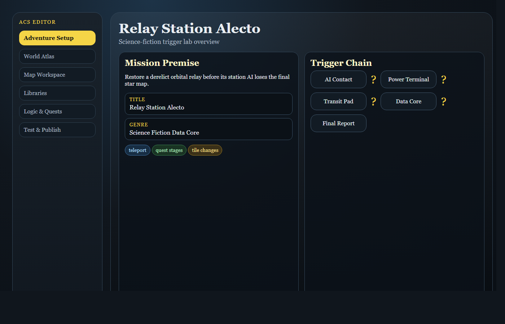

### Adventure Concept: Relay Station Alecto

You are creating a compact science-fiction mission called Relay Station Alecto. The station is quiet, but not empty. A defense drone patrols the access ring, a damaged station AI can still speak, and the central data core is locked behind a power field. The player must bring the station online in a deliberate sequence:

1. Contact the station AI.
2. Restore auxiliary power at a terminal.
3. Use the newly active transit pad to teleport into the data core chamber.
4. Collect the recovered data core.
5. Trigger a visible map change that shows the station has awakened.
6. Return through an exit or teleport and report success.

This is intentionally more complex than a normal fetch quest because several different triggers depend on each other. The mission uses flags, quest stages, item gates, tile changes, dialogue, exits, teleport actions, and diagnostics as one connected design.

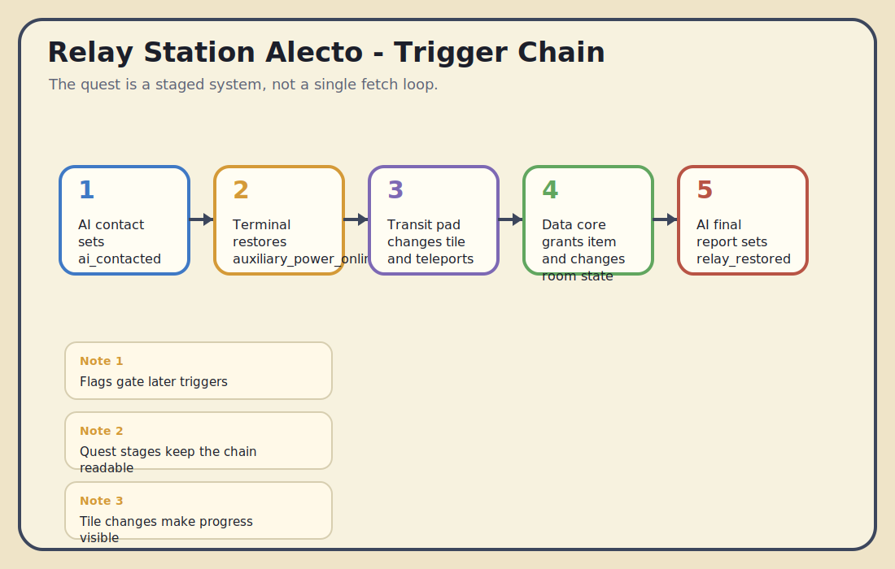

### Step 1: Start The App And Open The Editor

From the repo root, run:

~~~powershell
npm run build
npm run serve:web
~~~

Open the editor:

~~~text
http://localhost:4317/editor.html
~~~

If you are also using project save/load through the API, run this in a second terminal:

~~~powershell
npm run serve:api
~~~

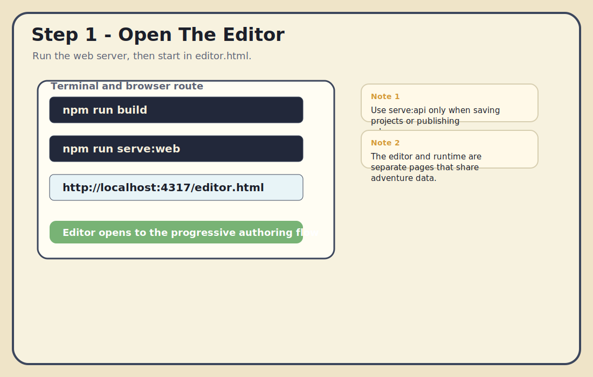

### Step 2: Set The Adventure Identity

In Adventure Setup, give the adventure this identity:

- Title: Relay Station Alecto
- Description: A derelict orbital relay must be reawakened before its failing AI loses the final star map.
- Tags: science-fiction, relay, data-core, station-ai, trigger-chain

This does not change the runtime rules, but it makes the project readable to the editor, future export tools, and future AI-assisted authoring.

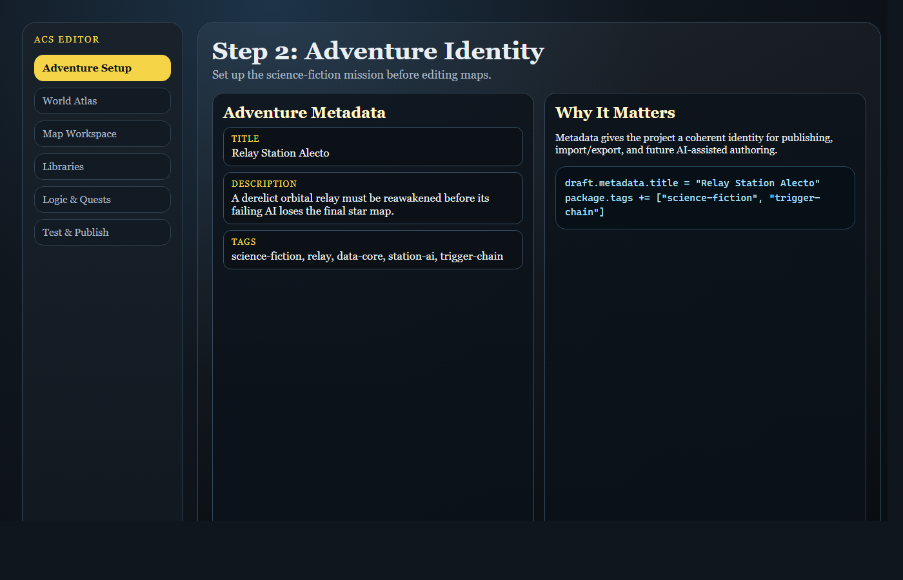

### Step 3: Plan The Map Structure In World Atlas

Open World Atlas and organize the adventure around two or three compact maps. Work left to right: choose or create the map, assign its region, give it a clear kind, then move to the next map.

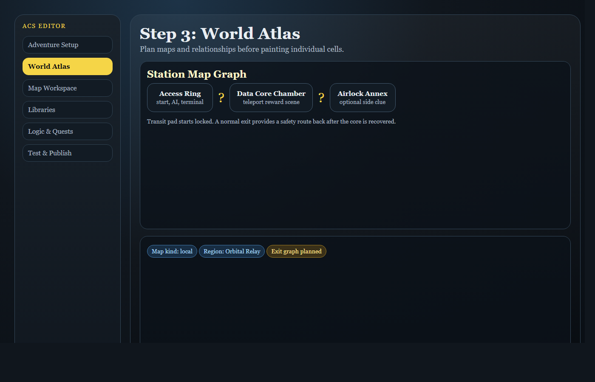

Use this structure:

- Access Ring: create this as the starting map. Put it in a Station Exterior or Relay Station region. This map contains the Station AI, the auxiliary terminal, a defense drone, and a dormant transit pad.
- Data Core Chamber: create this as the high-value destination map. Put it in a Station Interior or Secure Core region. This map contains the recovered core, the arrival coordinate, and the safety exit back out.
- Optional Airlock Annex: create this only if you want a clue or alternate route. Put it in an Airlock / Maintenance region. This can teach the player that normal exits exist before the teleport pad works.

The important design idea is that the player can see the transit pad early, but it should not work until a trigger chain has set the right flag and quest stage.

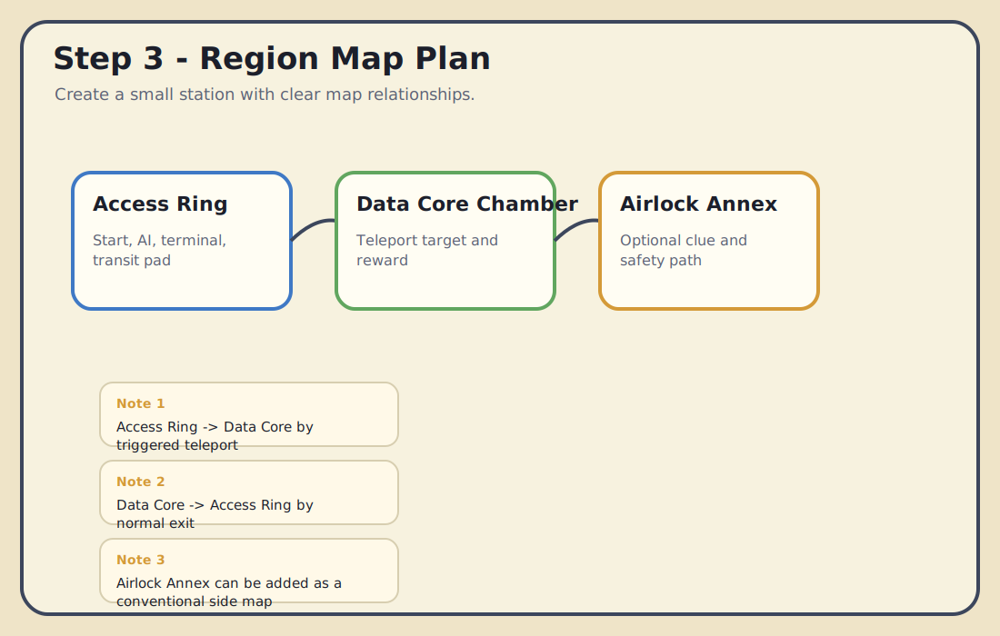

### Step 4: Paint The Access Ring

Open Map Workspace, select Access Ring or the closest available map, and choose tile painting mode. Paint a readable station layout.

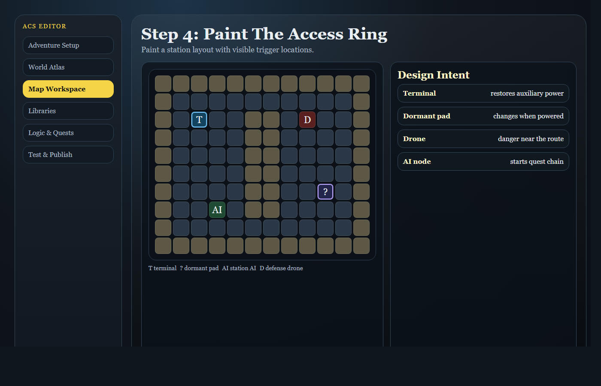

Suggested layout:

- Use floor/path tiles for the main ring corridor.
- Use wall/stone/force-field-like tiles to frame the corridor.
- Put a terminal tile near the station AI.
- Put a transit pad or distinctive portal-like tile at the far side of the ring.
- Put one blocked-looking tile near the data-core route so the later changeTile action has a visible payoff.

The current editor should let the brush remain selected while you paint multiple cells. As the UI matures, this workspace should hide unrelated entity/exit/trigger controls while tile painting is active.

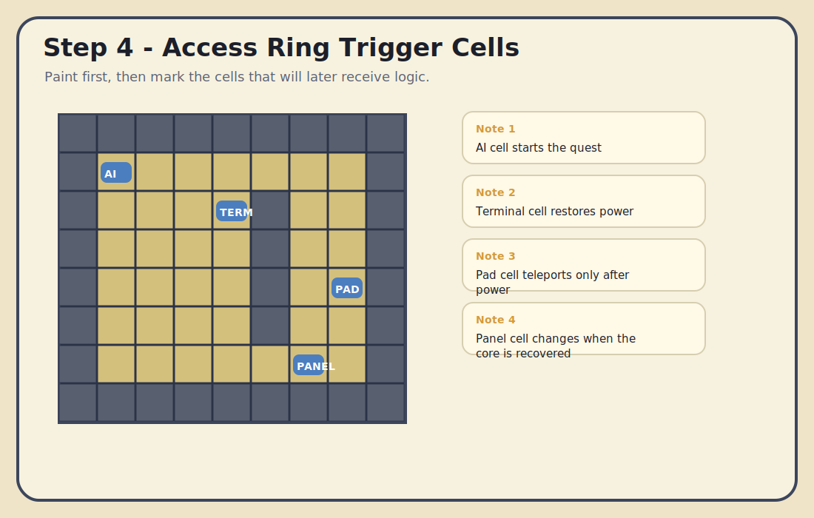

### Step 5: Review Or Create The Science-Fiction Tile Concepts

Go to Libraries, then Tiles. Inspect tiles such as data terminal, force field, teleport pad, locked gate, floor, and wall. If the exact science-fiction tile name you want does not exist yet, adapt the closest current tile and describe the intended role.

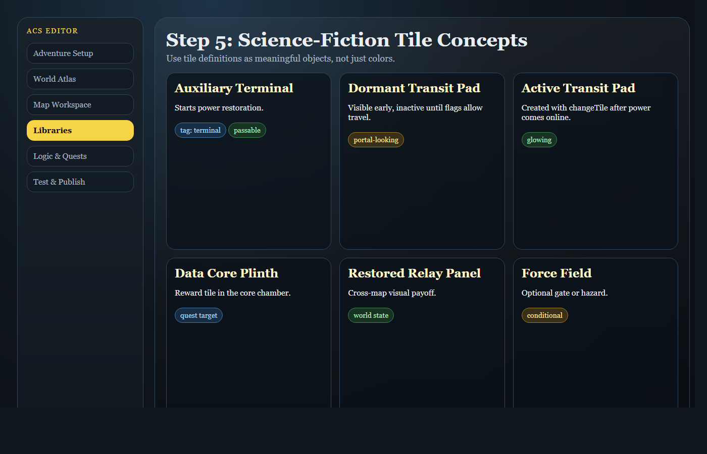

For Relay Station Alecto, the key tile concepts are:

- Auxiliary Terminal: a walkable or interactable tile that starts power restoration.
- Dormant Transit Pad: a portal-looking tile that is inactive until a flag is set.
- Active Transit Pad: the same map cell after changeTile makes the pad visibly active.
- Data Core Plinth: the reward tile in the core chamber.
- Restored Relay Panel: a tile that appears after the station comes back online.

Current supported trigger payoff: changeTile can make the station visually react to player progress. That is one of the best ways to make the world feel responsive right now.

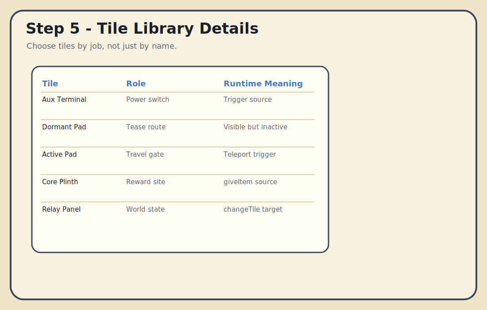

### Step 6: Review Or Create The Main Objects

Open Libraries and inspect Items. Choose or create the closest available science-fiction quest objects.

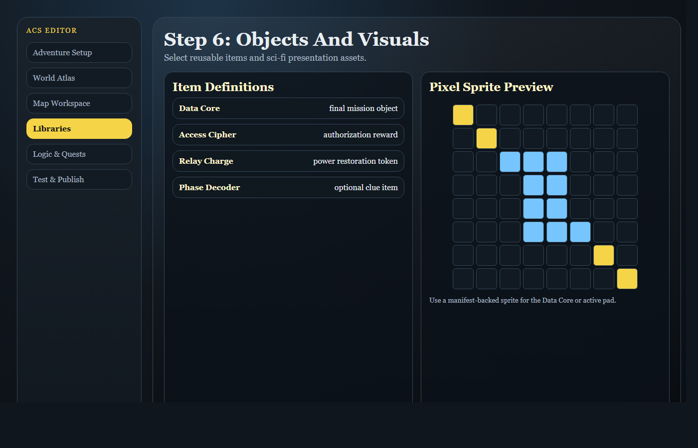

Recommended objects:

- Data Core: the final mission object, represented by an existing data core/relic item if available.
- Access Cipher: an intermediate authorization item granted by the station AI or terminal.
- Relay Charge: an optional item reward showing that auxiliary power is restored.

If the current UI cannot create every new object yet, use existing science-fiction items from the starter library and rename/descriptively adapt them where the editor permits. The long-term roadmap is clear: every item should be CRUD-enabled, categorized, searchable, and graphically editable from its own detail panel.

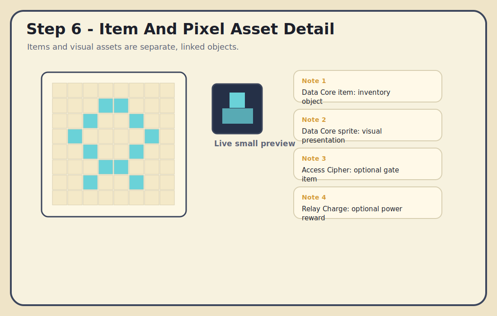

### Step 7: Place The Cast

Return to Map Workspace and use entity mode. Place or review these actors:

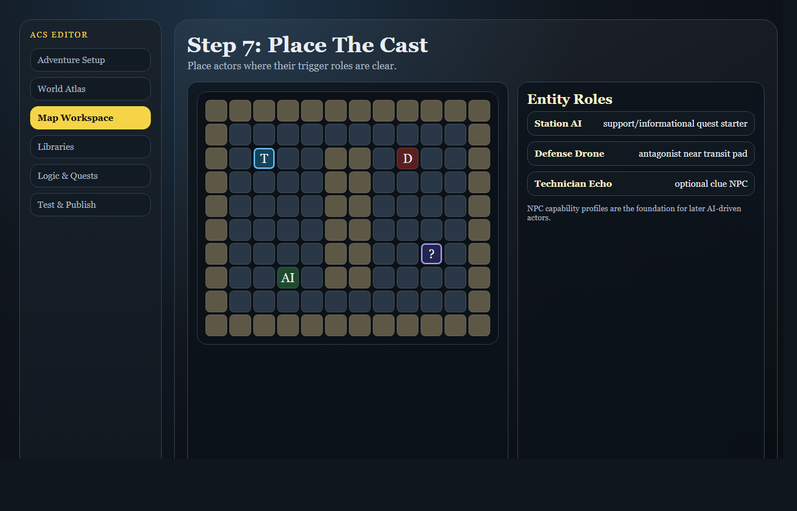

- Station AI or oracle-like guide: informational/support role near the start.
- Defense Drone or alien scout: antagonist near the transit pad or data-core route.
- Optional technician echo or ghost witness: an informational clue NPC if the library includes one.

Do not make the drone a constant movement trap. The project already moved toward classic turn pacing, so enemies should act on configured intervals instead of every keypress.

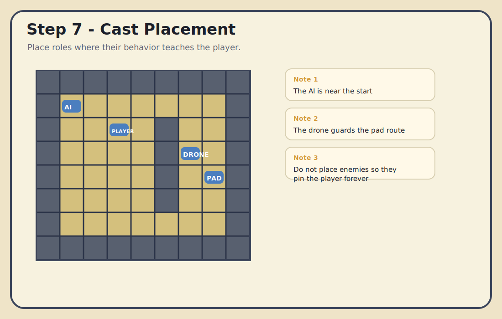

### Step 8: Define The Quest Stages

Open Libraries, choose Quests, and create or adapt a quest called Restore Relay Station Alecto.


Use this stage structure:

- Stage 0: Establish contact with the station AI.
- Stage 1: Restore auxiliary power at the terminal.
- Stage 2: Use the active transit pad to reach the Data Core Chamber.
- Stage 3: Recover the Data Core and wake the relay panel.
- Stage 4: Return with the recovered star map data.

This stage chain gives us several gates. The terminal should only work after stage 0. The transit pad should only work after stage 1. The data core reward should only fire after stage 2. The return dialogue should only complete after stage 3 or after the player has the Data Core item.

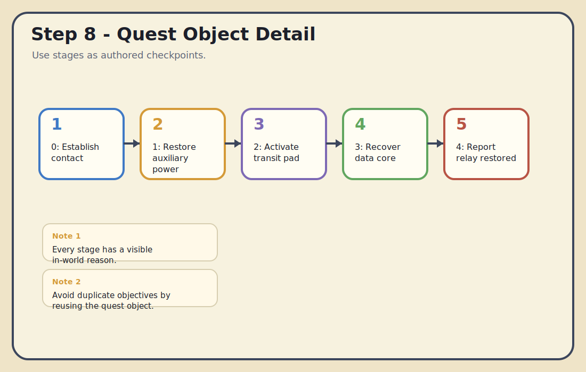

### Step 9: Write Dialogue For Multiple System States

Open Libraries, choose Dialogue, and prepare several dialogue records or nodes.

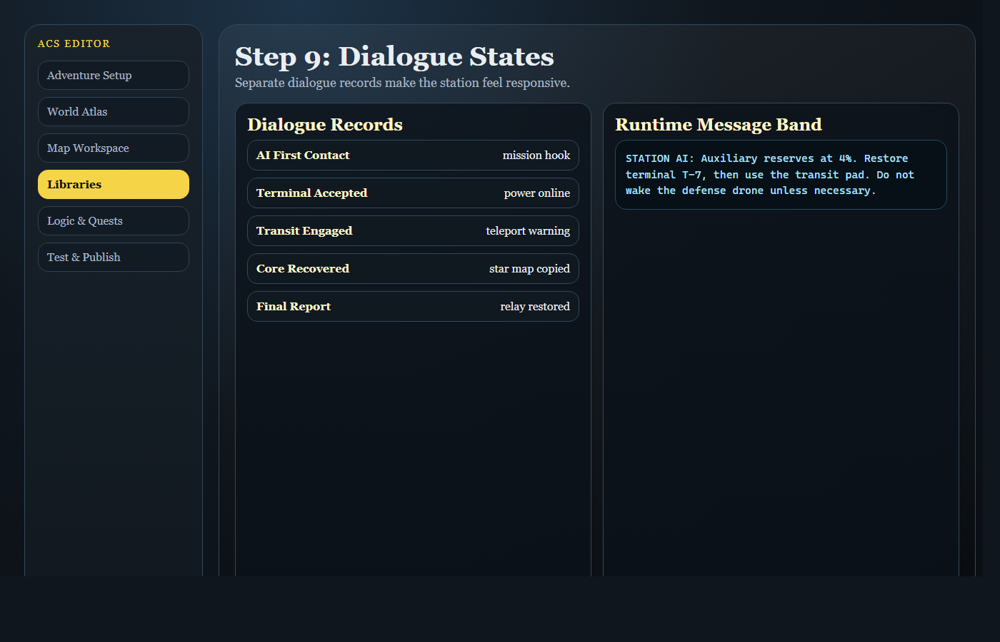

Suggested dialogue beats:

- AI first contact: The relay is conscious but power-starved. It tells the player to find the auxiliary terminal.
- Terminal accepted: The terminal recognizes the player and charges the transit pad.
- Terminal denied: Optional warning text if the player reaches the terminal too early.
- Data core recovered: The chamber confirms the star map has been copied.
- Final report: The AI thanks the player and marks the relay restored.

Even though the current runtime starts at the first dialogue node, having separate dialogue definitions lets different triggers create the feeling of a responsive computer system.

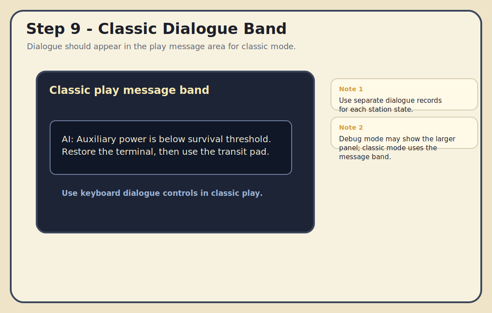

### Step 10: Wire Trigger 1 - First Contact With The Station AI

Open Logic & Quests. Select or create an onInteractEntity trigger for the Station AI.


Trigger design:

- When: interact with Station AI.
- If: no special condition, or quest stage at least 0.
- Then: show AI first-contact dialogue.
- Then: set flag ai_contacted to true.
- Then: set quest stage Restore Relay Station Alecto to 1.

This establishes the mission. It also prevents the next trigger from feeling arbitrary because auxiliary power restoration now depends on the player having spoken with the AI.

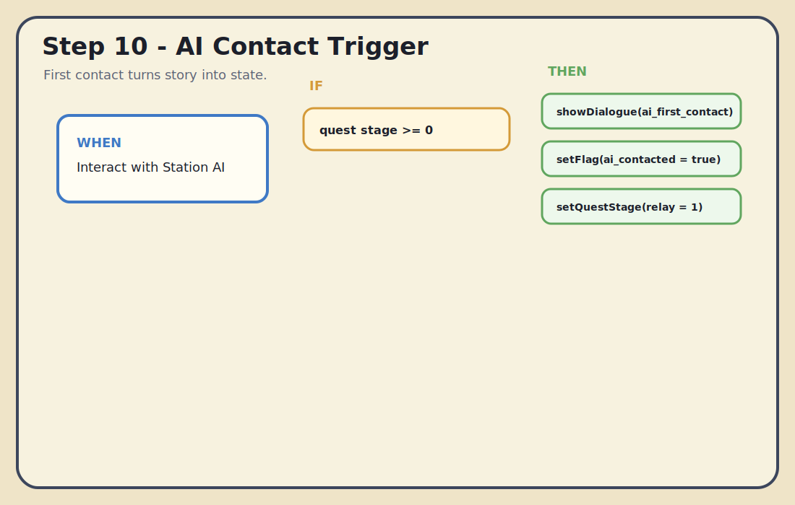

### Step 11: Wire Trigger 2 - Auxiliary Terminal Restores Power

Create an onEnterTile or onUseItem trigger for the terminal cell, depending on how you want the terminal interaction to feel.


Trigger design:

- When: enter or use the terminal tile.
- If: flag ai_contacted equals true.
- If: quest stage Restore Relay Station Alecto at least 1.
- Then: show terminal accepted dialogue.
- Then: set flag auxiliary_power_online to true.
- Then: give item Access Cipher or Relay Charge.
- Then: change tile at the transit pad coordinate from dormant pad to active pad.
- Then: set quest stage to 2.

This is the first clever payoff. The player does not merely receive text. The map changes, an item appears in inventory, a flag changes, and the quest advances. That is a compact example of the current trigger system doing several things from one action stack.

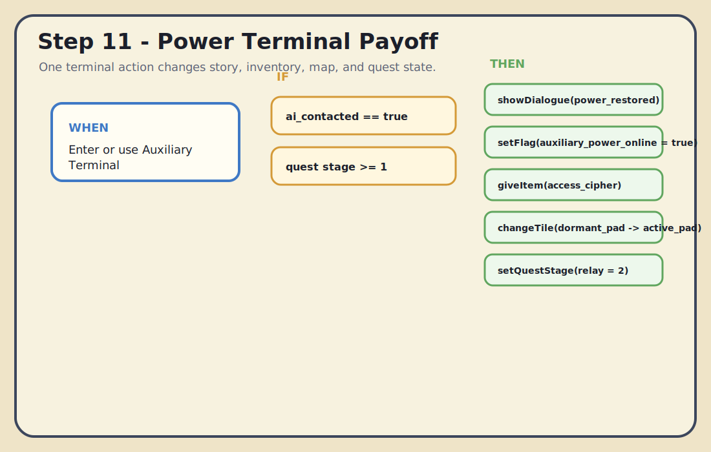

### Step 12: Wire Trigger 3 - Transit Pad Teleports The Player

Create an onEnterTile trigger for the active transit pad cell.


Trigger design:

- When: enter the transit pad tile.
- If: flag auxiliary_power_online equals true.
- If: has item Access Cipher or Relay Charge, if you created one.
- Then: show transit dialogue.
- Then: teleport to the Data Core Chamber coordinate.
- Then: set flag used_transit_pad to true.
- Then: set quest stage to 3.

This uses teleport as an authored trigger action. You can also wire a normal exit for physical travel, but teleport is more dramatic for a science-fiction relay pad.

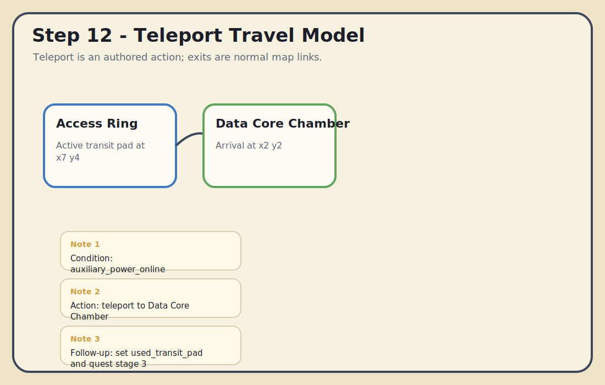

### Step 13: Wire Trigger 4 - Recover The Data Core And Wake The Room

In the Data Core Chamber, place or identify the data core reward tile. Create an onEnterTile trigger for that cell.


Trigger design:

- When: enter the data core reward tile.
- If: quest stage Restore Relay Station Alecto at least 3.
- Then: show data core recovered dialogue.
- Then: give item Data Core.
- Then: set flag data_core_recovered to true.
- Then: change tile at the core plinth to a restored/active/empty version.
- Then: change tile on the Access Ring relay panel to a restored visual state.
- Then: set quest stage to 4.

This is the strongest currently supported pattern: a single location produces inventory, story, quest state, and visible world-state changes across one or more maps.

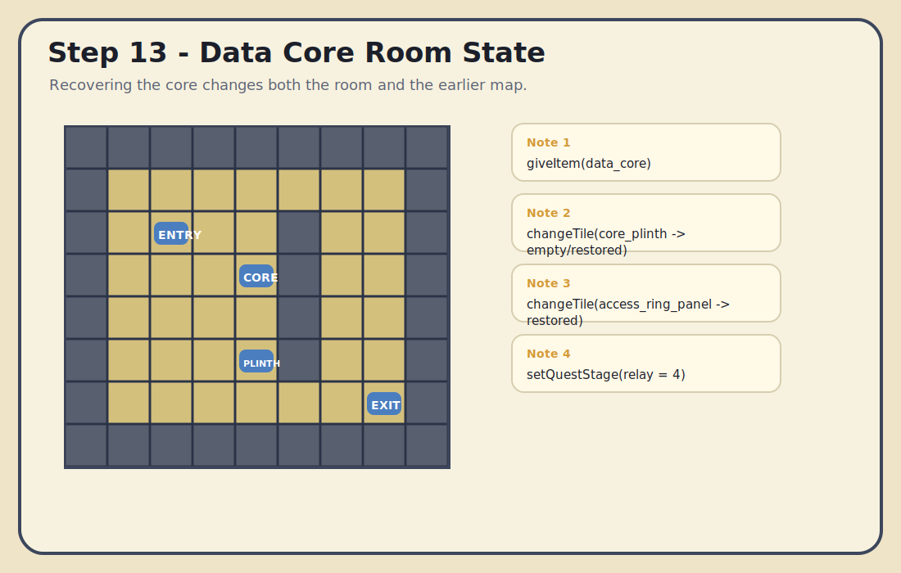

### Step 14: Wire Trigger 5 - Return Or Report Completion

Create an onInteractEntity trigger for the Station AI after the data core has been recovered.

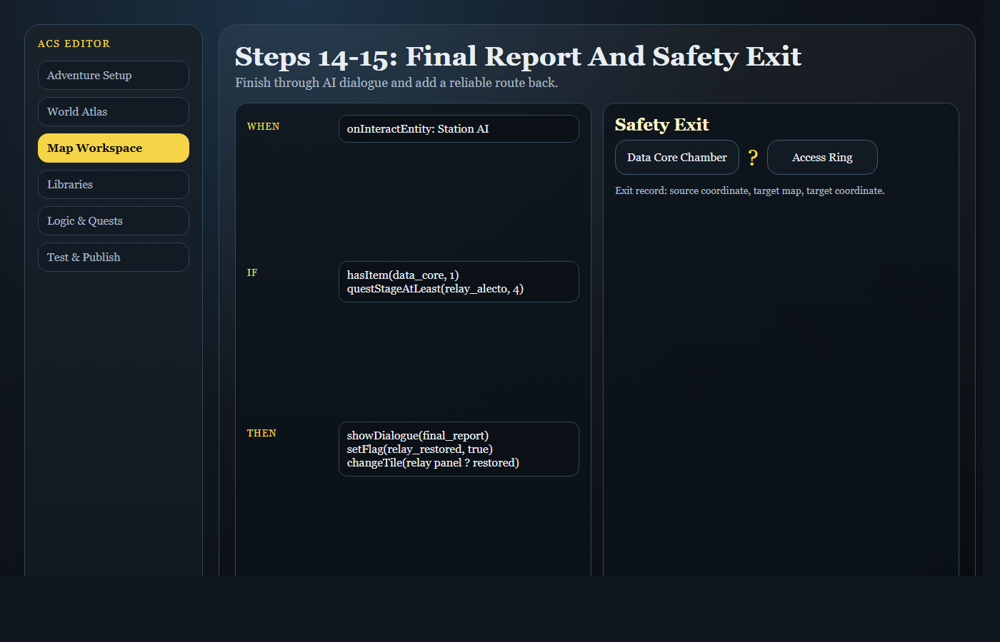

Trigger design:

- When: interact with Station AI.
- If: has item Data Core, or flag data_core_recovered equals true.
- If: quest stage Restore Relay Station Alecto at least 4.
- Then: show final report dialogue.
- Then: set flag relay_restored to true.
- Then: set quest stage to 4 or a completed stage if your quest uses one.
- Then: optionally change a nearby tile to a restored relay panel.

This is still a return/report beat, but it is no longer the whole quest. The real complexity came from staged power restoration, pad activation, teleporting, and cross-map tile changes.

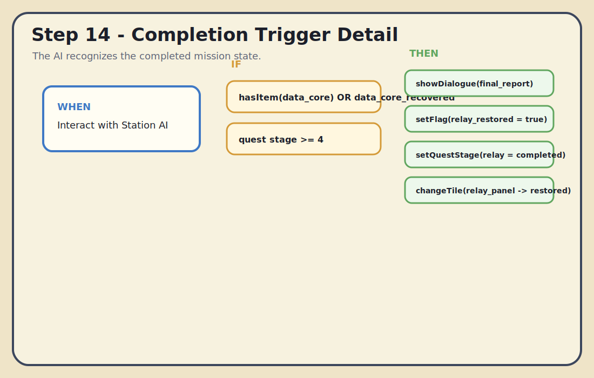

### Step 15: Add A Normal Exit As A Safety Route

Use Map Workspace, Exits & Portals to add a conventional exit between the Data Core Chamber and the Access Ring. This is the explicit map-link step:

1. Choose Data Core Chamber in the Map selector.
2. Change Layer Mode to Exits & Portals. The target-map controls should appear only in this mode.
3. Set Target Map to Access Ring.
4. Set Target X and Target Y to the return coordinate near the Station AI.
5. Click the Data Core Chamber exit tile.
6. Switch Map to Access Ring and create the return exit if you want two-way walking travel.

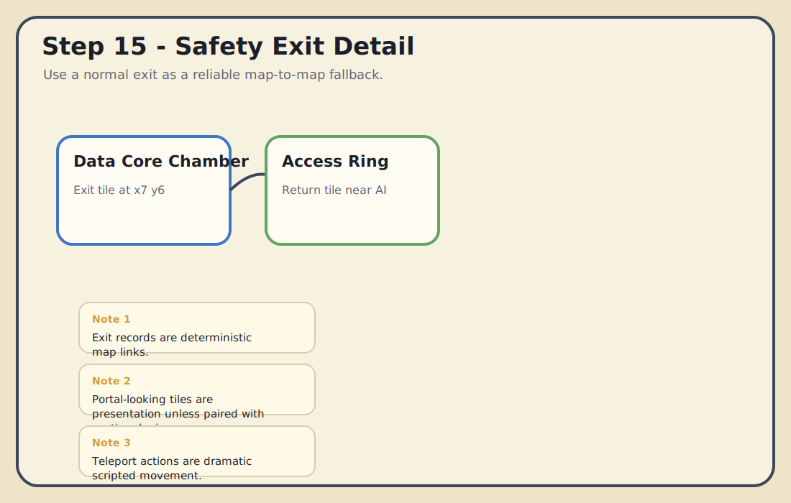

This creates a useful design contrast:

- The transit pad is an authored teleport trigger that only works after power is restored.
- The safety route is a normal exit record that provides reliable map-to-map travel.

That distinction helps designers understand that portals are story/presentation, while exits and teleport actions are runtime mechanics.

### Step 16: Run Diagnostics Like A Designer

Go to Test & Publish and read Authoring Diagnostics and Playtest Scenarios.

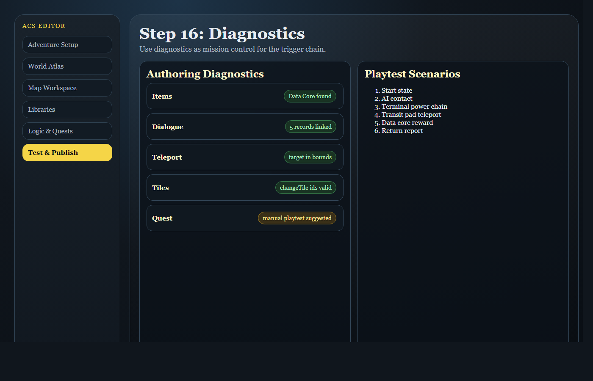

Look specifically for:

- broken item references in giveItem actions
- missing dialogue ids in showDialogue actions
- invalid map ids or coordinates in teleport actions
- invalid tile ids in changeTile actions
- quest stages that never get advanced
- exits pointing outside map bounds

The diagnostics screen is not just a publishing chore. Treat it like a mission-control checklist for your trigger chain.

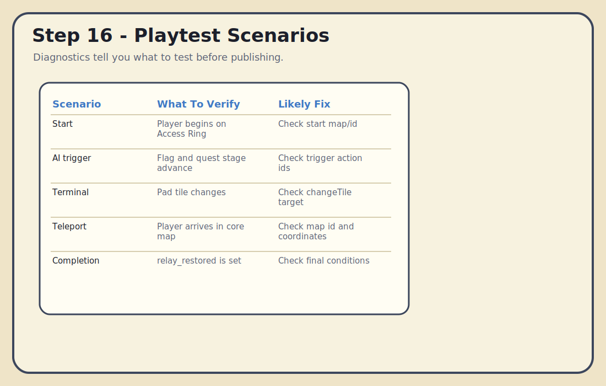

### Step 17: Play The Mission In Order

Open play mode and test the mission as a player.


Expected flow:

1. The player starts in the Access Ring.
2. The Station AI starts the quest and sets ai_contacted.
3. The terminal accepts the player, sets auxiliary_power_online, grants the Access Cipher or Relay Charge, changes the transit pad tile, and advances the quest.
4. The active transit pad teleports the player to the Data Core Chamber.
5. The data core tile grants the Data Core, changes visible tiles, sets data_core_recovered, and advances the quest.
6. The player returns through an exit or pad route.
7. The Station AI recognizes completion and sets relay_restored.

If one step fails, go back to Logic & Quests and inspect the trigger condition first. Most broken trigger chains are either a missing flag value, a mismatched quest stage, or a referenced object id that does not exist.

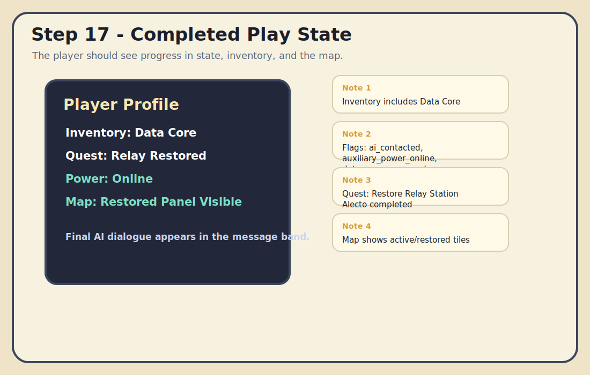

### Why This Is The Best Current Stress Test

Relay Station Alecto is a good current-era tutorial because it uses nearly every implemented authoring system without pretending future features already exist.

It uses:

- entity interaction to start a mission
- flag conditions to gate later behavior
- quest stages to create a multi-step objective chain
- item grants for authorization and reward
- tile changes for visible world feedback
- teleport actions for science-fiction travel
- normal exits for map graph travel
- dialogue definitions for different station states
- diagnostics to review authored references and playtest scenarios
- presentation assets and pixel sprites for classic sci-fi flavor

Future milestones can make this even richer with item removal, NPC spawning, sound effects, splash/cutscene events, stacked trigger templates, AI-authored variations, and AI-driven NPC behavior. But with the features available today, this is the most layered adventure pattern we can build cleanly.

## Projects And Published Releases


The editor can move a draft through five project stages:

1. `Validate Draft`: run the backend validation report without publishing
2. `Create Project`: create a mutable backend project from the current draft
3. `Save Project`: update the mutable backend draft
4. `Publish Release`: create an immutable release snapshot
5. `Open Latest Release`: launch that published release in the runtime

### Important Distinction

- `Save Draft` writes to browser storage
- `Save Project` writes to the local API
- `Publish Release` freezes a release snapshot instead of editing it in place

### Future Export Modes

Future publishing work should split finished projects into two shareable forms:

- `Forkable Project`: an editable construction-set package that includes source adventure data, custom libraries, provenance, and remix/license metadata so another designer can continue building from it.
- `Standalone Playable`: a runtime-only package that includes the validated release and required assets, but excludes editor panels, draft metadata, authoring diagnostics, and private construction notes.

Both modes should start from an immutable published release. That keeps the draft safe while letting the same adventure become either a remixable design file or a clean playable game.

## Where Data Lives

### Browser Storage

Used for:

- runtime saves
- local drafts
- remembered active project id

### Local API Storage

Used for:

- mutable project drafts
- immutable published releases
- stored locally in `apps/api/data/store.json`

### Built-In Starter Libraries

Milestone 26 adds the first dedicated boundary for built-in library content: `packages/default-content`.

The important split is:

- `packages/domain` defines the shapes, such as `StarterLibraryPackDefinition`, item definitions, tile definitions, entity definitions, and quest definitions.
- `packages/default-content` defines built-in starter-library source metadata and helpers for creating starter snapshots and custom library export files.
- `apps/web/src/sampleAdventure.ts` still contains the current sample adventure's actual object data while the starter content is being migrated out over time.

Starter libraries should be treated as application-owned defaults. A designer can start from them, but editing a built-in object should eventually create a project-local copy rather than mutating the built-in library.

### Custom Libraries

Custom libraries should be stored separately from the starter libraries. They are designer-owned export files with:

- their own schema version
- a custom source marker
- genre tags
- references to any starter packs they were based on
- exported object collections for categories, tiles, entities, items, skills, traits, spells, flags, quests, dialogue, custom objects, and assets

This gives us three clean layers: shipped starter libraries, adventure-local objects, and reusable custom libraries that can be imported into future projects.

## Milestone 25: Authoring Diagnostics And Smoke Testing

Milestone 25 adds a safety dashboard for designers. The editor now has an `Authoring Diagnostics` card and a `Playtest Scenarios` card inside `Test & Publish`. These are not replacements for validation. Validation answers, "is this package legal enough to publish?" Diagnostics answers, "what authored systems should I playtest and what could feel wrong even if the package is valid?"

Use this pass when you finish editing a scene:

1. Open `Editor` and choose `Test & Publish` from the left `Edit Flow`.
2. Read `Draft Health` first. Fix blocking validation errors before publishing.
3. Read `Authoring Diagnostics`. It summarizes trigger effects, entity behavior, exits, initial flags, item definitions, and quest objects.
4. Read `Playtest Scenarios`. These scenario prompts tell you what to test manually: start state, trigger chain, exit graph, and quest state.
5. Run the automated smoke test from the repo root when you want a repeatable baseline check:

```powershell
npm run playtest:smoke
```

The smoke script builds the project, validates the sample adventure, confirms the start state, interacts with the Oracle, verifies the shrine reward trigger, checks the Solar Seal item grant and altar tile change, and confirms the meadow-to-shrine exit travel.

### Creative Tutorial Use: Debug The Shrine Reward

Try this as a designer-facing diagnostic exercise after experimenting with triggers:

1. In `Logic`, select the shrine reward trigger.
2. Temporarily remove or change the `giveItem` action in the guided action list or advanced JSON.
3. Go to `Test & Publish` and notice that validation may still pass, because a trigger without that reward can be structurally legal.
4. Use `Authoring Diagnostics` and `Playtest Scenarios` to remind yourself that the reward chain should be tested.
5. Restore the `giveItem` action for `item_solar_seal`, then run `npm run playtest:smoke`.

This distinction matters as adventures get richer. A missing reward, one-way portal loop, or quest stage mismatch can be valid data but bad adventure design. Milestone 25 gives us the first reusable place to surface those authoring concerns without cluttering every editor panel.

## Current Limitations

This is still an MVP. Important current limitations include:

- no real user accounts yet
- no cloud backend yet
- no asset upload flow yet
- no deletion of maps yet
- no deletion of entity instances in the editor yet
- trigger records can now be created, duplicated, deleted, edited, and placed as map markers
- brand-new dialogue and item record creation remains future work; quest definitions can now be created and edited
- the classic visual mode now includes manifest-backed pixel sprite authoring, stocked starter genre packs, splash-screen selection, and starting music selection. The current packs include real reusable item, entity, tile, skill, trait, spell, and asset objects; later milestones will deepen sprite sheets, animation, and higher-resolution asset-pack preparation
- the editor can create and edit tile and quest definitions, but deletion and advanced conditional passability rules remain future work
- the editor can edit existing reusable entity definitions, but brand-new entity/item/dialogue definition creation remains future work
- the editor now includes authoring diagnostics and generated playtest scenario prompts in `Test & Publish`; the CLI smoke test can be run with `npm run playtest:smoke`

## Documentation Generation Instructions

From this point forward, every milestone documentation pass should follow these rules:

- The User Guide tutorial must exercise every feature currently available in the application, not just the newest feature.
- After the Milestone 24 starter-library foundation, continue expanding the main tutorial into a brand-new adventure creation walkthrough. It should be inspired by Land of Adventuria: fun, multi-genre, screenshot-heavy, and focused on building something from scratch using genre libraries, maps, tiles, entities, items, quests, triggers, exits, splash screen, and starting music.
- When Milestone 27 lands, the tutorial must show UI-based display rename/reskin operations with preview and validation, not scripts or code edits.
- The newest milestone's features must be called out explicitly near the start of the tutorial and in the feature list.
- The User Guide PDF must include current screenshots or screenshot-style graphics for the runtime, editor, and major workflow diagrams.
- The System Reference must explain how all major features are implemented, including end-to-end input-to-rendering or input-to-draft flows.
- Mermaid diagrams in Markdown should have readable rendered equivalents in the HTML/PDF outputs.
- Diagrams, screenshots, code blocks, and enclosed callout boxes should avoid page splits wherever practical.
- If a screenshot shows UI button text spilling outside a button, regenerate the graphic with smaller text before publishing the PDF.
## Troubleshooting

### The editor says the API is unavailable

Start the API server:

```powershell
node .\apps\api\dist\index.js
```

### Validate Draft fails or publish stays disabled

Common causes:

- a trigger references a missing map, item, dialogue, or quest
- an entity or start position is outside the bounds of a map
- a map layer has the wrong tile count for its dimensions
- a map or trigger references a tile id that has no tile definition
- a singleton entity definition has more than one placed instance

### A published release will not open

Common causes:

- the API may not be running
- the release id may not exist anymore
- the local API store may have been cleared

### My draft changes are gone

Check whether you clicked:

- `Save Draft` for browser-local storage
- `Save Project` for backend storage

### Playtest Draft opens the sample adventure instead

The runtime falls back to the built-in sample when it cannot find the draft key passed by the editor.

## Summary

At this point, the application is best thought of as:

- a playable ACS-style browser runtime
- a browser-based draft editor with tile painting, tile definition editing, entity placement, map creation, definition editing, dialogue editing, and structured trigger editing
- a local save and draft persistence layer
- a local project, validation, and publishing workflow
- a playtest and release loop that uses the same runtime page
