# ACS User Guide

## Table Of Contents

1. What This Application Currently Includes
2. Latest Milestone 32 AI Game Creation Note
3. Starting The Application
4. Playing The Game
5. Saving And Loading Progress
6. Using The Editor
7. Tutorial: Build Relay Station Alecto
8. Testing, Publishing, And Exporting
9. Skinning Readiness Notes
10. Current Limits And Planned Expansion

## What This Application Currently Includes

The current Milestone 32 project gives you three working pieces plus authoring diagnostics, playtest-smoke simulation, classic presentation scaling, release-backed export workflows, triggerable media/sound cue support, and the first AI game creation request-planning layer for later prompt-driven authoring:

- `apps/web/index.html`: the playable runtime
- `apps/web/editor.html`: the browser-based editor
- `apps/api/dist/index.js`: the local API for projects, validation, and published releases

The runtime and editor both use local browser storage:

- game saves are stored in IndexedDB
- local editor drafts are stored in IndexedDB
- the editor also remembers the active backend project id in browser local storage

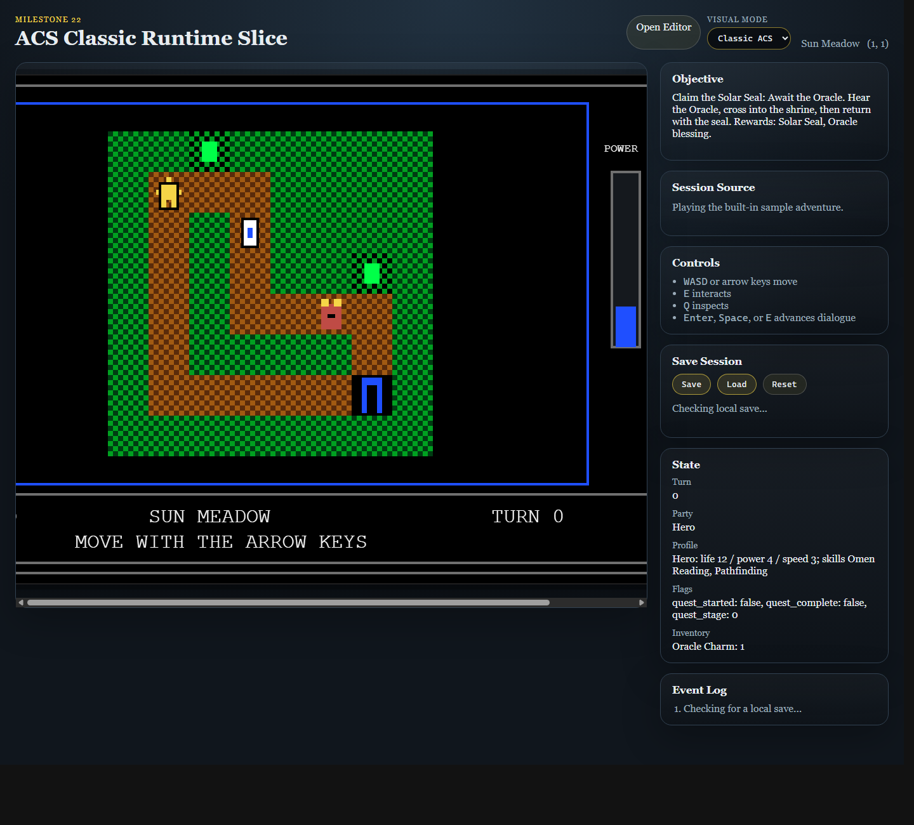

## Latest Milestone 32 AI Game Creation Note

Milestone 31 built the internal AI-provider groundwork rather than visible AI buttons. Milestone 32A starts turning that foundation into the product feature designers actually need: creating a new game, finishing an existing game, or expanding an existing game from an AI prompt. The new request-planning helpers still live in `@acs/ai-core`, still stay provider-agnostic, and still preserve the review-first rule: AI may propose structured game content, but accepted changes must flow through normal editor mutation and validation.

## Starting The Application

Build the workspace if needed, then start both local servers from the repo root.

### Web Server

```powershell
node .\apps\web\server.mjs
```

Default URL:

```text
http://localhost:4173/
```

Common alternate URL in this environment:

```text
http://localhost:4317/
```

### API Server

```powershell
node .\apps\api\dist\index.js
```

Local API check:

```text
http://localhost:4318/api/session
```

### Editor URL

```text
http://localhost:4317/apps/web/editor.html
```

## Playing The Game

Milestone 28 defaults to Classic ACS visual mode. This is a presentation mode that draws the same engine state inside a vintage-inspired game panel with a map viewport, right-side status rail, and bottom message band. The classic panel intentionally uses a larger modern play window rather than the original 8-bit pixel dimensions, while preserving crisp retro styling. The classic renderer uses tile definitions and the adventure's classic-acs visual manifest to choose tile and entity sprite styles, so map data remains logical while presentation can evolve. Use the Visual Mode dropdown to switch between Classic ACS and Debug Grid at any time, and use Classic Size to choose Compact, Large, or Extra Large without changing the adventure data.

The runtime can load one of three sources:

- the built-in sample adventure
- a local draft playtest
- a published release loaded with `?release=<id>`

The current sample adventure goal is:

1. Speak to the Oracle.
2. Enter the shrine.
3. Claim the Solar Seal.
4. Return to the Oracle.

### Runtime Controls

- `W`, `A`, `S`, `D` or arrow keys: move
- `E`: interact with an adjacent entity
- `Q`: inspect the current tile or an adjacent entity
- Enter, Space, or E: advance dialogue
- Arrow keys: scroll longer dialogue while Classic ACS dialogue is active
- `Save`: store the current session locally
- `Visual Mode`: switch between the classic ACS-inspired presentation and the debug grid renderer
- `Classic Size`: resize the classic gameplay panel for readability while keeping the same engine state
- `Load`: restore the most recent local save for the current source
- `Reset`: restart the current session from its start state

### Turn-Based Enemy Timing

The runtime now preserves the classic turn-based feel more deliberately. Successful player actions advance the turn count, but blocked movement does not give enemies a free action. Enemy behavior can define a `turnInterval`; the sample Shrine Wolf acts every third successful player turn, which gives you room to maneuver instead of having the wolf stick to every step.

### Runtime Panels

The play page shows:

- the map canvas
- the current map name
- the player position
- the session source panel
- the objective panel
- save/load/reset controls
- state details such as turn count, flags, and inventory
- the event log
- the Classic ACS bottom message band, or the Debug Grid dialogue panel, when a conversation is active

### Milestone 28: Media And Sound Cues

Milestone 28 adds first-class `Media Cue` and `Sound Cue` objects. They are not hardcoded browser effects. They are named data objects in the adventure package that point at assets, and trigger actions can reference them by id.

Use them for moments such as:

- a splash-card flash when a station AI wakes up
- a region-transition card when the player crosses a portal or airlock
- a confirmation chime when a relic, data core, or terminal activates
- a looping ambient cue for a charged room or dangerous zone

In the current runtime, cues appear as named `mediaCuePlayed` and `soundCuePlayed` events in the event log. This deliberately lands the architecture first: later phases can attach real audio/video playback or richer scene presentation without changing trigger rules.

## Saving And Loading Progress

The runtime uses separate local save slots for the sample adventure, draft playtests, and published releases.

Examples:

- built-in sample: `adv_milestone3:latest`
- local draft playtest: `<adventure id>:draft-playtest`
- published release: `<adventure id>:release:<release id>`

### Save

`Save` stores the current `RuntimeSnapshot` in browser IndexedDB.

### Load

`Load` restores the most recent saved snapshot for the current source. The runtime starts fresh from the adventure start state; it does not automatically restore a save on page load.

### Reset

`Reset` restarts the live session only.

Important:

- `Reset` does not erase the saved snapshot
- `Load` can still bring that snapshot back afterward

## Using The Editor

Open the editor at:

```text
http://localhost:4317/apps/web/editor.html
```


The current editor supports:

- editing the adventure title and description
- switching between maps in the draft
- painting tiles on the current map with a persistent brush
- moving existing entity instances on the current map
- adding new entity instances from reusable entity definitions
- giving placed entity instances their own friendly names and optional behavior overrides
- respecting singleton-vs-multiple placement rules for creatures and NPCs
- editing existing dialogue text records
- editing existing structured trigger records for conditions and actions
- editing current-map structure metadata and creating new blank maps
- editing reusable tile definitions with passability, interaction hints, tags, and classic sprite mappings
- creating and editing reusable quest definitions with stages, rewards, and source references
- reviewing the shared validation summary for the current draft
- running `Validate Draft` against the local API
- saving a local draft
- creating a backend project from the draft
- saving the draft to the backend project
- publishing a release from the project
- opening the latest published release
- launching a draft playtest in the runtime


### Organized Edit Game Screen

The editor is now organized around the way game information relates:

- `Edit Flow` navigation moves through Adventure, World Atlas, Map Workspace, Libraries, Logic, and Test & Publish.
- `Adventure Setup` contains game-wide title and description metadata.
- `World Atlas` contains region/map thinking: selected map, map scale, parent region assignment, and blank-map creation.
- `Map Workspace` contains the grid-centered work for terrain tiles and entity instances on the selected map.
- `Dependencies` shows the selected map's relationship checklist: region, terrain, population, logic, and exits.
- `Libraries` contains reusable definitions and dialogue records that maps, entities, and triggers can reference.
- `Logic & Quests` contains trigger editing, shaped around `When / If / Then` even while conditions/actions are still edited as JSON.
- `Test & Publish` contains validation, project saving, publishing, and release opening.

This organization is meant to keep the hierarchy visible: Adventure -> Regions -> Maps -> Tiles / Entities / Triggers, with reusable libraries and logic references shown beside the map workspace.

World Atlas uses three editor-facing map scales:

- `World`: a broad overview or travel map.
- `Region`: a major area such as a kingdom, district, station deck, planet zone, or dungeon-level grouping.
- `Local Area`: the playable scene map. This can be a room, street, shrine, cave, rooftop, office, clearing, or ship bay.

`Parent Region` is for organization only. It does not limit exits. You can connect local areas inside one region, connect local areas across regions, or connect region maps directly when that is the clearest adventure design.
### Editor Buttons

At the top of the editor page:

- `Back To Play`: opens the standard runtime page
- `Save Draft`: stores the current draft locally in IndexedDB
- `Reset Draft`: restores the built-in sample adventure and removes the saved local draft
- `Playtest Draft`: saves the current draft locally and opens it in the runtime

### Editor Toolbar

In the Map Workspace:

- `World Atlas`: choose which map is being edited because maps belong to the region/adventure hierarchy
- `Layer Mode`: choose `Terrain Tiles` or `Entity Instances`
- `Tile`: active only in tile mode
- `Move Entity`: active only in entity mode
- Add Definition: active only in entity mode
- `Instance Name`: optional friendly name for the placed copy, such as `Red Team Spy Handler`
- `Behavior Override`: optional per-instance behavior mode for this one placed copy
- Place New: switches entity mode into new-instance placement
- Active Brush: shows the currently loaded tile brush or entity placement target

### Tile Editing

To paint tiles:

1. Set `Layer Mode` to `Terrain Tiles`.
2. Pick a tile id from the `Tile` dropdown.
3. Check the `Active Brush` preview to confirm the selected tile.
4. Click a cell in the grid to paint a single tile, or click and drag to paint across multiple cells.

The selected tile stays loaded like a brush until you choose a different tile.

### Tile Definition Editing

Tiles are now library objects, not just visual strings in a map layer. In `Libraries`, choose `Tiles` from `Library Type` to edit reusable terrain definitions.

Tile definitions currently include:

- `Name`: the designer-facing label shown in editor lists
- `Passability`: `passable`, `blocked`, or `conditional`
- `Description`: what the terrain represents
- `Interaction Hint`: short text that can guide inspection or future interaction UI
- `Tags`: classification labels such as `terrain`, `barrier`, `relic`, `water`, or `sci-fi`
- `Classic Sprite`: the renderer-neutral classic sprite id used by the Classic ACS visual mode

Why this matters:

- A map can paint `water`, `shrub`, `stone`, `altar`, or a new `force_field` tile by id.
- Runtime-core can now consult the tile definition to decide whether terrain blocks movement.
- Runtime-2d can use the tile definition's classic sprite id without hardcoding that every visual style must draw the tile the same way.
- Future visual styles such as high-resolution 2D or 3D can map the same tile definition to different art.

### Pixel Art Editing

In `Libraries`, choose `Assets` from `Library Type` to edit presentation assets and classic pixel sprites. The pixel editor has three live previews:

- `Paint Color`: a visual swatch beside the dropdown shows the loaded brush color before you paint.
- `In-Game Preview`: the sprite at normal game scale.
- `Magnified Preview`: the same sprite enlarged for precise editing.
- `Grouping Preview`: a repeated 4-by-4 preview that shows how the sprite looks beside itself.

The grouping preview is especially useful for terrain and repeated wall/floor patterns. A tile can look fine by itself but create an ugly seam or accidental stripe when it repeats across a room. Use the grouping preview before assigning a sprite to frequently painted terrain.


### Quest Definition Editing

Milestone 23 makes quests first-class library objects instead of hardcoded objective text. In `Libraries`, choose `Quests` from `Library Type` to edit objective chains.


Quest definitions currently include:

- `Name`: the player/designer-facing quest title
- `Summary`: the durable premise shown beside the current objective
- `Objective`: a selectable objective object with its own stable id, title, kind, description, and optional target map or target item
- `Objective Kind`: a focused classification such as `story`, `travel`, `collect`, `return`, `survive`, or `custom`
- `Reward`: a selectable reward object with its own stable id, kind, label, and optional item reference
- `Reward Kind`: a focused classification such as `story`, `item`, `flag`, or `custom`
- `Source References`: notes about inspiration, myth, genre pack, or design source material
- `Category`: reusable organization through the same library category system used by other game objects

Why this matters:

- The Objective panel now reads quest data and runtime quest state instead of hardcoded page copy.
- Trigger actions can advance a quest by using `Set Quest Stage`.
- Quest conditions can gate later triggers with `Quest Stage At Least`.
- Future AI-assisted adventure completion can reason over quest definitions, stages, rewards, and references as structured data.
### Entity Editing

Entity mode now supports both moving existing instances and placing new instances from definitions.

To reposition an entity:

1. Set `Layer Mode` to `Entity Instances`.
2. Pick an existing entity from `Move Entity`.
3. Click the destination cell.

To add a new entity:

1. Set `Layer Mode` to `Entity Instances`.
2. Pick a reusable definition from `Add Definition`.
3. Optionally type an `Instance Name`, such as `Red Team Spy Handler`, `Green Team Spy Handler`, `Lobby Police Officer`, or `Rooftop Police Officer`.
4. Optionally choose a `Behavior Override` if this specific copy should act differently from the reusable definition.
5. Click `Place New` if the editor is currently set to move an existing entity.
6. Click the destination cell.

Entity definitions and entity instances serve different purposes:

- The definition is the reusable template, such as `Spy Handler` or `Police Officer`.
- The instance is the copy placed on a map. It can now have its own friendly name and behavior override.
- If no friendly name is set, the editor falls back to the definition name and generated instance id.

Placement rules:

- `singleton` definitions can only appear once in the adventure. The Oracle is singleton.
- `multiple` definitions can be placed repeatedly. The Shrine Wolf is multiple.
- validation reports a blocking error if a singleton definition somehow has more than one placed instance.
- `multiple` definitions should usually use friendly instance names when the copies have different story roles, factions, patrol jobs, or trigger/dialogue meanings.

Current limitation:

- the editor can add and move entity instances
- it can name placed instances and set a simple behavior override
- it does not yet delete entity instances or create new entity definitions

### Validation

The validation panel now runs the shared validation package and shows an error-and-warning summary plus a detailed issue list for the current draft.

Use `Validate Draft` in the `Project & Release` panel when you want the local API to run the same validation report that the publish flow uses.

If the draft has blocking errors, project save and publish controls stay disabled until those are fixed.

## Tutorial: Build Relay Station Alecto From The Editor

This tutorial assumes you have never used the application before. It walks through the editor exactly the way a new designer should experience it: choose one editor area, make one concrete change, confirm the screen, then move to the next area.

The mission you will build is a science-fiction mini-adventure called Relay Station Alecto. The player reaches a derelict relay station, speaks with a failing station AI, restores power, activates a transit pad, reaches a data core chamber, and returns with recovered star-map data. The design is intentionally more interesting than a simple "get item and return" quest because it combines maps, tiles, entity placement, unique entity instance names, exits, quest objects, trigger conditions, trigger actions, diagnostics, and playtesting.

### What You Are Building

Relay Station Alecto uses three maps:

- Access Ring: the starting area with the station AI, a sentry drone, a terminal, a force-field obstacle, and a transit pad.
- Data Core Chamber: the target room that contains the recovered data core.
- Airlock Annex: a small side room used to show that normal map-to-map exits can exist alongside dramatic trigger-driven teleport effects.

The quest flow is:

1. The player starts in the Access Ring.
2. The player speaks with Station AI Alecto.
3. A trigger marks the quest as started.
4. The player restores power at the terminal.
5. The transit pad becomes narratively usable.
6. The player travels to the Data Core Chamber.
7. The player recovers the data core.
8. The player returns to Alecto to complete the mission.

### Step 1: Open The Editor

From the repo root, start the web app:

```powershell
npm run serve:web
```

Open the editor in your browser:

```text
http://localhost:4317/apps/web/editor.html
```

You should see the left-side `Edit Flow` navigation and the first editor panel. The flow is meant to be followed from top to bottom: Adventure Setup, World Atlas, Map Workspace, Libraries, Logic, and Test & Publish.

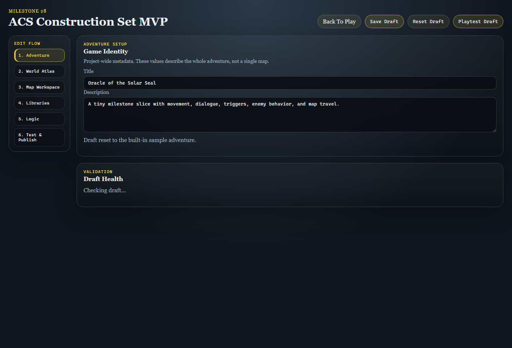

### Step 2: Name The Adventure

Select `1. Adventure` in the left `Edit Flow`.

Fill in the adventure identity:

- Title: Relay Station Alecto
- Description: A derelict orbital relay must be reawakened before its failing AI loses the final star map.

This information does not change movement or combat rules. It gives the project a readable identity for the editor, project storage, publishing, and future AI-assisted authoring.

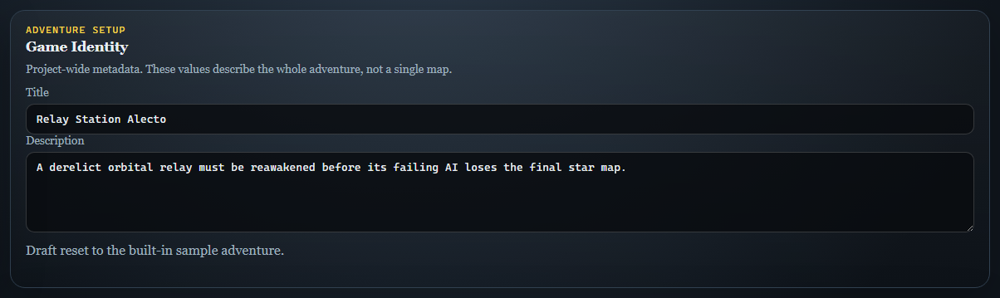

### Step 3: Open World Atlas

Select `2. World Atlas`.

World Atlas is where you manage the large-scale shape of the adventure. Think of this as the table of contents for your game world. Regions contain maps. Maps contain tiles, entities, exits, and triggers.

At this point, do not paint tiles yet. First create the maps that will hold the mission.

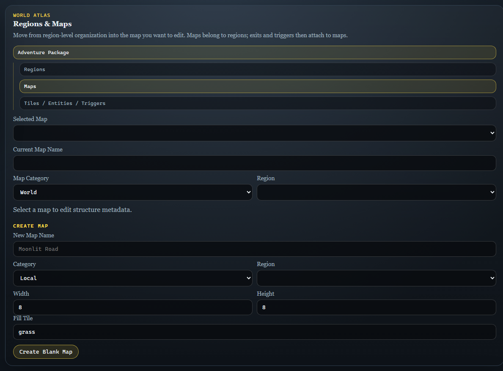

### Step 4: Create The Access Ring Map

In World Atlas, use the map creation controls to create the first map:

- New Map Name: Access Ring
- Region: use the available relay/station region or the nearest current region option
- Map Kind: local
- Fill Tile: steel_deck

Create the map. This will become the starting play space where the player meets Station AI Alecto.

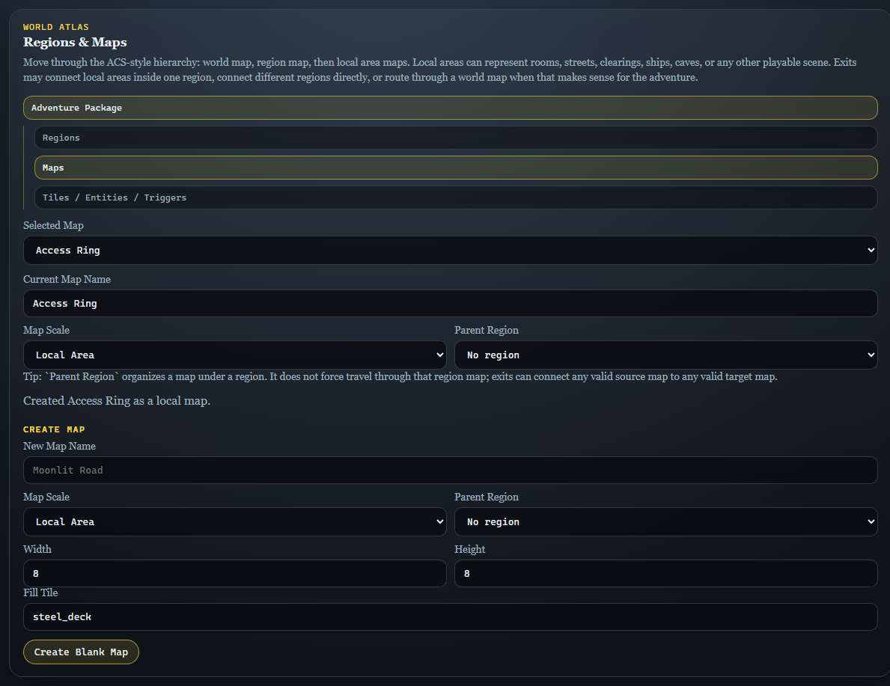

### Step 5: Create The Data Core Chamber Map

Create a second map:

- New Map Name: Data Core Chamber
- Region: use an interior or station region
- Map Kind: interior
- Fill Tile: steel_deck

This is the reward room. The player should not feel like they simply walked next door; this room represents the secure heart of the station.

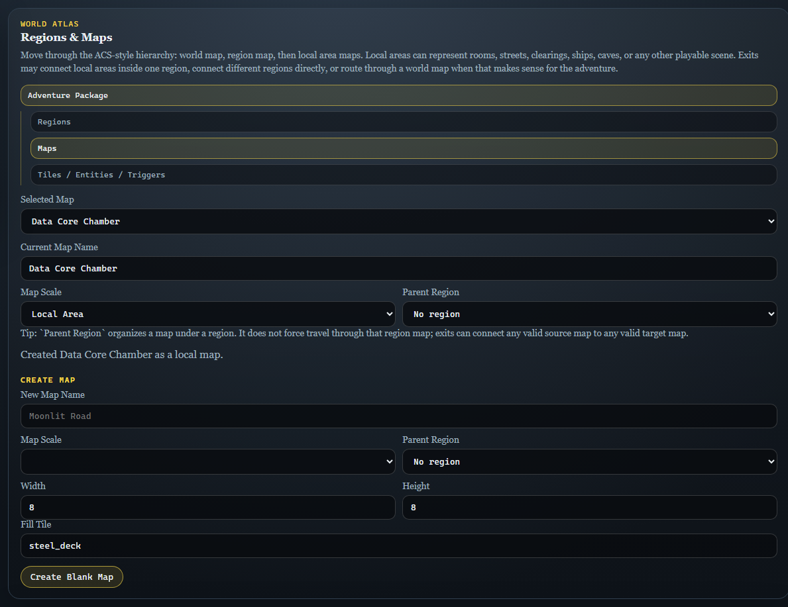

### Step 6: Create The Airlock Annex Map

Create a third map:

- New Map Name: Airlock Annex
- Region: use an airlock, station, or interior region
- Map Kind: interior
- Fill Tile: steel_deck

The Airlock Annex is optional for the story, but useful for learning. It gives you a safe place to practice normal exit records before relying on trigger-driven teleport effects.

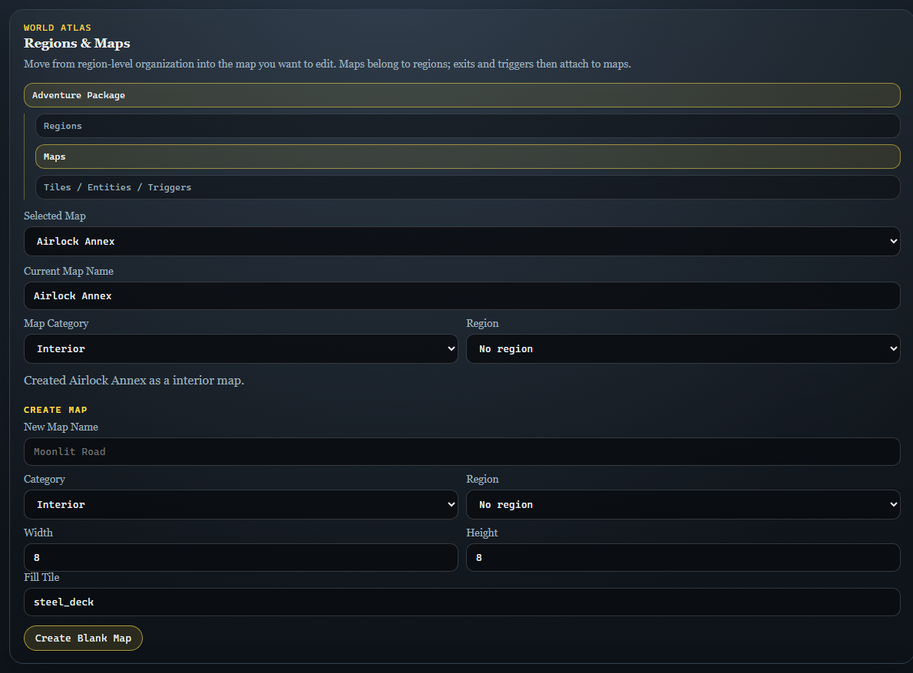

### Step 7: Paint The Access Ring

Select `3. Map Workspace`.

Use these controls in order:

1. Set the map selector to `Access Ring`.
2. Set `Layer Mode` to `Terrain Tiles`.
3. Choose `steel_deck` in the tile brush.
4. Click multiple cells to paint the main walkway.
5. Choose `data_terminal` and paint a terminal cell near the left side of the map.
6. Choose `teleport_pad` and paint a pad near the right side.
7. Choose `force_field` and paint a visible obstacle between the terminal and pad.

Notice the important UI rule: because you are painting terrain, the editor should show tile controls and hide controls for entity placement or exit targeting. This keeps the screen focused on the task you selected.

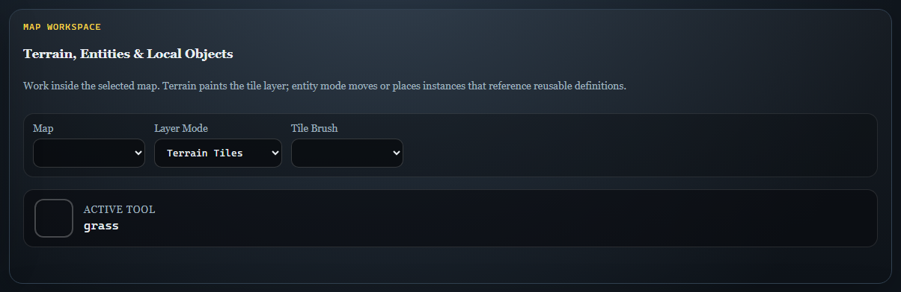

### Step 8: Paint The Data Core Chamber

Stay in `Map Workspace`.

Use these controls:

1. Set the map selector to `Data Core Chamber`.
2. Keep `Layer Mode` set to `Terrain Tiles`.
3. Paint a compact steel-deck room.
4. Add a `data_terminal` or similar tile to represent the core plinth.
5. Add a `door` tile where the safety exit will go later.

This room should be small and clear. A first-time player should immediately understand that the bright terminal-like tile is important.

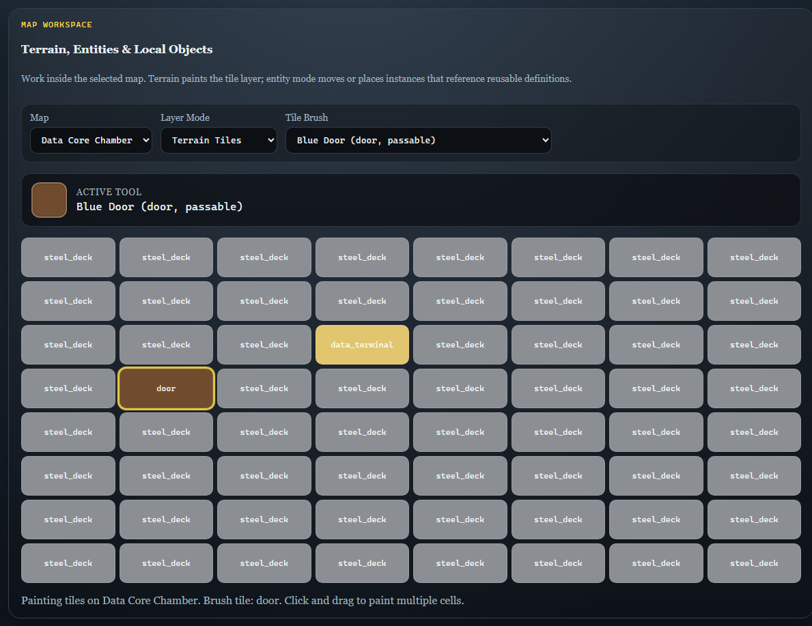

### Step 9: Paint The Airlock Annex

Still in `Map Workspace`:

1. Set the map selector to `Airlock Annex`.
2. Paint a tiny steel-deck room.
3. Add a `signpost` or clue-like tile.

The Airlock Annex is your practice space for simple traversal. Later, you can use it for warnings, clues, or side objectives.

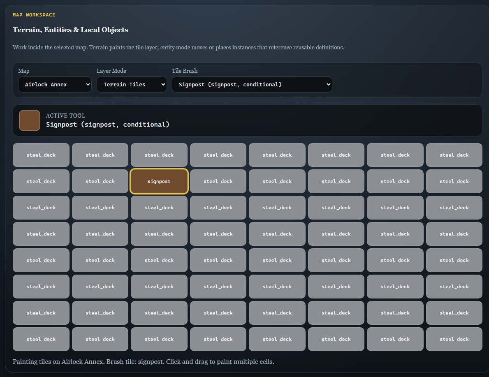

### Step 10: Place Station AI Alecto

Switch `Layer Mode` to `Entity Instances`.

Use these controls:

1. Set the map selector back to `Access Ring`.
2. Choose the reusable entity definition that best represents a station AI, oracle, or guide.
3. In `Instance Name`, enter `Station AI Alecto`.
4. Leave `Behavior Override` as `Inherit` or choose `Idle` if you want this placed copy to stay put.
5. Click the cell where Alecto should appear.

This step shows the difference between an entity definition and an entity instance. The definition is the reusable template. The instance is this placed copy on this map. Because instances can now have their own friendly names, one generic guide definition can become `Station AI Alecto`, `Red Team Handler`, or `Green Team Handler` depending on where you place it.

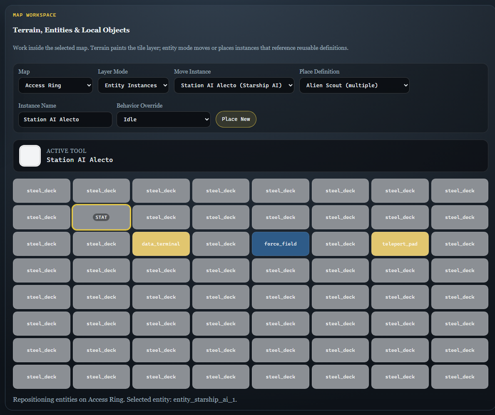

### Step 11: Place The Pad Sentry Drone

Keep `Layer Mode` set to `Entity Instances`.

Use these controls:

1. Choose a drone, wolf, guard, or enemy-like reusable definition.
2. In `Instance Name`, enter `Pad Sentry Drone`.
3. Set `Behavior Override` to `Guard` or `Pursue`, depending on how active you want this specific placed copy to be.
4. Click a cell near the transit pad.

This is the same reusable definition idea, but with a different story role. If you later place another copy, you can name it `Core Patrol Drone` and give it a different behavior override.

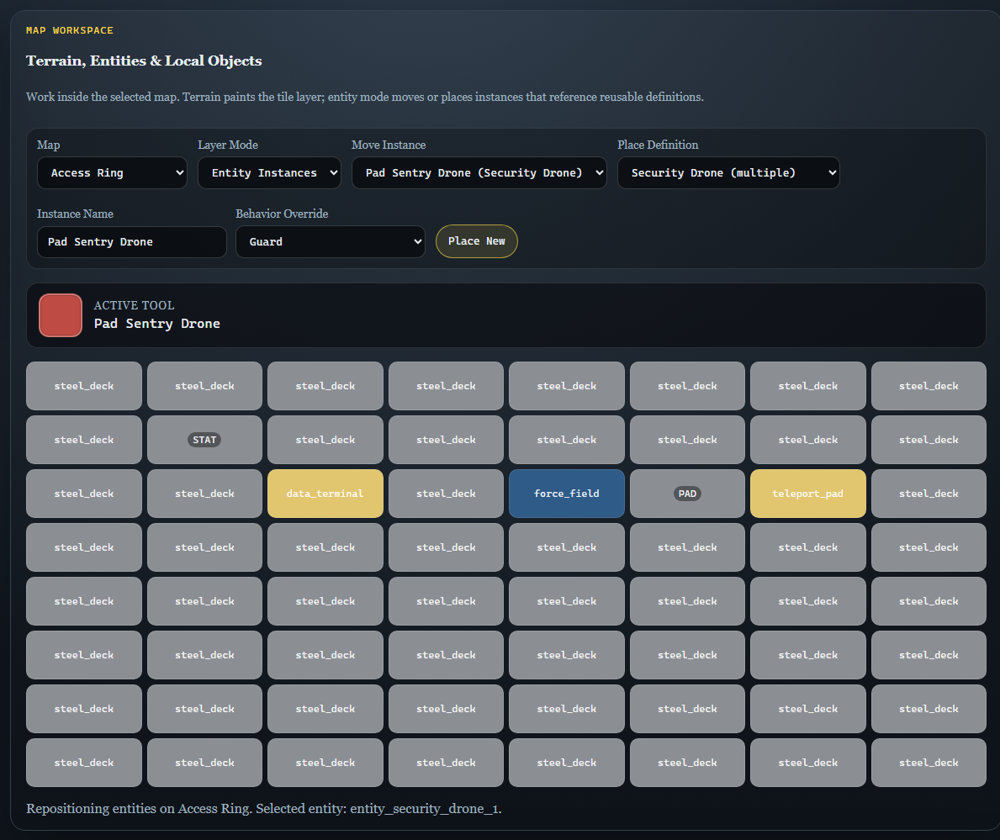

### Step 12: Build The Quest Objective Sequence

Select `4. Libraries`, then choose the quest-related library focus.

In this panel you can inspect quest definitions, objective objects, reward objects, and the current quest metadata. For Relay Station Alecto, create or update a quest definition named `Restore Relay Station Alecto`.

Start with the quest itself:

1. Set `Name` to `Restore Relay Station Alecto`.
2. Set `Summary` to `Contact the station AI, restore auxiliary power, recover the star-map core, and report success before the relay collapses.`
3. Keep the quest in a main-quest or science-fiction category if one is available.

Now create the objectives as separate objects. Do not type these as one long string in the summary. Each objective should have its own title, kind, target reference, and description so triggers, diagnostics, future duplicate warnings, and future AI tools can reason about the quest.

- Establish Contact: speak with Station AI Alecto.
- Restore Auxiliary Power: use the terminal after contact.
- Reach The Core: travel to the Data Core Chamber.
- Recover Star Map Data: obtain the Data Core.
- Report Restoration: return to Alecto.

Create them in order:

1. Click `Create Objective`.
2. For `Establish Contact`, choose kind `story`, describe the AI wake-up scene, and target the Access Ring map if the target-map field is available.
3. Click `Create Objective` again.
4. For `Restore Auxiliary Power`, choose kind `custom` or `story`, describe the terminal restoration, and target the Access Ring map.
5. Click `Create Objective` again.
6. For `Reach The Core`, choose kind `travel` and target the Data Core Chamber map.
7. Click `Create Objective` again.
8. For `Recover Star Map Data`, choose kind `collect` and target the data-core item if the item selector is available.
9. Click `Create Objective` again.
10. For `Report Restoration`, choose kind `return` and target the Access Ring map.

Then create at least one reward object:

1. Click `Create Reward`.
2. Set `Reward Kind` to `item` if you want to award the recovered data object, or `story` if you want the reward to be narrative completion only.
3. Give the reward a clear label such as `Alecto Restored` or `Recovered Star Map`.

The important design rule is that objectives and rewards should be objects with names, kinds, target references, and descriptions. They should not become an invisible pile of one-off strings.

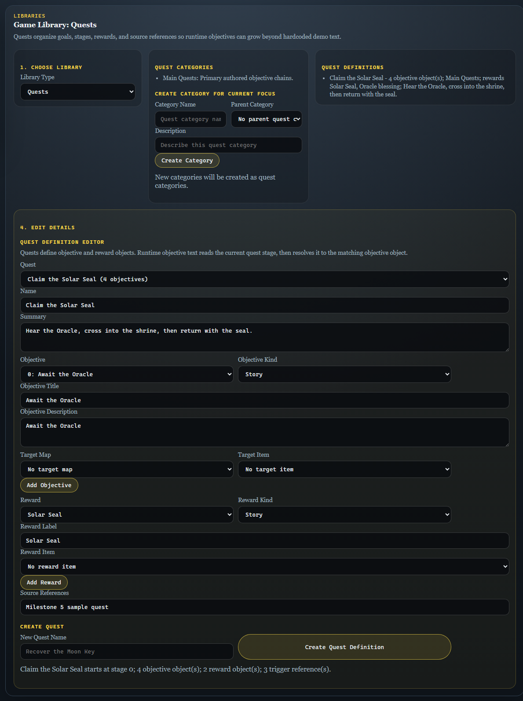

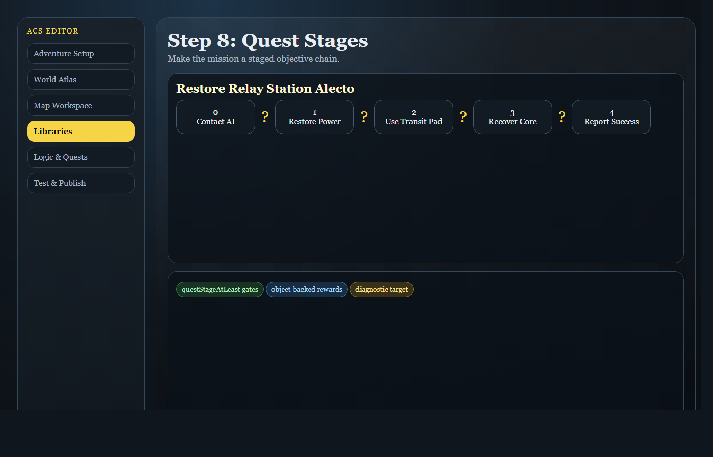

### Step 13: Check The Pixel Art Grouping Preview

Stay in `4. Libraries`, then switch `Library Type` to `Assets`.

Use this step to understand how visual editing is supposed to feel:

1. Pick a `Pixel Sprite`.
2. Pick a `Paint Color`.
3. Click cells in `Large Paint View`.
4. Watch the `In-Game Preview`, `Magnified Preview`, and `Grouping Preview` update together.

For Relay Station Alecto, this is where you would refine repeated station tiles, terminal icons, splash cards, or future object sprites. The grouping preview is the key safety check for terrain: if a floor, wall, shrub, or starfield tile creates distracting seams when repeated, you will see it here before you paint an entire map with it.


### Step 14: Create The Trigger Chain

Select `5. Logic`.

Logic is where authored events become game behavior. A trigger has three parts:

- When: what starts the trigger, such as entering a tile or interacting with an entity.
- If: conditions that must be true, such as a flag or quest stage.
- Then: actions to run, such as dialogue, flags, item grants, media cues, sound cues, teleport, tile changes, or quest-stage changes.

For Relay Station Alecto, the core trigger chain should eventually look like this:

- Interact with Station AI Alecto, then play a `Media Cue`, play a `Sound Cue`, show dialogue, and set the quest-started flag.
- Enter or use the terminal after the quest has started, then play a success chime, restore power, and advance the quest.
- Enter the active transit pad after power is restored, then play a transition media cue and teleport to the Data Core Chamber.
- Enter the core tile, then play the data chime, give the data item, change visible tiles, and advance the quest.
- Interact with Alecto after recovery, then play the completion cue, show completion dialogue, and mark the relay restored.

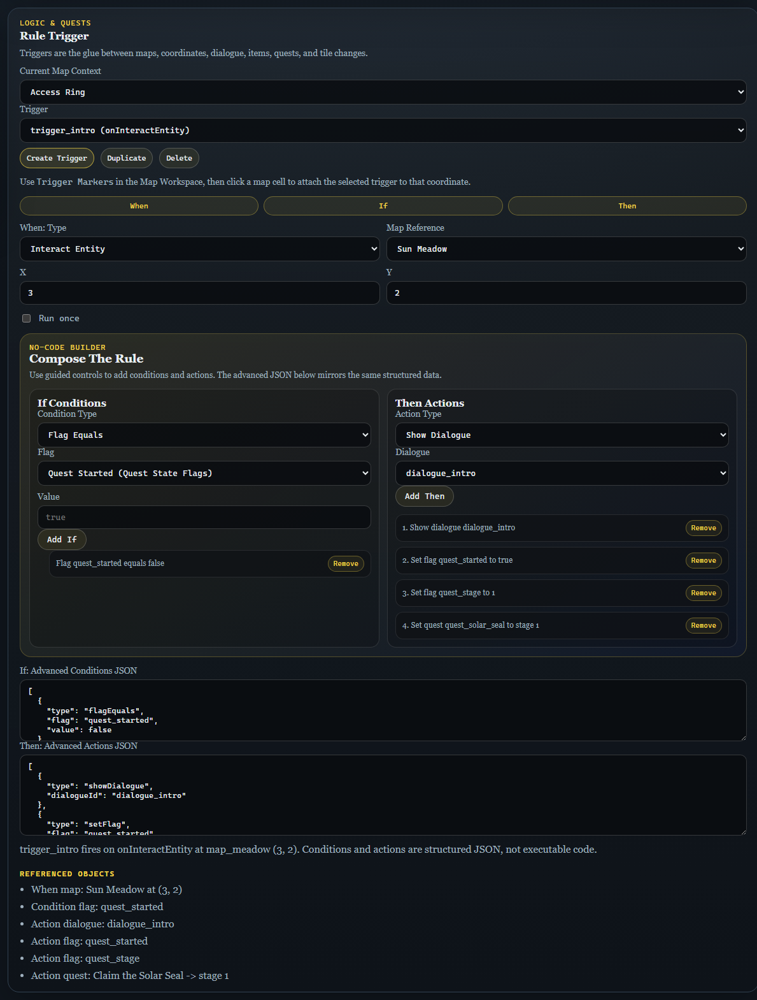

Build the first trigger, `AI Contact`:

1. Click `Create Trigger`.
2. Set `When Type` to `Interact Entity`.
3. Choose the Access Ring as the map reference.
4. Set the target coordinates to the Station AI Alecto cell.
5. Add an `If` condition only if you want this to happen once. A useful condition is `Flag Equals` with `ai_contacted` set to `false`.
6. In `Then Actions`, add `Play Media Cue`, then choose a splash or transition cue from the `Media Cue` chooser.
7. Add `Play Sound Cue`, then choose an effect or ambient cue from the `Sound Cue` chooser.
8. Add `Show Dialogue` for Alecto's first message.
9. Add `Set Flag` for `ai_contacted = true`.
10. Add `Set Quest Stage` for `Restore Relay Station Alecto` stage `1`.

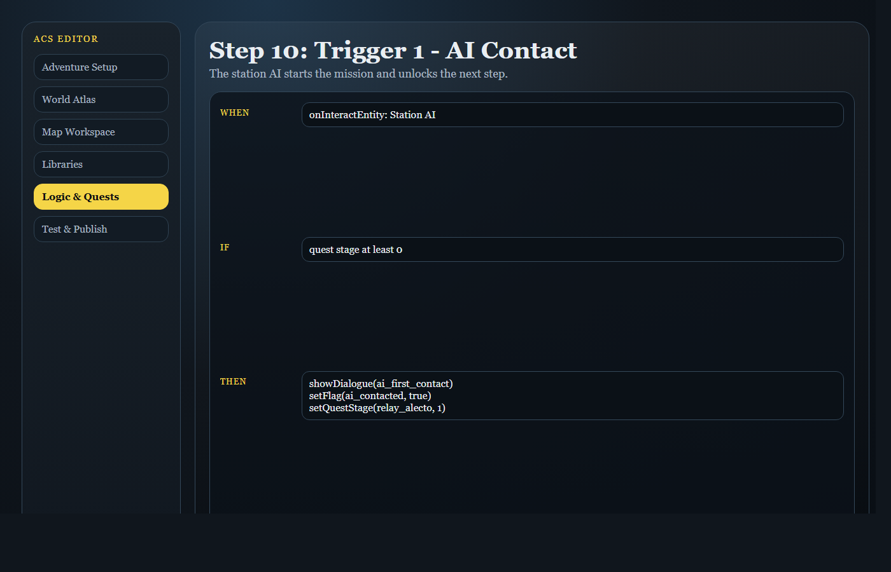

Build the second trigger, `Auxiliary Power Terminal`:

1. Click `Create Trigger`.
2. Set `When Type` to `Enter Tile`.
3. Choose the Access Ring map and the terminal tile coordinates.
4. Add conditions requiring `ai_contacted = true` and quest stage at least `1`.
5. Add actions to show terminal dialogue, play a sound cue, set `auxiliary_power_online = true`, give an access item, change the transit-pad tile to an active-pad tile, and set quest stage `2`.

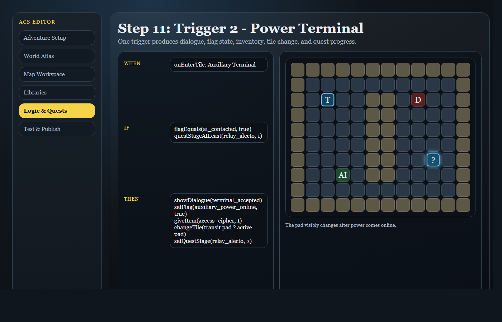

Build the third trigger, `Transit Pad Jump`:

1. Click `Create Trigger`.
2. Set `When Type` to `Enter Tile`.
3. Choose the Access Ring map and the active transit-pad coordinates.
4. Add conditions requiring `auxiliary_power_online = true` and quest stage at least `2`.
5. Add `Play Media Cue` for a transition flash.
6. Add `Play Sound Cue` for the pad hum or jump effect.
7. Add `Teleport` to the Data Core Chamber start coordinate.
8. Add `Set Quest Stage` stage `3`.

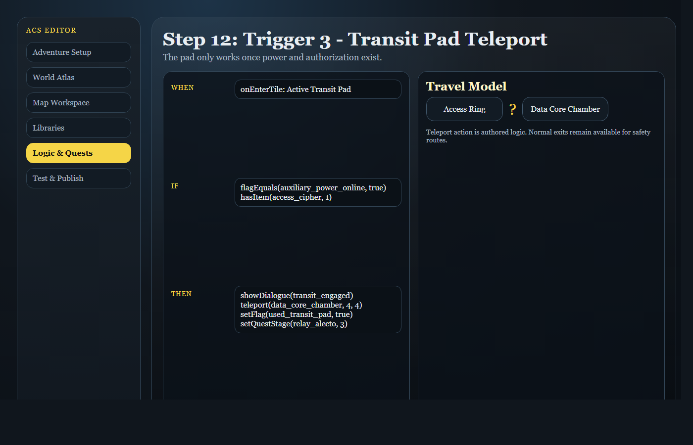

Build the fourth trigger, `Recover Core`:

1. Click `Create Trigger`.
2. Set `When Type` to `Enter Tile`.
3. Choose the Data Core Chamber map and the core tile coordinates.
4. Add a condition requiring quest stage at least `3`.
5. Add actions to play a sound cue, show dialogue, give the recovered data item, change the core tile to a spent/empty tile, set a recovered flag, and set quest stage `4`.

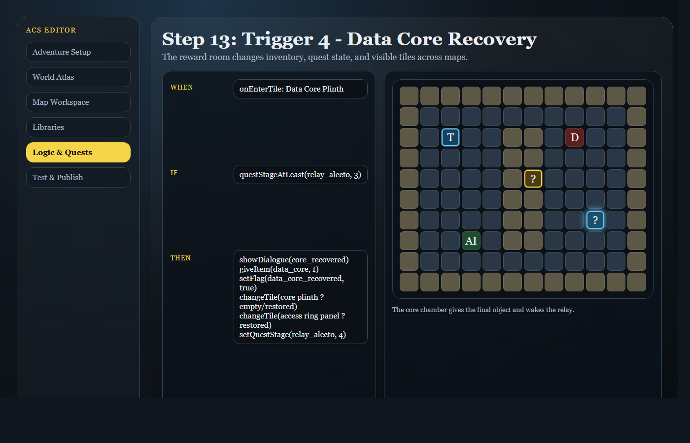

Milestone 28 callout: in `Then Actions`, choose `Play Media Cue` to add a splash, image, transition, cutscene, or future video cue. Choose `Play Sound Cue` to add an authored effect, music, or ambient cue. The current application stores these as cue objects and shows `mediaCuePlayed` / `soundCuePlayed` events in the runtime log. Real file upload/playback is intentionally later; the supported data categories are already present as `image`, `splash`, `video`, `audio`, `music`, and `sound` assets so the engine does not need to change when richer playback lands.

The strongest scenes are chains, not single actions: wake the screen, hum, speak, set a flag, grant an item, change a tile, and move the quest forward from one coherent trigger.

### Step 15: Create A Normal Exit Between Maps

Return to `3. Map Workspace`.

Use these controls:

1. Set the map selector to `Data Core Chamber`.
2. Set `Layer Mode` to `Exits & Portals`.
3. Choose `Access Ring` as the target map.
4. Enter the target X and Y coordinate where the player should arrive.
5. Click the door or exit cell on the Data Core Chamber map.

This is different from a teleport trigger. An exit is a map-link record. A teleport is an action that can be gated behind trigger conditions. You can use both in one adventure.

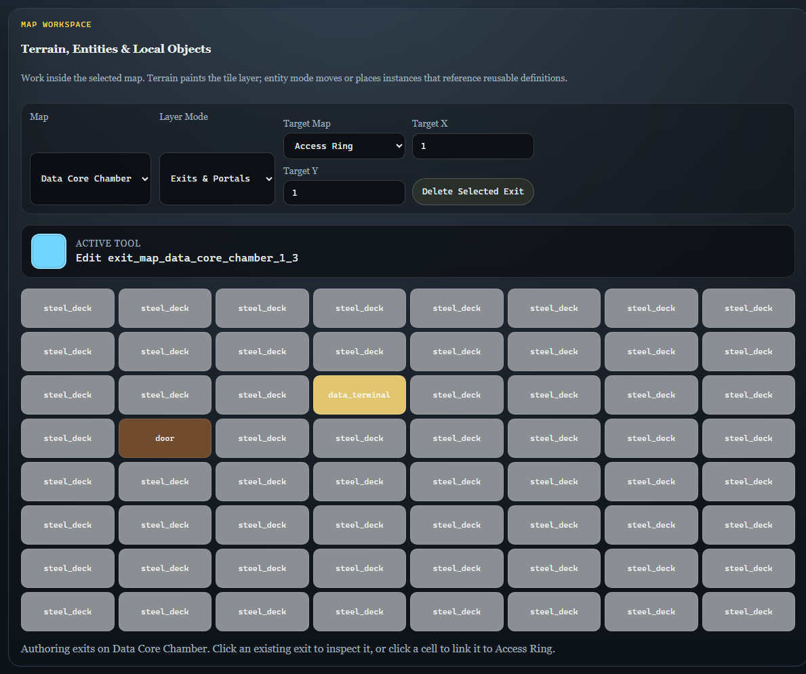

### Step 16: Inspect The Selected Cell

Stay in `Map Workspace` after creating the exit.

Look at `Selected Cell Inspector` in the right-side `Selected Map Relations` panel. The inspector should tell you exactly what is on the clicked coordinate:

- the selected map and cell coordinate
- the tile definition and passability
- the occupant, if an entity instance is on that cell
- the exit record, if one starts on that cell
- any local triggers attached to that coordinate

This is a Milestone 27 feature. It gives a first-time designer one place to answer, "What is actually on this square?" without hunting through map, entity, exit, and trigger panels separately.

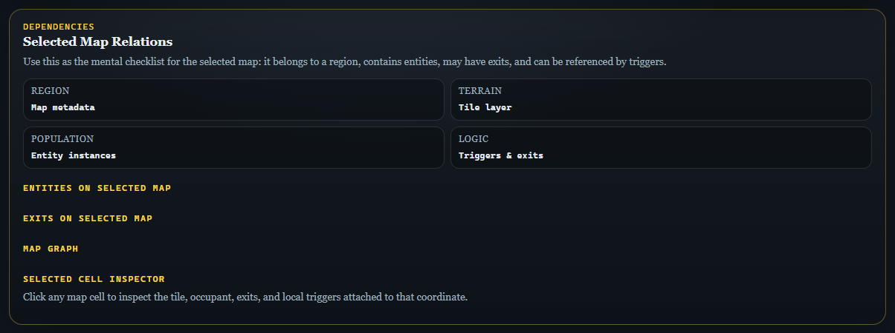

### Step 17: Run Diagnostics

Select `6. Test & Publish`.

Use the diagnostics panel before playtesting. It checks the draft for problems such as missing map references, invalid coordinates, broken trigger references, missing dialogue ids, or impossible exits.

For this tutorial, treat diagnostics like mission control. If a trigger does not work, the likely causes are:

- The trigger points at the wrong map.
- The trigger coordinates are wrong.
- The condition expects a flag that was never set.
- The action references a dialogue, item, tile, or quest id that does not exist.
- The exit target points outside the target map.

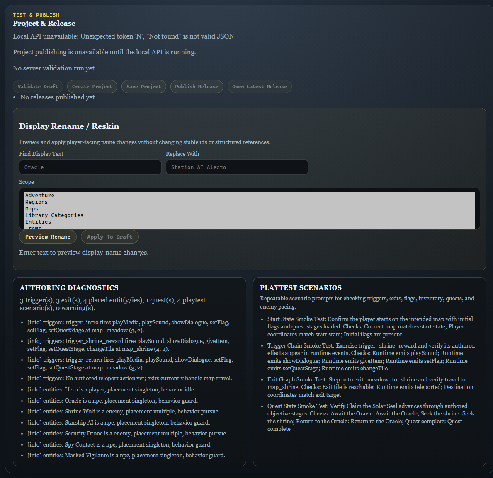

### Step 18: Preview A Display Rename / Reskin

Still in `6. Test & Publish`, find `Display Rename / Reskin`.

Try a safe preview:

1. Enter `Oracle` in `Find Display Text`.
2. Enter `Station AI Alecto` in `Replace With`.
3. Leave all scopes selected for this tutorial.
4. Click `Preview Rename`.

The preview lists every player-facing display field that would change. It does not change internal ids, map ids, entity definition ids, trigger references, item ids, or quest ids. That distinction matters: this is for reskinning visible names and text, not rewriting the structured identity of objects.

If the preview looks right, click `Apply To Draft`. If it looks too broad, narrow the scope before applying. For example, you could reskin only `Dialogue` and `Quests`, or only `Entities`.

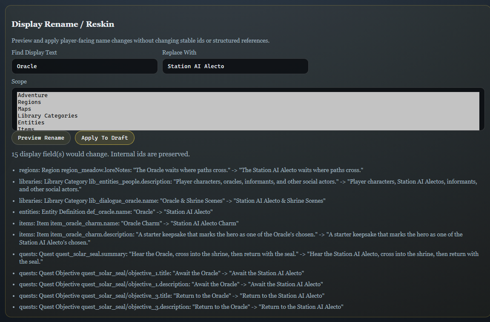

### Step 19: Save, Publish, Or Playtest

After diagnostics look clean, use the project controls in `Test & Publish` to save or publish the draft. Then open the runtime play view and test the mission in order.

Your playtest checklist is:

1. Start in the Access Ring.
2. Interact with Station AI Alecto.
3. Confirm the quest-start dialogue appears.
4. Move to the terminal and restore power.
5. Confirm the transit pad route becomes meaningful.
6. Travel to the Data Core Chamber.
7. Recover the data core.
8. Return through the exit.
9. Interact with Alecto again and confirm the completion beat.

If anything feels confusing, go back to the editor area that owns that kind of data. Use World Atlas for maps, Map Workspace for placed objects and exits, Libraries for reusable objects, Logic for rules, and Test & Publish for validation.

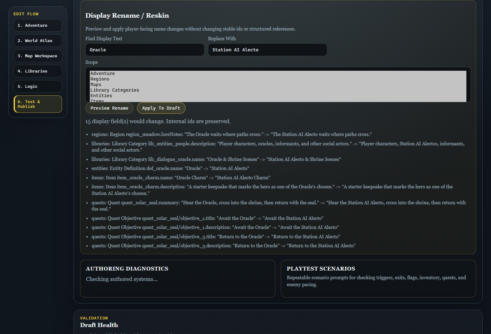

### What This Tutorial Demonstrates

Relay Station Alecto is the best current stress test because it uses the application as an integrated construction set rather than as disconnected forms.

It demonstrates:

- beginner navigation through the editor flow
- map creation through World Atlas
- terrain painting with a persistent brush
- progressive disclosure in Map Workspace
- selected-cell inspection for tile, occupant, exit, and trigger context
- reusable entity definitions
- uniquely named entity instances
- per-instance behavior overrides
- quest definitions and objective planning
- trigger chains made from when, if, and then parts
- normal exits as map links
- UI-based display rename/reskin with preview
- diagnostics before publishing
- a science-fiction adventure structure inspired by the variety-show spirit of Land of Adventuria

Future milestones will deepen this pattern with richer item CRUD, custom starter libraries, stacked trigger templates, graphic editing for every visual object, splash screens, music, sound effects, cutscenes, and eventually AI-assisted adventure generation.

## Projects And Published Releases

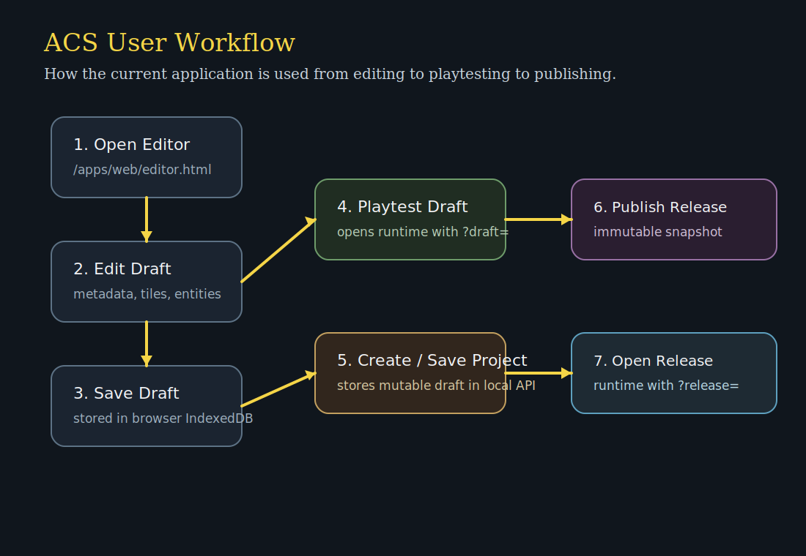

The editor can move a draft through five project stages:

1. `Validate Draft`: run the backend validation report without publishing
2. `Create Project`: create a mutable backend project from the current draft
3. `Save Project`: update the mutable backend draft
4. `Publish Release`: create an immutable release snapshot
5. `Open Latest Release`: launch that published release in the runtime

### Important Distinction

- `Save Draft` writes to browser storage
- `Save Project` writes to the local API
- `Publish Release` freezes a release snapshot instead of editing it in place

### Future Export Modes

Future publishing work should split finished projects into two shareable forms:

- `Forkable Project`: an editable construction-set package that includes source adventure data, custom libraries, provenance, and remix/license metadata so another designer can continue building from it.
- `Standalone Playable`: a runtime-only package that includes the validated release and required assets, but excludes editor panels, draft metadata, authoring diagnostics, and private construction notes.

Both modes should start from an immutable published release. That keeps the draft safe while letting the same adventure become either a remixable design file or a clean playable game.

Milestone 30A note: the first internal packaging layer now exists in `@acs/publishing`. It can build a `forkableProject` artifact or a `standalonePlayable` artifact from an adventure package, and it can report the runtime asset dependencies a standalone build would need. The editor and API do not expose these export buttons yet; this slice is the tested data-model foundation that later export UI and bundle generation will use.

Milestone 30B note: those export controls now exist in `Test & Publish`, but they are intentionally release-backed. Publish a release first, then use the forkable export or standalone export actions. This keeps mutable draft editing separate from shareable/shippable artifacts.

Milestone 30C note: `Export Standalone JSON` now returns more than a trimmed runtime package. The standalone artifact now includes a generated play-bundle manifest with a static `index.html`, runtime module files, and `bundle/adventure-package.json`. The browser runtime also understands `?package=...`, which is the boot path that future packaged standalone exports will use.

Milestone 30D note: the standalone export action is now `Export Standalone ZIP`. The editor still requests a release-backed `standalonePlayable` artifact from the API, but it now packages the returned bundle manifest into an actual ZIP download instead of giving you only JSON.

Milestone 30E note: `Test & Publish` now also includes `Preview Standalone Package`. Use it after publishing a release when you want to inspect the bundle entry file, packaged file list, and runtime asset counts before downloading the ZIP.

Milestone 30F note: `Test & Publish` now includes `Release Readiness`. Use it as the final quick check before sharing a release. It combines validation state, release existence, standalone preview status, diagnostics presence, and current known MVP limitations in one place.

Milestone 30G note: `Test & Publish` now also includes a `Release Notes` card. Use it before publishing to give the next immutable release a readable label and short notes. Those notes now appear in the recent release summary and in the readiness checklist, so exported builds are easier to review and discuss.

Milestone 30H note: standalone exports now carry a packaged `distribution-manifest.json`. In practice, that means the standalone preview is now showing release-aware distribution details like release label, packaged manifest presence, and packaged limitation notes instead of only raw file counts.

Milestone 30I note: standalone exports now also include bundled Windows launcher helpers at `launch/run-local.cmd` and `launch/run-local.ps1`. The exported game is still the same static web bundle, but those helper files can start a tiny local web server and open the game in the browser for a more direct local-play path.

Milestone 30J note: standalone exports now also include packaged handoff guides at `README.html` and `README.txt`. Use `Preview Standalone Package` before export if you want to confirm the shipped bundle includes player-facing launch instructions and the recommended launch path.

Milestone 30K note: `Test & Publish` now also includes `Preview Forkable Artifact`. Use it when you want to inspect the editable handoff package before export, especially to confirm that starter-pack references, custom-library counts, and editor-oriented data are present in the forkable release artifact.

Milestone 30L note: forkable exports now also carry a typed `projectManifest`. The forkable preview and release-readiness panels now show the release-backed recommended file name, suggested import area, handoff next steps, and known limitations so the editable export is self-describing instead of being only raw adventure JSON.

Milestone 30M note: `Test & Publish` now also includes an `Artifact Comparison` panel. Use it after previewing one or both export modes when you want the editor to summarize the practical difference between a forkable editable handoff and a standalone play-only package.

Milestone 30N note: standalone preview now also shows the final ZIP download name, the recommended extracted-folder name, and the packaged `RELEASE-NOTES.txt` file. Forkable export now follows the manifest-backed handoff naming shown in Forkable Artifact Preview.

Milestone 30O note: the editable handoff is now packaged too. `Export Forkable Package` downloads a ZIP that contains the full `forkable-project.json` artifact, a smaller `project-manifest.json`, packaged README files, and `RELEASE-NOTES.txt`. Use `Preview Forkable Artifact` first if you want to confirm the final package names and included handoff files before exporting.

Milestone 30P note: forkable exports now also carry a typed package manifest. That means `Preview Forkable Artifact` can show the packaged entry file, packaged file count, and packaged file paths from the same shared manifest the ZIP builder uses.

Milestone 30Q note: `Test & Publish` now also includes `Preview Release Handoff`. Use it when you want one shared release summary that explains both export modes together. Both the forkable package and the standalone package now also include `RELEASE-HANDOFF.json`, so recipients can see the editable-versus-play-only handoff story without reopening the editor.

Milestone 30R note: `Test & Publish` now also includes `Export Release Handoff`. Use it when you want the shared release-level handoff story as its own JSON document, separate from the forkable package or standalone ZIP. The download uses the manifest-backed handoff filename shown in the Release Handoff Manifest card.

Milestone 30S note: `Test & Publish` now also includes `Preview Artifact Integrity` and `Export Integrity Report`. Use them after publishing a release when you want one final packaging check that compares the forkable package, standalone bundle, and shared release handoff summary before distribution. The report highlights whether release metadata, archive names, release-notes paths, and required packaged files still agree across both export modes.

Milestone 30T note: `Test & Publish` now also includes `Preview Review Package` and `Export Review Package`. Use them when you want one small reviewer-facing ZIP that bundles the shared release handoff summary and the artifact-integrity report together, along with README files and release notes, so external reviewers can evaluate the handoff without reconstructing it from multiple separate downloads.

Milestone 30U note: the reviewer ZIP is now self-describing too. `Preview Review Package` now shows the direct review-manifest filename and the packaged `review-package-manifest.json` file, so the reviewer bundle follows the same typed-manifest pattern as the other export packages.

## Where Data Lives

### Browser Storage

Used for:

- runtime saves
- local drafts
- remembered active project id

### Local API Storage

Used for:

- mutable project drafts
- immutable published releases
- stored locally in `apps/api/data/store.json`

### Built-In Starter Libraries

Milestone 26 adds the first dedicated boundary for built-in library content: `packages/default-content`.

The important split is:

- `packages/domain` defines the shapes, such as `StarterLibraryPackDefinition`, item definitions, tile definitions, entity definitions, and quest definitions.
- `packages/default-content` defines built-in starter-library source metadata and helpers for creating starter snapshots and custom library export files.
- `apps/web/src/sampleAdventure.ts` still contains the current sample adventure's actual object data while the starter content is being migrated out over time.

Starter libraries should be treated as application-owned defaults. A designer can start from them, but editing a built-in object should eventually create a project-local copy rather than mutating the built-in library.

### Custom Libraries

Custom libraries should be stored separately from the starter libraries. They are designer-owned export files with:

- their own schema version
- a custom source marker
- genre tags
- references to any starter packs they were based on
- exported object collections for categories, tiles, entities, items, skills, traits, spells, flags, quests, dialogue, custom objects, and assets

This gives us three clean layers: shipped starter libraries, adventure-local objects, and reusable custom libraries that can be imported into future projects.

## Milestone 25: Authoring Diagnostics And Smoke Testing

Milestone 25 adds a safety dashboard for designers. The editor now has an `Authoring Diagnostics` card and a `Playtest Scenarios` card inside `Test & Publish`. These are not replacements for validation. Validation answers, "is this package legal enough to publish?" Diagnostics answers, "what authored systems should I playtest and what could feel wrong even if the package is valid?"

Use this pass when you finish editing a scene:

1. Open `Editor` and choose `Test & Publish` from the left `Edit Flow`.
2. Read `Draft Health` first. Fix blocking validation errors before publishing.
3. Read `Authoring Diagnostics`. It summarizes trigger effects, entity behavior, exits, initial flags, item definitions, and quest objects.
4. Read `Playtest Scenarios`. These scenario prompts tell you what to test manually: start state, trigger chain, exit graph, and quest state.
5. Run the automated smoke test from the repo root when you want a repeatable baseline check:

```powershell
npm run playtest:smoke
```

The smoke script builds the project, validates the sample adventure, confirms the start state, interacts with the Oracle, verifies the shrine reward trigger, checks the Solar Seal item grant and altar tile change, and confirms the meadow-to-shrine exit travel.

## Milestone 29A: Full Testing Gate

Milestones now require the full available test suite before completion:

```powershell
npm test
```

That command currently runs:

- `npm run test:unit`: package-level unit tests for runtime-core, editor-core, validation, and persistence.
- `npm run test:ui:editor`: a headless Chromium editor smoke test that confirms Map Workspace progressive disclosure and pixel editor preview controls.
- `npm run test:ui:runtime`: a headless Chromium runtime E2E test that opens the playable browser app and verifies canvas startup, visual preference changes, keyboard movement, Oracle interaction, dialogue, trigger/flag logging, save, reset, and load.
- `npm run test:ui`: both browser UI tests.
- `npm run playtest:smoke`: the end-to-end runtime smoke test for validation, start state, Oracle interaction, shrine reward effects, inventory, tile change, and exit travel.
- `npm run test:e2e`: both browser UI tests plus the runtime smoke playtest.

Use `npm run test:coverage` when you want the coverage-capable unit-test path. On this current Node 18 Windows runtime, raw V8 coverage emission is disabled by default because `NODE_V8_COVERAGE` crashes the process. On a verified runtime, set `ACS_ENABLE_V8_COVERAGE=1` first to emit JSON coverage files.

### Creative Tutorial Use: Debug The Shrine Reward

Try this as a designer-facing diagnostic exercise after experimenting with triggers:

1. In `Logic`, select the shrine reward trigger.
2. Temporarily remove or change the `giveItem` action in the guided action list or advanced JSON.
3. Go to `Test & Publish` and notice that validation may still pass, because a trigger without that reward can be structurally legal.
4. Use `Authoring Diagnostics` and `Playtest Scenarios` to remind yourself that the reward chain should be tested.
5. Restore the `giveItem` action for `item_solar_seal`, then run `npm run test:e2e` to verify both the browser UI and the command-level runtime playthrough.

This distinction matters as adventures get richer. A missing reward, one-way portal loop, or quest stage mismatch can be valid data but bad adventure design. Milestone 25 gives us the first reusable place to surface those authoring concerns without cluttering every editor panel.

## Skinning Readiness Notes

The project now tracks its live Play Mode and Edit Mode UI surface area in:

- `docs/ux-skinning-inventory.md`
- `docs/ux-skinning-inventory.json`

Those files exist so future skins can be applied safely. When the application later gets WorldTree, classic, minimal, or other visual shells, the team will already have a current inventory of:

- panels
- buttons
- inputs
- dropdowns
- lists
- overlays
- workspace grids
- dialogue surfaces
- runtime HUD elements
- publishing and diagnostics cards

Milestones that change visible UI are expected to update that inventory as part of closeout.

## Current Limitations

This is still an MVP. Important current limitations include:

- no real user accounts yet
- no cloud backend yet
- no asset upload flow yet
- no live AI provider is wired into the application yet, so Milestone 31 AI work is still contract/review infrastructure rather than an end-user generation feature
- no deletion of maps yet
- no deletion of entity instances in the editor yet
- trigger records can now be created, duplicated, deleted, edited, and placed as map markers
- brand-new dialogue and item record creation remains future work; quest definitions can now be created and edited
- the classic visual mode now includes manifest-backed pixel sprite authoring, stocked starter genre packs, splash-screen selection, and starting music selection. The current packs include real reusable item, entity, tile, skill, trait, spell, and asset objects; later milestones will deepen sprite sheets, animation, and higher-resolution asset-pack preparation
- the editor can create and edit tile and quest definitions, but deletion and advanced conditional passability rules remain future work
- the editor can edit existing reusable entity definitions, but brand-new entity/item/dialogue definition creation remains future work
- true map-window scrolling for oversized runtime maps is still future work; the current renderers do not yet provide a full player-follow or camera-based large-map presentation model
- targeted item usage is still future work; the accepted plan is to add designer-authored self/entity/tile item effects, shared actor-action validation, item effect authoring in Libraries, and player-facing targeting UX in later milestones instead of hardcoded one-off combat/heal shortcuts
- variable sprite scale is still future work for higher-resolution modes; the accepted plan is to keep classic 8-bit mode unchanged while later renderer families gain optional visual scaling, render layers, and higher-resolution collision/rendering support
- the editor now includes authoring diagnostics and generated playtest scenario prompts in `Test & Publish`; the CLI smoke test can be run with `npm run playtest:smoke`

## Documentation Generation Instructions

From this point forward, every milestone documentation pass should follow these rules:

- The User Guide must keep a reader-first structure: product overview, current capabilities, quick start, play overview, editor overview, flagship tutorial, publishing/sharing guidance, troubleshooting, current limits, and a short glossary. The working outline is tracked in `docs/user-guide-outline.md`.
- The User Guide tutorial must exercise every feature currently available in the application, not just the newest feature.
- After the Milestone 24 starter-library foundation, continue expanding the main tutorial into a brand-new adventure creation walkthrough. It should be inspired by Land of Adventuria: fun, multi-genre, screenshot-heavy, and focused on building something from scratch using genre libraries, maps, tiles, entities, items, quests, triggers, exits, splash screen, and starting music.
- The tutorial is a product-selling walkthrough, not just a checklist. It should be the most exciting, creative, and feature-rich adventure the current application can support while still remaining readable to a first-time user.
- Milestone 28 and later tutorials must show cue-heavy trigger chains that combine dialogue, flags, item rewards, media cues, sound cues, teleport, tile changes, quest updates, diagnostics, and playtesting.
- The newest milestone's features must be called out explicitly near the start of the tutorial and in the feature list.
- The User Guide PDF must include current screenshots or screenshot-style graphics for the runtime, editor, and major workflow diagrams.
- Tutorial screenshots must be step-specific. If a step tells the reader to choose a map, paint a tile, select a library focus, inspect a cell, or create an exit, the screenshot should crop to the relevant panel or changed map area rather than repeating a generic full-screen editor image.
- Before regenerating PDFs, make sure HTML source pages use print-safe font and link colors that remain readable against a white page background.
- Every milestone completion must run `npm test` and document any unavailable test layer before calling the milestone complete.
- When planning or implementation changes are accepted, update `docs/roadmap.html` plus the related durable docs in the same pass rather than leaving the roadmap, reference, guide, and AI-readable context out of sync.
- The System Reference must keep a readable top-down structure: purpose, executive summary, product model, domains, boundaries, architecture, data hierarchy, modes, workflows, publishing, AI integration, runtime, editor, presentation/skinning, storage, validation, limits, roadmap alignment, glossary, technical catalog, diagrams, and maintenance guidance.
- Mermaid diagrams in Markdown should have readable rendered equivalents in the HTML/PDF outputs.
- Diagrams, screenshots, code blocks, and enclosed callout boxes should avoid page splits wherever practical.
- If a screenshot shows UI button text spilling outside a button, regenerate the graphic with smaller text before publishing the PDF.
## Troubleshooting

### The editor says the API is unavailable

Start the API server:

```powershell
node .\apps\api\dist\index.js
```

### Validate Draft fails or publish stays disabled

Common causes:

- a trigger references a missing map, item, dialogue, or quest
- an entity or start position is outside the bounds of a map
- a map layer has the wrong tile count for its dimensions
- a map or trigger references a tile id that has no tile definition
- a singleton entity definition has more than one placed instance

### A published release will not open

Common causes:

- the API may not be running
- the release id may not exist anymore
- the local API store may have been cleared

### My draft changes are gone

Check whether you clicked:

- `Save Draft` for browser-local storage
- `Save Project` for backend storage

### Playtest Draft opens the sample adventure instead

The runtime falls back to the built-in sample when it cannot find the draft key passed by the editor.

## Summary

At this point, the application is best thought of as:

- a playable ACS-style browser runtime
- a browser-based draft editor with tile painting, tile definition editing, entity placement, map creation, definition editing, dialogue editing, and structured trigger editing
- a local save and draft persistence layer
- a local project, validation, and publishing workflow
- a playtest and release loop that uses the same runtime page
