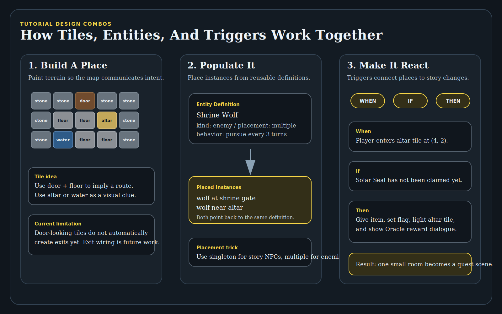

# ACS User Guide

## What This Application Currently Includes

The current Milestone 14 project gives you three working pieces:

- `apps/web/index.html`: the playable runtime
- `apps/web/editor.html`: the browser-based editor
- `apps/api/dist/index.js`: the local API for projects, validation, and published releases

The runtime and editor both use local browser storage:

- game saves are stored in IndexedDB
- local editor drafts are stored in IndexedDB
- the editor also remembers the active backend project id in browser local storage


## Starting The Application

Build the workspace if needed, then start both local servers from the repo root.

### Web Server

```powershell
node .\apps\web\server.mjs
```

Default URL:

```text
http://localhost:4173/
```

Common alternate URL in this environment:

```text
http://localhost:4317/
```

### API Server

```powershell
node .\apps\api\dist\index.js
```

Local API check:

```text
http://localhost:4318/api/session
```

### Editor URL

```text
http://localhost:4317/apps/web/editor.html
```

## Playing The Game

Milestone 14 defaults to `Classic ACS` visual mode. This is a presentation mode that draws the same engine state inside a vintage-inspired game panel with a map viewport, right-side status rail, and bottom message band. The classic panel intentionally uses a larger modern play window rather than the original 8-bit pixel dimensions, while preserving crisp retro styling. The classic renderer now uses the adventure's `classic-acs` visual manifest to choose tile and entity sprite styles, so the map data remains logical while presentation can evolve. Use the `Visual Mode` dropdown to switch between `Classic ACS` and `Debug Grid` at any time.

The runtime can load one of three sources:

- the built-in sample adventure
- a local draft playtest
- a published release loaded with `?release=<id>`

The current sample adventure goal is:

1. Speak to the Oracle.
2. Enter the shrine.
3. Claim the Solar Seal.
4. Return to the Oracle.

### Runtime Controls

- `W`, `A`, `S`, `D` or arrow keys: move
- `E`: interact with an adjacent entity
- `Q`: inspect the current tile or an adjacent entity
- `Enter` or `Space`: advance dialogue
- `Save`: store the current session locally
- `Visual Mode`: switch between the classic ACS-inspired presentation and the debug grid renderer
- `Load`: restore the most recent local save for the current source
- `Reset`: restart the current session from its start state

### Turn-Based Enemy Timing

The runtime now preserves the classic turn-based feel more deliberately. Successful player actions advance the turn count, but blocked movement does not give enemies a free action. Enemy behavior can define a `turnInterval`; the sample Shrine Wolf acts every third successful player turn, which gives you room to maneuver instead of having the wolf stick to every step.

### Runtime Panels

The play page shows:

- the map canvas
- the current map name
- the player position
- the session source panel
- the objective panel
- save/load/reset controls
- state details such as turn count, flags, and inventory
- the event log
- the dialogue overlay when a conversation is active

## Saving And Loading Progress

The runtime uses separate local save slots for the sample adventure, draft playtests, and published releases.

Examples:

- built-in sample: `adv_milestone3:latest`
- local draft playtest: `<adventure id>:draft-playtest`
- published release: `<adventure id>:release:<release id>`

### Save

`Save` stores the current `RuntimeSnapshot` in browser IndexedDB.

### Load

`Load` restores the most recent saved snapshot for the current source.

### Reset

`Reset` restarts the live session only.

Important:

- `Reset` does not erase the saved snapshot
- `Load` can still bring that snapshot back afterward

## Using The Editor

Open the editor at:

```text
http://localhost:4317/apps/web/editor.html
```


The current editor supports:

- editing the adventure title and description
- switching between maps in the draft
- painting tiles on the current map with a persistent brush
- moving existing entity instances on the current map
- adding new entity instances from reusable entity definitions
- respecting singleton-vs-multiple placement rules for creatures and NPCs
- editing existing dialogue text records
- editing existing structured trigger records for conditions and actions
- editing current-map structure metadata and creating new blank maps
- reviewing the shared validation summary for the current draft
- running `Validate Draft` against the local API
- saving a local draft
- creating a backend project from the draft
- saving the draft to the backend project
- publishing a release from the project
- opening the latest published release
- launching a draft playtest in the runtime


### Organized Edit Game Screen

The editor is now organized around the way game information relates:

- `Edit Flow` navigation moves through Adventure, World Atlas, Map Workspace, Libraries, Logic, and Test & Publish.
- `Adventure Setup` contains game-wide title and description metadata.
- `World Atlas` contains region/map thinking: selected map, map category, region assignment, and blank-map creation.
- `Map Workspace` contains the grid-centered work for terrain tiles and entity instances on the selected map.
- `Dependencies` shows the selected map's relationship checklist: region, terrain, population, logic, and exits.
- `Libraries` contains reusable definitions and dialogue records that maps, entities, and triggers can reference.
- `Logic & Quests` contains trigger editing, shaped around `When / If / Then` even while conditions/actions are still edited as JSON.
- `Test & Publish` contains validation, project saving, publishing, and release opening.

This organization is meant to keep the hierarchy visible: Adventure -> Regions -> Maps -> Tiles / Entities / Triggers, with reusable libraries and logic references shown beside the map workspace.
### Editor Buttons

At the top of the editor page:

- `Back To Play`: opens the standard runtime page
- `Save Draft`: stores the current draft locally in IndexedDB
- `Reset Draft`: restores the built-in sample adventure and removes the saved local draft
- `Playtest Draft`: saves the current draft locally and opens it in the runtime

### Editor Toolbar

In the Map Workspace:

- `World Atlas`: choose which map is being edited because maps belong to the region/adventure hierarchy
- `Layer Mode`: choose `Terrain Tiles` or `Entity Instances`
- `Tile`: active only in tile mode
- `Move Entity`: active only in entity mode
- Add Definition: active only in entity mode
- Place New: switches entity mode into new-instance placement
- Active Brush: shows the currently loaded tile brush or entity placement target

### Tile Editing

To paint tiles:

1. Set `Layer Mode` to `Terrain Tiles`.
2. Pick a tile id from the `Tile` dropdown.
3. Check the `Active Brush` preview to confirm the selected tile.
4. Click a cell in the grid to paint a single tile, or click and drag to paint across multiple cells.

The selected tile stays loaded like a brush until you choose a different tile.

### Entity Editing

Entity mode now supports both moving existing instances and placing new instances from definitions.

To reposition an entity:

1. Set `Layer Mode` to `Entity Instances`.
2. Pick an existing entity from `Move Entity`.
3. Click the destination cell.

To add a new entity:

1. Set `Layer Mode` to `Entity Instances`.
2. Pick a reusable definition from `Add Definition`.
3. Click `Place New` if the editor is currently set to move an existing entity.
4. Click the destination cell.

Placement rules:

- `singleton` definitions can only appear once in the adventure. The Oracle is singleton.
- `multiple` definitions can be placed repeatedly. The Shrine Wolf is multiple.
- validation reports a blocking error if a singleton definition somehow has more than one placed instance.

Current limitation:

- the editor can add and move entity instances
- it does not yet delete entity instances or create new entity definitions

### Validation

The validation panel now runs the shared validation package and shows an error-and-warning summary plus a detailed issue list for the current draft.

Use `Validate Draft` in the `Project & Release` panel when you want the local API to run the same validation report that the publish flow uses.

If the draft has blocking errors, project save and publish controls stay disabled until those are fixed.

## Tutorial: Try Every Current Feature

This walkthrough is the recommended smoke test after each milestone. It deliberately exercises every major feature currently available, highlights the newest Milestone 14 world-structure tools, and shows how small tile, entity, dialogue, and trigger edits can combine into a miniature quest scene.


Goal of this tutorial:

- play the built-in sample adventure and observe the runtime panels
- switch visual modes without changing game state
- test runtime save, load, and reset
- edit adventure metadata
- use the organized `Edit Flow` screen
- use the Milestone 14 `World Atlas` map structure tools
- create a new blank map
- paint terrain with the persistent brush
- move existing entity instances
- place new entity instances from reusable definitions
- edit reusable entity definition behavior
- edit dialogue text
- edit structured trigger data
- validate locally and through the API
- save a browser-local draft
- create/save/publish a backend project
- open the published release in the runtime


### Step 1: Start Both Servers

From the repo root, start the web server:

```powershell
node .\apps\web\server.mjs
```

In a second terminal, start the API server:

```powershell
node .\apps\api\dist\index.js
```

Open the runtime:

```text
http://localhost:4317/apps/web/index.html
```

Open the editor:

```text
http://localhost:4317/apps/web/editor.html
```

What to look for:

- The runtime is the player-facing game screen.
- The editor is the construction set.
- The API server enables `Validate Draft`, project saving, publishing, and release loading.

### Step 2: Play The Sample Adventure First

Before editing, play the sample once so you understand what you are changing.

In the runtime:

1. Confirm `Visual Mode` is set to `Classic ACS`.
2. Move with `W`, `A`, `S`, `D` or the arrow keys.
3. Walk next to the Oracle and press `E` to interact.
4. Press `Enter` or `Space` to advance dialogue.
5. Press `Q` near the Oracle or on a tile to inspect.
6. Use the door tile to enter the Inner Shrine.
7. Move to the altar to claim the Solar Seal.
8. Return to the Oracle and interact again.

While playing, watch the right-side state panels and event log. Movement changes position and turn count. Dialogue changes the dialogue overlay. The altar trigger changes flags, inventory, and tile state. Enemy turns advance only on their configured cadence.

Clever observation:

- The shrine is not just a painted room. It is a map with terrain, an altar tile, a reward trigger, dialogue, inventory changes, and enemy behavior layered together.

### Step 3: Try Runtime Save, Load, Reset, And Visual Mode

In the runtime:

1. Click `Save` after moving a few steps.
2. Move somewhere else.
3. Click `Load` and confirm your saved position is restored.
4. Click `Reset` and confirm the session returns to the start.
5. Click `Load` again and confirm the saved snapshot can still be restored.
6. Switch `Visual Mode` from `Classic ACS` to `Debug Grid`, then back to `Classic ACS`.

This verifies two important architectural ideas:

- Visual mode is presentation only. It does not change the adventure data or runtime state.
- Runtime persistence stores a `RuntimeSnapshot`, not a second copy of the map data.

### Step 4: Understand The Organized Editor Flow

The `Edit Game` screen is now organized to match the game data relationships.


Use the screen from left to right:

1. `Edit Flow` navigation shows the major authoring areas.
2. `Adventure Setup` edits game-wide identity.
3. `World Atlas` selects and organizes maps by region/category.
4. `Map Workspace` edits the selected map's terrain and entity instances.
5. `Dependencies` reminds you what the selected map relates to: region, terrain, population, logic, and exits.
6. `Libraries` edits reusable definitions and dialogue.
7. `Logic & Quests` edits triggers.
8. `Test & Publish` validates, saves, publishes, and opens releases.

The mental model is:

```text
Adventure -> Regions -> Maps -> Tiles / Entities / Triggers
```

Reusable libraries sit beside that hierarchy because maps and triggers reference them.

### Step 5: Edit Metadata In Adventure Setup

In `Adventure Setup`:

1. Change the adventure `Title` to `Milestone 14 Feature Test`.
2. Change the `Description` to mention that this draft tests map creation, tiles, entities, dialogue, triggers, and publishing.
3. Watch the validation summary update as the draft changes.

This is a project-wide edit. It should not affect the player's position, maps, tiles, entities, triggers, or saves. It changes the adventure package metadata that project/release flows use.

### Step 6: Highlight Milestone 14: Edit World Structure

Milestone 14 added map category metadata and current-map structure editing. These controls live in `World Atlas` because maps are part of the adventure's spatial hierarchy.

In `World Atlas`:

1. Select `Sun Meadow` as the current map.
2. Confirm the map category is `local`.
3. Change the map name to `Sun Meadow Test`.
4. Confirm the map remains assigned to the `Sun Meadow` region.
5. Select `Inner Shrine`.
6. Confirm its category is `interior`.
7. Change its name to `Inner Shrine Test`.

What this demonstrates:

- `Region` is the larger organizing bucket.
- `Map` is the playable/editable space.
- `Map Category` describes map scale or purpose: `world`, `region`, `local`, `interior`, or `dungeonFloor`.
- Today, category is metadata. Later, it can drive navigation tools, map filters, encounter rules, or different renderers.

### Step 7: Highlight Milestone 14: Create A Blank Map

Still in `World Atlas`, use `Create Map`:

1. Set the new map name to `Practice Dungeon`.
2. Set category to `dungeonFloor`.
3. Assign it to the `Inner Shrine` region if that region is available.
4. Set width to `8` and height to `8`.
5. Set fill tile to `stone` or `floor`.
6. Click `Create Map`.

The editor switches to the new map after creation. The new map has a base tile layer and no exits yet.

Important limitation:

- The new map is editable immediately, but it is not automatically reachable from gameplay yet. Exit/portal wiring is intentionally left for a later milestone because it needs reference-safe tools.

### Step 8: Paint A Small Scene With Tiles

With `Practice Dungeon` selected, use `Map Workspace`:

1. Set `Layer Mode` to `Terrain Tiles`.
2. Choose `floor` from the tile dropdown.
3. Confirm the `Active Tool` panel shows `floor`.
4. Click and drag across several cells to paint a room shape.
5. Choose `door` and paint one doorway tile.
6. Choose `altar` and paint one focal tile.
7. Choose `water`, `grass`, or `shrub` and paint a small visual clue.

The selected tile stays active until you choose another tile. You should not need to reselect the tile after each cell.

Clever tile use:

- Use `door` tiles as visual promises of exits, even before exit wiring exists.
- Use `altar` tiles as natural trigger locations.
- Use `water` or `shrub` tiles as soft barriers, clues, or thematic decoration.
- Paint a trail of `floor` or `path` tiles toward the important object so the player reads the room correctly.



### Step 9: Move Existing Entities

Switch back to `Sun Meadow Test` or `Inner Shrine Test`.

In `Map Workspace`:

1. Set `Layer Mode` to `Entity Instances`.
2. Choose an existing entity from `Move Instance`, such as the Oracle or Shrine Wolf.
3. Click a new destination cell on the same map.
4. Confirm the `Entities On Selected Map` list updates with the new coordinates.

What this demonstrates:

- You are moving an `EntityInstance`, not changing the reusable definition.
- The instance stores `definitionId`, `mapId`, `x`, and `y`.
- Moving the instance affects only that placed copy.

Clever placement use:

- Put the Oracle near an obvious path intersection to make the first conversation discoverable.
- Put the wolf near a reward route, but not directly on top of the player path, so turn cadence matters.
- Move entities away from exits when you want the player to avoid being blocked.

### Step 10: Place A New Entity From A Definition

Still in `Entity Instances` mode:

1. Choose `Shrine Wolf` from `Place Definition`.
2. Click `Place New`.
3. Click a destination cell.
4. Confirm the new wolf appears on the grid and in the map entity list.
5. Try choosing the Oracle definition if it is available.

Placement rules matter:

- The Oracle is a `singleton`, so once it already exists, the editor should prevent another Oracle placement.
- The Shrine Wolf is `multiple`, so it can be placed repeatedly.

Clever entity use:

- Use singleton for story-critical NPCs, unique bosses, special containers, or one-of-a-kind quest objects.
- Use multiple for guards, wolves, generic townspeople, treasure containers, or reusable obstacles.
- Use two instances of the same enemy definition in different rooms to keep behavior consistent while changing placement.

### Step 11: Edit A Reusable Entity Definition

In `Libraries`, use the reusable entity definition editor:

1. Select `Shrine Wolf`.
2. Change its name to `Trial Wolf`.
3. Confirm `Placement` remains `multiple`.
4. Change behavior values such as detection range, leash range, or turn interval.
5. Confirm placed wolf instances still exist because instances reference the reusable definition by id.

What this demonstrates:

- An `EntityDefinition` is the template.
- An `EntityInstance` is a placed copy on a map.
- Changing the definition can affect how all instances of that definition are interpreted.

Clever behavior use:

- Increase `turnInterval` to make a creature slower and more puzzle-like.
- Decrease detection range to make a guard feel sleepy or territorial.
- Increase leash range to make a hunter feel persistent.
- Keep placement as `singleton` for characters whose duplication would break the story.

### Step 12: Edit Dialogue Text

In `Libraries`, use `Dialogue Text`:

1. Select the Oracle dialogue record.
2. Change the speaker or text to something easy to recognize, such as `The Oracle remembers this test.`
3. Keep the continue label readable.
4. Later, when playtesting, interact with the Oracle and confirm the changed text appears.

Clever dialogue use:

- Use dialogue as feedback after a trigger changes a flag or grants an item.
- Use the same NPC to provide different hints in later milestones once branching dialogue expands.
- Keep important quest instructions short enough to fit in the runtime dialogue overlay.

### Step 13: Edit A Structured Trigger

In `Logic & Quests`, use the trigger editor. The UI now frames trigger thinking as `When / If / Then`, even though conditions and actions are still edited as JSON.

1. Select the shrine reward trigger.
2. Review the trigger type, map id, x/y location, and `Run Once` setting.
3. Review the conditions JSON.
4. Review the actions JSON.
5. Carefully edit only values you understand while keeping valid JSON.
6. If the editor reports invalid JSON, undo the last edit or correct the syntax.

A safe trigger experiment:

- Keep the trigger type as `onEnterTile`.
- Keep the map and coordinate pointed at the altar tile.
- Change a `changeTile` action target tile to an existing tile such as `altar-lit`.
- Change a `showDialogue` action only if the referenced dialogue id already exists.

Clever trigger patterns:

- Reward scene: entering an altar tile gives an item, sets a flag, changes the altar tile, and shows dialogue.
- Secret reveal: stepping on a special floor tile changes a nearby wall-like tile into a door-like tile.
- One-time warning: entering a dangerous room shows dialogue once using `runOnce`.
- Return proof: speaking to an NPC after a reward flag is set can complete the quest in a later branch-capable milestone.

Important:

- Conditions and actions are structured package data, not executable scripts.
- Invalid JSON is rejected instead of silently stored.
- The future trigger builder should replace raw JSON with guided fields, but it should still produce the same `TriggerDefinition` shape.

### Step 14: Combine Tiles, Entities, And Triggers Into A Mini Scene

Use the pieces together:

1. Paint a path or floor route toward a focal tile.
2. Put an `altar` or unusual tile at the destination.
3. Place a wolf near, but not directly on, the approach route.
4. Make sure the reward trigger points to the focal tile.
5. Use dialogue to explain what happened after the trigger fires.
6. Playtest and watch the event log, inventory, flags, and tile changes.

This is the heart of the construction set: a map cell can be more than a picture. It can be terrain, a clue, a creature position, a trigger location, a reward moment, and a story beat.

### Step 15: Validate The Draft

Use both validation paths:

1. Read the local validation summary in the editor.
2. Click `Validate Draft` in `Test & Publish`.
3. Confirm the API validation result appears.
4. If validation reports a blocking error, fix it before saving or publishing.

Common validation failures include:

- an entity outside a map's bounds
- a map layer with the wrong tile count
- a trigger referencing a missing map, item, dialogue, or quest
- a duplicate singleton entity instance

### Step 16: Save And Playtest The Draft

1. Click `Save Draft`.
2. Click `Playtest Draft`.
3. In the runtime tab, confirm the edited title/source is loaded as a draft playtest.
4. Walk to the Oracle and confirm dialogue edits.
5. Visit the shrine and confirm tile or trigger edits that are reachable in the sample quest.
6. Use `Save`, `Load`, and `Reset` in the playtest session.

Remember:

- A newly created blank map will not be reachable through gameplay until a future milestone adds exit/portal wiring tools.
- Edits to the original reachable maps are the easiest ones to verify in playtest right now.

### Step 17: Create, Save, Publish, And Open A Release


If the API server is running:

1. Return to the editor.
2. Click `Create Project` if no backend project exists yet.
3. Click `Save Project` to send the current draft to the API.
4. Click `Publish Release` to create an immutable release snapshot.
5. Click `Open Latest Release`.
6. In the runtime, confirm the release loads separately from the local draft playtest.

This verifies the complete authoring loop: editor draft, validation, backend project, immutable release, and runtime loading.

### Step 18: Reset Safely When Finished

If you want to return the editor to the built-in sample adventure:

1. Click `Reset Draft`.
2. Confirm the local draft is removed.
3. Reload the editor if needed.

This does not delete backend projects or published releases already stored by the local API.
## Projects And Published Releases


The editor can move a draft through five project stages:

1. `Validate Draft`: run the backend validation report without publishing
2. `Create Project`: create a mutable backend project from the current draft
3. `Save Project`: update the mutable backend draft
4. `Publish Release`: create an immutable release snapshot
5. `Open Latest Release`: launch that published release in the runtime

### Important Distinction

- `Save Draft` writes to browser storage
- `Save Project` writes to the local API
- `Publish Release` freezes a release snapshot instead of editing it in place

## Where Data Lives

### Browser Storage

Used for:

- runtime saves
- local drafts
- remembered active project id

### Local API Storage

Used for:

- mutable project drafts
- immutable published releases
- stored locally in `apps/api/data/store.json`

## Current Limitations

This is still an MVP. Important current limitations include:

- no real user accounts yet
- no cloud backend yet
- no asset upload flow yet
- no deletion of maps or automatic exit/portal wiring yet
- no deletion of entity instances in the editor yet
- no brand-new trigger/dialogue creation yet; existing records can be edited
- no fully visual trigger/action builder yet; trigger conditions and actions are edited as structured JSON
- the classic visual mode currently uses manifest-driven procedural sprite styles; later milestones can replace those entries with richer sprite sheets, animations, or higher-resolution asset packs
- the editor can edit existing reusable entity definitions, but brand-new item/tile/terrain definition creation remains future work

## Documentation Generation Instructions

From this point forward, every milestone documentation pass should follow these rules:

- The User Guide tutorial must exercise every feature currently available in the application, not just the newest feature.
- The newest milestone's features must be called out explicitly near the start of the tutorial and in the feature list.
- The User Guide PDF must include current screenshots or screenshot-style graphics for the runtime, editor, and major workflow diagrams.
- The System Reference must explain how all major features are implemented, including end-to-end input-to-rendering or input-to-draft flows.
- Mermaid diagrams in Markdown should have readable rendered equivalents in the HTML/PDF outputs.
- Diagrams, screenshots, code blocks, and enclosed callout boxes should avoid page splits wherever practical.
- If a screenshot shows UI button text spilling outside a button, regenerate the graphic with smaller text before publishing the PDF.
## Troubleshooting

### The editor says the API is unavailable

Start the API server:

```powershell
node .\apps\api\dist\index.js
```

### Validate Draft fails or publish stays disabled

Common causes:

- a trigger references a missing map, item, dialogue, or quest
- an entity or start position is outside the bounds of a map
- a map layer has the wrong tile count for its dimensions
- a singleton entity definition has more than one placed instance

### A published release will not open

Common causes:

- the API may not be running
- the release id may not exist anymore
- the local API store may have been cleared

### My draft changes are gone

Check whether you clicked:

- `Save Draft` for browser-local storage
- `Save Project` for backend storage

### Playtest Draft opens the sample adventure instead

The runtime falls back to the built-in sample when it cannot find the draft key passed by the editor.

## Summary

At this point, the application is best thought of as:

- a playable ACS-style browser runtime
- a browser-based draft editor with tile painting, entity placement, map creation, definition editing, dialogue editing, and structured trigger editing
- a local save and draft persistence layer
- a local project, validation, and publishing workflow
- a playtest and release loop that uses the same runtime page
