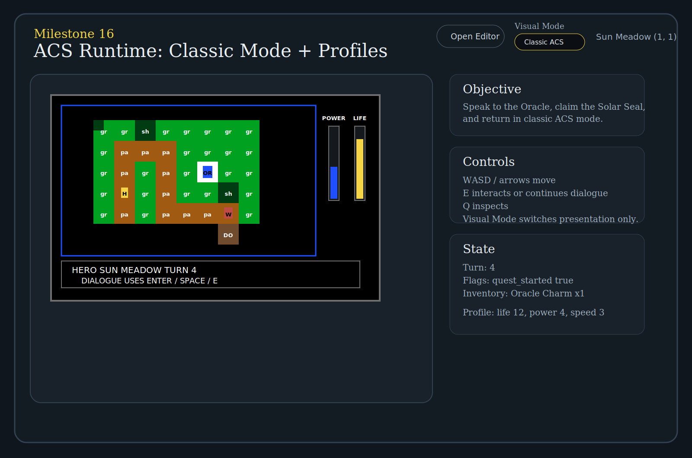
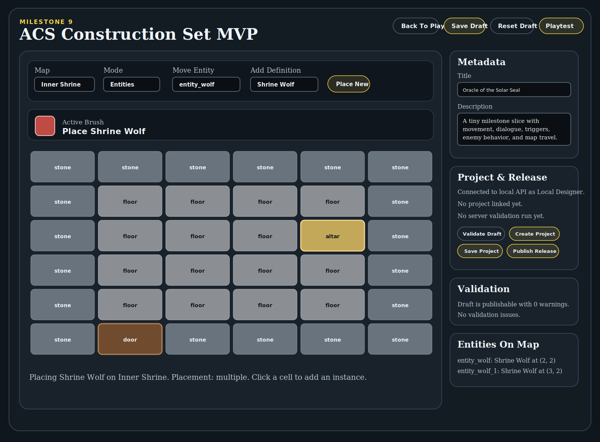

# ACS User Guide

## What This Application Currently Includes

The current Milestone 9 project gives you three working pieces:

- `apps/web/index.html`: the playable runtime
- `apps/web/editor.html`: the browser-based editor
- `apps/api/dist/index.js`: the local API for projects, validation, and published releases

The runtime and editor both use local browser storage:

- game saves are stored in IndexedDB
- local editor drafts are stored in IndexedDB
- the editor also remembers the active backend project id in browser local storage



## Starting The Application

Build the workspace if needed, then start both local servers from the repo root.

### Web Server

```powershell
node .\apps\web\server.mjs
```

Default URL:

```text
http://localhost:4173/
```

Common alternate URL in this environment:

```text
http://localhost:4317/
```

### API Server

```powershell
node .\apps\api\dist\index.js
```

Local API check:

```text
http://localhost:4318/api/session
```

### Editor URL

```text
http://localhost:4317/apps/web/editor.html
```

## Playing The Game

The runtime can load one of three sources:

- the built-in sample adventure
- a local draft playtest
- a published release loaded with `?release=<id>`

The current sample adventure goal is:

1. Speak to the Oracle.
2. Enter the shrine.
3. Claim the Solar Seal.
4. Return to the Oracle.

### Runtime Controls

- `W`, `A`, `S`, `D` or arrow keys: move
- `E`: interact with an adjacent entity
- `Q`: inspect the current tile or an adjacent entity
- `Enter` or `Space`: advance dialogue
- `Save`: store the current session locally
- `Load`: restore the most recent local save for the current source
- `Reset`: restart the current session from its start state

### Runtime Panels

The play page shows:

- the map canvas
- the current map name
- the player position
- the session source panel
- the objective panel
- save/load/reset controls
- state details such as turn count, flags, and inventory
- the event log
- the dialogue overlay when a conversation is active

## Saving And Loading Progress

The runtime uses separate local save slots for the sample adventure, draft playtests, and published releases.

Examples:

- built-in sample: `adv_milestone3:latest`
- local draft playtest: `<adventure id>:draft-playtest`
- published release: `<adventure id>:release:<release id>`

### Save

`Save` stores the current `RuntimeSnapshot` in browser IndexedDB.

### Load

`Load` restores the most recent saved snapshot for the current source.

### Reset

`Reset` restarts the live session only.

Important:

- `Reset` does not erase the saved snapshot
- `Load` can still bring that snapshot back afterward

## Using The Editor

Open the editor at:

```text
http://localhost:4317/apps/web/editor.html
```



The current editor supports:

- editing the adventure title and description
- switching between maps in the draft
- painting tiles on the current map with a persistent brush
- moving existing entity instances on the current map
- adding new entity instances from reusable entity definitions
- respecting singleton-vs-multiple placement rules for creatures and NPCs
- reviewing the shared validation summary for the current draft
- running `Validate Draft` against the local API
- saving a local draft
- creating a backend project from the draft
- saving the draft to the backend project
- publishing a release from the project
- opening the latest published release
- launching a draft playtest in the runtime

### Editor Buttons

At the top of the editor page:

- `Back To Play`: opens the standard runtime page
- `Save Draft`: stores the current draft locally in IndexedDB
- `Reset Draft`: restores the built-in sample adventure and removes the saved local draft
- `Playtest Draft`: saves the current draft locally and opens it in the runtime

### Editor Toolbar

Above the grid:

- `Map`: choose which map is being edited
- `Mode`: choose `Tiles` or `Entities`
- `Tile`: active only in tile mode
- `Move Entity`: active only in entity mode
- Add Definition: active only in entity mode
- Place New: switches entity mode into new-instance placement
- Active Brush: shows the currently loaded tile brush or entity placement target

### Tile Editing

To paint tiles:

1. Set `Mode` to `Tiles`.
2. Pick a tile id from the `Tile` dropdown.
3. Check the `Active Brush` preview to confirm the selected tile.
4. Click a cell in the grid to paint a single tile, or click and drag to paint across multiple cells.

The selected tile stays loaded like a brush until you choose a different tile.

### Entity Editing

Entity mode now supports both moving existing instances and placing new instances from definitions.

To reposition an entity:

1. Set `Mode` to `Entities`.
2. Pick an existing entity from `Move Entity`.
3. Click the destination cell.

To add a new entity:

1. Set `Mode` to `Entities`.
2. Pick a reusable definition from `Add Definition`.
3. Click `Place New` if the editor is currently set to move an existing entity.
4. Click the destination cell.

Placement rules:

- `singleton` definitions can only appear once in the adventure. The Oracle is singleton.
- `multiple` definitions can be placed repeatedly. The Shrine Wolf is multiple.
- validation reports a blocking error if a singleton definition somehow has more than one placed instance.

Current limitation:

- the editor can add and move entity instances
- it does not yet delete entity instances or create new entity definitions

### Validation

The validation panel now runs the shared validation package and shows an error-and-warning summary plus a detailed issue list for the current draft.

Use `Validate Draft` in the `Project & Release` panel when you want the local API to run the same validation report that the publish flow uses.

If the draft has blocking errors, project save and publish controls stay disabled until those are fixed.

## Tutorial: Make A Simple Map Edit And Play It

Because the current editor cannot create a brand-new map yet, the best simple workflow is to modify one of the built-in maps and then playtest that edited version.

This walkthrough uses `Inner Shrine` because it is compact and easy to change.

### Step 1: Open The Editor

Go to:

```text
http://localhost:4317/apps/web/editor.html
```

### Step 2: Choose The Map

In the `Map` dropdown, select:

- `Inner Shrine`

You should now see the shrine grid in the editor.

### Step 3: Choose Tile Mode

Set:

- `Mode` = `Tiles`

Then choose a tile from the `Tile` dropdown.

A good simple first change is:

- choose `floor`

### Step 4: Paint A Simple Room Layout

Use the selected tile like a brush. You can click individual cells or hold the mouse button down and drag across multiple cells to paint continuously.

A simple example is:

- paint more `floor` tiles around the center
- leave the `door` tile in place so the map exit still works
- leave the `altar` tile in place if you still want the shrine reward trigger to work

If you want a very obvious change, repaint several outer `stone` cells into `floor` so the room becomes visibly larger.

### Step 5: Rename The Draft

In the `Metadata` panel, change the `Title` to something like:

- `My Shrine Test`

This makes it easy to tell your playtest apart from the built-in sample.

### Step 6: Validate The Draft

Click:

- `Validate Draft`

This runs the same validation report the publish flow uses. If you see blocking errors, fix those before publishing.

### Step 7: Save The Draft

Click:

- `Save Draft`

This stores the edited draft in browser IndexedDB.

### Step 8: Playtest The Draft

Click:

- `Playtest Draft`

A new tab opens the runtime using your edited draft rather than the built-in sample adventure.

### Step 9: Verify The Change In Game

In the runtime tab:

- move to the shrine
- confirm the room layout looks the way you painted it
- use `Save` if you want to preserve your playtest progress

### Optional Step 10: Publish It Locally

If the API is running, you can also:

1. return to the editor tab
2. click `Create Project`
3. click `Save Project`
4. click `Publish Release`
5. click `Open Latest Release`

That launches the published release version instead of the draft playtest version.

## Projects And Published Releases


The editor can move a draft through five project stages:

1. `Validate Draft`: run the backend validation report without publishing
2. `Create Project`: create a mutable backend project from the current draft
3. `Save Project`: update the mutable backend draft
4. `Publish Release`: create an immutable release snapshot
5. `Open Latest Release`: launch that published release in the runtime

### Important Distinction

- `Save Draft` writes to browser storage
- `Save Project` writes to the local API
- `Publish Release` freezes a release snapshot instead of editing it in place

## Where Data Lives

### Browser Storage

Used for:

- runtime saves
- local drafts
- remembered active project id

### Local API Storage

Used for:

- mutable project drafts
- immutable published releases
- stored locally in `apps/api/data/store.json`

## Current Limitations

This is still an MVP. Important current limitations include:

- no real user accounts yet
- no cloud backend yet
- no asset upload flow yet
- no creation or deletion of maps in the editor yet
- no deletion of entity instances in the editor yet
- no trigger editor yet
- no dialogue editor yet
- the runtime still uses simple colored tiles and abstract markers

## Troubleshooting

### The editor says the API is unavailable

Start the API server:

```powershell
node .\apps\api\dist\index.js
```

### Validate Draft fails or publish stays disabled

Common causes:

- a trigger references a missing map, item, dialogue, or quest
- an entity or start position is outside the bounds of a map
- a map layer has the wrong tile count for its dimensions
- a singleton entity definition has more than one placed instance

### A published release will not open

Common causes:

- the API may not be running
- the release id may not exist anymore
- the local API store may have been cleared

### My draft changes are gone

Check whether you clicked:

- `Save Draft` for browser-local storage
- `Save Project` for backend storage

### Playtest Draft opens the sample adventure instead

The runtime falls back to the built-in sample when it cannot find the draft key passed by the editor.

## Summary

At this point, the application is best thought of as:

- a playable ACS-style browser runtime
- a browser-based draft editor with tile painting and entity placement
- a local save and draft persistence layer
- a local project, validation, and publishing workflow
- a playtest and release loop that uses the same runtime page


