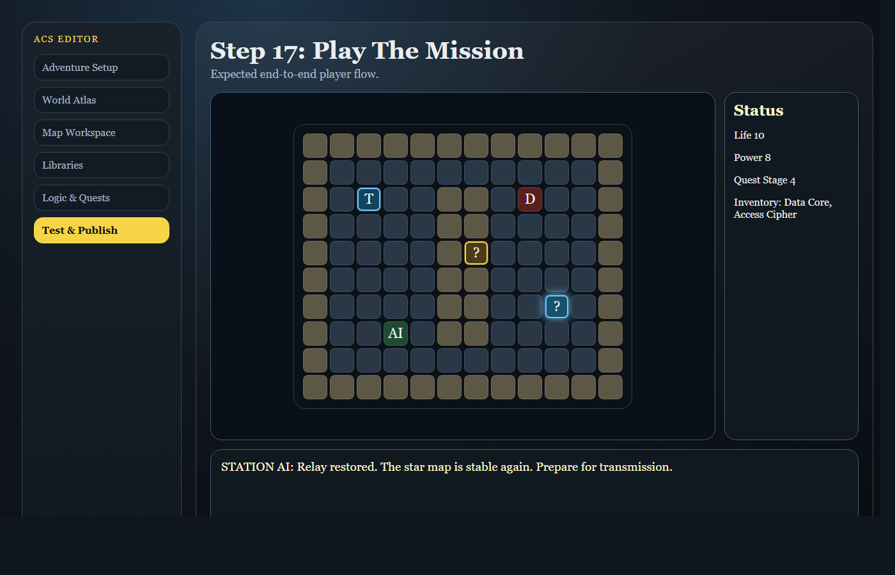

# ACS User Guide

## Current Milestone 32E Editor

This guide describes the current ACS Milestone 32E editor and how to use it to build, test, publish, review AI-assisted adventure proposals, and preview controlled AI apply plans from the live `apps/web/editor.html` interface.

### What this guide covers

- Opening the editor and saving draft state
- Setting adventure metadata and creating maps
- Painting terrain, placing entities, and defining exits
- Creating reusable libraries, quests, tiles, dialogue, and assets
- Building trigger chains with Logic & Quests
- Validating drafts, reviewing AI proposal handoffs, previewing AI apply plans, and publishing releases

> This guide matches the current implementation in `apps/web/editor.html` and does not describe future or abstract features.

## Start the Application

The editor is available at:

`http://localhost:4317/apps/web/editor.html`

The runtime player is available at:

`http://localhost:4317/apps/web/index.html`

The editor expects the local API backend at:

`http://localhost:4318`

If the API is not running, the editor will still open, but Test & Publish will show a disconnected or unavailable status.

## Editor Overview

The editor is organized into six main areas:

1. Adventure
2. World Atlas
3. Map Workspace
4. Libraries
5. Logic & Quests
6. Test & Publish

The top bar contains the current draft controls and quick access to the runtime player.

## 1. Adventure Setup

The Adventure section contains project-wide metadata for the whole adventure.

- **Title**: Set the adventure title.
- **Description**: Enter a short adventure description.
- **Draft Status**: Shows whether the current draft is loaded, saved, or dirty.

Always click **Save Draft** after changing the title or description.

## 2. World Atlas

Use the World Atlas panel to select, rename, and create maps.

- **Selected Map**: Choose a map.
- **Current Map Name**: Rename the selected map.
- **Map Scale**: World, Region, or Local Area.
- **Parent Region**: Assign a parent region for structure.

To create a new map:

1. Enter **New Map Name**.
2. Choose **Map Scale**.
3. Optionally assign **Parent Region**.
4. Set **Width** and **Height**.
5. Choose **Fill Tile**.
6. Click **Create Blank Map**.

## 3. Map Workspace

The Map Workspace edits the selected map layer by layer.

- **Map**: Choose the map to edit.
- **Layer Mode**: Switch between Terrain Tiles, Entity Instances, Trigger Markers, and Exits & Portals.
- **Tile Brush**: Pick the terrain tile to paint.
- **Move Instance**: Select an existing entity instance.
- **Place Definition**: Pick an entity definition to place.
- **Instance Name**: Optionally name the instance.
- **Behavior Override**: Override its behavior.
- **Place New**: Place the instance.
- **Target Map / Target X / Target Y**: Define exit destinations.
- **Delete Selected Exit**: Remove the current exit.

## 4. Libraries and Definitions

The Libraries section defines reusable game content.

- Choose **Library Type**.
- Create or select a **Category**.
- Select an object in the category.
- Edit object details in the detail panel.

Available library types include Entities, Items, Skills, Traits, Spells, Dialogue, Flags, Quests, Tiles, Assets, and Custom.

## 5. Logic & Quests

The Logic & Quests section builds gameplay rules.

- **Current Map Context** selects the map for the trigger.
- **Trigger** selects the trigger record.
- Use **Create Trigger**, **Duplicate**, or **Delete**.
- Place trigger markers on a map cell and attach the selected trigger.
- Use the rule builder to add If conditions and Then actions.
- Advanced JSON controls are available for direct rule editing.

## 6. Test & Publish

The Test & Publish panel validates, saves, and publishes the adventure release.

- **API status** shows the backend connection.
- **Project status** shows whether a backend project is linked.
- **Server validation status** shows whether validation ran.
- Enter **Release Label** and **Release Notes**.
- Use **Validate Draft**, **Create Project**, **Save Project**, and **Publish Release**.
- Preview and export release handoff, review packages, integrity reports, forkable artifacts, and standalone packages.
- Use **AI Game Creation** to submit a create, finish, or expand prompt through the local API. The current milestone lets you explicitly **Accept Proposal** or **Reject Proposal**, then preview the shared apply plan. It still does not apply AI changes directly to the draft.

## Harbor Museum Heist Tutorial

Use the step-by-step Harbor Museum Heist tutorial below to confirm the current editor workflow against the Milestone 32E UI. This tutorial uses a modern crime-caper genre, avoiding both science fiction and fantasy, while still showing map authoring, quest logic, trigger chains, sprite previews, AI proposal review, apply-plan preview, and publish-ready validation.

### Step 1: Open The Editor

Start the editor by running `npm run serve:web`, then open `http://localhost:4317/apps/web/editor.html` in your browser.

This opens the current Milestone 32E editor interface for the Harbor Museum Heist.

### Step 2: Name The Adventure

In Adventure Setup, set the title to **Harbor Museum Heist** and enter a short **Description** that explains the waterfront museum robbery, the missing ledger, the inside contact, and the rooftop getaway.

Use the Adventure title and description fields to define the package metadata.

### Step 3: Open World Atlas

Open the World Atlas panel and review the adventure structure. The Museum Atrium, Secure Archive, and Rooftop Getaway maps will become linked nodes in the map graph.

This step makes the world structure visible and confirms that maps, regions, and exits are organized correctly.

### Step 4: Create The Museum Atrium Map

Create a new map named **Museum Atrium**. Choose **Map Kind** / **Map Scale** as `Local Area`, then set the fill tile to `marble` or `cobblestone` if available.

This map becomes the public entry space where the player begins casing the museum.

### Step 5: Create The Secure Archive Map

Create a second map named **Secure Archive**. Choose **Map Kind** / **Map Scale** as `Local Area`, then use a guarded tile set such as `stone_floor`, `locked_gate`, and `vault door`.

This map will hold the stolen ledger and the alarm trigger.

### Step 6: Create The Rooftop Getaway Map

Create a third map named **Rooftop Getaway**. Choose **Map Kind** / **Map Scale** as `Local Area`, then set an outdoor tile style such as `path`, `stone`, or a rooftop `lantern` marker.

This map is the getaway route that ties the adventure together.

### Step 7: Paint The Museum Atrium

In Map Workspace, select **Museum Atrium** and use **Terrain Tiles** mode. Choose the **Tile Brush** and paint marble halls, cobblestone service corridors, display alcoves, and a side entrance.

This builds the public museum environment where the player can move between exhibits and secret staff doors.

### Step 8: Paint The Secure Archive

Switch to **Secure Archive**, stay in **Terrain Tiles**, and paint the archive interior using guard tiles, record shelves, and a vault door.

The archive should look distinct from the atrium and clearly show the target objective.

### Step 9: Paint The Rooftop Getaway

Switch to **Rooftop Getaway** and paint the escape route. Add roof tiles, service stairs, a lantern-lit handoff point, and a final jump tile.

This final map should feel like an urgent getaway route.

### Step 10: Place The Inside Contact

Switch to **Entity Instances** and place an NPC called **Inside Contact** in the Museum Atrium map. Use **Instance Name** to label it clearly.

This NPC is the quest giver who directs the player to the archive.

### Step 11: Place The Stolen Ledger

In **Entity Instances**, place the item **Stolen Ledger** or a similar collectible. Ensure the object is placed in the Secure Archive.

This item is the heist objective that the player must retrieve.

### Step 12: Build The Heist Quest

Open the Quests library and create a quest named **Recover the Stolen Ledger**. Add objectives for meeting the inside contact, entering the archive, obtaining the ledger, and reaching the rooftop getaway.

Use the quest editor to connect objectives with rewards and success conditions.

### Step 13: Verify The Sprite Preview

Open the Assets library and choose a **Pixel Sprite** used for museum floor trim, archive shelves, or a guard marker. Review the **Grouping Preview** to verify how the sprite repeats in the scene.

This ensures the selected art reads clearly at the intended map scale.

### Step 14: Create The Alarm Trigger Chain

Open Logic & Quests and build a trigger chain for the heist sequence. Create a trigger for `Alarm` when the ledger is picked up.

Add actions for **Play Sound Cue**, **Play Media Cue**, and teleport the player toward the Rooftop Getaway if the alarm triggers.

### Step 15: Link The Map Exits

Switch to **Exits & Portals** and create normal exits from **Museum Atrium** to **Secure Archive** and from **Secure Archive** to **Rooftop Getaway**.

This links the heist route through the map graph.

### Step 16: Inspect The Selected Cell

Click on a tile in each map and inspect the **Selected Cell Inspector**. Check the tile, entity, exit, and trigger details to confirm the layout is correct.

This helps catch misconfigured exits or misplaced triggers.

### Step 17: Run Validation Diagnostics

Open **Test & Publish**, then run **Validate Draft**. Review any validation issues and fix missing references, invalid tile definitions, or quest inconsistencies.

Use **AI Game Creation** to preview an expansion handoff without applying changes directly. Choose **Expand Existing Game**, leave the model at the default unless your API server is configured differently, enter a focused prompt such as "add one optional clue room and a tense guard patrol to Harbor Museum Heist," then click **Submit AI Prompt**. If credentials are not configured, the panel reports the blocked provider state; if the server returns a proposal, review the proposal summary, issues, and next step. Use **Accept Proposal** or **Reject Proposal** to record the review decision, then use **Preview Apply Plan** to inspect apply readiness, target counts, blockers, and next step before continuing.

This ensures the heist adventure is publish-ready and shows how AI-generated game content is reviewed and apply-planned before it can become real project data.

### Step 18: Preview Rename / Reskin and Playtest

In the **Display Rename / Reskin** controls, rename the protagonist or reskin the night guard. Use the preview to confirm the new character name and appearance before playtesting.

Then save your draft and open the runtime player to run a short playtest. Walk the Museum Atrium, enter the Secure Archive, pick up the Stolen Ledger, and escape to the Rooftop Getaway.

This step confirms the authoring flow from editor to runtime and proves the adventure is playable.

### Step 19: Save, Publish, Or Export

Use the **Save Draft** button, then create a project release in **Test & Publish**. Add a release label like **Harbor Museum Beta** and click **Publish Release**.

If you want to keep working, export a development package for later editing. If you are ready to share, publish the release so it becomes available to players.

This final step closes the loop from authoring through distribution.

